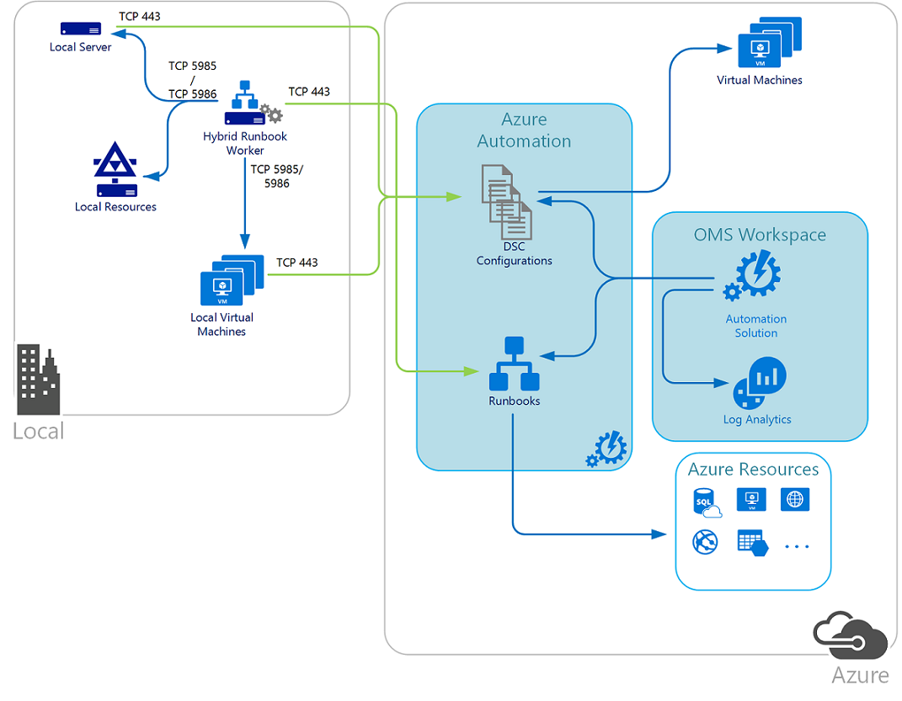
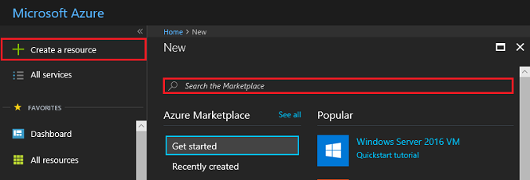

--- 
title:  Get Started with Azure Automation | Microsoft Docs
description: This article provides an overview of Azure Automation service by reviewing the design and implementation details in preparation to onboard the offering from Azure Marketplace. 
services: automation
documentationcenter: ''
author: mgoedtel
manager: carmonm
editor: ''

ms.assetid: 
ms.service: automation
ms.workload: tbd
ms.tgt_pltfrm: na
ms.devlang: na
ms.topic: get-started-article
ms.date: 06/16/2017
ms.author: magoedte
---

# Getting Started with Azure Automation

This getting started guide introduces core concepts related to the deployment of Azure Automation. If you are new to Automation in Azure or have experience with automation workflow software like System Center Orchestrator, this guide helps you understand how to prepare and onboard Automation.  Afterwards, you will be prepared to begin developing runbooks in support of your process automation needs. 

## Automation architecture overview

Azure Automation is a software as a service (SaaS) application that provides a scalable and reliable, multi-tenant environment to automate processes with runbooks and manage configuration changes to Windows and Linux systems using Desired State Configuration (DSC) in Azure, other cloud services, or on-premises. Entities contained within your Automation account, such as runbooks, assets, Run As accounts are isolated from other Automation accounts within your subscription and other subscriptions.  

Runbooks that you run in Azure are executed on Automation sandboxes, which are hosted in Azure platform as a service (PaaS) virtual machines.  Automation sandboxes provide tenant isolation for all aspects of runbook execution – modules, storage, memory, network communication, job streams, etc. This role is managed by the service and is not accessible from your Azure or Azure Automation account for you to control.         

To automate the deployment and management of resources in your local data center or other cloud services, after creating an Automation account, you can designate one or more machines to run the [Hybrid Runbook Worker (HRW)](automation-hybrid-runbook-worker.md)  role.  Each HRW requires the Microsoft Management Agent (MMA) with a connection to a Log Analytics workspace and an Automation account.  Log Analytics is used to bootstrap the installation, maintain the MMA agent, and monitor the functionality of the HRW.  The delivery of runbooks and the instruction to run them are performed by Azure Automation.

You can deploy multiple HRW to provide high availability for your runbooks, load balance runbook jobs, and in some cases dedicate them for particular workloads or environments.  HRW communicates with the Automation service over TCP outbound port 443.  Once you have runbook running on an HRW within your datacenter, and you want the runbook to perform management tasks against other machines or services within the datacenter, then there may be other ports that the runbook needs access to.  If your IT security policies do not allow computers on your network to connect to the Internet, review the article [OMS Gateway](../log-analytics/log-analytics-oms-gateway.md), which acts as a proxy for the HRW to collect job status and receive configuration information from your Automation account.

Runbooks running on an HRW run in the context of the local System account on the computer, which is the recommended security context when performing administrative actions on the local Windows machine. If you want the runbook to run tasks against resources outside of the local machine, you may need to define secure credential assets in the Automation account that you can access from the runbook and use to authenticate with the external resource. You can use [Credential](automation-credentials.md), [Certificate](automation-certificates.md), and [Connection](automation-connections.md) assets in your runbook with cmdlets that allow you to specify credentials so you can authenticate them.

DSC configurations stored in Azure Automation can be directly applied to Azure virtual machines. Other physical and virtual machines can request configurations from the Azure Automation DSC pull server.  For managing configurations of your on-premise physical or virtual Windows and Linux systems, you don't need to deploy any infrastructure to support the Automation DSC pull server, only outbound Internet access from each system to be managed by Automation DSC, communicating over TCP port 443 to the OMS service.   

## Requirements

### Automation DSC
Azure Automation DSC can be used to manage various machines:

* Azure virtual machines (classic) running Windows or Linux
* Azure virtual machines running Windows or Linux
* Amazon Web Services (AWS) virtual machines running Windows or Linux
* Physical/virtual Windows computers on-premises, or in a cloud other than Azure or AWS
* Physical/virtual Linux computers on-premises, or in a cloud other than Azure or AWS

The latest version of WMF 5 must be installed for the PowerShell DSC agent for Windows to be able to communicate with Azure Automation. The latest version of the [PowerShell DSC agent for Linux](https://www.microsoft.com/en-us/download/details.aspx?id=49150) must be installed for Linux to be able to communicate with Azure Automation.

### Hybrid Runbook Worker  
When designating a computer to run hybrid runbook jobs, this computer must have the following:

* Windows Server 2012 or later
* Windows PowerShell 4.0 or later.  We recommend installing Windows PowerShell 5.0 on the computer for increased reliability. You can download the new version from the [Microsoft Download Center](https://www.microsoft.com/download/details.aspx?id=50395)
* Minimum of two cores
* Minimum of 4 GB of RAM

## Authentication planning
Azure Automation allows you to automate tasks against resources in Azure, on-premises, and with other cloud providers.  In order for a runbook to perform its required actions, it must have permissions to securely access the resources with the minimal rights required within the subscription.  

### What is an Automation Account 
All the automation tasks you perform against resources using the Azure cmdlets in Azure Automation authenticate to Azure using Azure Active Directory organizational identity credential-based authentication.  An Automation account is separate from the account you use to sign in to the portal to configure and use Azure resources.  Automation resources included with an account are the following:

* **Certificates** - contains a certificate used for authentication from a runbook or DSC configuration or add them.
* **Connections** - contains authentication and configuration information required to connect to an external service or application from a runbook or DSC configuration.
* **Credentials** - is a PSCredential object which contains security credentials such as a username and password required to authenticate from a runbook or DSC configuration.
* **Integration modules** - are PowerShell modules included with an Azure Automation account to make use of cmdlets within runbooks and DSC configurations.
* **Schedules** - contains schedules that starts or stops a runbook at a specified time, including recurring frequencies.
* **Variables** - contain values that are available from a runbook or DSC configuration.

The Automation resources for each Automation account are associated with a single Azure region, but Automation accounts can manage all the resources in your subscription. Create Automation accounts in different regions if you have policies that require data and resources to be isolated to a specific region.

> [!NOTE]
> Automation accounts, and the resources they contain that are created in the Azure portal, cannot be accessed in the Azure classic portal. If you want to manage these accounts or their resources with Windows PowerShell, you must use the Azure Resource Manager modules.
> 

When you create an Automation account in the Azure portal, you automatically create two authentication entities:

* A Run As account. This account creates a service principal in Azure Active Directory (Azure AD) and a certificate. It also assigns the Contributor role-based access control (RBAC), which manages Resource Manager resources by using runbooks.
* A Classic Run As account. This account uploads a management certificate, which is used to manage classic resources by using runbooks.

Role-based access control is available with Azure Resource Manager to grant permitted actions to an Azure AD user account and Run As account, and authenticate that service principal.  Read [Role-based access control in Azure Automation article](automation-role-based-access-control.md) for further information to help develop your model for managing Automation permissions.  

#### Authentication methods
The following table summarizes the different authentication methods for each environment supported by Azure Automation.

| Method | Environment 
| --- | --- | 
| Azure Run As and Classic Run As account |Azure Resource Manager and Azure classic deployment |  
| Azure AD User account |Azure Resource Manager and Azure classic deployment |  
| Windows authentication |Local data center or other cloud provider using the Hybrid Runbook Worker |  
| AWS credentials |Amazon Web Services |  

Under the **How to\Authentication and security** section, are supporting articles providing overview and implementation steps to configure authentication for those environments, either with an existing or new account you dedicate for that environment.  For the Azure Run As and Classic Run As account, the topic [Update Automation Run As account](automation-create-runas-account.md) describes how to update your existing Automation account with the Run As accounts from the portal or using PowerShell if it was not originally configured with a Run As or Classic Run As account. If you want to create a Run As and a Classic Run As account with a certificate issued by your enterprise certification authority (CA), review this article to learn how to create the accounts using this configuration.     
 
## Network planning
For the Hybrid Runbook Worker to connect to and register with Microsoft Operations Management Suite (OMS), it must have access to the port number and the URLs described below.  This is in addition to the [ports and URLs required for the Microsoft Monitoring Agent](../log-analytics/log-analytics-windows-agents.md#network) to connect to OMS. If you use a proxy server for communication between the agent and the OMS service, you need to ensure that the appropriate resources are accessible. If you use a firewall to restrict access to the Internet, you need to configure your firewall to permit access.

The information below list the port and URLs that are required for the Hybrid Runbook Worker to communicate with Automation.

* Port:  Only TCP 443 is required for outbound Internet access
* Global URL:  *.azure-automation.net

If you have an Automation account defined for a specific region and you want to restrict communication with that regional data center, the following table provides the DNS record for each region.

| **Region** | **DNS Record** |
| --- | --- |
| South Central US |scus-jobruntimedata-prod-su1.azure-automation.net |
| East US 2 |eus2-jobruntimedata-prod-su1.azure-automation.net |
| West Central US | wcus-jobruntimedata-prod-su1.azure-automation.net |
| West Europe |we-jobruntimedata-prod-su1.azure-automation.net |
| North Europe |ne-jobruntimedata-prod-su1.azure-automation.net |
| Canada Central |cc-jobruntimedata-prod-su1.azure-automation.net |
| South East Asia |sea-jobruntimedata-prod-su1.azure-automation.net |
| Central India |cid-jobruntimedata-prod-su1.azure-automation.net |
| Japan East |jpe-jobruntimedata-prod-su1.azure-automation.net |
| Australia South East |ase-jobruntimedata-prod-su1.azure-automation.net |
| UK South | uks-jobruntimedata-prod-su1.azure-automation.net |
| US Gov Virginia | usge-jobruntimedata-prod-su1.azure-automation.us |

For a list of IP addresses instead of names, download and review the [Azure Datacenter IP address](https://www.microsoft.com/download/details.aspx?id=41653) xml file from the Microsoft Download Center. 

> [!NOTE]
> This file contains the IP address ranges (including Compute, SQL and Storage ranges) used in the Microsoft Azure Datacenters. An updated file is posted weekly which reflects the currently deployed ranges and any upcoming changes to the IP ranges. New ranges appearing in the file will not be used in the datacenters for at least one week. Please download the new xml file every week and perform the necessary changes on your site to correctly identify services running in Azure. Express Route users may note this file used to update the BGP advertisement of Azure space in the first week of each month. 
> 

## Creating an Automation account

There are different ways you can create an Automation account in the Azure portal.  The following table introduces each type of deployment experience and differences between them.  

|Method | Description |
|-------|-------------|
| Select Automation & Control from the Marketplace | An offering, which creates both an Automation account and OMS workspace linked to one another in the same resource group and region.  Integration with OMS also includes the benefit of using Log Analytics to monitor and analyze runbook job status and job streams over time and utilize advanced features to escalate or investigate issues. The offering also deploys the Change Tracking & Update Management solutions, which are enabled by default. |
| Select Automation from the Marketplace | Creates an Automation account in a new or existing resource group that is not linked to an OMS workspace and does not include any available solutions from the Automation & Control offering. This is a basic configuration that introduces you to Automation and can help you learn how to write runbooks, DSC configurations, and use the capabilities of the service. |
| Selected Management solutions | If you select a solution – **[Update Management](../operations-management-suite/oms-solution-update-management.md)**, **[Start/Stop VMs during off hours](automation-solution-vm-management.md)**, or **[Change Tracking](../log-analytics/log-analytics-change-tracking.md)** they prompt you to select an existing Automation and OMS workspace, or offer you the option to create both as required for the solution to be deployed in your subscription. |

This topic walks you through creating an Automation account and OMS workspace by onboarding the Automation & Control offering.  To create a standalone Automation account for testing or to preview the service, review the following article [Create standalone Automation account](automation-create-standalone-account.md).  

### Create Automation account integrated with OMS
The recommended method to onboard Automation is by selecting the Automation & Control offering from the Marketplace.  This creates both an Automation account and establishes the integration with an OMS workspace, including the option to install the management solutions that are available with the offering.  

>[!NOTE]
>To create an Automation account, you must be a member of the Service Admins role or co-administrator of the subscription that is granting access to the subscription. You must also be added as a user to that subscription's default Active Directory instance. The account does not need to be assigned a privileged role.
>
>If you are not a member of the subscription’s Active Directory instance before you are added to the co-administrator role of the subscription, you are added to Active Directory as a guest. In this instance, you receive a “You do not have permissions to create…” warning on the **Add Automation Account** blade.
>
>Users who were added to the co-administrator role first can be removed from the subscription's Active Directory instance and re-added to make them a full User in Active Directory. To verify this situation from the **Azure Active Directory** pane in the Azure portal by selecting **Users and groups**, selecting **All users** and, after you select the specific user, selecting **Profile**. The value of the **User type** attribute under the users profile should not equal **Guest**.

1. Sign in to the Azure portal with an account that is a member of the Subscription Admins role and co-administrator of the subscription.

2. Click **New**.      

3. Search for **Automation** and then in the search results select **Automation & Control***.   .    

4. After reading the description for the offering, click **Create**.  

5. On the **Automation & Control** settings blade, select **OMS Workspace**.  On the **OMS Workspaces** blade, select an OMS workspace linked to the same Azure subscription that the Automation account is in or create an OMS workspace.  If you do not have an OMS workspace, select **Create New Workspace** and on the **OMS Workspace** blade perform the following: 
   - Specify a name for the new **OMS Workspace**.
   - Select a **Subscription** to link to by selecting from the drop-down list if the default selected is not appropriate.
   - For **Resource Group**, you can create a resource group or select an existing resource group.  
   - Select a **Location**.  Currently the only locations available are **Australia Southeast**, **East US**, **Southeast Asia**, **West Central US**, and **West Europe**.
   - Select a **Pricing tier**.  The solution is offered in two tiers: free and Per Node (OMS) tier.  The free tier has a limit on the amount of data collected daily, retention period, and runbook job runtime minutes.  The Per Node (OMS) tier does not have a limit on the amount of data collected daily.  
   - Select **Automation Account**.  If you are creating a new OMS workspace, you are required to also create an Automation account that is associated with the new OMS workspace specified earlier, including your Azure subscription, resource group, and region.  You can select **Create an Automation account** and on the **Automation Account** blade, provide the following: 
  - In the **Name** field, enter the name of the Automation account.

    All other options are automatically populated based on the OMS workspace selected and these options cannot be modified.  An Azure Run As account is the default authentication method for the offering.  Once you click **OK**, the configuration options are validated and the Automation account is created.  You can track its progress under **Notifications** from the menu. 

    Otherwise, select an existing Automation Run As account.  The account you select cannot already be linked to another OMS workspace, otherwise a notification message is presented in the blade.  If it is already linked, you need to select a different Automation Run As account or create one.

    After completing the information required, click **Create**.  The information is verified and the Automation Account and Run As accounts are created.  You are returned to the **OMS workspace** blade automatically.  

6. After providing the required information on the **OMS Workspace** blade, click **Create**.  While the information is verified and the workspace is created, you can track its progress under **Notifications** from the menu.  You are returned to the **Add Solution** blade.  

7. On the **Automation & Control** settings blade, confirm you want to install the recommended pre-selected solutions. If you deselect any, you can install them individually later.  

8. Click **Create** to proceed with onboarding Automation and an OMS workspace. All settings are validated and then it attempts to deploy the offering in your subscription.  This process can take several seconds to complete and you can track its progress under **Notifications** from the menu. 

After the offering is onboarded, you can begin creating runbooks, work with the management solutions you enabled, deploy a [Hybrid Runbook worker](automation-hybrid-runbook-worker.md) role, or start working with [Log Analytics](https://docs.microsoft.com/azure/log-analytics) to collect data generated by resources in your cloud or on-premises environment.   

## Next steps
* You can confirm your new Automation account can authenticate against Azure resources by reviewing [test Azure Automation Run As account authentication](automation-verify-runas-authentication.md).
* To get started with creating runbooks, first review the [Automation runbook types](automation-runbook-types.md) supported and related considerations before you begin authoring.

