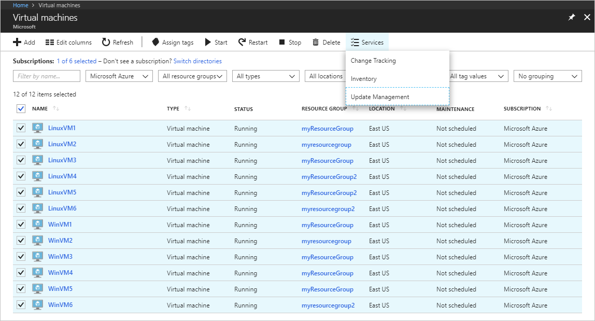
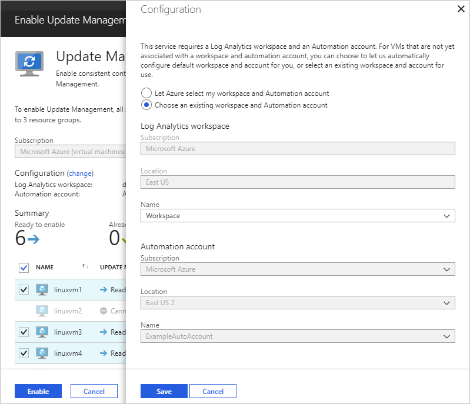

# Enable Update Management, Change Tracking, and Inventory solutions on multiple VMs

Azure Automation provides solutions to manage operating system security updates, track changes, and inventory what is installed on your computers. There are multiple ways to onboard machines, you can onboard the solution [from a virtual machine](automation-onboard-solutions-from-vm.md), from your [Automation account](automation-onboard-solutions-from-automation-account.md), when browsing virtual machines, or by [runbook](automation-onboard-solutions.md). This article covers onboarding these solutions when browsing virtual machines in Azure.

## Log in to Azure

Log in to Azure at https://portal.azure.com

## Enable solutions

In the Azure portal, navigate to **Virtual machines**.

Using the checkboxes, select the virtual machines you wish to onboard with Change Tracking and Inventory or Update Management. Onboarding is available for up to three different resource groups at a time.

> [!TIP]
> Use the filter controls to modify the list of virtual machines and then click the top checkbox to select all virtual machines in the list.

From the command bar, click **Services** and select either **Change tracking**, **Inventory**, or **Update Management**.

> [!NOTE]
> **Change tracking** and **Inventory** use the same solution, when one is enabled the other is enabled as well.

The following image is for Update Management. Change tracking and Inventory have the same layout and behavior.

The list of virtual machines is filtered to show only the virtual machines that are in the same subscription and location. If your virtual machines are in more than three resource groups, the first three resource groups are selected.

Use the filter controls to select virtual machines from different subscriptions, locations, and resource groups.

Review the choices for the Log analytics workspace and Automation account. A new workspace and Automation Account are selected by default. If you have an existing Log Analytics workspace and Automation Account you want to use, click **change** to select them from the **Configuration** page. When done, click **Save**.

Deselect the checkbox next to any virtual machine that you don't want to enable. Virtual machines that can't be enabled are already deselected.

Click **Enable** to enable the solution. The solution takes up to 15 minutes to enable.

## Troubleshooting

When onboarding multiple machines, there may be machines that show as **Cannot enable**. There are different reasons why some machines may not be enabled. The following sections show possible reasons for the **Cannot enable** state on a VM when attempting to onboard.

### VM reports to a different workspace: '\<workspaceName\>'.  Change configuration to use it for enabling

**Cause**: This error shows that the VM that you are trying to onboard reports to another workspace.

**Solution**: Click **Use as configuration** to change the targeted Automation Account and Log Analytics workspace.

### VM reports to a workspace that is not available in this subscription

**Cause**: The workspace that the virtual machine reports to:

* Is in a different subscription, or
* No longer exists, or
* Is in a resource group you don't have access permissions to

**Solution**: Find the automation account associated with the workspace that the VM reports to and onboard the virtual machine by changing the scope configuration.

### VM operating system version or distribution is not supported

**Cause:** The solution is not supported for all Linux distributions or all versions of Windows.

**Solution:** Refer to the [list of supported clients](automation-update-management.md#clients) for the solution.

### Classic VMs cannot be enabled

**Cause**: Virtual machines that use the classic deployment model are not supported.

**Solution**: Migrate the virtual machine to the resource manager deployment model. To learn how to do this, see [Migrate classic deployment model resources](../virtual-machines/windows/migration-classic-resource-manager-overview.md).

### VM is stopped. (deallocated)

**Cause**: The virtual machine in not in a **Running** state.

**Solution**: In order to onboard a VM to a solution the VM must be running. Click the **Start VM** inline link to start the VM without navigating away from the page.

## Next steps

Now that the solution is enabled for your virtual machines, visit the Update Management overview article to learn how to view the update assessment for your machines.

> [!div class="nextstepaction"]
> [Update Management - View update assessment](./automation-update-management.md#viewing-update-assessments)

Addition tutorials on the solutions and how to use them:

* [Tutorial - Manage Updates for your VM](automation-tutorial-update-management.md)

* [Tutorial - Identify software on a VM](automation-tutorial-installed-software.md)

* [Tutorial - Troubleshoot changes on a VM](automation-tutorial-troubleshoot-changes.md)