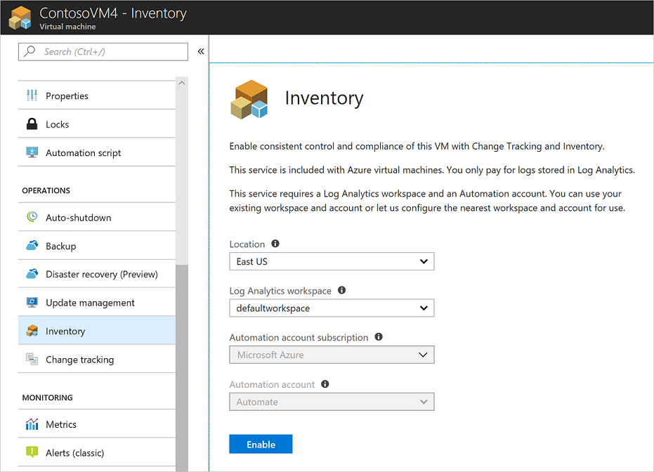

# Onboard Update Management, Change Tracking, and Inventory solutions from an Azure Virtual Machine

Azure Automation provides solutions to manage operating system security updates, track changes, and inventory what is installed on your computers. There are multiple ways to onboard machines, you can onboard the solution from a virtual machine, [from your Automation account](automation-onboard-solutions-from-automation-account.md), or by [runbook](automation-onboard-solutions.md). This article covers onboarding these solutions from an Azure Virtual Machine.

## Log in to Azure

Log in to Azure at https://portal.azure.com

## Enable the solutions

Navigate to an existing virtual machine and select either **Update management**, **Inventory**, or **Change tracking** under **OPERATIONS**.

Choose the Log analytics workspace and automation account and click **Enable** to enable the solution. The solution takes up to 15 minutes to enable.

Navigate to the other solutions and click **Enable**, the Log analytics, and Automation account drop-down boxes are disabled as they use the same workspace and automation account as the previously enabled solution.

> [!NOTE]
> **Change tracking** and **Inventory** use the same solution, when one is enabled the other is enabled as well.

## Scope Configuration

Each solution uses a Scope Configuration within the workspace to target the computers that get the solution. The Scope Configuration is a group of one or more saved searches that is used to limit the scope of the solution to specific computers. To access the Scope Configurations, in your Automation account under **RELATED RESOURCES**, select **Workspace**  Then in the workspace under **WORKSPACE DATA SOURCES**, select **Scope Configurations**.

The two scope configurations created by default are **MicrosoftDefaultScopeConfig-ChangeTracking** and **MicrosoftDefaultScopeConfig-Updates**.

Click the ellipses (...) on any of the configurations and select **Edit**. On the **Edit scope configuration** page, select **Select Computer Groups** to open the **Computer Groups** page. This page shows the saved searches that are used to create the Scope Configuration.

## Saved searches

When a computer is added to the Update Management or the Change Tracking and Inventory solutions, they are added to one of two saved searches in your workspace. These saved searches are queries that contain the computers that are targeted for these solutions.

Navigate to your workspace and select **Saved searches** under **General**. The two saved searches used by these solutions can be seen in the following table:

|Name     |Category  |Alias  |
|---------|---------|---------|
|MicrosoftDefaultComputerGroup     |  ChangeTracking       | ChangeTracking__MicrosoftDefaultComputerGroup        |
|MicrosoftDefaultComputerGroup     | Updates        | Updates__MicrosoftDefaultComputerGroup         |

Select either saved search to view the query used to populate the group. The following image shows the query and its results.

## Next steps

Continue to the tutorials on the solutions to learn how to use them.

* [Tutorial - Manage Updates for your VM](automation-tutorial-update-management.md)

* [Tutorial - Identify software on a VM](automation-tutorial-installed-software.md)

* [Tutorial - Troubleshoot changes on a VM](automation-tutorial-troubleshoot-changes.md)
