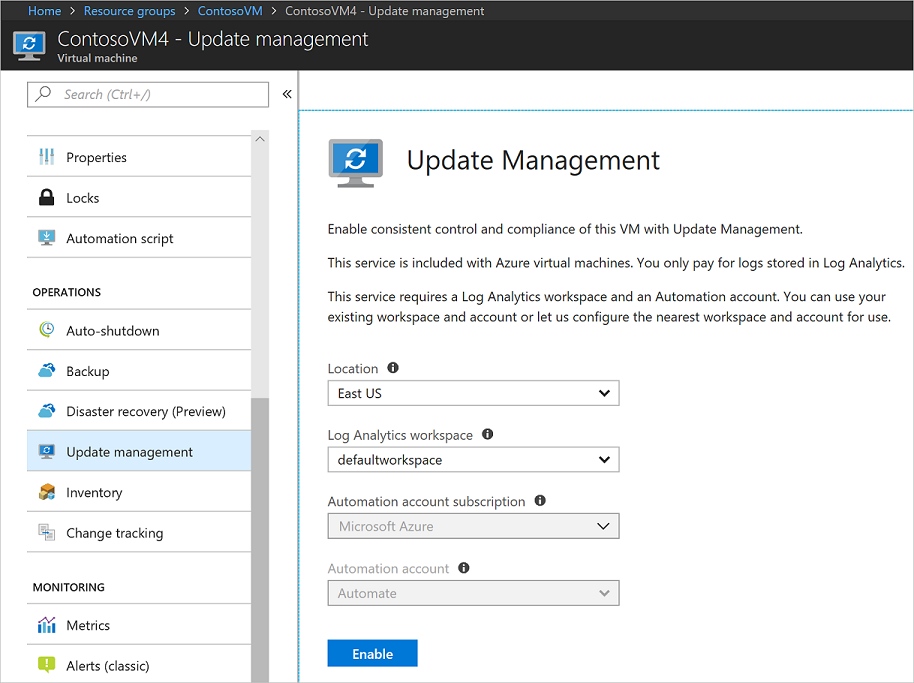
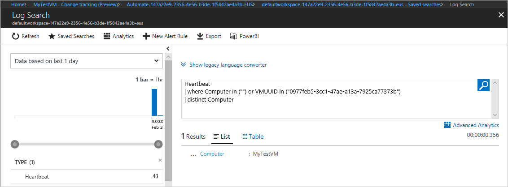

# Onboard Update Management, Change Tracking, and Inventory solutions from an Azure virtual machine

Azure Automation provides solutions to help you manage operating system security updates, track changes, and inventory what's installed on your computers. There are multiple ways to onboard machines. You can onboard the solution from a virtual machine, [from your Automation account](automation-onboard-solutions-from-automation-account.md), [from browsing multiple machines](automation-onboard-solutions-from-browse.md), or by using a [runbook](automation-onboard-solutions.md). This article covers onboarding these solutions from an Azure virtual machine.

## Sign in to Azure

Sign in to the Azure portal at https://portal.azure.com.

## Enable the solutions

Go to an existing virtual machine. Under **OPERATIONS**, select **Update management**, **Inventory**, or **Change tracking**. The virtual machine can exist in any region no matter the location of your Automation Account. When onboarding a solution from a VM you need to have the `Microsoft.OperationalInsights/workspaces/read` permission to determine if the VM is onboarded to a workspace. To learn about additional permissions that are needed in general, see [permissions needed to onboard machines](automation-role-based-access-control.md#onboarding).

To enable the solution for the VM only, ensure that **Enable for this VM** is selected. To onboard multiple machines to the solution, select **Enable for VMs in this subscription**, and then select **Click to select machines to enable**. To learn how to onboard multiple machines at once, see [Onboard Update Management, Change Tracking, and Inventory solutions](automation-onboard-solutions-from-automation-account.md).

Select the Azure Log Analytics workspace and Automation account, and then select **Enable** to enable the solution. The solution takes up to 15 minutes to enable.

Go to the other solutions, and then select **Enable**. The Log Analytics workspace and Automation account drop-down lists are disabled because these solutions use the same workspace and Automation account as the previously enabled solution.

> [!NOTE]
> **Change tracking** and **Inventory** use the same solution. When one of these solutions is enabled, the other is also enabled.

## Scope configuration

Each solution uses a scope configuration in the workspace to target the computers that get the solution. The scope configuration is a group of one or more saved searches that are used to limit the scope of the solution to specific computers. To access the scope configurations, in your Automation account, under **RELATED RESOURCES**, select **Workspace**. In the workspace, under **WORKSPACE DATA SOURCES**, select **Scope Configurations**.

If the selected workspace doesn't already have the Update Management or Change Tracking solutions, the following scope configurations are created:

* **MicrosoftDefaultScopeConfig-ChangeTracking**

* **MicrosoftDefaultScopeConfig-Updates**

If the selected workspace already has the solution, the solution isn't redeployed and the scope configuration isn't added.

Select the ellipses (**...**) on any of the configurations, and then select **Edit**. In the **Edit scope configuration** pane, select **Select Computer Groups**. The **Computer Groups** pane shows the saved searches that are used to create the scope configuration.

## Saved searches

When a computer is added to the Update Management, Change Tracking, or Inventory solutions, the computer is added to one of two saved searches in your workspace. The saved searches are queries that contain the computers that are targeted for these solutions.

Go to your workspace. Under **General**, select **Saved searches**. The two saved searches that are used by these solutions are shown in the following table:

|Name     |Category  |Alias  |
|---------|---------|---------|
|MicrosoftDefaultComputerGroup     |  ChangeTracking       | ChangeTracking__MicrosoftDefaultComputerGroup        |
|MicrosoftDefaultComputerGroup     | Updates        | Updates__MicrosoftDefaultComputerGroup         |

Select either of the saved searches to view the query that's used to populate the group. The following image shows the query and its results:

## Unlink workspace

The following solutions are dependent on a Log Analytics workspace:

* [Update Management](automation-update-management.md)
* [Change Tracking](automation-change-tracking.md)
* [Start/Stop VMs during off-hours](automation-solution-vm-management.md)

If you decide you no longer wish to integrate your Automation account with a Log Analytics workspace, you can unlink your account directly from the Azure portal.  Before you proceed, you first need to remove the solutions mentioned earlier, otherwise this process will be prevented from proceeding. Review the article for the particular solution you have imported to understand the steps required to remove it.

After you remove these solutions, you can perform the following steps to unlink your Automation account.

> [!NOTE]
> Some solutions including earlier versions of the Azure SQL monitoring solution may have created automation assets and may also need to be removed prior to unlinking the workspace.

1. From the Azure portal, open your Automation account, and on the Automation account page  select **Linked workspace** under the section **Related Resources** on the left.

2. On the Unlink workspace page, click **Unlink workspace**.

   .

   You will receive a prompt verifying you wish to proceed.

3. While Azure Automation attempts to unlink the account your Log Analytics workspace, you can track the progress under **Notifications** from the menu.

If you used the Update Management solution, optionally you may want to remove the following items that are no longer needed after you remove the solution.

* Update schedules - Each will have names that match the update deployments you created)

* Hybrid worker groups created for the solution -  Each will be named similarly to  machine1.contoso.com_9ceb8108-26c9-4051-b6b3-227600d715c8).

If you used the Start/Stop VMs during off-hours solution, optionally you may want to remove the following items that are no longer needed after you remove the solution.

* Start and stop VM runbook schedules
* Start and stop VM runbooks
* Variables

Alternatively you can also unlink your workspace from your Automation Account from your Log Analytics workspace. On your workspace, select **Automation Account** under **Related Resources**. On the Automation Account page, select **Unlink account**.

## Next steps

Continue to the tutorials for the solutions to learn how to use them:

* [Tutorial - Manage updates for your VM](automation-tutorial-update-management.md)
* [Tutorial - Identify software on a VM](automation-tutorial-installed-software.md)
* [Tutorial - Troubleshoot changes on a VM](automation-tutorial-troubleshoot-changes.md)
