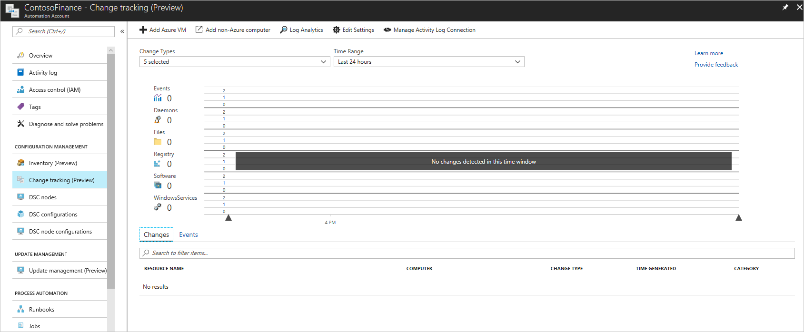
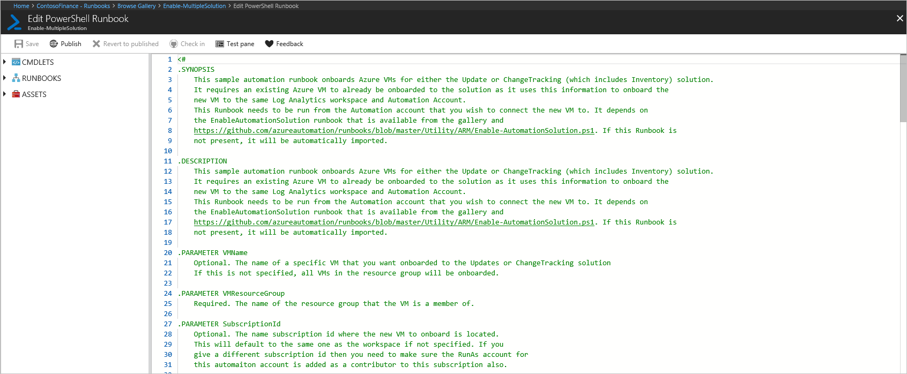

# Onboard update and change tracking solutions to Azure Automation

In this tutorial, you learn how to automatically onboard Update, Change Tracking, and Inventory solutions for VMs to Azure Automation:

> [!div class="checklist"]
> * Onboard an Azure virtual machine manually.
> * Install and update required Azure modules.
> * Import runbook that onboards Azure VMs.
> * Start runbook that onboards Azure VMs automatically.

## Prerequisites

To complete this tutorial, the following are required.
+ Azure subscription. If you don't have one yet, you can [activate your MSDN subscriber benefits](https://azure.microsoft.com/pricing/member-offers/msdn-benefits-details/) or sign up for a [free account](https://azure.microsoft.com/free/?WT.mc_id=A261C142F).
+ [Automation account](automation-offering-get-started.md) to manage machines.

## Onboard an Azure virtual machine manually

1.	Open the Automation account.
2.	Click on the Inventory page.

3.	Select an existing Log Analytics workspace or create new. Click Enable button.
4.  When the change tracking and inventory solution onboarding notification completes, click on the Update Management page.

4.	Click Enable button that onboards the update solution.
5.  When the update solution onboarding notification completes, click on the Change Tracking page.

6.  Click on the Add Azure VM button.

7.  Select an Azure VM and click on the Enable button to onboard to the change tracking and inventory solution.
8.  When the VM onboarding notification completes, click on the Update Management page.

9.  Click on the Add Azure VM button.

10.  Select an Azure VM and click on the Enable button to onboard to the update management solution.

## Install and update required Azure modules

It is required to update to the latest Azure modules and import AzureRM.OperationalInsights to successfully automate onboarding.
1.	Click on the Modules page.

2.	Click on the Update Azure Modules to update to the latest version. Wait for updates to complete.
3.	Click on the Browse gallery button to open up the module gallery.

4.  Search for AzureRM.OperationalInsights and import this module into the Automation account.

## Import runbook that onboards solutions to Azure VMs

1.	Click on the Runbooks page under the “PROCESS AUTOMATION” category.
2.	Click on the “Browse gallery” button.
3.	Search for “update and change tracking” and import the runbook into the Automation account.

4.	Click on “Edit” to view the Runbook source and click on the “Publish” button.

## Start runbook that onboards Azure VMs automatically

You must have onboarded either change tracking or update solutions to an Azure VM in order to start this runbook. It requires an existing virtual machine and resource group with the solution onboarded for parameters.
1.	Open the Enable-MultipleSolution runbook.

2.	Click the start button and enter the following values for parameters.
    *	VMNAME. The name of an existing VM to onboard to update or change tracking solution. Leave blank and all VMs in the resource group are onboarded.
    *	VMRESOURCEGROUP. The name of the resource group that the VM is a member of.
    *	SUBSCRIPTIONID. The subscription ID the new VM to onboard is located. Leave blank and the subscription of the workspace is used. When a different subscription ID is given, the RunAs account for this automation account should be added as a contributor for this subscription also.
    *	ALREADYONBOARDEDVM. The name of the VM that was manually onboarded to either the Updates or ChangeTracking solution.
    *	ALREADYONBOARDEDVMRESOURCEGROUP. The name of the resource group that the VM is a member of.
    *	SOLUTIONTYPE. Enter "Updates" or "ChangeTracking"

3.  Click OK to start the runbook job.
4.  Monitor progress and any errors on the runbook job page.

## Next steps

For more information, see [Scheduling runbooks](automation-schedules.md).