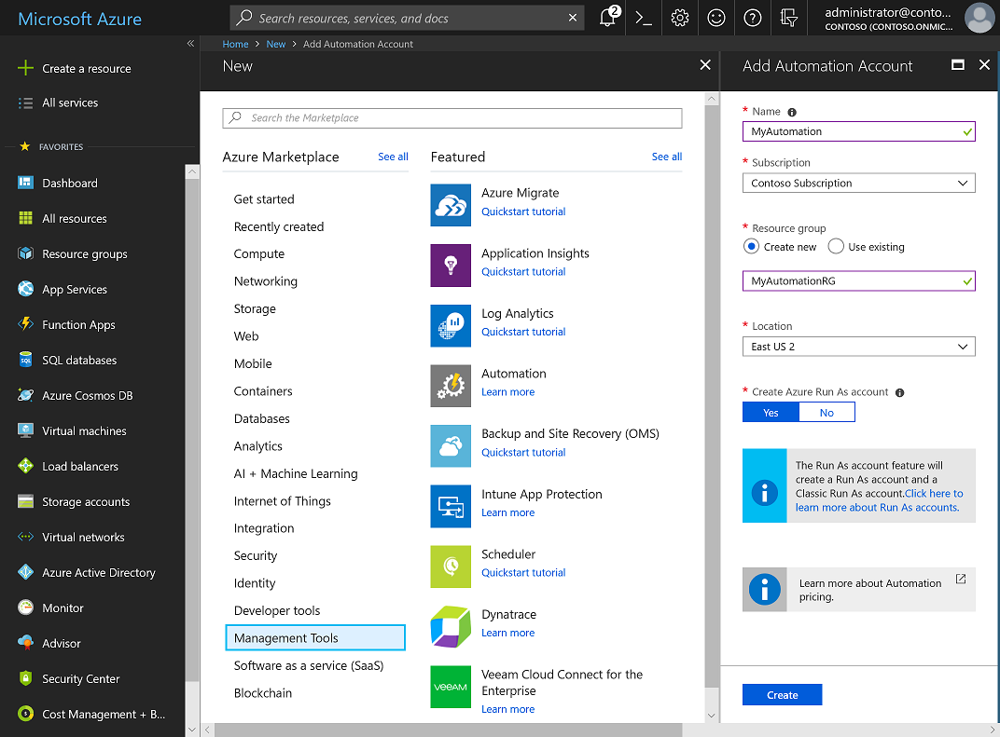
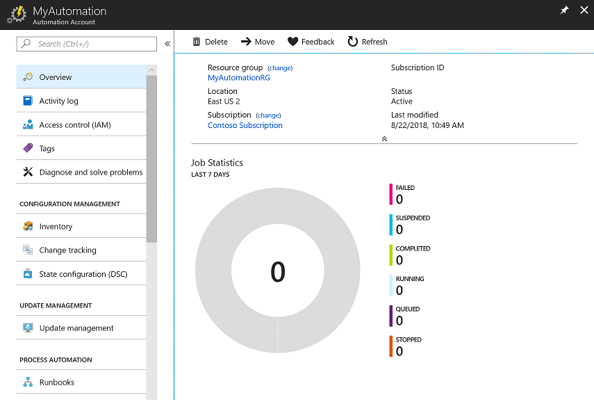
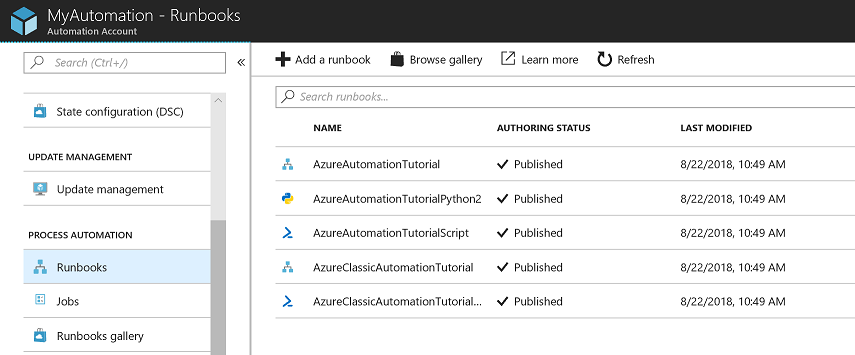
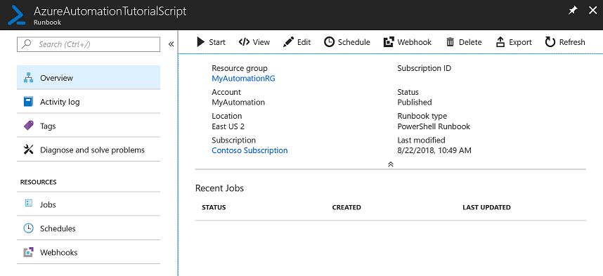
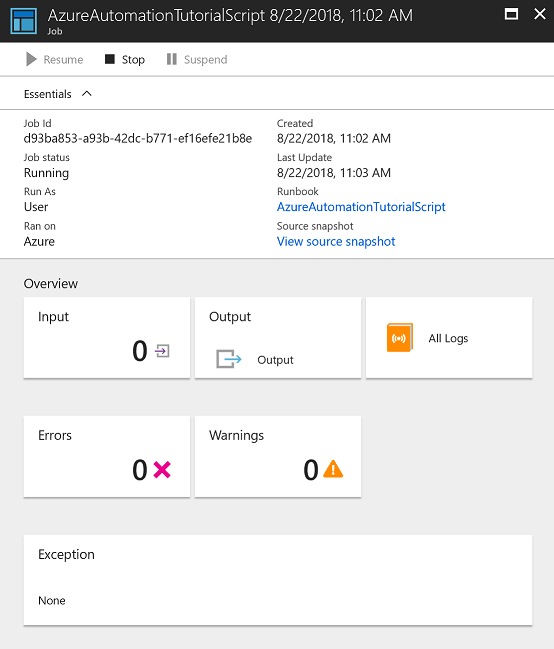

# Create an Azure Automation account

Azure Automation accounts can be created through Azure. This method provides a browser-based user interface for creating and configuring Automation accounts and related resources. This quickstart steps through creating an Automation account and running a runbook in the account.

If you don't have an Azure subscription, create a [free Azure account](https://azure.microsoft.com/free/?WT.mc_id=A261C142F) before you begin.

## Sign in to Azure

Sign in to Azure at https://portal.azure.com

## Create Automation account

1. Click the **Create a resource** button found on the upper left-hand corner of Azure.

1. Select **Management Tools**, and then select **Automation**.

1. Enter the account information. For **Create Azure Run As account**, choose **Yes** so that the artifacts to simplify authentication to Azure are enabled automatically. It is important to note, that when creating an Automation Account, the name cannot be changed after it is chosen. When complete, click **Create**, to start the Automation account deployment.

      

1. When the deployment has completed, click ** **All Services**, select **Automation Accounts** and select the Automation Account you created.

    

## Run a runbook

Run one of the tutorial runbooks.

1. Click **Runbooks** under **PROCESS AUTOMATION**. The list of runbooks is displayed. By default several tutorial runbooks are enabled in the account.

    

1. Select the **AzureAutomationTutorialScript** runbook. This action opens the runbook overview page.

    

1. Click **Start**, and on the **Start Runbook** page, click **OK** to start the runbook.

    

1. After the **Job status** becomes **Running**, click **Output** or **All Logs** to view the runbook job output. For this tutorial runbook, the output is a list of your Azure resources.

## Clean up resources

When no longer needed, delete the resource group, Automation account, and all related resources. To do so, select the resource group for the Automation account and click **Delete**.

## Next steps

In this quickstart, you’ve deployed an Automation account, started a runbook job, and viewed the job results. To learn more about Azure Automation, continue to the quickstart for creating your first runbook.

> [!div class="nextstepaction"]
> [Automation Quickstart - Create Runbook](./automation-quickstart-create-runbook.md)
