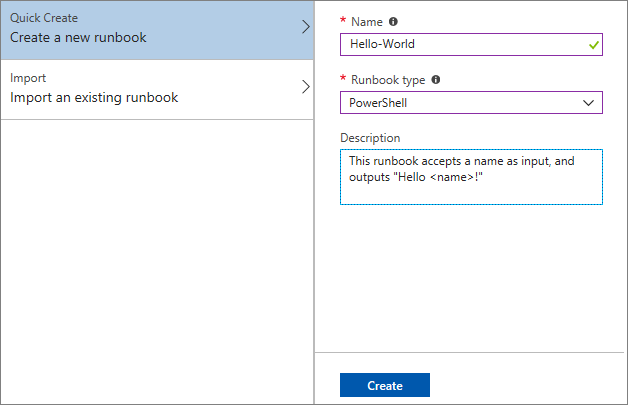
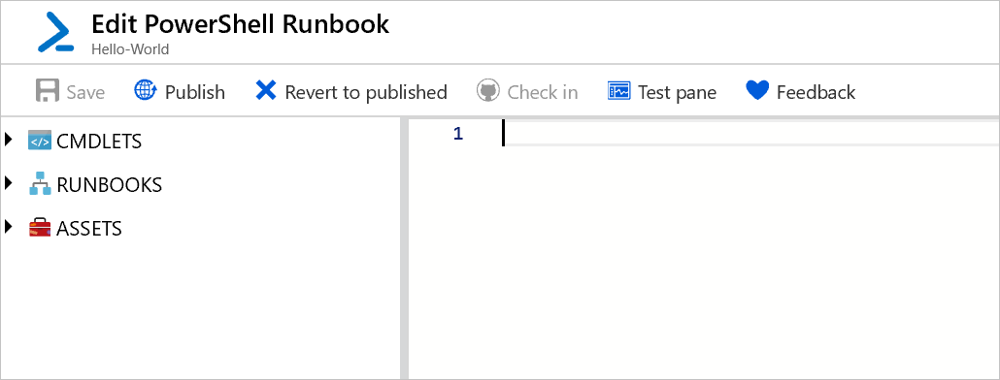
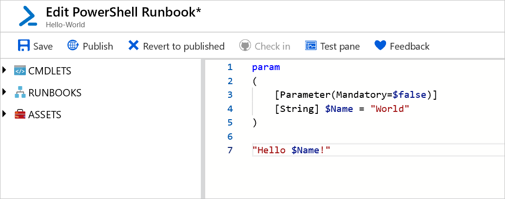
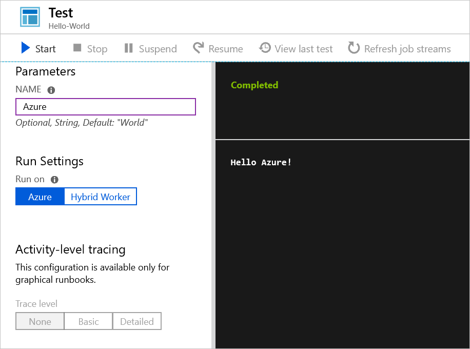
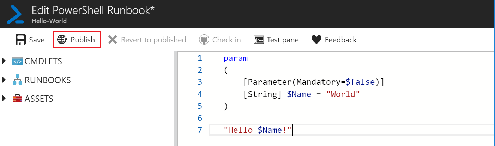
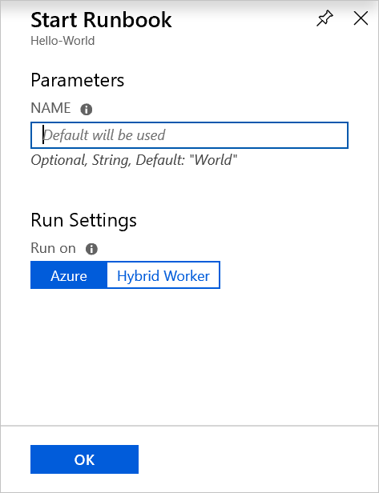
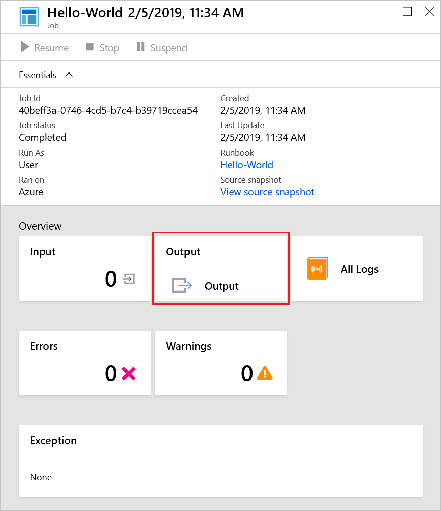
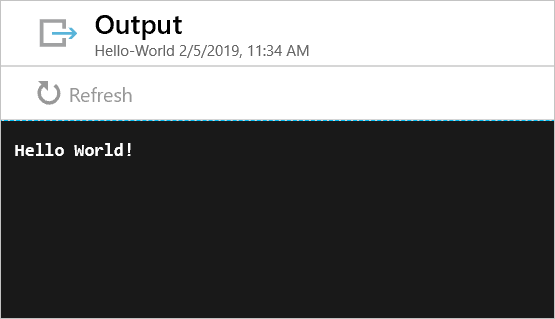

# Create an Azure Automation runbook

Azure Automation runbooks can be created through Azure. This method provides a browser-based user interface for creating Automation runbooks. In this quickstart you walk through creating, editing, testing, and publishing an Automation PowerShell runbook.

If you don't have an Azure subscription, create a [free Azure account](https://azure.microsoft.com/free/?WT.mc_id=A261C142F) before you begin.

## Sign in to Azure

Sign in to Azure at https://portal.azure.com.

## Create the runbook

First, create a runbook. The sample runbook created in this quickstart outputs `Hello World` by default.

1. Open your Automation account.

1. Click **Runbooks** under **Process Automation**. The list of runbooks is displayed.

1. Click **Create a runbook** at the top of the list.

1. Enter `Hello-World` for the runbook name in the **Name** field, and select **PowerShell** for the **Runbook type** field. 

   

1. Click **Create**. The runbook is created and the Edit PowerShell Runbook page opens.

    

1. Type or copy and paste the following code into the edit pane. It creates an optional input parameter called `Name` with a default value of `World`, and outputs a string that uses this input value:

   ```powershell-interactive
   param
   (
       [Parameter(Mandatory=$false)]
       [String] $Name = "World"
   )

   "Hello $Name!"
   ```

1. Click **Save** to save a draft copy of the runbook.

    

## Test the runbook

Once the runbook is created, you must test the runbook to validate that it works.

1. Click **Test pane** to open the Test pane.

1. Enter a value for **Name**, and click **Start**. The test job starts and the job status and output display.

    

1. Close the Test pane by clicking the **X** in the upper right corner. Select **OK** in the popup that appears.

1. In the Edit PowerShell Runbook page, click **Publish** to publish the runbook as the official version of the runbook in the account.

   

## Run the runbook

Once the runbook is published, the overview page is shown.

1. In the runbook overview page, click **Start** to open the Start Runbook configuration page for this runbook.

   

1. Leave **Name** blank, so that the default value is used, and click **OK**. The runbook job is submitted, and the Job page appears.

   

1. When the job status is `Running` or `Completed`, click **Output** to open the Output pane and view the runbook output.

   

## Clean up resources

When no longer needed, delete the runbook. To do so, select the runbook in the runbook list, and click **Delete**.

## Next steps

In this quickstart, you’ve created, edited, tested, and published a runbook and started a runbook job. To learn more about Automation runbooks, continue to the article on the different runbook types that you can create and use in Automation.

> [!div class="nextstepaction"]
> [Azure Automation runbook types](./automation-runbook-types.md)
