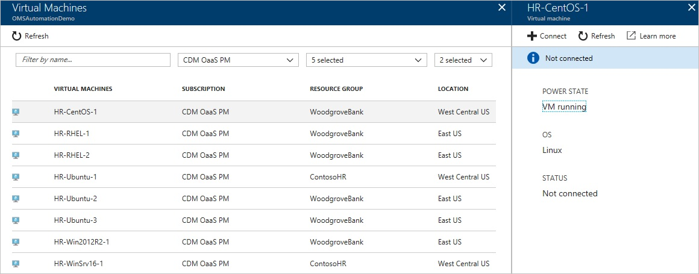
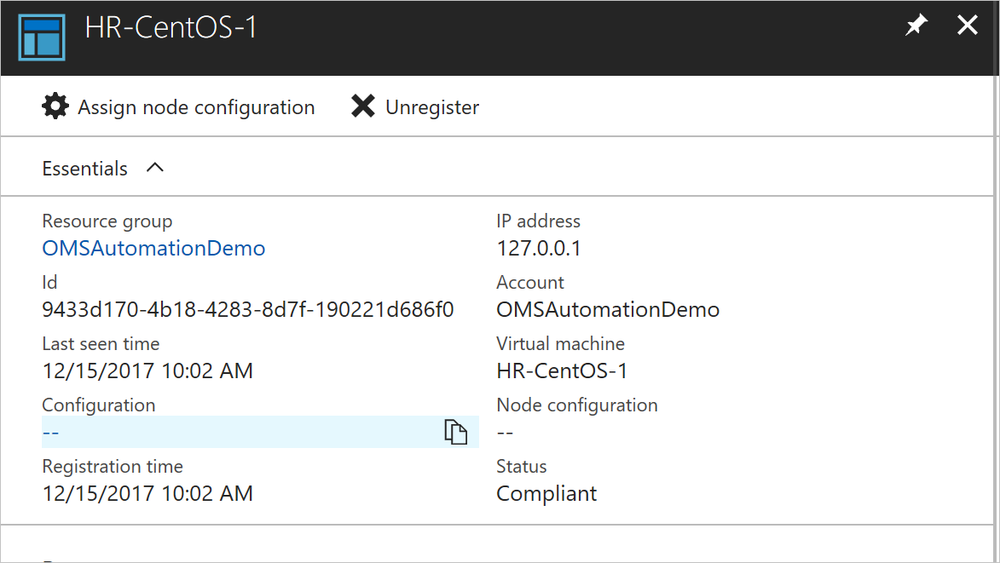
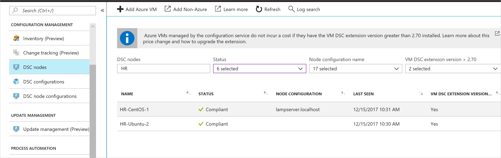

# Configure a Linux virtual machine with Desired State Configuration

By enabling Desired State Configuration (DSC), you can manage and monitor the configurations of your Windows and Linux servers. Configurations that drift from the desired configuration can be identified or auto-corrected. This quickstart steps through onboarding a Linux VM and deploying a LAMP stack with DSC.

## Prerequisites

To complete this quickstart, you need:

* An Azure subscription. If you don't have an Azure subscription, [create a free account](https://azure.microsoft.com/free/).
* An Azure Automation account. For instructions on creating an Azure Automation Run As account, see [Azure Run As Account](automation-sec-configure-azure-runas-account.md).
* An Azure Resource Manager VM (not Classic) running Red Hat Enterprise Linux, CentOS, or Oracle Linux. For instructions on creating a VM, see
  [Create your first Linux virtual machine in the Azure portal](../virtual-machines/linux/quick-create-portal.md)

## Sign in to Azure
Sign in to Azure at https://portal.azure.com

## Onboard a virtual machine
There are many different methods to onboard a machine and enable Desired State Configuration. This quickstart covers onboarding through an Automation account. You can learn more about different methods to onboard your machines to Desired State Configuration by reading the [onboarding](https://docs.microsoft.com/azure/automation/automation-dsc-onboarding) article.

1. In the left pane of the Azure portal, select **Automation accounts**. If it is not visible in the left pane, click **All services** and search for it in the resulting view.
1. In the list, select an Automation account.
1. In the left pane of the Automation account, select **State configuration (DSC)**.
2. Click **Add** to open the VM select page.
3. Find the virtual machine you would like to enable DSC for. You can use the search field and filter options to find a specific virtual machine.
4. Click on the virtual machine, and then select **Connect**
5. Select the DSC settings appropriate for the virtual machine. If you have already prepared a configuration, you can specify it as *Node Configuration Name*. You can set the [configuration mode](https://docs.microsoft.com/powershell/dsc/metaconfig) to control the configuration behavior for the machine.
6. Click **OK**



While the Desired State Configuration extension is deployed to the virtual machine, it shows *Connecting.*

## Import modules

Modules contain DSC Resources and many can be found on the [PowerShell Gallery](https://www.powershellgallery.com). Any resources that are used in your configurations must be imported to the Automation Account before compiling. For this tutorial, the module named **nx** is required.

1. In the left pane of the Automation account, select **Modules Gallery** (under Shared Resources).
1. Search for the module that you would like to import by typing part of its name: *nx*
1. Click on the module you would like to import
1. Click **Import**


## Import the configuration

This quickstart uses a DSC configuration that configures Apache HTTP Server, MySQL, and PHP on the machine.

For information about DSC configurations, see [DSC configurations](https://docs.microsoft.com/powershell/dsc/configurations).

In a text editor, type the following and save it locally as `LAMPServer.ps1`.

```powershell-interactive
configuration LAMPServer {
   Import-DSCResource -module "nx"

   Node localhost {

        $requiredPackages = @("httpd","mod_ssl","php","php-mysql","mariadb","mariadb-server")
        $enabledServices = @("httpd","mariadb")

        #Ensure packages are installed
        ForEach ($package in $requiredPackages){
            nxPackage $Package{
                Ensure = "Present"
                Name = $Package
                PackageManager = "yum"
            }
        }

        #Ensure daemons are enabled
        ForEach ($service in $enabledServices){
            nxService $service{
                Enabled = $true
                Name = $service
                Controller = "SystemD"
                State = "running"
            }
        }
   }
}
```

To import the configuration:

1. In the left pane of the Automation account, select **State configuration (DSC)** and then click the **Configurations** tab.
2. Click **+ Add**
3. Select the *Configuration file* that you saved in the prior step
4. Click **OK**

## Compile a configuration

DSC Configurations must be compiled to a Node Configuration (MOF document) before being assigned to a node. Compilation validates the configuration and allows for the input of parameter values. To learn more about compiling a configuration, see: [Compiling Configurations in Azure Automation DSC](https://docs.microsoft.com/azure/automation/automation-dsc-compile)

To compile the configuration:

1. In the left pane of the Automation account, select **State Configuration (DSC)** and then click the **Configurations** tab.
1. Select the configuration you imported in a prior step, "LAMPServer"
1. From the menu options, click **Compile** and then **Yes**
1. In the Configuration view, you see a new *Compilation job* queued. When the job has completed successfully, you are ready to move on to the next step. If there are any failures, you can click on the Compilation job for details.

## Assign a node configuration

A compiled *Node Configuration* can be assigned to DSC Nodes. Assignment applies the configuration to the machine and monitors (or auto-corrects) for any drift from that configuration.

1. In the left pane of the Automation account, select **State Configuration (DSC) and then click the **Nodes** tab.
1. Select the node you would like to assign a configuration to
1. Click **Assign Node Configuration**
1. Select the *Node Configuration* - **LAMPServer.localhost** -  to assign and click **OK**
1. The compiled configuration is now be assigned to the node, and the node status changes to *Pending*. On the next periodic check, the node retrieves the configuration, apply it, and report status back. It can take up to 30 minutes for the node to retrieve the configuration, depending on the node's settings. To force an immediate check, you can run the following command locally on the Linux virtual machine:
   `sudo /opt/microsoft/dsc/Scripts/PerformRequiredConfigurationChecks.py`



## Viewing node status

The status of all managed nodes can be found in the **State Configuration (DSC)** and then under the **Nodes** tab in the Automation Account. You can filter the display by status, node configuration, or name search.



## Next steps

In this quickstart, you onboarded a Linux VM to DSC, created a configuration for a LAMP stack, and deployed it to the VM. To learn how you can use Automation DSC to enable continuous deployment, continue to the article:

> [!div class="nextstepaction"]
> [Continuous deployment to a VM using DSC and Chocolatey](./automation-dsc-cd-chocolatey.md)

* To learn more about PowerShell Desired State Configuration, see [PowerShell Desired State Configuration Overview](https://docs.microsoft.com/powershell/dsc/overview).
* To learn more about managing Automation DSC from PowerShell, see [Azure PowerShell](https://docs.microsoft.com/powershell/module/azurerm.automation/)
* To learn how to forward DSC reports to Azure Monitor logs for reporting and alerting, see [Forwarding DSC Reporting to Azure Monitor logs](https://docs.microsoft.com/azure/automation/automation-dsc-diagnostics) 

