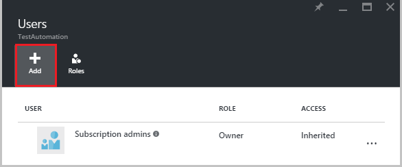
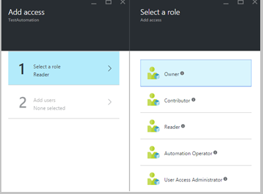
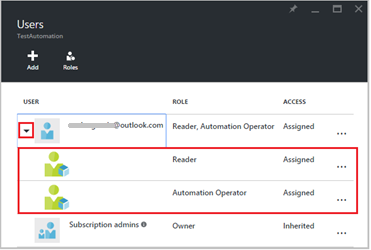
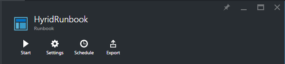
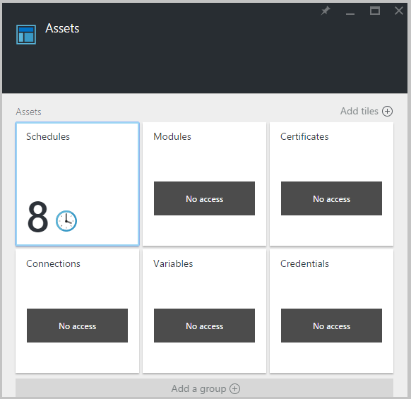
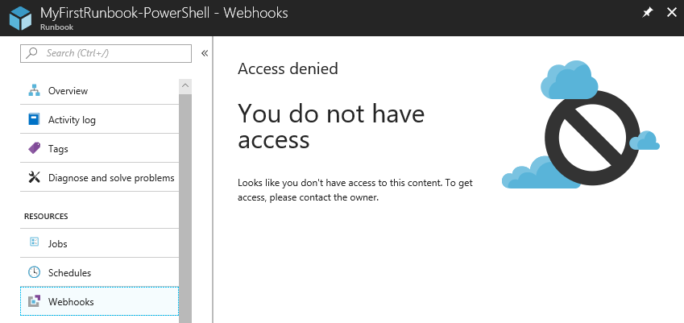
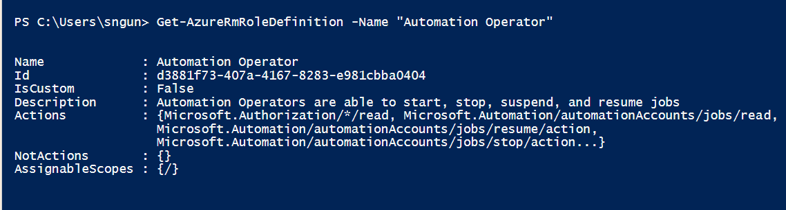
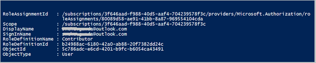
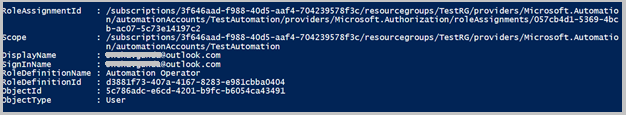

<properties 
   pageTitle="Role-based access control in Azure Automation | Microsoft Azure"
   description="Role-based access control (RBAC) enables access management for Azure resources. This article describes how to set up RBAC in Azure Automation."
   services="automation"
   documentationCenter=""
   authors="SnehaGunda"
   manager="stevenka"
   editor="tysonn" />
<tags 
   ms.service="automation"
   ms.devlang="na"
   ms.topic="get-started-article"
   ms.tgt_pltfrm="na"
   ms.workload="infrastructure-services"
   ms.date="04/04/2016"
   ms.author="sngun"/>

# Role-based access control in Azure Automation

## Role-based access control

Role-based access control (RBAC) enables access management for Azure resources. Using [RBAC](../active-directory/role-based-access-control-configure.md), you can segregate duties within your team and grant only the amount of access to users, groups and applications that they need to perform their jobs. Role-based access can be granted to users using the Azure portal, Azure Command-Line tools or Azure Management APIs.

## RBAC in Automation Accounts

In Azure Automation, access is granted by assigning the appropriate RBAC role to users, groups, and applications at the Automation account scope. Following are the built-in roles supported by an Automation account:  

|**Role** | **Description** |
|:--- |:---|
| Owner | The owner role allows access to all resources and actions within an Automation account including providing access to other users, groups and applications to manage the Automation account. |
| Contributor | The contributor role allows you to manage everything except modifying other user’s access permissions to an Automation account. |
| Reader | The reader role allows you to view all the resources in an Automation account but cannot make any changes. |
| Automation operator | The Automation operator role allows you to perform operational tasks such as start, stop, suspend, resume and schedule jobs. This role is helpful if you want to protect your Automation Account resources like credentials assets and runbooks from being viewed or modified but still allow members of your organization to execute these runbooks. [Automation operator actions](../active-directory/role-based-access-built-in-roles.md#automation-operator) lists the actions supported by the Automation operator role on the Automation account and its resources. |
| User access administrator | The user access administrator role allows you to manage user access to Azure Automation accounts. |

In this article we will walk you through how to set up RBAC in Azure Automation. 

## Configure RBAC for your Automation Account using Azure Portal

1.	Log in to the [Azure Portal](https://portal.azure.com/) and open your Automation account from the Automation Accounts blade.  

2.	Click on the **Access** control at the top right corner. This opens the **Users** blade where you can add new users, groups and applications to manage your Automation account and view existing roles that can be configured for the Automation Account.  

      

>[AZURE.NOTE]  **Subscription admins** already exists as the default user. The subscription admins active directory group includes the service administrator(s) and co-administrator(s) for your Azure subscription. The Service admin is the owner of your Azure subscription and its resources, and will have the owner role inherited for the automation accounts too. This means that the access is **Inherited** for **service administrators and co-admins** of a subscription and it’s **Assigned** for all the other users. Click **Subscription admins** to view more details about their permissions.  

### Add a new user and assign a role

1.	From the Users blade, click **Add** to open the **Add access blade** where you can add a user, group, or application, and assign a role to them.  

      

2.	Select a role from the list of available roles. We will choose the **Reader** role, but you can choose any of the available built-in roles that an Automation Account supports or any custom role you may have defined.  

      

3.	Click on **Add users** to open the **Add users** blade. If you have added any users, groups, or applications to manage your subscription then those users are listed and you can select them to add access. If there aren’t any users listed, or if the user you are interested in adding is not listed then click **invite** to open the **Invite a guest** blade, where you can invite a user with a valid Microsoft account email address such as Outlook.com, OneDrive, or Xbox Live Ids. Once you have entered the email address of the user, click **Select** to add the user, and then click **OK**. 

      
 
Now you should see the user added to the **Users** blade with the **Reader** role assigned.  

  

You can also assign a role to the user from the **Roles** blade. Click **Roles** from the Users blade to open the **Roles blade**. From this blade, you can view the name of the role, the number of users and groups assigned to that role.

  
   
>[AZURE.NOTE] Role-based access control can only be set at the Automation Account level and not at any resource below the Automation Account.

You can assign more than one role to a user, group, or application. For example, if we add the **Automation Operator** role along with the **Reader role** to the user, then they can view all the Automation resources, as well as execute the runbook jobs. You can expand the dropdown to view a list of roles assigned to the user.  

  
 
### Remove a user

You can remove the access permission for a user who is not managing the Automation Account, or who no longer works for the organization. Following are the steps to remove a user: 

1.	From the **Users** blade, select the role assignment that you wish to remove.

2.	Click the **Remove** button in the assignment details blade.

3.	Click **Yes** to confirm removal. 

      

## Role Assigned User

When a user assigned to a role logs in to their Automation account, they can now see the owner’s account listed in the list of **Default Directories**. In order to view the Automation account that they have been added to, they must switch the default directory to the owner’s default directory.  

  

### User experience for Automation operator role

When a user, who is assigned to the Automation Operator role views the Automation account he is assigned to, they can only view the list of runbooks, runbook jobs and schedules created in the Automation account but can’t view their definition. They can start, stop, suspend, resume or schedule the runbook job. The user will not have access to other Automation resources such as configurations, hybrid worker groups or DSC nodes.  

  

When the user clicks on the runbook, the commands to view the source or edit the runbook are not provided as the Automation operator role doesn’t allow access to them.  

  

The user will have access to view and to create schedules but will not have access to any other asset type.  

  

This user also doesn’t have access to view the webhooks associated with a runbook

  

## Configure RBAC for your Automation Account using Azure PowerShell

Role-based access can also be configured to an Automation Account using the following [Azure PowerShell cmdlets](../active-directory/role-based-access-control-manage-access-powershell.md).

• [Get-AzureRmRoleDefinition](https://msdn.microsoft.com/library/mt603792.aspx) lists all roles that are available in Azure Active Directory RBAC. You can use this command along with the **Name** property to list all the users with a specific role.  
    **Example:**  
      

• [Get-AzureRmRoleAssignment](https://msdn.microsoft.com/library/mt619413.aspx) lists Azure RBAC role assignments at the specified scope. Without any parameters, this command returns all the role assignments made under the subscription. Use the **ExpandPrincipalGroups** parameter to list access assignments to the specified user as well as to the groups of which the user is a member.  
    **Example:** Use the following command to list all the users and their roles within an automation account.

    Get-AzureRMRoleAssignment -scope “/subscriptions/<SubscriptionID>/resourcegroups/<Resource Group Name>/Providers/Microsoft.Automation/automationAccounts/<Automation Account Name>” 

• [New-AzureRmRoleAssignment](https://msdn.microsoft.com/library/mt603580.aspx) to grant access to users, groups and applications at a particular scope.  
    **Example:** Use the following command to create a new role “Automation Operator” for a user at the Automation Account scope.

    New-AzureRmRoleAssignment -SignInName <sign-in Id of a user you wish to grant access> -RoleDefinitionName "Automation operator" -Scope “/subscriptions/<SubscriptionID>/resourcegroups/<Resource Group Name>/Providers/Microsoft.Automation/automationAccounts/<Automation Account Name>”  

• Use [Remove-AzureRmRoleAssignment](https://msdn.microsoft.com/library/mt603781.aspx) to remove access to the specified user, group or application at a particular scope.
    **Example:** Use the following command to create a new role “Automation Operator” for a user at the Automation Account scope.

    Remove-AzureRmRoleAssignment -SignInName "<sign-in Id of a user you wish to remove>" -RoleDefinitionName "Automation Operator" -Scope “/subscriptions/<SubscriptionID>/resourcegroups/<Resource Group Name>/Providers/Microsoft.Automation/automationAccounts/<Automation Account Name>”

In the above cmdlets, replace sign in name, subscription ID, resource group name and Automation account name with your account details. Choose **yes** when prompted for continue to delete the role assignment.   

## Next Steps
-  For information on different ways to configure RBAC to Azure Automation, refer to [manage RBAC with Azure PowerShell](../active-directory/role-based-access-control-manage-access-powershell.md).
- For details on different ways to start a runbook, see [Starting a runbook](automation-starting-a-runbook.md)
- For information about different types, refer to [Azure Automation runbook types](automation-runbook-types.md)

