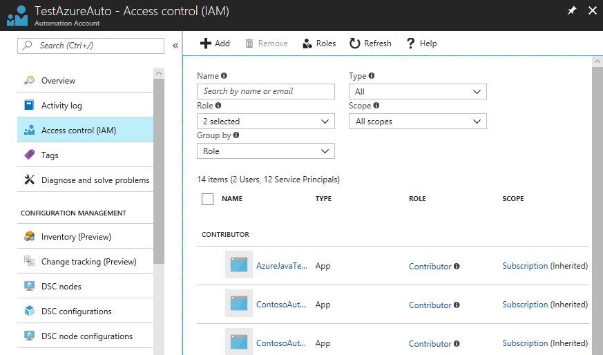
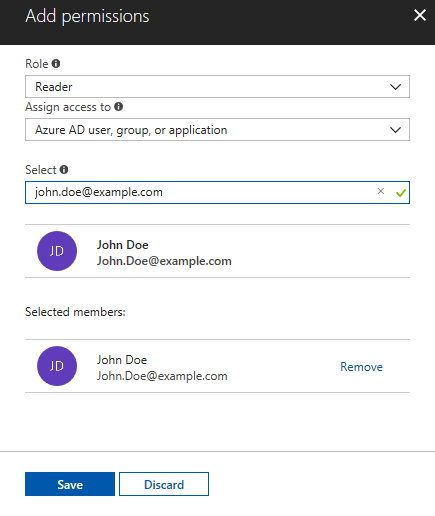
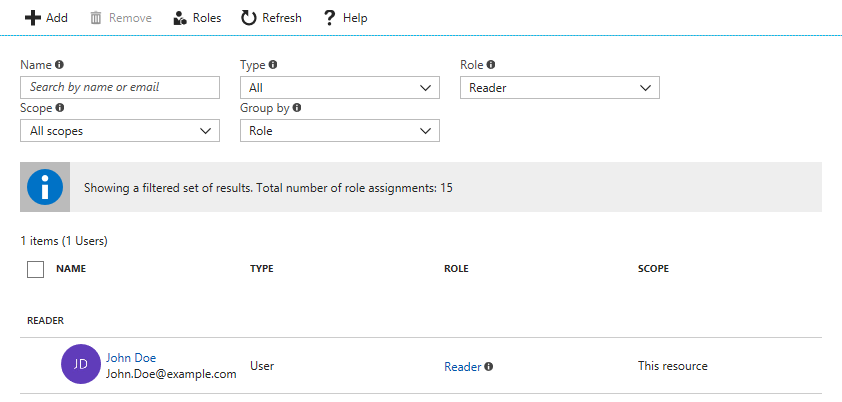
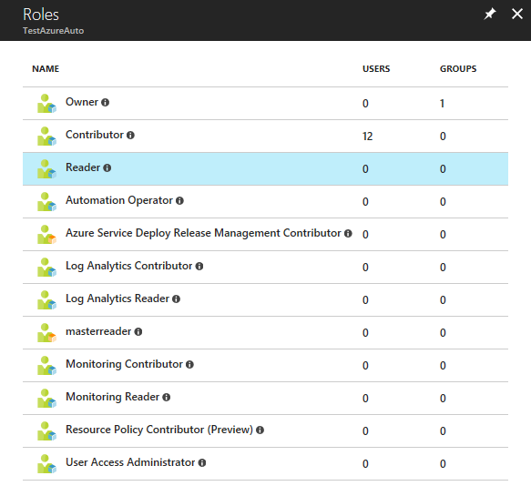
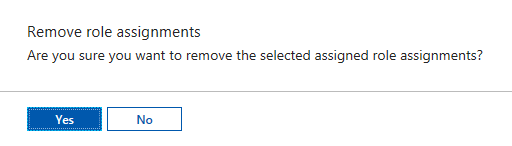
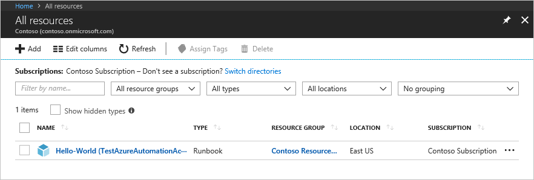

# Manage role permissions and security

Role-based access control (RBAC) enables access management for Azure resources. Using [RBAC](../role-based-access-control/overview.md), you can segregate duties within your team and grant only the amount of access to users, groups, and applications that they need to perform their jobs. You can grant role-based access to users using the Azure portal, Azure Command-Line tools, or Azure Management APIs.

## Roles in Automation accounts

In Azure Automation, access is granted by assigning the appropriate RBAC role to users, groups, and applications at the Automation account scope. Following are the built-in roles supported by an Automation account:

| **Role** | **Description** |
|:--- |:--- |
| Owner |The Owner role allows access to all resources and actions within an Automation account including providing access to other users, groups, and applications to manage the Automation account. |
| Contributor |The Contributor role allows you to manage everything except modifying other user’s access permissions to an Automation account. |
| Reader |The Reader role allows you to view all the resources in an Automation account but cannot make any changes. |
| Automation Operator |The Automation Operator role allows you to view runbook name and properties and to create and manage jobs for all runbooks in an Automation account. This role is helpful if you want to protect your Automation account resources like credentials assets and runbooks from being viewed or modified but still allow members of your organization to execute these runbooks. |
|Automation Job Operator|The Automation Job Operator role allows you to create and manage jobs for all runbooks in an Automation account.|
|Automation Runbook Operator|The Automation Runbook Operator role allows you to view a runbook’s name and properties.|
| Log Analytics Contributor | The Log Analytics Contributor role allows you to read all monitoring data and edit monitoring settings. Editing monitoring settings includes adding the VM extension to VMs, reading storage account keys to be able to configure collection of logs from Azure storage, creating and configuring Automation accounts, adding Azure Automation features, and configuring Azure diagnostics on all Azure resources.|
| Log Analytics Reader | The Log Analytics Reader role allows you to view and search all monitoring data as well as view monitoring settings. This includes viewing the configuration of Azure diagnostics on all Azure resources. |
| Monitoring Contributor | The Monitoring Contributor role allows you to read all monitoring data and update monitoring settings.|
| Monitoring Reader | The Monitoring Reader role allows you to read all monitoring data. |
| User Access Administrator |The User Access Administrator role allows you to manage user access to Azure Automation accounts. |

## Role permissions

The following tables describe the specific permissions given to each role. This can include Actions, which give permissions, and NotActions, which restrict them.

### Owner

An Owner can manage everything, including access. The following table shows the permissions granted for the role:

|Actions|Description|
|---|---|
|Microsoft.Automation/automationAccounts/|Create and manage resources of all types.|

### Contributor

A Contributor can manage everything except access. The following table shows the permissions granted and denied for the role:

|**Actions**  |**Description**  |
|---------|---------|
|Microsoft.Automation/automationAccounts/|Create and manage resources of all types|
|**Not Actions**||
|Microsoft.Authorization/*/Delete| Delete roles and role assignments.       |
|Microsoft.Authorization/*/Write     |  Create roles and role assignments.       |
|Microsoft.Authorization/elevateAccess/Action    | Denies the ability to create a User Access Administrator.       |

### Reader

A Reader can view all the resources in an Automation account but cannot make any changes.

|**Actions**  |**Description**  |
|---------|---------|
|Microsoft.Automation/automationAccounts/read|View all resources in an Automation account. |

### Automation Operator

An Automation Operator is able to create and manage jobs, and read runbook names and properties for all runbooks in an Automation account.  Note: If you want to control operator access to individual runbooks then don’t set this role, and instead use the 'Automation Job Operator' and 'Automation Runbook Operator' roles in combination. The following table shows the permissions granted for the role:

|**Actions**  |**Description**  |
|---------|---------|
|Microsoft.Authorization/*/read|Read authorization.|
|Microsoft.Automation/automationAccounts/hybridRunbookWorkerGroups/read|Read Hybrid Runbook Worker Resources.|
|Microsoft.Automation/automationAccounts/jobs/read|List jobs of the runbook.|
|Microsoft.Automation/automationAccounts/jobs/resume/action|Resume a job that is paused.|
|Microsoft.Automation/automationAccounts/jobs/stop/action|Cancel a job in progress.|
|Microsoft.Automation/automationAccounts/jobs/streams/read|Read the Job Streams and Output.|
|Microsoft.Automation/automationAccounts/jobs/output/read|Get the Output of a job.|
|Microsoft.Automation/automationAccounts/jobs/suspend/action|Pause a job in progress.|
|Microsoft.Automation/automationAccounts/jobs/write|Create jobs.|
|Microsoft.Automation/automationAccounts/jobSchedules/read|Get an Azure Automation job schedule.|
|Microsoft.Automation/automationAccounts/jobSchedules/write|Create an Azure Automation job schedule.|
|Microsoft.Automation/automationAccounts/linkedWorkspace/read|Get the workspace linked to the Automation account.|
|Microsoft.Automation/automationAccounts/read|Get an Azure Automation account.|
|Microsoft.Automation/automationAccounts/runbooks/read|Get an Azure Automation runbook.|
|Microsoft.Automation/automationAccounts/schedules/read|Get an Azure Automation schedule asset.|
|Microsoft.Automation/automationAccounts/schedules/write|Create or update an Azure Automation schedule asset.|
|Microsoft.Resources/subscriptions/resourceGroups/read      |Read roles and role assignments.         |
|Microsoft.Resources/deployments/*      |Create and manage resource group deployments.         |
|Microsoft.Insights/alertRules/*      | Create and manage alert rules.        |
|Microsoft.Support/* |Create and manage support tickets.|

### Automation Job Operator

An Automation Job Operator role is granted at the Automation account scope. This allows the operator permissions to create and manage jobs for all runbooks in the account. The following table shows the permissions granted for the role:

|**Actions**  |**Description**  |
|---------|---------|
|Microsoft.Authorization/*/read|Read authorization.|
|Microsoft.Automation/automationAccounts/jobs/read|List jobs of the runbook.|
|Microsoft.Automation/automationAccounts/jobs/resume/action|Resume a job that is paused.|
|Microsoft.Automation/automationAccounts/jobs/stop/action|Cancel a job in progress.|
|Microsoft.Automation/automationAccounts/jobs/streams/read|Read the Job Streams and Output.|
|Microsoft.Automation/automationAccounts/jobs/suspend/action|Pause a job in progress.|
|Microsoft.Automation/automationAccounts/jobs/write|Create jobs.|
|Microsoft.Resources/subscriptions/resourceGroups/read      |  Read roles and role assignments.       |
|Microsoft.Resources/deployments/*      |Create and manage resource group deployments.         |
|Microsoft.Insights/alertRules/*      | Create and manage alert rules.        |
|Microsoft.Support/* |Create and manage support tickets.|

### Automation Runbook Operator

An Automation Runbook Operator role is granted at the Runbook scope. An Automation Runbook Operator can view the runbook's name and properties.  This role combined with the 'Automation Job Operator' role enables the operator to also create and manage jobs for the runbook. The following table shows the permissions granted for the role:

|**Actions**  |**Description**  |
|---------|---------|
|Microsoft.Automation/automationAccounts/runbooks/read     | List the runbooks.        |
|Microsoft.Authorization/*/read      | Read authorization.        |
|Microsoft.Resources/subscriptions/resourceGroups/read      |Read roles and role assignments.         |
|Microsoft.Resources/deployments/*      | Create and manage resource group deployments.         |
|Microsoft.Insights/alertRules/*      | Create and manage alert rules.        |
|Microsoft.Support/*      | Create and manage support tickets.        |

### Log Analytics Contributor

A Log Analytics Contributor can read all monitoring data and edit monitoring settings. Editing monitoring settings includes adding the VM extension to VMs; reading storage account keys to be able to configure collection of logs from Azure Storage; creating and configuring Automation accounts; adding features; and configuring Azure diagnostics on all Azure resources. The following table shows the permissions granted for the role:

|**Actions**  |**Description**  |
|---------|---------|
|*/read|Read resources of all types, except secrets.|
|Microsoft.Automation/automationAccounts/*|Manage Automation accounts.|
|Microsoft.ClassicCompute/virtualMachines/extensions/*|Create and manage virtual machine extensions.|
|Microsoft.ClassicStorage/storageAccounts/listKeys/action|List classic storage account keys.|
|Microsoft.Compute/virtualMachines/extensions/*|Create and manage classic virtual machine extensions.|
|Microsoft.Insights/alertRules/*|Read/write/delete alert rules.|
|Microsoft.Insights/diagnosticSettings/*|Read/write/delete diagnostic settings.|
|Microsoft.OperationalInsights/*|Manage Azure Monitor logs.|
|Microsoft.OperationsManagement/*|Manage Azure Automation features in workspaces.|
|Microsoft.Resources/deployments/*|Create and manage resource group deployments.|
|Microsoft.Resources/subscriptions/resourcegroups/deployments/*|Create and manage resource group deployments.|
|Microsoft.Storage/storageAccounts/listKeys/action|List storage account keys.|
|Microsoft.Support/*|Create and manage support tickets.|

### Log Analytics Reader

A Log Analytics Reader can view and search all monitoring data as well as and view monitoring settings, including viewing the configuration of Azure diagnostics on all Azure resources. The following table shows the permissions granted or denied for the role:

|**Actions**  |**Description**  |
|---------|---------|
|*/read|Read resources of all types, except secrets.|
|Microsoft.OperationalInsights/workspaces/analytics/query/action|Manage queries in Azure Monitor logs.|
|Microsoft.OperationalInsights/workspaces/search/action|Search Azure Monitor log data.|
|Microsoft.Support/*|Create and manage support tickets.|
|**Not Actions**| |
|Microsoft.OperationalInsights/workspaces/sharedKeys/read|Not able to read the shared access keys.|

### Monitoring Contributor

A Monitoring Contributor can read all monitoring data and update monitoring settings. The following table shows the permissions granted for the role:

|**Actions**  |**Description**  |
|---------|---------|
|*/read|Read resources of all types, except secrets.|
|Microsoft.AlertsManagement/alerts/*|Manage Alerts.|
|Microsoft.AlertsManagement/alertsSummary/*|Manage the Alert dashboard.|
|Microsoft.Insights/AlertRules/*|Manage alert rules.|
|Microsoft.Insights/components/*|Manage Application Insights components.|
|Microsoft.Insights/DiagnosticSettings/*|Manage diagnostic settings.|
|Microsoft.Insights/eventtypes/*|List Activity Log events (management events) in a subscription. This permission is applicable to both programmatic and portal access to the Activity Log.|
|Microsoft.Insights/LogDefinitions/*|This permission is necessary for users who need access to Activity Logs via the portal. List log categories in Activity Log.|
|Microsoft.Insights/MetricDefinitions/*|Read metric definitions (list of available metric types for a resource).|
|Microsoft.Insights/Metrics/*|Read metrics for a resource.|
|Microsoft.Insights/Register/Action|Register the Microsoft.Insights provider.|
|Microsoft.Insights/webtests/*|Manage Application Insights web tests.|
|Microsoft.OperationalInsights/workspaces/intelligencepacks/*|Manage Azure Monitor logs solution packs.|
|Microsoft.OperationalInsights/workspaces/savedSearches/*|Manage Azure Monitor logs saved searches.|
|Microsoft.OperationalInsights/workspaces/search/action|Search Log Analytics workspaces.|
|Microsoft.OperationalInsights/workspaces/sharedKeys/action|List keys for a Log Analytics workspace.|
|Microsoft.OperationalInsights/workspaces/storageinsightconfigs/*|Manage Azure Monitor logs storage insight configurations.|
|Microsoft.Support/*|Create and manage support tickets.|
|Microsoft.WorkloadMonitor/workloads/*|Manage Workloads.|

### Monitoring Reader

A Monitoring Reader can read all monitoring data. The following table shows the permissions granted for the role:

|**Actions**  |**Description**  |
|---------|---------|
|*/read|Read resources of all types, except secrets.|
|Microsoft.OperationalInsights/workspaces/search/action|Search Log Analytics workspaces.|
|Microsoft.Support/*|Create and manage support tickets|

### User Access Administrator

A User Access Administrator can manage user access to Azure resources. The following table shows the permissions granted for the role:

|**Actions**  |**Description**  |
|---------|---------|
|*/read|Read all resources|
|Microsoft.Authorization/*|Manage authorization|
|Microsoft.Support/*|Create and manage support tickets|

## Feature setup permissions

The following sections describe the minimum required permissions needed for enabling the Update Management and Change Tracking and Inventory features.

### Permissions for enabling Update Management and Change Tracking and Inventory from a VM

|**Action**  |**Permission**  |**Minimum scope**  |
|---------|---------|---------|
|Write new deployment      | Microsoft.Resources/deployments/*          |Subscription          |
|Write new resource group      | Microsoft.Resources/subscriptions/resourceGroups/write        | Subscription          |
|Create new default Workspace      | Microsoft.OperationalInsights/workspaces/write         | Resource group         |
|Create new Account      |  Microsoft.Automation/automationAccounts/write        |Resource group         |
|Link workspace and account      |Microsoft.OperationalInsights/workspaces/write</br>Microsoft.Automation/automationAccounts/read|Workspace</br>Automation account
|Create MMA extension      | Microsoft.Compute/virtualMachines/write         | Virtual Machine         |
|Create saved search      | Microsoft.OperationalInsights/workspaces/write          | Workspace         |
|Create scope config      | Microsoft.OperationalInsights/workspaces/write          | Workspace         |
|Onboarding state check - Read workspace      | Microsoft.OperationalInsights/workspaces/read         | Workspace         |
|Onboarding state check - Read linked workspace property of account     | Microsoft.Automation/automationAccounts/read      | Automation account        |
|Onboarding state check - Read solution      | Microsoft.OperationalInsights/workspaces/intelligencepacks/read          | Solution         |
|Onboarding state check - Read VM      | Microsoft.Compute/virtualMachines/read         | Virtual Machine         |
|Onboarding state check - Read account      | Microsoft.Automation/automationAccounts/read  |  Automation account   |
| Onboarding workspace check for VM<sup>1</sup>       | Microsoft.OperationalInsights/workspaces/read         | Subscription         |
| Register the Log Analytics provider |Microsoft.Insights/register/action | Subscription|

<sup>1</sup> This permission is needed to enable features through the VM portal experience.

### Permissions for enabling Update Management and Change Tracking and Inventory from an Automation account

|**Action**  |**Permission** |**Minimum Scope**  |
|---------|---------|---------|
|Create new deployment     | Microsoft.Resources/deployments/*        | Subscription         |
|Create new resource group     | Microsoft.Resources/subscriptions/resourceGroups/write         | Subscription        |
|AutomationOnboarding blade - Create new workspace     |Microsoft.OperationalInsights/workspaces/write           | Resource group        |
|AutomationOnboarding blade - read linked workspace     | Microsoft.Automation/automationAccounts/read        | Automation account       |
|AutomationOnboarding blade - read solution     | Microsoft.OperationalInsights/workspaces/intelligencepacks/read         | Solution        |
|AutomationOnboarding blade - read workspace     | Microsoft.OperationalInsights/workspaces/intelligencepacks/read        | Workspace        |
|Create link for workspace and Account     | Microsoft.OperationalInsights/workspaces/write        | Workspace        |
|Write account for shoebox      | Microsoft.Automation/automationAccounts/write        | Account        |
|Create/edit saved search     | Microsoft.OperationalInsights/workspaces/write        | Workspace        |
|Create/edit scope config     | Microsoft.OperationalInsights/workspaces/write        | Workspace        |
| Register the Log Analytics provider |Microsoft.Insights/register/action | Subscription|
|**Step 2   - Enable Multiple VMs**     |         |         |
|VMOnboarding blade - Create MMA extension     | Microsoft.Compute/virtualMachines/write           | Virtual Machine        |
|Create / edit saved search     | Microsoft.OperationalInsights/workspaces/write           | Workspace        |
|Create / edit scope config  | Microsoft.OperationalInsights/workspaces/write   | Workspace|

## Update management permissions

Update management reaches across multiple services to provide its service. The following table shows the permissions needed to manage update management deployments:

|**Resource**  |**Role**  |**Scope**  |
|---------|---------|---------|
|Automation account     | Log Analytics Contributor       | Automation account        |
|Automation account    | Virtual Machine Contributor        | Resource Group for the account        |
|Log Analytics workspace     | Log Analytics Contributor| Log Analytics workspace        |
|Log Analytics workspace |Log Analytics Reader| Subscription|
|Solution     |Log Analytics Contributor         | Solution|
|Virtual Machine     | Virtual Machine Contributor        | Virtual Machine        |

## Configure RBAC for your Automation account

The following section shows you how to configure RBAC on your Automation account through the [Azure portal](#configure-rbac-using-the-azure-portal) and [PowerShell](#configure-rbac-using-powershell).

### Configure RBAC using the Azure portal

1. Log in to the [Azure portal](https://portal.azure.com/) and open your Automation account from the Automation Accounts page.
2. Click on **Access control (IAM)** to open the Access control (IAM) page. You can use this page to add new users, groups, and applications to manage your Automation account and view existing roles that are configurable for the Automation account.
3. Click the **Role assignments** tab.

   

#### Add a new user and assign a role

1. From the Access control (IAM) page, click **+ Add role assignment**. This action opens the Add role assignment page where you can add a user, group, or application, and assign a corresponding role.

2. Select a role from the list of available roles. You can choose any of the available built-in roles that an Automation account supports or any custom role you may have defined.

3. Type the name of the user that you want to give permissions to in the **Select** field. Choose the user from the list and click **Save**.

   

   Now you should see the user added to the Users page, with the selected role assigned.

   

   You can also assign a role to the user from the Roles page.
4. Click **Roles** from the Access control (IAM) page to open the Roles page. You can view the name of the role and the number of users and groups assigned to that role.

    

   > [!NOTE]
   > You can only set role-based access control at the Automation account scope and not at any resource below the Automation account.

#### Remove a user

You can remove the access permission for a user who is not managing the Automation account, or who no longer works for the organization. Following are the steps to remove a user:

1. From the Access control (IAM) page, select the user to remove and click **Remove**.
2. Click the **Remove** button in the assignment details pane.
3. Click **Yes** to confirm removal.

   

### Configure RBAC using PowerShell

You can also configure role-based access to an Automation account using the following [Azure PowerShell cmdlets](../role-based-access-control/role-assignments-powershell.md):

[Get-AzRoleDefinition](https://docs.microsoft.com/powershell/module/Az.Resources/Get-AzRoleDefinition?view=azps-3.7.0) lists all RBAC roles that are available in Azure Active Directory. You can use this cmdlet with the `Name` parameter to list all the actions that a specific role can perform.

```azurepowershell-interactive
Get-AzRoleDefinition -Name 'Automation Operator'
```

The following is the example output:

```azurepowershell
Name             : Automation Operator
Id               : d3881f73-407a-4167-8283-e981cbba0404
IsCustom         : False
Description      : Automation Operators are able to start, stop, suspend, and resume jobs
Actions          : {Microsoft.Authorization/*/read, Microsoft.Automation/automationAccounts/jobs/read, Microsoft.Automation/automationAccounts/jobs/resume/action,
                   Microsoft.Automation/automationAccounts/jobs/stop/action...}
NotActions       : {}
AssignableScopes : {/}
```

[Get-AzRoleAssignment](https://docs.microsoft.com/powershell/module/az.resources/get-azroleassignment?view=azps-3.7.0) lists Azure AD RBAC role assignments at the specified scope. Without any parameters, this cmdlet returns all the role assignments made under the subscription. Use the `ExpandPrincipalGroups` parameter to list access assignments for the specified user, as well as the groups that the user belongs to.

**Example:** Use the following cmdlet to list all the users and their roles within an Automation account.

```azurepowershell-interactive
Get-AzRoleAssignment -Scope '/subscriptions/<SubscriptionID>/resourcegroups/<Resource Group Name>/Providers/Microsoft.Automation/automationAccounts/<Automation account name>'
```

The following is the example output:

```powershell
RoleAssignmentId   : /subscriptions/00000000-0000-0000-0000-000000000000/resourceGroups/myResourceGroup/providers/Microsoft.Automation/automationAccounts/myAutomationAccount/provid
                     ers/Microsoft.Authorization/roleAssignments/cc594d39-ac10-46c4-9505-f182a355c41f
Scope              : /subscriptions/00000000-0000-0000-0000-000000000000/resourceGroups/myResourceGroup/providers/Microsoft.Automation/automationAccounts/myAutomationAccount
DisplayName        : admin@contoso.com
SignInName         : admin@contoso.com
RoleDefinitionName : Automation Operator
RoleDefinitionId   : d3881f73-407a-4167-8283-e981cbba0404
ObjectId           : 15f26a47-812d-489a-8197-3d4853558347
ObjectType         : User
```

Use [New-AzRoleAssignment](https://docs.microsoft.com/powershell/module/Az.Resources/New-AzRoleAssignment?view=azps-3.7.0) to assign access to users, groups, and applications to a particular scope.
    
**Example:** Use the following command to assign the "Automation Operator" role for a user in the Automation account scope.

```azurepowershell-interactive
New-AzRoleAssignment -SignInName <sign-in Id of a user you wish to grant access> -RoleDefinitionName 'Automation operator' -Scope '/subscriptions/<SubscriptionID>/resourcegroups/<Resource Group Name>/Providers/Microsoft.Automation/automationAccounts/<Automation account name>'
```

The following is the example output:

```azurepowershell
RoleAssignmentId   : /subscriptions/00000000-0000-0000-0000-000000000000/resourcegroups/myResourceGroup/Providers/Microsoft.Automation/automationAccounts/myAutomationAccount/provid
                     ers/Microsoft.Authorization/roleAssignments/25377770-561e-4496-8b4f-7cba1d6fa346
Scope              : /subscriptions/00000000-0000-0000-0000-000000000000/resourcegroups/myResourceGroup/Providers/Microsoft.Automation/automationAccounts/myAutomationAccount
DisplayName        : admin@contoso.com
SignInName         : admin@contoso.com
RoleDefinitionName : Automation Operator
RoleDefinitionId   : d3881f73-407a-4167-8283-e981cbba0404
ObjectId           : f5ecbe87-1181-43d2-88d5-a8f5e9d8014e
ObjectType         : User
```

Use [Remove-AzRoleAssignment](https://docs.microsoft.com/powershell/module/Az.Resources/Remove-AzRoleAssignment?view=azps-3.7.0) to remove access of a specified user, group, or application from a particular scope.

**Example:** Use the following command to remove the user from the Automation Operator role in the Automation account scope.

```azurepowershell-interactive
Remove-AzRoleAssignment -SignInName <sign-in Id of a user you wish to remove> -RoleDefinitionName 'Automation Operator' -Scope '/subscriptions/<SubscriptionID>/resourcegroups/<Resource Group Name>/Providers/Microsoft.Automation/automationAccounts/<Automation account name>'
```

In the preceding example, replace `sign-in ID of a user you wish to remove`, `SubscriptionID`, `Resource Group Name`, and `Automation account name` with your account details. Choose **yes** when prompted to confirm before continuing to remove user role assignments.

### User experience for Automation Operator role - Automation account

When a user assigned to the Automation Operator role on the Automation account scope views the Automation account to which he/she is assigned, the user can only view the list of runbooks, runbook jobs, and schedules created in the Automation account. This user cannot view the definitions of these items. The user can start, stop, suspend, resume, or schedule the runbook job. However, the user does not have access to other Automation resources, such as configurations, hybrid worker groups, or DSC nodes.


## Configure RBAC for runbooks

Azure Automation allows you to assign RBAC to specific runbooks. To do this, run the following script to add a user to a specific runbook. An Automation Account Administrator or a Tenant Administrator can run this script.

```azurepowershell-interactive
$rgName = "<Resource Group Name>" # Resource Group name for the Automation account
$automationAccountName ="<Automation account name>" # Name of the Automation account
$rbName = "<Name of Runbook>" # Name of the runbook
$userId = "<User ObjectId>" # Azure Active Directory (AAD) user's ObjectId from the directory

# Gets the Automation account resource
$aa = Get-AzResource -ResourceGroupName $rgName -ResourceType "Microsoft.Automation/automationAccounts" -ResourceName $automationAccountName

# Get the Runbook resource
$rb = Get-AzResource -ResourceGroupName $rgName -ResourceType "Microsoft.Automation/automationAccounts/runbooks" -ResourceName "$automationAccountName/$rbName"

# The Automation Job Operator role only needs to be run once per user.
New-AzRoleAssignment -ObjectId $userId -RoleDefinitionName "Automation Job Operator" -Scope $aa.ResourceId

# Adds the user to the Automation Runbook Operator role to the Runbook scope
New-AzRoleAssignment -ObjectId $userId -RoleDefinitionName "Automation Runbook Operator" -Scope $rb.ResourceId
```

Once the script has run, have the user log in to the Azure portal and select **All Resources**. In the list, the user can see the runbook for which he/she has been added as an Automation Runbook Operator.



### User experience for Automation operator role - Runbook

When a user assigned to the Automation Operator role on the Runbook scope views an assigned runbook, the user can only start the runbook and view the runbook jobs.


## Next steps

* To find out more PowerShell RBAC, see [Manage RBAC with Azure PowerShell](../role-based-access-control/role-assignments-powershell.md).
* For details of the types of runbooks, see [Azure Automation runbook types](automation-runbook-types.md).
* To start a runbook, see [Start a runbook in Azure Automation](start-runbooks.md).
