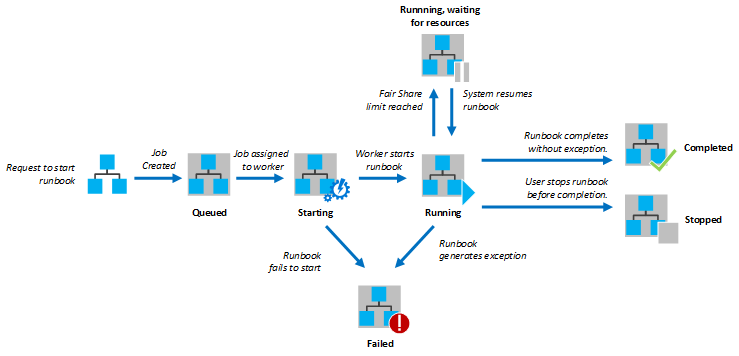

# Runbook execution in Azure Automation

When you start a runbook in Azure Automation, a job is created. A job is a single execution instance of a runbook. An Azure Automation worker is assigned to run each job. While workers are shared by many Azure accounts, jobs from different Automation accounts are isolated from one another. You don't have control over which worker services the request for your job. A single runbook can have many jobs running at one time. The execution environment for jobs from the same Automation Account may be reused. When you view the list of runbooks in the Azure portal, it lists the status of all jobs that were started for each runbook. You can view the list of jobs for each runbook to track the status of each. For a description of the different job statuses [Job Statuses](#job-statuses).

[!INCLUDE [GDPR-related guidance](../../includes/gdpr-dsr-and-stp-note.md)]

The following diagram shows the lifecycle of a runbook job for [Graphical runbooks](automation-runbook-types.md#graphical-runbooks) and [PowerShell Workflow runbooks](automation-runbook-types.md#powershell-workflow-runbooks).


The following diagram shows the lifecycle of a runbook job for [PowerShell runbooks](automation-runbook-types.md#powershell-runbooks).



Your jobs have access to your Azure resources by making a connection to your Azure subscription. They only have access to resources in your data center if those resources are accessible from the public cloud.

## Job statuses

The following table describes the different statuses that are possible for a job. PowerShell has two types of errors, terminating and non-terminating errors. Terminating errors set the runbook status to **Failed** if they occur. Non-terminating errors allow the script to continue even after they occur. An example of a non-terminating error is using the `Get-ChildItem` cmdlet with a path that doesn't exist. PowerShell sees that the path doesn't exist, throws an error, and continues to the next folder. This error wouldn't set the runbook status to **Failed** and could be marked as **Completed**. To force a runbook to stop on a non-terminating error, you can use `-ErrorAction Stop` on the cmdlet.

| Status | Description |
|:--- |:--- |
| Completed |The job completed successfully. |
| Failed |For [Graphical and PowerShell Workflow runbooks](automation-runbook-types.md), the runbook failed to compile. For [PowerShell Script runbooks](automation-runbook-types.md), the runbook failed to start or the job had an exception. |
| Failed, waiting for resources |The job failed because it reached the [fair share](#fair-share) limit three times and started from the same checkpoint or from the start of the runbook each time. |
| Queued |The job is waiting for resources on an Automation worker to come available so that it can be started. |
| Starting |The job has been assigned to a worker, and the system is starting it. |
| Resuming |The system is resuming the job after it was suspended. |
| Running |The job is running. |
| Running, waiting for resources |The job has been unloaded because it reached the [fair share](#fair-share) limit. It resumes shortly from its last checkpoint. |
| Stopped |The job was stopped by the user before it was completed. |
| Stopping |The system is stopping the job. |
| Suspended |The job was suspended by the user, by the system, or by a command in the runbook. If a runbook doesn't have a checkpoint, it starts from the beginning of the runbook. If it has a checkpoint, it can start again and resume from its last checkpoint. The runbook is only be suspended by the system when an exception occurs. By default, ErrorActionPreference is set to **Continue**, meaning that the job keeps running on an error. If this preference variable is set to **Stop**, then the job suspends on an error. Applies to [Graphical and PowerShell Workflow runbooks](automation-runbook-types.md) only. |
| Suspending |The system is trying to suspend the job at the request of the user. The runbook must reach its next checkpoint before it can be suspended. If it already passed its last checkpoint, then it completes before it can be suspended. Applies to [Graphical and PowerShell Workflow runbooks](automation-runbook-types.md) only. |

## Viewing job status from the Azure portal

You can view a summarized status of all runbook jobs or drill into details of a specific runbook job in the Azure portal. You can also configuring integration with your Log Analytics workspace to forward runbook job status and job streams. For more information about integrating with Log Analytics, see [Forward job status and job streams from Automation to Log Analytics](automation-manage-send-joblogs-log-analytics.md).

### Automation runbook jobs summary

On the right of your selected Automation account, you can see a summary of all of the runbook jobs under **Job Statistics** tile.


This tile displays a count and graphical representation of the job status for all jobs executed.

Clicking on the tile presents the **Jobs** page, which includes a summarized list of all jobs executed. This page shows the status, start times, and completion times.


You can filter the list of jobs by selecting **Filter jobs**  and filter on a specific runbook, job status, or from the drop-down list, and the time range to search within.


Alternatively, you can view job summary details for a specific runbook by selecting that runbook from the **Runbooks** page in your Automation account, and then select the **Jobs** tile. This action presents the **Jobs** page, and from there you can click on the job record to view its detail and output.


### Job Summary

You can view a list of all of the jobs that have been created for a particular runbook and their most recent status. You can filter this list by job status and the range of dates for the last change to the job. To view its detailed information and output, click on the name of a job. The detailed view of the job includes the values for the runbook parameters that were provided to that job.

You can use the following steps to view the jobs for a runbook.

1. In the Azure portal, select **Automation** and then select the name of an Automation account.
2. From the hub, select **Runbooks** and then on the **Runbooks** page select a runbook from the list.
3. On the page for the selected runbook, click the **Jobs** tile.
4. Click on one of the jobs in the list and on the runbook job details page you can view its detail and output.

## Retrieving job status using Windows PowerShell

You can use the [Get-AzureRmAutomationJob](https://docs.microsoft.com/powershell/module/azurerm.automation/get-azurermautomationjob) to retrieve the jobs created for a runbook and the details of a particular job. If you start a runbook with Windows PowerShell using [Start-AzureRmAutomationRunbook](https://docs.microsoft.com/powershell/module/azurerm.automation/start-azurermautomationrunbook), then it returns the resulting job. Use [Get-AzureRmAutomationJobOutput](https://docs.microsoft.com/powershell/module/azurerm.automation/get-azurermautomationjoboutput) to get a job’s output.

The following sample commands retrieve the last job for a sample runbook and display its status, the values provided for the runbook parameters, and the output from the job.

```azurepowershell-interactive
$job = (Get-AzureRmAutomationJob –AutomationAccountName "MyAutomationAccount" `
–RunbookName "Test-Runbook" -ResourceGroupName "ResourceGroup01" | sort LastModifiedDate –desc)[0]
$job.Status
$job.JobParameters
Get-AzureRmAutomationJobOutput -ResourceGroupName "ResourceGroup01" `
–AutomationAccountName "MyAutomationAcct" -Id $job.JobId –Stream Output
```

The following sample retrieves the output for a specific job, and returns each record. In the case that there was an exception for one of the records, the exception is written out instead of the value. This behavior is useful as exceptions can provide additional information, which may not be logged normally during output.

```azurepowershell-interactive
$output = Get-AzureRmAutomationJobOutput -AutomationAccountName <AutomationAccountName> -Id <jobID> -ResourceGroupName <ResourceGroupName> -Stream "Any"
foreach($item in $output)
{
    $fullRecord = Get-AzureRmAutomationJobOutputRecord -AutomationAccountName <AutomationAccountName> -ResourceGroupName <ResourceGroupName> -JobId <jobID> -Id $item.StreamRecordId
    if ($fullRecord.Type -eq "Error")
    {
        $fullRecord.Value.Exception
    }
    else
    {
    $fullRecord.Value
    }
}
```

## Get details from Activity log

Other details such as the person or account that started the runbook can be retrieved from the Activity log for the automation account. The following PowerShell example provides the last user to run the runbook in question:

```powershell-interactive
$SubID = "00000000-0000-0000-0000-000000000000"
$rg = "ResourceGroup01"
$AutomationAccount = "MyAutomationAccount"
$RunbookName = "Test-Runbook"
$JobResourceID = "/subscriptions/$subid/resourcegroups/$rg/providers/Microsoft.Automation/automationAccounts/$AutomationAccount/jobs"

Get-AzureRmLog -ResourceId $JobResourceID -MaxRecord 1 | Select Caller
```

## Fair share

In order to share resources among all runbooks in the cloud, Azure Automation will temporarily unload any job after it has been running for three hours. During this time, jobs for [PowerShell-based runbooks](automation-runbook-types.md#powershell-runbooks) are stopped and are not be restarted. The job status shows **Stopped**. This type of runbook is always restarted from the beginning since they don't support checkpoints.

[PowerShell-Workflow-based runbooks](automation-runbook-types.md#powershell-workflow-runbooks) are resumed from their last [checkpoint](https://docs.microsoft.com/system-center/sma/overview-powershell-workflows#bk_Checkpoints). After running three hours, the runbook job is suspended by the service and its status shows **Running, waiting for resources**. When a sandbox becomes available, the runbook is automatically restarted by the Automation service and resumes from the last checkpoint. This behavior is normal PowerShell-Workflow behavior for suspend/restart. If the runbook again exceeds three hours of runtime, the process repeats, up to three times. After the third restart, if the runbook still has not completed in three hours, then the runbook job is failed, and the job status shows **Failed, waiting for resources**. In this case, you receive the following exception with the failure.

*The job cannot continue running because it was repeatedly evicted from the same checkpoint. Please make sure your Runbook does not perform lengthy operations without persisting its state.*

This behavior is to protect the service from runbooks running indefinitely without completing, as they are not able to make it to the next checkpoint without being unloaded again.

If the runbook has no checkpoints or the job had not reached the first checkpoint before being unloaded, then it restarts from the beginning.

For long running tasks, it is recommended to use a [Hybrid Runbook Worker](automation-hrw-run-runbooks.md#job-behavior). Hybrid Runbook Workers are not limited by fair share, and don't have a limitation on how long a runbook can execute. The other job [limits](../azure-subscription-service-limits.md#automation-limits) apply to both Azure sandboxes and Hybrid Runbook Workers.

If you are using a PowerShell Workflow runbook on Azure, when you create a runbook, you should make sure the time to run any activities between two checkpoints does not exceed three hours. You may need to add checkpoints to your runbook to make sure it does not reach this three-hour limit or break up long running operations. For example, your runbook might run a reindex on a large SQL database. If this single operation does not complete within the fair share limit, then the job is unloaded and restarted from the beginning. In this case, you should break up the reindex operation into multiple steps, such as reindexing one table at a time, and then insert a checkpoint after each operation so the job could resume after the last operation to complete.

## Next steps

* To learn more about the different methods that can be used to start a runbook in Azure Automation, see [Starting a runbook in Azure Automation](automation-starting-a-runbook.md)
