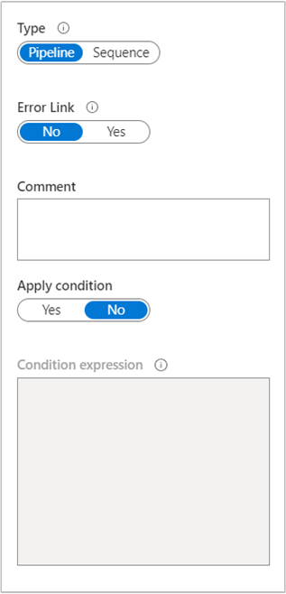
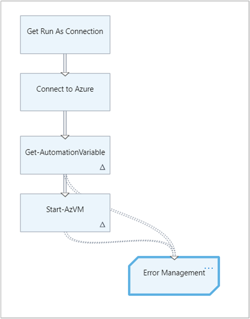
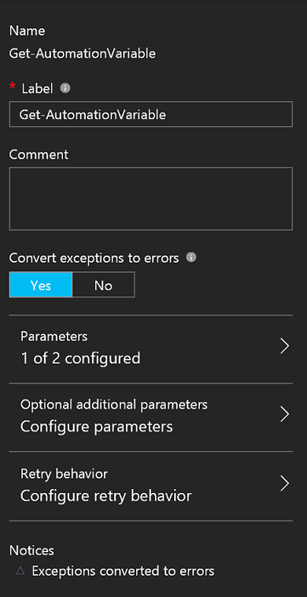
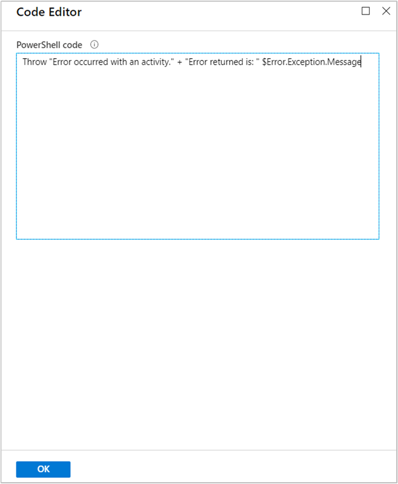

# Handle errors in graphical runbooks

A key design principle to consider for your Azure Automation graphical runbook is the identification of issues that the runbook might experience during execution. These issues can include success, expected error states, and unexpected error conditions.

Often, if there is a non-terminating error that occurs with a runbook activity, Windows PowerShell handles the activity by processing any activity that follows, regardless of the error. The error is likely to generate an exception, but the next activity is still allowed to run.

Your graphical runbook should include error handling code to deal with execution issues. To validate the output of an activity or handle an error, you can use a PowerShell code activity, define conditional logic on the output link of the activity, or apply another method.

Azure Automation graphical runbooks have been improved with the capability to include error handling. You can now turn exceptions into non-terminating errors and create error links between activities. The improved process allows your runbook to catch errors and manage realized or unexpected conditions. 

## PowerShell error types

The types of PowerShell errors that can occur during runbook execution are terminating errors and non-terminating errors.
 
### Terminating error

A terminating error is a serious error during execution that halts a command or script execution completely. Examples include nonexistent cmdlets, syntax errors that prevent a cmdlet from running, and other fatal errors.

### Non-terminating error

A non-terminating error is a non-serious error that allows execution to continue despite the error condition. Examples include operational errors, such as file not found errors and permissions issues.

## When to use error handling

Use error handling in your runbook when a critical activity throws an error or exception. It's important to prevent the next activity in the runbook from processing and to handle the error appropriately. Handling the error is especially critical when your runbooks are supporting a business or service operations process.

## Add error links

For each activity that can produce an error, you can add an error link pointing to any other activity. The destination activity can be of any type, including code activity, invocation of a cmdlet, invocation of another runbook, and so on. The destination activity can also have outgoing links, either regular or error links. The links allow the runbook to implement complex error handling logic without resorting to a code activity.

The recommended practice is to create a dedicated error handling runbook with common functionality, but this practice isn't mandatory. For example, consider a runbook that tries to start a virtual machine and install an application on it. If the VM doesn't start correctly, it:

1. Sends a notification about this problem.
2. Starts another runbook that automatically provisions a new VM instead.

One solution is to have an error link in the runbook pointing to an activity that handles step one. For example, the runbook can connect the `Write-Warning` cmdlet to an activity for step two, such as the [Start-AzAutomationRunbook](/powershell/module/az.automation/start-azautomationrunbook) cmdlet.

You can also generalize this behavior for use in many runbooks by putting these two activities in a separate error handling runbook. Before your original runbook calls this error handling runbook, it can construct a custom message from its data and then pass it as a parameter to the error handling runbook.

## Turn exceptions into non-terminating errors

Each activity in your runbook has a configuration setting that turns exceptions into non-terminating errors. By default, this setting is disabled. We recommend enabling this setting on any activity where your runbook handles errors. This setting ensures that the runbook handles both terminating and non-terminating errors in the activity as non-terminating errors, using an error link.  

After enabling the configuration setting, have your runbook create an activity that handles the error. If the activity produces any error, the outgoing error links are followed. The regular links are not followed, even if the activity produces regular output as well.   

In the following example, a runbook retrieves a variable that contains the computer name of a VM. It then attempts to start the VM with the next activity.           

The `Get-AutomationVariable` activity and the [Start-AzVM](/powershell/module/Az.Compute/Start-AzVM) cmdlet are configured to convert exceptions to errors. If there are problems getting the variable or starting the VM, the code generates errors.   .

Error links flow from these activities to a single `error management` code activity. This activity is configured with a simple PowerShell expression that uses the `throw` keyword to stop processing, along with `$Error.Exception.Message` to get the message that describes the current exception.   

## Next steps

* For information about resolving graphical runbook errors, see [Troubleshoot runbook issues](troubleshoot/runbooks.md).
