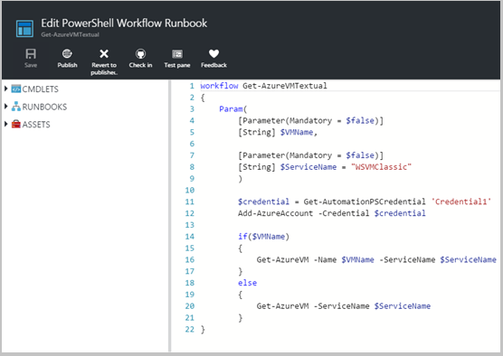
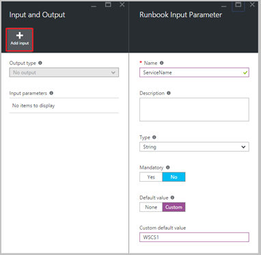
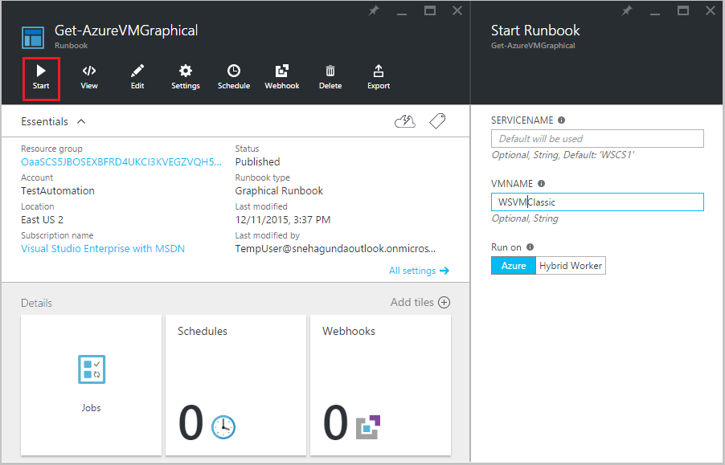
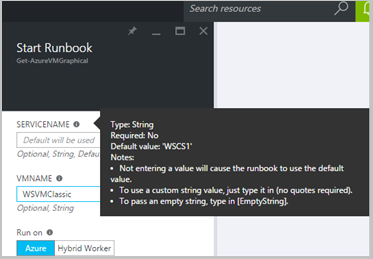
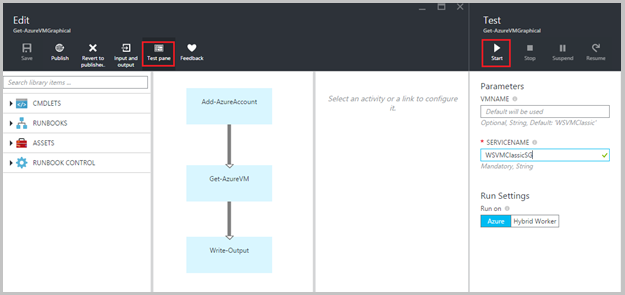
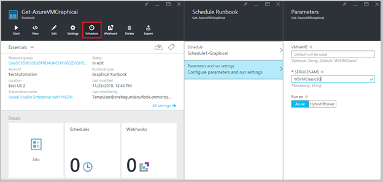
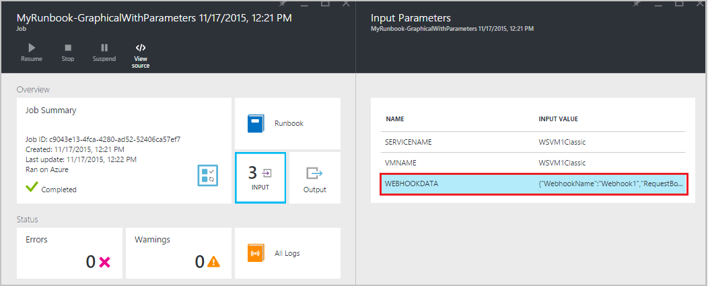

<properties
   pageTitle="Runbook input parameters| Microsoft Azure"
   description="Runbook input parameters increase the flexibility of runbooks by allowing you to pass data to a runbook when it is started. This article describes different scenarios where input parameters are used in runbooks."
   services="automation"
   documentationCenter=""
   authors="SnehaGunda"
   manager="stevenka"
   editor="tysonn" />
<tags
   ms.service="automation"
   ms.devlang="na"
   ms.topic="article"
   ms.tgt_pltfrm="na"
   ms.workload="infrastructure-services"
   ms.date="04/25/2016"
   ms.author="sngun"/>

# Runbook input parameters

Runbook input parameters increase the flexibility of runbooks by allowing you to pass data to a runbook when it is started. The parameters allow the runbook actions to be targeted for specific scenarios and environments. In this article, we will walk you through different scenarios where input parameters are used in runbooks.

## Configure input parameters

Input parameters can be configured in PowerShell, PowerShell Workflow, and graphical runbooks. A runbook can have multiple parameters with different data types, or no parameters at all. Input parameters can be mandatory or optional, and you can assign a default value for optional parameters. You can assign values to the input parameters for a runbook when you start it through one of the available methods. These methods include starting  a runbook by using the UI or a web service. You can also start one as a child runbook that is called inline in another runbook.

## Configure input parameters in PowerShell and PowerShell Workflow runbooks

PowerShell and [PowerShell Workflow runbooks](automation-first-runbook-textual.md) in Azure Automation support input parameters that are defined through the following attributes.  

| **Property** | **Description** |
|:--- |:---|
| Type | Required. The data type expected for the parameter value. Any .NET type is valid. |
| Name | Required. The name of the parameter. This must be unique within the runbook, and can contain only letters, numbers, or underscore characters. It must start with a letter. |
| Mandatory | Optional. Specifies whether a value must be provided for the parameter. If you set this to **$true**, then a value must be provided when the runbook is started. If you set this to **$false**, then a value is optional. |
| Default value | Optional.  Specifies a value that will be used for the parameter if a value is not passed in when the runbook is started. A default value can be set for any parameter and will automatically make the parameter optional regardless of the Mandatory setting. |

 Windows PowerShell supports more attributes of input parameters than those listed here, like validation, aliases, and parameter sets. However, Azure Automation currently supports only the input parameters listed above.

A parameter definition in PowerShell Workflow runbooks has the following general form, where multiple parameters are separated by commas.

```
     Param
     (
         [Parameter (Mandatory= $true/$false)]
         [Type] Name1 = <Default value>,

         [Parameter (Mandatory= $true/$false)]
         [Type] Name2 = <Default value>
     )
```

>[AZURE.NOTE] When you're defining parameters, if you don’t specify the **Mandatory** attribute, then by default, the parameter is considered optional. Also, if you set a default value for a parameter in PowerShell Workflow runbooks, then it will be treated by PowerShell as an optional parameter, regardless of the **Mandatory** attribute value.

As an example, let’s configure the input parameters for a PowerShell Workflow runbook that outputs details about virtual machines--either a single VM or all VMs within a service. This runbook has two parameters as shown in the following screenshot: the name of virtual machine and the name of the service.



In this parameter definition, the parameters **$VMName** and **$ServiceName** are simple parameters of type string. However, PowerShell and PowerShell Workflow runbooks support all simple types and complex types, such as **object** or **PSCredential** for input parameters.

If your runbook has an [object] type input parameter, then use a PowerShell hashtable with (name,value) pairs to pass in a value. For example, if you have the following parameter in a runbook:

     [Parameter (Mandatory = $true)]
     [object] $FullName

Then you can pass the following value to the parameter:

    @{"FirstName"="Joe";"MiddleName"="Bob";"LastName"="Smith"}


## Configure input parameters in graphical runbooks

To [configure a graphical runbook](automation-first-runbook-graphical.md) with input parameters, let’s create a graphical runbook that outputs details about virtual machines--either a single VM or all VMs within a service. Configuring a runbook consists of two major activities, as described below.

[**Add-AzureAccount**](https://msdn.microsoft.com/library/dn495128.aspx) to authenticate with Azure.

[**Get-AzureVM**](https://msdn.microsoft.com/library/azure/dn495236.aspx) to get all the virtual machines.

You can use the [**Write-Output**](https://technet.microsoft.com/library/hh849921.aspx) activity to output the names of virtual machines. The activity **Get-AzureVM** will accept two parameters, the **virtual machine name** and the **service name**. Since these parameters could require different values each time you start the runbook, you can add input parameters to your runbook. Here are the steps to add input parameters:

1. Select the graphical runbook from the **Runbooks** blade and [edit](automation-graphical-authoring-intro.md) it.

2. From the **Edit** blade, click **Input and output** to open the **Input and output** blade.

    


3. The **Input and output** blade displays a list of input parameters that are defined for the runbook. On this blade, you can either add a new input parameter or edit the configuration of an existing input parameter. To add a new parameter for the runbook, click **Add input** to open the **Runbook input parameter** blade. There, you can configure the following parameters:

    | **Property** | **Description** |
    |:--- |:---|
    | Name | Required.  The name of the parameter. This must be unique within the runbook, and can contain only letters, numbers, or underscore characters. It must start with a letter. |
    | Description | Optional. Description about the purpose of input parameter. |
    | Type | Optional. The data type that's expected for the parameter value. Supported parameter types are **String**, **Int32**, **Int64**, **Decimal**, **Boolean**, **DateTime**, and **Object**. If a data type is not selected, it defaults to **String**. |
    | Mandatory | Optional. Specifies whether a value must be provided for the parameter. If you choose **yes**, then a value must be provided when the runbook is started. If you choose **no**, then a value is not required when the runbook is started, and a default value may be set. |
    | Default Value | Optional. Specifies a value that will be used for the parameter if a value is not passed in when the runbook is started. A default value can be set for a parameter that's not mandatory. To set a default value, choose **Custom**. This value is used unless another value is provided when the runbook is started. Choose **None** if you don’t want to provide any default value. |  

    

4. Create two parameters with the following properties that will be used by the **Get-AzureVM** activity:

    * **Parameter1:**
    Name--VMName,
    Type--String,
    Mandatory--No

    * **Parameter2:**
    Name--ServiceName,
    Type--String,
    Mandatory--No,
    Default value--Custom,
    Custom default value--\<Name of the default service that contains the virtual machines>

5. Once you add the parameters, click **OK**.  You can now view them in the **Input and output blade**. Click **OK** again, and then click  **Save** and **Publish** your runbook.

## Assign values to input parameters in runbooks

You can pass values to input parameters in runbooks in the following scenarios.

### Start a runbook and assign parameters

A runbook can be started many ways: through the Azure portal UI, with a webhook,  with the PowerShell cmdlets, with the REST API, or with an SDK. Below we discuss different methods for starting a runbook and assigning parameters.

- **Start a published runbook by using the Azure portal and assign parameters**

When you [start the runbook](automation-starting-a-runbook.md#starting-a-runbook-with-the-azure-portal), the **Start Runbook** blade opens and you can configure values for the parameters that you just created.



In the label beneath the input box, you can see the attributes that have been set for the parameter. Attributes include mandatory or optional, type, and  default value. In the help balloon next to the parameter name, you can see all the key information you need to make decisions about parameter input values. This information includes whether a parameter is mandatory or optional. It also includes the type and  default value (if any), and  other helpful notes.




>[AZURE.NOTE] String type parameters support **Empty** String values.  Entering **[EmptyString]** in the input parameter box will pass an empty string to the parameter. Also, String type parameters don’t support **Null** values being passed. If you don’t pass any value to the String parameter, then PowerShell will interpret it as null.

- **Start a published runbook by using PowerShell cmdlets and assign parameters**

    - **Azure Service Management cmdlets:** You can start an automation runbook that was created in a default resource group by using [Start-AzureAutomationRunbook](https://msdn.microsoft.com/library/dn690259.aspx).

    **Example:**  

      ```
        $params = @{“VMName”=”WSVMClassic”; ”ServiceName”=”WSVMClassicSG”}

        Start-AzureAutomationRunbook -AutomationAccountName “TestAutomation” -Name “Get-AzureVMGraphical” -Parameters $params
      ```

    - **Azure Resource Manager cmdlets:** You can start an Automation runbook that was created in a resource group by using [Start-AzureRmAutomationRunbook](https://msdn.microsoft.com/library/mt603661.aspx).


    **Example:**  

      ```
        $params = @{“VMName”=”WSVMClassic”;”ServiceName”=”WSVMClassicSG”}

        Start-AzureRmAutomationRunbook -AutomationAccountName “TestAutomationRG” -Name “Get-AzureVMGraphical” –ResourceGroupName “RG1” -Parameters $params
      ```

>[AZURE.NOTE] When you start a runbook by using PowerShell cmdlets, a default parameter, **MicrosoftApplicationManagementStartedBy**, is created with the value **PowerShell**. You can view this parameter in the **Job details** blade.

- **Start a runbook by using an SDK and assign parameters**

    - **Azure Service Management method:** You can start a runbook by using the SDK of a programming language. Below is a C# code snippet for starting a runbook in your Automation account. You can view all the code at our [GitHub repository](https://github.com/Azure/azure-sdk-for-net/blob/master/src/ServiceManagement/Automation/Automation.Tests/TestSupport/AutomationTestBase.cs).  

    ```      
        public Job StartRunbook(string runbookName, IDictionary<string, string> parameters = null)
        {
            var response = AutomationClient.Jobs.Create(automationAccount, new JobCreateParameters
            {
                Properties = new JobCreateProperties
                {
                    Runbook = new RunbookAssociationProperty
                    {
                        Name = runbookName
                    },
                        Parameters = parameters
                }
            });
            return response.Job;
        }
    ```

    - **Azure Resource Manager method:** You can start a runbook by using the SDK of a programming language. Below is a C# code snippet for starting a runbook in your Automation account. You can view all the code at our [GitHub repository](https://github.com/Azure/azure-sdk-for-net/blob/master/src/ResourceManagement/Automation/Automation.Tests/TestSupport/AutomationTestBase.cs).  

    ```
        public Job StartRunbook(string runbookName, IDictionary<string, string> parameters = null)
        {
           var response = AutomationClient.Jobs.Create(resourceGroup, automationAccount, new JobCreateParameters
           {
               Properties = new JobCreateProperties
               {
                   Runbook = new RunbookAssociationProperty
                   {
                       Name = runbookName
                   },
                       Parameters = parameters
               }
           });
        return response.Job;
        }
    ```

To start this method, create a dictionary to store the runbook parameters, **VMName** and **ServiceName**, and their values. Then start the runbook. Below is the C# code snippet for calling the method that's defined above.

```
    IDictionary<string, string> RunbookParameters = new Dictionary<string, string>();

    // Add parameters to the dictionary.
    RunbookParameters.Add("VMName", "WSVMClassic");
    RunbookParameters.Add("ServiceName", "WSVMClassicSG");

    //Call the StartRunbook method with parameters
    StartRunbook(“Get-AzureVMGraphical”, RunbookParameters);
```

- **Start a runbook by using the REST API and assign parameters**

A runbook job can be created and started with the Azure Automation REST API by using the **PUT** method with the following request URI.

    https://management.core.windows.net/<subscription-id>/cloudServices/<cloud-service-name>/resources/automation/~/automationAccounts/<automation-account-name>/jobs/<job-id>?api-version=2014-12-08

In the request URI, replace the following parameters:

* **subscription-id:** Your Azure subscription ID.  
* **cloud-service-name:** The name of the cloud service to which the request should be sent.  
* **automation-account-name:** The name of your automation account that's hosted within the specified cloud service.  
* **job-id:** The GUID for the job. GUIDs in PowerShell can be created by using the **[GUID]::NewGuid().ToString()** command.

In order to pass parameters to the runbook job, use the request body. It takes the following two properties provided in JSON format:

* **Runbook name**--Required. The name of the runbook for the job to start.  
* **Runbook parameters**--Optional. A dictionary of the parameter list in (name, value) format where name should be of String type and value can be any valid JSON value.

If you want to start the **Get-AzureVMTextual** runbook that was created earlier with **VMName** and **ServiceName** as parameters, use the following JSON format for the request body.

```
        {
           "properties":{
           "runbook":{
               "name":"Get-AzureVMTextual"
           },
           "parameters":{
               "VMName":"WSVMClassic",
               "ServiceName":”WSCS1”
           }
          }
       }
```

An HTTP status code 201 is returned if the job is successfully created. For more information on response headers and the response body, refer to the article about how to [create a runbook job by using the REST API.](https://msdn.microsoft.com/library/azure/mt163849.aspx)

### Test a runbook and assign parameters

When you  [test the draft version of your runbook](automation-testing-runbook.md) by using the test option, the **Test** blade opens and you can configure values for the parameters that you just created.



### Link a schedule to a runbook and assign parameters

You can [link a schedule](automation-scheduling-a-runbook.md) to your runbook so that the runbook starts at a specific time. You assign input parameters when you create the schedule, and the runbook will use these values when it is started by the schedule. You can’t save the schedule until all mandatory parameter values are provided.



### Create a webhook for a runbook and assign parameters

You can create a [webhook](automation-webhooks.md)  for your runbook and configure runbook input parameters. You can’t save the webhook until all mandatory parameter values are provided.


When you execute a runbook by using a webhook, the predefined input parameter  **[Webhookdata](automation-webhooks.md#details-of-a-webhook)** is sent, along with the input parameters that you defined. You can click to expand the **WebhookData** parameter for more details.




## Next steps

- For more information on runbook input and output, see [Azure Automation: runbook input, output, and nested runbooks](https://azure.microsoft.com/blog/azure-automation-runbook-input-output-and-nested-runbooks/).
- For details about different ways to start a runbook, see [Starting a runbook](automation-starting-a-runbook.md).
- To edit a textual runbook, refer to [Editing textual runbooks](automation-edit-textual-runbook.md).
- To edit a graphical runbook, refer to [Graphical authoring in Azure Automation](automation-graphical-authoring-intro.md).
