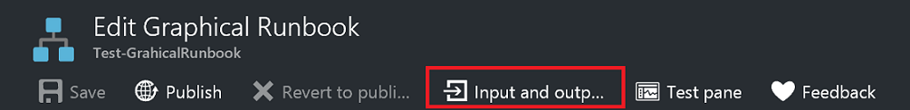
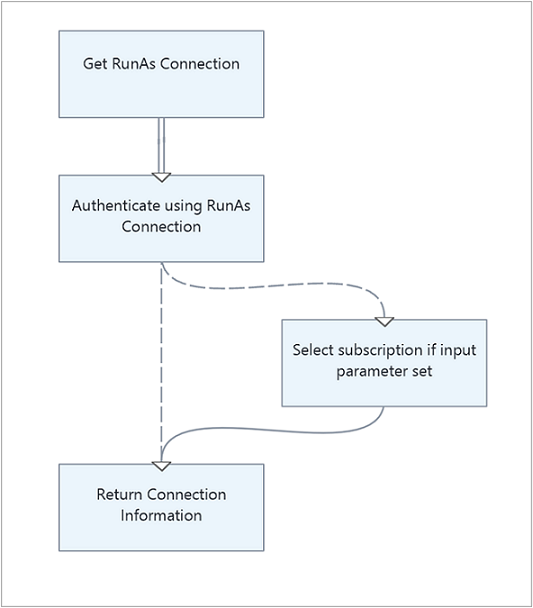
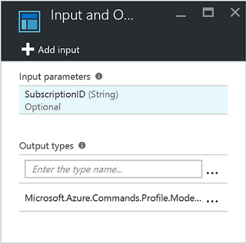
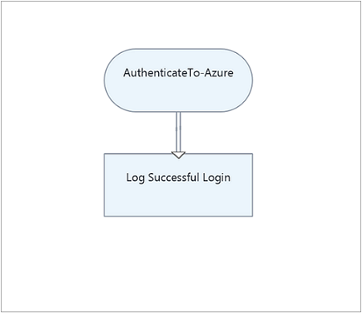
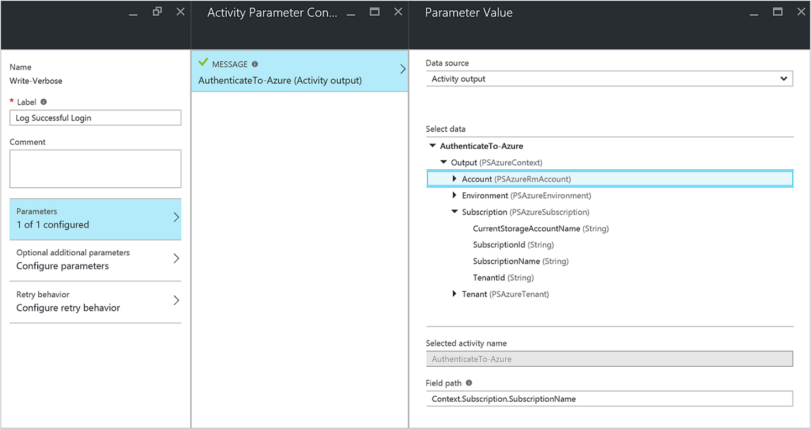
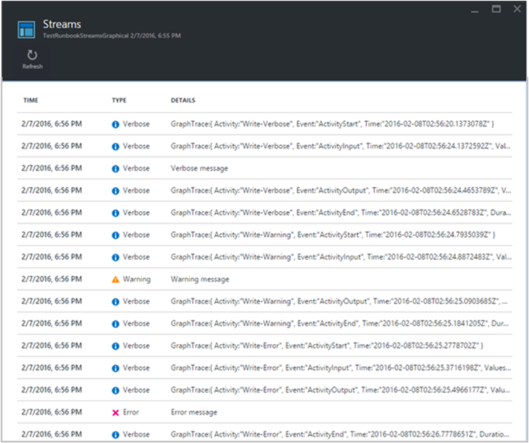
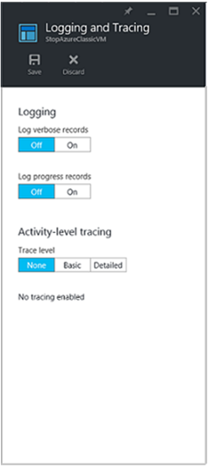

# Monitor runbook output

Most Azure Automation runbooks have some form of output. This output can be an error message to the user or a complex object intended to be used with another runbook. Windows PowerShell provides [multiple streams](/powershell/module/microsoft.powershell.core/about/about_redirection) to send output from a script or workflow. Azure Automation works with each of these streams differently. You should follow best practices for using the streams when you're creating a runbook.

The following table briefly describes each stream with its behavior in the Azure portal for published runbooks and during [testing of a runbook](automation-testing-runbook.md). The output stream is the main stream used for communication between runbooks. The other streams are classified as message streams, intended to communicate information to the user. 

| Stream | Description | Published | Test |
|:--- |:--- |:--- |:--- |
| Error |Error message intended for the user. Unlike with an exception, the runbook continues after an error message by default. |Written to job history |Displayed in Test output pane |
| Debug |Messages intended for an interactive user. Shouldn't be used in runbooks. |Not written to job history |Not displayed in Test output pane |
| Output |Objects intended to be consumed by other runbooks. |Written to job history |Displayed in Test output pane |
| Progress |Records automatically generated before and after each activity in the runbook. The runbook shouldn't try to create its own progress records, since they're intended for an interactive user. |Written to job history only if progress logging is turned on for the runbook |Not displayed in Test output pane |
| Verbose |Messages that give general or debugging information. |Written to job history only if verbose logging is turned on for the runbook |Displayed in Test output pane only if `VerbosePreference` variable is set to Continue in runbook |
| Warning |Warning message intended for the user. |Written to job history |Displayed in Test output pane |

## Use the output stream

The output stream is used for the output of objects created by a script or workflow when it runs correctly. Azure Automation primarily uses this stream for objects to be consumed by parent runbooks that call the [current runbook](automation-child-runbooks.md). When a parent [calls a runbook inline](automation-child-runbooks.md#invoke-a-child-runbook-using-inline-execution), the child returns data from the output stream to the parent. 

Your runbook uses the output stream to communicate general information to the client only if it is never called by another runbook. As a best practice, however, you runbooks should typically use the [verbose stream](#monitor-verbose-stream) to communicate general information to the user.

Have your runbook write data to the output stream using [Write-Output](https://technet.microsoft.com/library/hh849921.aspx). Alternatively, you can put the object on its own line in the script.

```powershell
#The following lines both write an object to the output stream.
Write-Output –InputObject $object
$object
```

### Handle output from a function

When a runbook function writes to the output stream, the output is passed back to the runbook. If the runbook assigns that output to a variable, the output is not written to the output stream. Writing to any other streams from within the function writes to the corresponding stream for the runbook. Consider the following sample PowerShell Workflow runbook.

```powershell
Workflow Test-Runbook
{
  Write-Verbose "Verbose outside of function" -Verbose
  Write-Output "Output outside of function"
  $functionOutput = Test-Function
  $functionOutput

  Function Test-Function
  {
    Write-Verbose "Verbose inside of function" -Verbose
    Write-Output "Output inside of function"
  }
}
```

The output stream for the runbook job is:

```output
Output inside of function
Output outside of function
```

The verbose stream for the runbook job is:

```output
Verbose outside of function
Verbose inside of function
```

Once you've published the runbook and before you start it, you must also turn on verbose logging in the runbook settings to get the verbose stream output.

### Declare output data type

The following are examples of output data types:

* `System.String`
* `System.Int32`
* `System.Collections.Hashtable`
* `Microsoft.Azure.Commands.Compute.Models.PSVirtualMachine`

#### Declare output data type in a workflow

A workflow specifies the data type of its output using the [OutputType attribute](/powershell/module/microsoft.powershell.core/about/about_functions_outputtypeattribute). This attribute has no effect during runtime, but it provides you an indication at design time of the expected output of the runbook. As the tool set for runbooks continues to evolve, the importance of declaring output data types at design time increases. Therefore it's a best practice to include this declaration in any runbooks that you create.

The following sample runbook outputs a string object and includes a declaration of its output type. If your runbook outputs an array of a certain type, then you should still specify the type as opposed to an array of the type.

```powershell
Workflow Test-Runbook
{
  [OutputType([string])]

  $output = "This is some string output."
  Write-Output $output
}
 ```

#### Declare output data type in a graphical runbook

To declare an output type in a graphical or graphical PowerShell Workflow runbook, you can select the **Input and Output** menu option and enter the output type. It's recommended to use the full .NET class name to make the type easily identifiable when a parent runbook references it. Using the full name exposes all the properties of the class to the databus in the runbook and increases flexibility when the properties are used for conditional logic, logging, and referencing as values for other runbook activities.<br> 

>[!NOTE]
>After you enter a value in the **Output Type** field in the Input and Output properties pane, be sure to click outside the control so that it recognizes your entry.

The following example shows two graphical runbooks to demonstrate the Input and Output feature. Applying the modular runbook design model, you have one runbook as the Authenticate Runbook template managing authentication with Azure using the Run As account. The second runbook, which normally performs core logic to automate a given scenario, in this case executes the Authenticate Runbook template. It displays the results to your Test output pane. Under normal circumstances, you would have this runbook do something against a resource leveraging the output from the child runbook.

Here is the basic logic of the **AuthenticateTo-Azure** runbook.<br> .

The runbook includes the output type `Microsoft.Azure.Commands.Profile.Models.PSAzureContext`, which returns the authentication profile properties.<br> 

While this runbook is straightforward, there is one configuration item to call out here. The last activity executes the `Write-Output` cmdlet to write profile data to a variable using a PowerShell expression for the `Inputobject` parameter. This parameter is required for `Write-Output`.

The second runbook in this example, named **Test-ChildOutputType**, simply defines two activities.<br> 

The first activity calls the **AuthenticateTo-Azure** runbook. The second activity runs the `Write-Verbose` cmdlet with **Data source** set to **Activity output**. Also, **Field path** is set to **Context.Subscription.SubscriptionName**, the context output from the **AuthenticateTo-Azure** runbook.<br> 

The resulting output is the name of the subscription.<br> 

## Monitor message streams

Unlike the output stream, message streams communicate information to the user. There are multiple message streams for different kinds of information, and Azure Automation handles each stream differently.

### Monitor warning and error streams

The warning and error streams log problems that occur in a runbook. Azure Automation writes these streams to the job history when executing a runbook. Automation includes the streams in the Test output pane in the Azure portal when a runbook is tested. 

By default, a runbook continues to execute after a warning or error. You can specify that your runbook should suspend on a warning or error by having the runbook set a [preference variable](#work-with-preference-variables) before creating the message. For example, to cause the runbook to suspend on an error as it does on an exception, set the `ErrorActionPreference` variable to Stop.

Create a warning or error message using the [Write-Warning](https://technet.microsoft.com/library/hh849931.aspx) or [Write-Error](https://technet.microsoft.com/library/hh849962.aspx) cmdlet. Activities can also write to the warning and error streams.

```powershell
#The following lines create a warning message and then an error message that will suspend the runbook.

$ErrorActionPreference = "Stop"
Write-Warning –Message "This is a warning message."
Write-Error –Message "This is an error message that will stop the runbook because of the preference variable."
```

### Monitor debug stream

Azure Automation uses the debug message stream for interactive users. It should not be used in runbooks.

### Monitor verbose stream

The Verbose message stream supports general information about runbook operation. Since the debug stream is not available for a runbook, your runbook should use verbose messages for debug information. 

By default, the job history does not store verbose messages from published runbooks, for performance reasons. To store verbose messages, use the Azure portal **Configure** tab with the **Log Verbose Records** setting to configure your published runbooks to log verbose messages. Turn on this option only to troubleshoot or debug a runbook. In most cases, you should keep the default setting of not logging verbose records.

When [testing a runbook](automation-testing-runbook.md), verbose messages aren't displayed even if the runbook is configured to log verbose records. To display verbose messages while [testing a runbook](automation-testing-runbook.md), you must set the `VerbosePreference` variable to Continue. With that variable set, verbose messages are displayed in the Test output pane of the Azure portal.

The following code creates a verbose message using the [Write-Verbose](https://technet.microsoft.com/library/hh849951.aspx) cmdlet.

```powershell
#The following line creates a verbose message.

Write-Verbose –Message "This is a verbose message."
```

## Handle progress records

You can use the **Configure** tab of the Azure portal to configure a runbook to log progress records. The default setting is to not log the records, to maximize performance. In most cases, you should keep the default setting. Turn on this option only to troubleshoot or debug a runbook. 

If you enable progress record logging, your runbook writes a record to job history before and after each activity runs. Testing a runbook does not display progress messages even if the runbook is configured to log progress records.

>[!NOTE]
>The [Write-Progress](https://technet.microsoft.com/library/hh849902.aspx) cmdlet is not valid in a runbook, since this cmdlet is intended for use with an interactive user.

## Work with preference variables

You can set certain Windows PowerShell [preference variables](https://technet.microsoft.com/library/hh847796.aspx) in your runbooks to control the response to data sent to different output streams. The following table lists the preference variables that can be used in runbooks, with their default and valid values. Additional values are available for the preference variables when used in Windows PowerShell outside of Azure Automation.

| Variable | Default Value | Valid Values |
|:--- |:--- |:--- |
| `WarningPreference` |Continue |Stop<br>Continue<br>SilentlyContinue |
| `ErrorActionPreference` |Continue |Stop<br>Continue<br>SilentlyContinue |
| `VerbosePreference` |SilentlyContinue |Stop<br>Continue<br>SilentlyContinue |

The next table lists the behavior for the preference variable values that are valid in runbooks.

| Value | Behavior |
|:--- |:--- |
| Continue |Logs the message and continues executing the runbook. |
| SilentlyContinue |Continues executing the runbook without logging the message. This value has the effect of ignoring the message. |
| Stop |Logs the message and suspends the runbook. |

## <a name="runbook-output"></a>Retrieve runbook output and messages

### Retrieve runbook output and messages in Azure portal

You can view the details of a runbook job in the Azure portal using the **Jobs** tab for the runbook. The job summary displays the input parameters and the [output stream](#use-the-output-stream), in addition to general information about the job and any exceptions that have occurred. The job history includes messages from the output stream and [warning and error streams](#monitor-warning-and-error-streams). It also includes messages from the [verbose stream](#monitor-verbose-stream) and [progress records](#handle-progress-records) if the runbook is configured to log verbose and progress records.

### Retrieve runbook output and messages in Windows PowerShell

In Windows PowerShell, you can retrieve output and messages from a runbook using the [Get-AzAutomationJobOutput](https://docs.microsoft.com/powershell/module/Az.Automation/Get-AzAutomationJobOutput?view=azps-3.5.0) cmdlet. This cmdlet requires the ID of the job and has a parameter called `Stream` in which to specify the stream to retrieve. You can specify a value of Any for this parameter to retrieve all streams for the job.

The following example starts a sample runbook and then waits for it to complete. Once the runbook completes execution, the script collects the runbook output stream from the job.

```powershell
$job = Start-AzAutomationRunbook -ResourceGroupName "ResourceGroup01" `
  –AutomationAccountName "MyAutomationAccount" –Name "Test-Runbook"

$doLoop = $true
While ($doLoop) {
  $job = Get-AzAutomationJob -ResourceGroupName "ResourceGroup01" `
    –AutomationAccountName "MyAutomationAccount" -Id $job.JobId
  $status = $job.Status
  $doLoop = (($status -ne "Completed") -and ($status -ne "Failed") -and ($status -ne "Suspended") -and ($status -ne "Stopped"))
}

Get-AzAutomationJobOutput -ResourceGroupName "ResourceGroup01" `
  –AutomationAccountName "MyAutomationAccount" -Id $job.JobId –Stream Output

# For more detailed job output, pipe the output of Get-AzAutomationJobOutput to Get-AzAutomationJobOutputRecord
Get-AzAutomationJobOutput -ResourceGroupName "ResourceGroup01" `
  –AutomationAccountName "MyAutomationAccount" -Id $job.JobId –Stream Any | Get-AzAutomationJobOutputRecord
```

### Retrieve runbook output and messages in graphical runbooks

For graphical runbooks, extra logging of output and messages is available in the form of activity-level tracing. There are two levels of tracing: Basic and Detailed. Basic tracing displays the start and end time for each activity in the runbook, plus information related to any activity retries. Some examples are the number of attempts and the start time of the activity. Detailed tracing includes basic tracing features plus logging of input and output data for each activity. 

Currently activity-level tracing writes records using the verbose stream. Therefore you must enable verbose logging when you enable tracing. For graphical runbooks with tracing enabled, there's no need to log progress records. Basic tracing serves the same purpose and is more informative.



You can see from the image that enabling verbose logging and tracing for graphical runbooks makes much more information available in the production **Job Streams** view. This extra information can be essential for troubleshooting production problems with a runbook. 

However, unless you require this information to track the progress of a runbook for troubleshooting, you might want to keep tracing turned off as a general practice. The trace records can be especially numerous. With graphical runbook tracing, you can get two to four records per activity, depending on your configuration of Basic or Detailed tracing.

**To enable activity-level tracing:**

1. In the Azure portal, open your Automation account.
2. Select **Runbooks** under **Process Automation** to open the list of runbooks.
3. On the Runbooks page, select a graphical runbook from your list of runbooks.
4. Under **Settings**, click **Logging and tracing**.
5. On the Logging and Tracing page, under **Log verbose records**, click **On** to enable verbose logging.
6. Under **Activity-level tracing**, change the trace level to **Basic** or **Detailed**, based on the level of tracing you require.<br>

   

### Retrieve runbook output and messages in Microsoft Azure Monitor logs

Azure Automation can send runbook job status and job streams to your Log Analytics workspace. Azure Monitor supports logs that allow you to:

* Get insight on your Automation jobs.
* Trigger an email or alert based on your runbook job status, for example, Failed or Suspended.
* Write advanced queries across job streams.
* Correlate jobs across Automation accounts.
* Visualize job history.

For more information on configuring integration with Azure Monitor logs to collect, correlate, and act on job data, see [Forward job status and job streams from Automation to Azure Monitor logs](automation-manage-send-joblogs-log-analytics.md).

## Next steps

* To work with runbooks, see [Manage runbooks in Azure Automation](manage-runbooks.md).
* For details of PowerShell, see [PowerShell Docs](https://docs.microsoft.com/powershell/scripting/overview).
* * For a PowerShell cmdlet reference, see [Az.Automation](https://docs.microsoft.com/powershell/module/az.automation/?view=azps-3.7.0#automation
).
