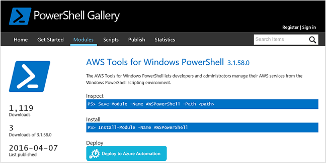
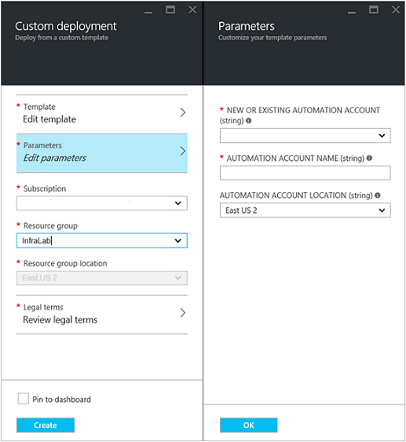
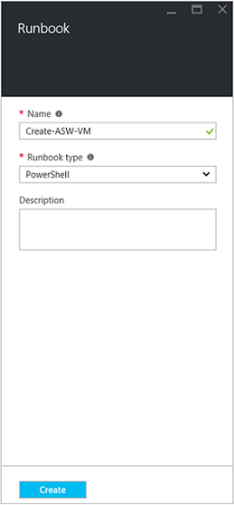
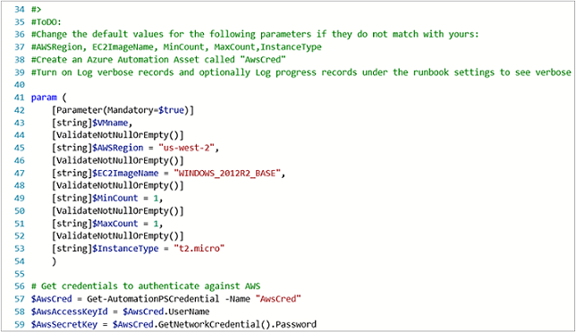
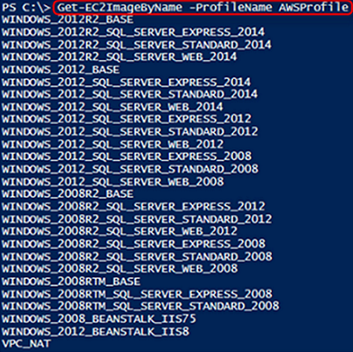
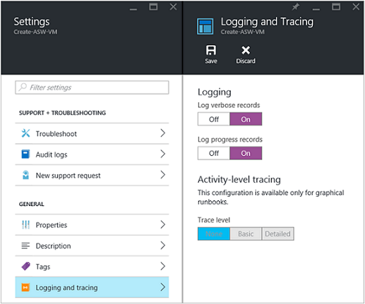
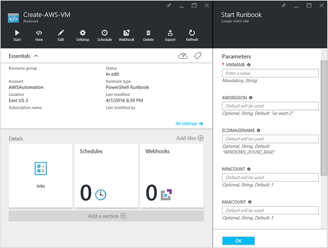
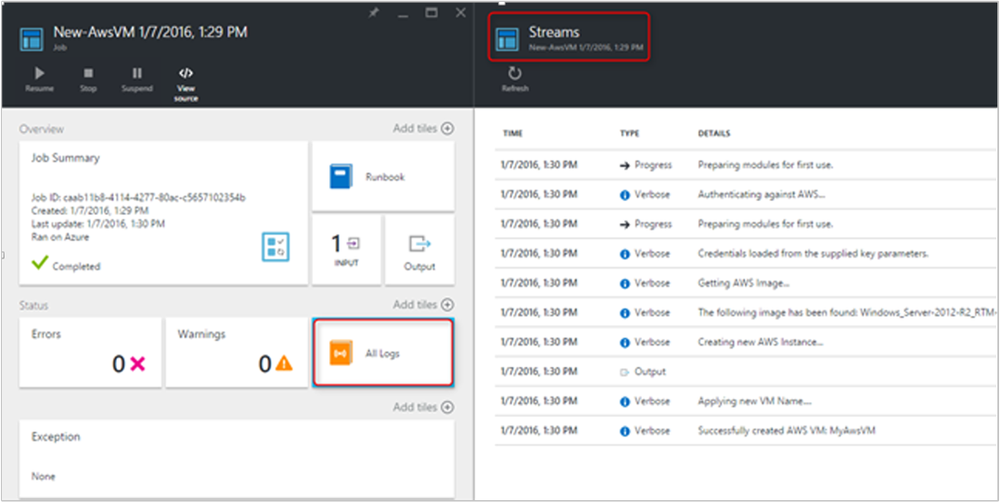

# Deploy an Amazon Web Services VM with a runbook

In this article, you learn how you can leverage Azure Automation to provision a virtual machine in your Amazon Web Service (AWS) subscription and give that VM a specific name – which AWS refers to as “tagging” the VM.

## Prerequisites

You need to have an Azure Automation account and an Amazon Web Services (AWS) subscription. For more information on setting up an Azure Automation account and configuring it with your AWS subscription credentials, review [Configure Authentication with Amazon Web Services](automation-config-aws-account.md). This account should be created or updated with your AWS subscription credentials before proceeding, as you reference this account in the sections below.

## Deploy Amazon Web Services PowerShell Module

Your VM provisioning runbook uses the AWS PowerShell module to do its work. Use the following steps to add the module to your Automation account that is configured with your AWS subscription credentials.  

1. Open your web browser and navigate to the [PowerShell Gallery](https://www.powershellgallery.com/packages/AWSPowerShell/) and click on the **Deploy to Azure Automation button**.<br><br> 
2. You are taken to the Azure login page and after authenticating, you will be routed to the Azure portal and presented with the following page:<br><br> 
3. Select the Automation account to use and click **OK** to start deployment.

   > [!NOTE]
   > When Azure Automation imports a PowerShell module, it extracts the cmdlets. The activities don't appear until Automation has completely finished importing the module and extracting the cmdlets. This process can take a few minutes.  
   > <br>

1. In the Azure portal, open your Automation account.
2. Click on the **Assets** tile and, on the Assets pane, select **Modules**.
3. On the Modules page, you see the **AWSPowerShell** module in the list.

## Create AWS deploy VM runbook

Once the AWS PowerShell Module has been deployed, you can now author a runbook to automate provisioning a virtual machine in AWS using a PowerShell script. The steps below demonstrate how to use native PowerShell script in Azure Automation.  

> [!NOTE]
> For further options and information regarding this script, please visit the [PowerShell Gallery](https://www.powershellgallery.com/packages/New-AwsVM/).
> 

1. Download the PowerShell script New-AwsVM from the PowerShell Gallery by opening a PowerShell session and typing the following command:<br>
   ```powershell
   Save-Script -Name New-AwsVM -Path <path>
   ```
   <br>
2. From the Azure portal, open your Automation account and select **Runbooks** under **Process Automation**.  
3. From the Runbooks page, select **Add a runbook**.
4. On the Add a runbook pane, select **Quick Create** to create a new runbook.
5. On the Runbook properties pane, type in a name for your runbook.
6. From the **Runbook type** drop-down list, select **PowerShell**, and then click **Create**.<br><br> 
7. When the Edit PowerShell Runbook page appears, copy and paste the PowerShell script into the runbook authoring canvas.<br><br> <br>
   
    Note the following when working with the example PowerShell script:

    * The runbook contains a number of default parameter values. Evaluate all default values and update where necessary.
    * If you have stored your AWS credentials as a credential asset named differently from `AWScred`, you need to update the script on line 57 to match accordingly.  
    * When working with the AWS CLI commands in PowerShell, especially with this example runbook, you must specify the AWS region. Otherwise, the cmdlets fail. View AWS topic [Specify AWS Region](https://docs.aws.amazon.com/powershell/latest/userguide/pstools-installing-specifying-region.html) in the AWS Tools for PowerShell document for further details.  

8. To retrieve a list of image names from your AWS subscription, launch PowerShell ISE and import the AWS PowerShell Module. Authenticate against AWS by replacing `Get-AutomationPSCredential` in your ISE environment with `AWScred = Get-Credential`. This statement prompts for your credentials and you can provide your access key ID for the user name and your secret access key for the password. 

        ```powershell
        #Sample to get the AWS VM available images
        #Please provide the path where you have downloaded the AWS PowerShell module
        Import-Module AWSPowerShell
        $AwsRegion = "us-west-2"
        $AwsCred = Get-Credential
        $AwsAccessKeyId = $AwsCred.UserName
        $AwsSecretKey = $AwsCred.GetNetworkCredential().Password
   
        # Set up the environment to access AWS
        Set-AwsCredentials -AccessKey $AwsAccessKeyId -SecretKey $AwsSecretKey -StoreAs AWSProfile
        Set-DefaultAWSRegion -Region $AwsRegion
   
        Get-EC2ImageByName -ProfileName AWSProfile
        ```
        
    The following output is returned:<br><br>
   <br>  
9. Copy and paste the one of the image names in an Automation variable as referenced in the runbook as `$InstanceType`. Since, in this example, you are using the free AWS tiered subscription, you use **t2.micro** for your runbook example.  
10. Save the runbook, then click **Publish** to publish the runbook and then **Yes** when prompted.

### Test the AWS VM runbook

1. Verify that the runbook creates an asset called `AWScred` for authenticating against AWS, or update the script to reference your credential asset name.    
2. Verify your new runbook and make sure that all parameter values have been updated has necessary.
Ensure that the AWS PowerShell module has been imported into Azure Automation.  
3. In Azure Automation, set **Log verbose records** and optionally **Log progress records** under the runbook operation **Logging and tracing** to **On**.<br><br> .  
4. Click **Start** to start the runbook, then click **OK** when the Start Runbook pane opens.
5. On the Start Runbook pane, provide a VM name. Accept the default values for the other parameters that you preconfigured in the script. Click **OK** to start the runbook job.<br><br> 
6. A Job pane is opened for the runbook job that you created. Close this pane.
7. You can view progress of the job and view output streams by selecting **All Logs** from the runbook Job pane.<br><br> 
8. To confirm that the VM is being provisioned, log into the AWS Management Console if you aren't currently logged in.<br><br> 

## Next steps
 
* To find out what runbooks are supported, see[Azure Automation runbook types](automation-runbook-types.md).
* To work with runbooks, see [Manage runbooks in Azure Automation](manage-runbooks.md).
* For details of PowerShell, see [PowerShell Docs](https://docs.microsoft.com/powershell/scripting/overview).
* For script support, see [Native PowerShell script support in Azure Automation](https://azure.microsoft.com/blog/announcing-powershell-script-support-azure-automation-2/).
* For a PowerShell cmdlet reference, see [Az.Automation](https://docs.microsoft.com/powershell/module/az.automation/?view=azps-3.7.0#automation
).