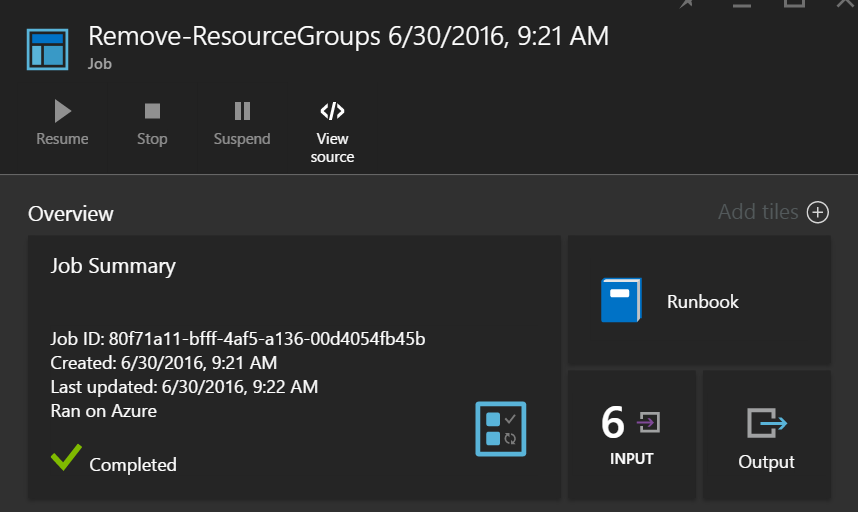
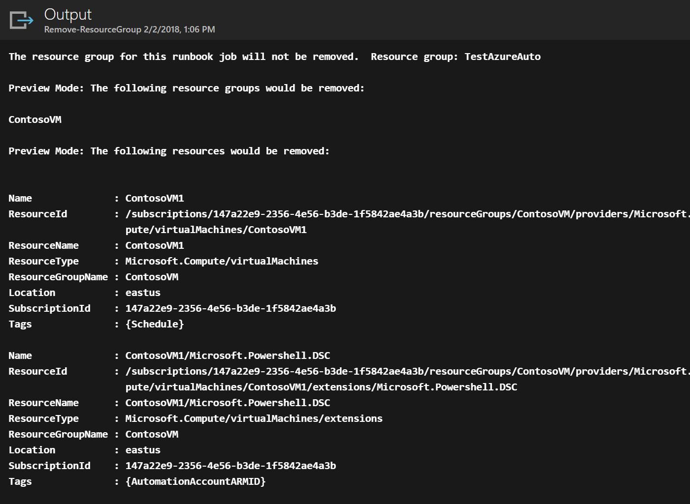

# Azure Automation scenario - automate removal of resource groups
Many customers create more than one resource group. Some might be used for managing production applications, and others might be used as development, testing, and staging environments. Automating the deployment of these resources is one thing, but being able to decommission a resource group with a click of the button is another. You can streamline this common management task by using Azure Automation. This is helpful if you are working with an Azure subscription that has a spending limit through a member offer like MSDN or the Microsoft Partner Network Cloud Essentials program.

This scenario is based on a PowerShell runbook and is designed to remove one or more resource groups that you specify from your subscription. The default setting of the runbook is to test before proceeding. This ensures that you don't accidentally delete the resource group before you're ready to complete this procedure.   

## Getting the scenario
This scenario consists of a PowerShell runbook that you can download from the [PowerShell Gallery](https://www.powershellgallery.com/packages/Remove-ResourceGroup/1.0/DisplayScript). You can also import it directly from the [Runbook Gallery](automation-runbook-gallery.md) in the Azure portal.  

| Runbook | Description |
| --- | --- |
| Remove-ResourceGroup |Removes one or more Azure resource groups and associated resources from the subscription. |

 
The following input parameters are defined for this runbook:

| Parameter | Description |
| --- | --- |
| NameFilter (Required) |Specifies a name filter to limit the resource groups that you intend on deleting. You can pass multiple values using a comma-separated list. The filter is not case-sensitive and matches any resource group that contains the string. |
| PreviewMode (Optional) |Executes the runbook to see which resource groups would be deleted, but takes no action. The default is **true** to help avoid accidental deletion of one or more resource groups passed to the runbook. |

## Install and configure this scenario
### Prerequisites
This runbook authenticates using the [Azure Run As account](automation-sec-configure-azure-runas-account.md).    

### Install and publish the runbooks
After you download the runbook, you can import it by using the procedure in [Importing runbook procedures](automation-creating-importing-runbook.md#importing-a-runbook-from-a-file-into-azure-automation). Publish the runbook after it has been successfully imported into your Automation account.

## Using the runbook
The following steps walk you through the execution of this runbook and help you become familiar with how it works. You are testing the runbook in this example, not actually deleting the resource group.  

1. From the Azure portal, open your Automation account and click **Runbooks**.
2. Select the **Remove-ResourceGroup** runbook and click **Start**.
3. When you start the runbook, the **Start Runbook** page opens and you can configure the parameters. Enter the names of resource groups in your subscription that you can use for testing and causes no harm if accidentally deleted.

   > [!NOTE]
   > Make sure **Previewmode** is set to **true** to avoid deleting the selected resource groups. This runbook does not remove the resource group that contains the Automation account that is running this runbook.  
   >
   >
1. After you have configured all the parameter values, click **OK**, and the runbook will be queued for execution.  

To view the details of the **Remove-ResourceGroup** runbook job in the Azure portal, under **Resource**, select **Jobs** in the runbook. Select, the job you want to view. The job summary displays the input parameters and the output stream in addition to general information about the job and any exceptions that occurred.  .

The **Job Summary** includes messages from the output, warning, and error streams. Select **Output** to view detailed results from the runbook execution.  

## Next steps
* To get started creating your own runbook, see [Creating or importing a runbook in Azure Automation](automation-creating-importing-runbook.md).
* To get started with PowerShell Workflow runbooks, see [My first PowerShell Workflow runbook](automation-first-runbook-textual.md).
