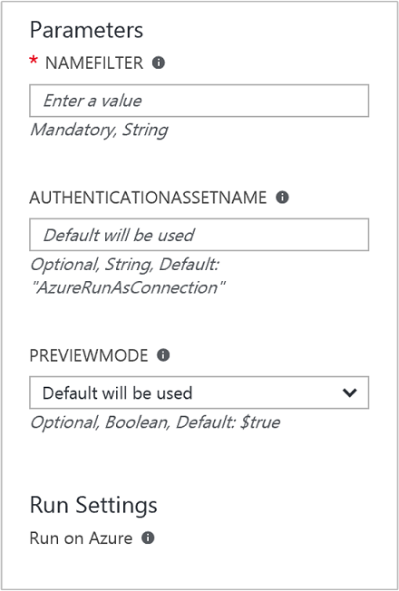

<properties
    pageTitle="Automate removal of Resource Groups | Microsoft Azure"
    description="PowerShell Workflow version of an Azure Automation scenario including runbooks to remove all Resource Groups in your subscription."
    services="automation"
    documentationCenter=""
    authors="MGoedtel"
    manager="jwhit"
    editor=""
	/>
<tags
    ms.service="automation"
    ms.workload="tbd"
    ms.tgt_pltfrm="na"
    ms.devlang="na"
    ms.topic="get-started-article"
    ms.date="09/23/2016"
    ms.author="magoedte"/>

# Azure Automation scenario - automate removal of Resource Groups

Many customers create more than one resource group, where some are for dedicated for managing production applications and others may be development, testing and staging environments. Automating the deployment of these resources is one thing, but being able to decommission a resource group with a click of the button is another.  Using Automation to handle it is a perfect use case and opportunity to streamline such a common management task. This also becomes helpful if you are working with an Azure subscription that has a spending limit through a member offer like MSDN or the Microsoft Partner Network Cloud Essentials program, for example. 

This scenario is based on a PowerShell runbook and is designed to remove one or more resource groups that you specify from your subscription.  The runbook supports testing first before proceeding, which is its default value.  This way you don't accidentally delete it without making absolutely sure your ready to complete this procedure.   

## Getting the scenario

This scenario consists of a PowerShell runbook that you can download from the [PowerShell Gallery](https://www.powershellgallery.com/packages/Remove-ResourceGroup/1.0/DisplayScript) or  you can import it directly from the [Runbook Gallery](automation-runbook-gallery.md) in the Azure portal.   

Runbook | Description|
----------|------------|
Remove-ResourceGroup | Removes one or more Azure resource groups and its resources from the subscription.  
 
The following input parameters are defined for this runbook:

Parameter | Description|
----------|------------|
NameFilter (Required) | Allows you to specify a name filter to limit the resource groups that you intend on deleting. You can pass multiple values using a comma separated list. 
The filter is not case sensitive and will match any resource group that contains the string.|
PreviewMode (Optional) with default of $true | Execute the runbook to see which resource groups would be deleted but take no action.

## Installing and configuring this scenario

### Prerequisites

The runbook works with an [Azure Run As account](automation-sec-configure-azure-runas-account.md).  The Run As account is the preferred authentication credential since it uses certificate authentication instead of a password that may expire or change frequently.  

### Install and publish the runbooks

After downloading the runbook, you can import it using the procedure in [Importing runbook procedures](automation-creating-importing-runbook.md#importing-a-runbook-from-a-file-into-Azure-Automation).  Publish the runbook after it has been successfully imported into your Automation account.

## Using the runbook

The following steps will walk you through the execution of this runbook and help you become familiar with how it works.  We will only be testing the runbook in this example, not actually deleting the resource group.  

1. From the Azure Portal, open your Automation account and click the  **Runbooks** tile.
2. Select the **Remove-ResourceGroup** runbook and click **Start**.
3. When you start the runbook, the **Start Runbook** blade opens and you can configure the following values for the parameters.  Enter the name of one or more resource groups in your subscription that you want to test with and will cause no harm if accidentally deleted.  
    
    >[AZURE.NOTE] Make sure the **Previewmode** option is set to **true** in order to avoid deleting the selected resource group(s).  **Please note** that this runbook will not remove the resource group that contains the Automation account that is running this runbook.  

4. Once you have configured all the parameter values, click **OK** and the runbook will be queued up for execution.  

To view the details of the **Remove-ResourceGroup** runbook job in the Azure portal, select the **Jobs** tile of the runbook. The job summary displays the input parameters and the output stream, in addition to general information about the job and any exceptions if they occurred.  .

The **Job Summary** includes messages from the output, warning, and error streams. Select the **Output** tile to view detailed results from the runbook execution.   

## Next steps

- To get started with creating your own runbook, see [Creating or importing a runbook in Azure Automation](automation-creating-importing-runbook.md)
- To get started with PowerShell workflow runbooks, see [My first PowerShell workflow runbook](automation-first-runbook-textual.md)