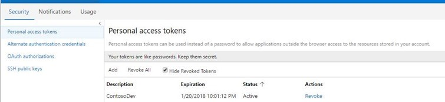
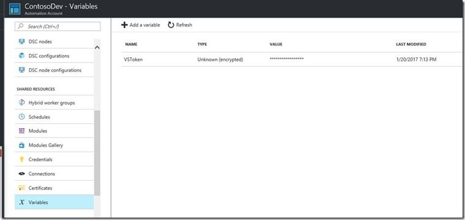
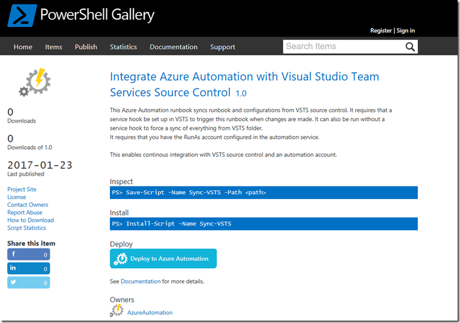
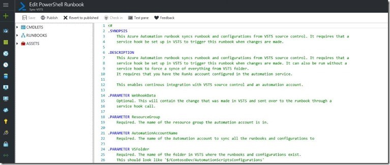
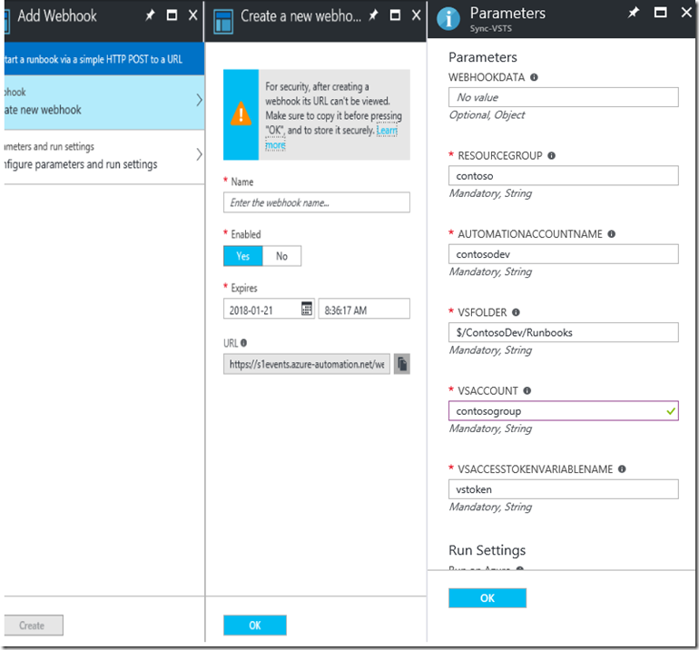
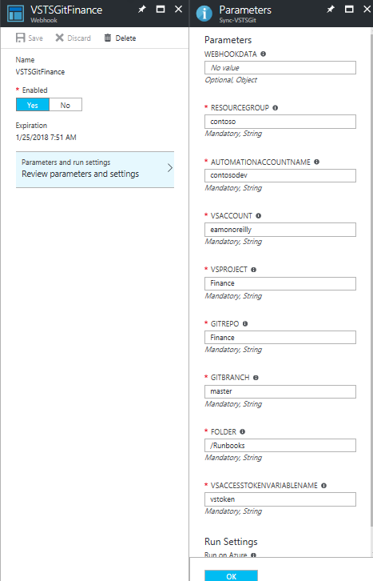
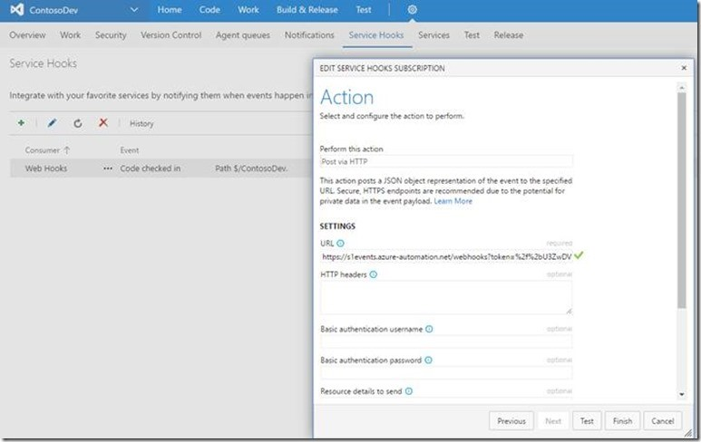
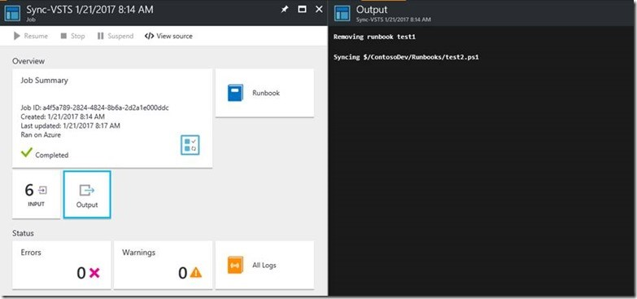

# Azure Automation scenario - Automation source control integration with Azure DevOps

> [!NOTE]
> There is a new experience for source control. To learn more about the new experience, see [Source Control (Preview)](source-control-integration.md).

In this scenario, you have an Azure DevOps project that you are using to manage Azure Automation runbooks or DSC configurations under source control.

This article describes how to integrate Azure DevOps with your Azure Automation environment so that continuous integration happens for each check-in.

## Getting the scenario

This scenario consists of two PowerShell runbooks that you can import directly from the [Runbook Gallery](automation-runbook-gallery.md) in the Azure portal or download from the [PowerShell Gallery](https://www.powershellgallery.com).

### Runbooks

Runbook | Description|
--------|------------|
Sync-VSTS | Import runbooks or configurations from Azure DevOps source control when a check-in is done. If run manually, it imports and publishes all runbooks or configurations into the Automation account.| 
Sync-VSTSGit | Import runbooks or configurations from Azure DevOps under Git source control when a check-in is done. If run manually, it imports and publishes all runbooks or configurations into the Automation account.|

### Variables

Variable | Description|
-----------|------------|
VSToken | Secure variable asset you create that contains the Azure DevOps personal access token. You can learn how to create an Azure DevOps personal access token on the [Azure DevOps authentication page](/azure/devops/organizations/accounts/use-personal-access-tokens-to-authenticate).

## Installing and configuring this scenario

Create a [personal access token](/azure/devops/organizations/accounts/use-personal-access-tokens-to-authenticate) in Azure DevOps that you use to sync the runbooks or configurations into your automation account.

 

Create a [secure variable](automation-variables.md) in your automation account to hold the personal access token so that the runbook can authenticate to Azure DevOps and sync the runbooks or configurations into the Automation account. You can name this VSToken.

Import the runbook that syncs your runbooks or configurations into the automation account. You can use the [Azure DevOps sample runbook](https://www.powershellgallery.com/packages/Sync-VSTS) or the [Azure DevOps with Git sample runbook](https://www.powershellgallery.com/packages/Sync-VSTSGit) from the [PowerShell Gallery](https://www.powershellgallery.com) depending on if you use Azure DevOps source control or Azure DevOps with Git and deploy to your automation account.

You can now [publish](automation-creating-importing-runbook.md#publishing-a-runbook) this runbook so you can create a webhook.

Create a [webhook](automation-webhooks.md) for this Sync-VSTS runbook and fill in the parameters as shown below. Make sure you copy the webhook url as you need it for a service hook in Azure DevOps. The VSAccessTokenVariableName is the name (VSToken) of the secure variable that you created earlier to hold the personal access token.

Integrating with Azure DevOps (Sync-VSTS.ps1) takes the following parameters:

### Sync-VSTS Parameters

Parameter | Description|
--------|------------|
WebhookData | This contains the checkin information sent from the Azure DevOps service hook. You should leave this parameter blank.| 
ResourceGroup | This is the name of the resource group that the automation account is in.|
AutomationAccountName | The name of the automation account that syncs with Azure DevOps.|
VSFolder | The name of the folder in Azure DevOps where the runbooks and configurations exist.|
VSAccount | The name of the Azure DevOps organization.|
VSAccessTokenVariableName | The name of the secure variable (VSToken) that holds the Azure DevOps personal access token.|

If you are using Azure DevOps with GIT (Sync-VSTSGit.ps1) it will take the following parameters.

Parameter | Description|
--------|------------|
WebhookData | This will contain the checkin information sent from the Azure DevOps service hook. You should leave this parameter blank.|
ResourceGroup | This the name of the resource group that the automation account is in.|
AutomationAccountName | The name of the automation account that syncs with Azure DevOps.|
VSAccount | The name of the Azure DevOps organization.|
VSProject | The name of the project in Azure DevOps where the runbooks and configurations exist.|
GitRepo | The name of the Git repository.|
GitBranch | The name of the branch in Azure DevOps Git repository.|
Folder | The name of the folder in Azure DevOps Git branch.|
VSAccessTokenVariableName | The name of the secure variable (VSToken) that holds the Azure DevOps personal access token.|

Create a service hook in Azure DevOps for check-ins to the folder that triggers this webhook on code check-in. Select **Web Hooks** as the service to integrate with when you create a new subscription. You can learn more about service hooks on [Azure DevOps Service Hooks documentation](https://www.visualstudio.com/docs/marketplace/integrate/service-hooks/get-started).

You should now be able to do all check-ins of your runbooks and configurations into Azure DevOps and have these automatically synched into your automation account.

If you run this runbook manually without being triggered by Azure DevOps, you can leave the webhookdata parameter empty and it does a full sync from the Azure DevOps folder specified.

If you wish to uninstall the scenario, remove the service hook from Azure DevOps, delete the runbook, and the VSToken variable.
