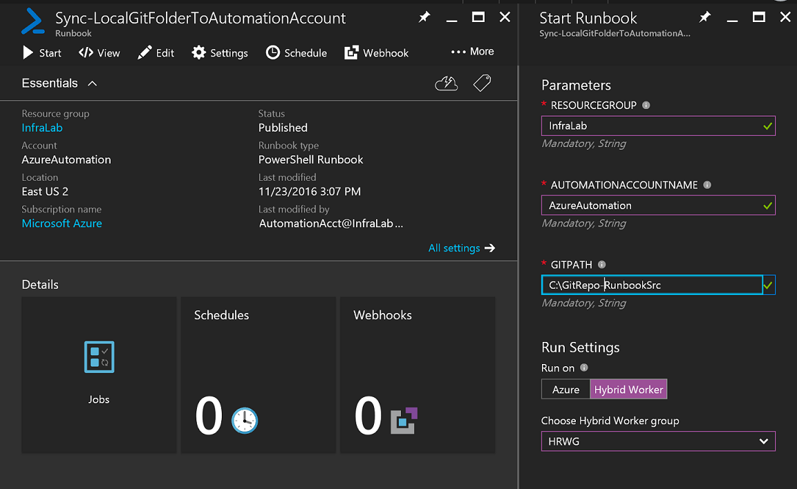

# Azure Automation scenario - Automation source control integration with GitHub Enterprise

Automation currently supports source control integration, which allows you to associate runbooks in your Automation account to a GitHub source control repository.  However, customers who have deployed [GitHub Enterprise](https://enterprise.github.com/home) to support their DevOps practices, also want to use it to manage the lifecycle of runbooks that are developed to automate business processes and service management operations.  

In this scenario, you will have a Windows computer in your data center configured as a Hybrid Runbook Worker with the Azure RM modules and Git tools installed.  The Hybrid worker machine will have a clone of the local Git repository.  When the runbook is run on the hybrid worker, the Git directory is synchronized and the runbook file contents are imported into the Automation account.

This article describes how to set up this configuration in your Azure Automation environment. We will start by configuring Automation with the security credentials, runbooks required to support this scenario, and deployment of a Hybrid Runbook Worker in your data center to run the runbooks and access your GitHub Enterprise repository to synchronize runbooks with your Automation account.  

## Getting the scenario

This scenario consists of two PowerShell runbooks that you can import directly from the [Runbook Gallery](automation-runbook-gallery.md) in the Azure portal or download from the [PowerShell Gallery](https://www.powershellgallery.com).

### Runbooks

Runbook | Description| 
--------|------------|
Export-RunAsCertificateToHybridWorker | Runbook will export a RunAs certificate from an Automation account to a hybrid worker so that runbooks on the worker can authenticate with Azure in order to import runbooks into the Automation account.| 
Sync-LocalGitFolderToAutomationAccount | Runbook will sync the local Git folder on the hybrid machine and then import the runbook files (*.ps1) into the Automation account.|

### Credentials

Credential | Description|
-----------|------------|
GitHRWCredential | Credential asset you will create that contains the username and password for a user with permissions to the hybrid worker.|

## Installing and configuring this scenario

### Prerequisites

1. The Sync-LocalGitFolderToAutomationAccount runbook authenticates using the [Azure Run As account](automation-sec-configure-azure-runas-account.md). 

2. A Microsoft Operations Management Suite (OMS) workspace with the Azure Automation solution enabled and configured is also required.  If you do not have one that is associated with the Automation account used to install and configure this scenario, it will be created and configured for you when you execute the **New-OnPremiseHybridWorker.ps1** script from the hybrid runbook worker.        

    > [!NOTE]
    > Currently these are the only regions supported for Automation integration with OMS - **Australia Southeast**, **East US 2**, **Southeast Asia**, and **West Europe**. 

3. A computer that can serve as a dedicated Hybrid Runbook Worker that will also host the GitHub software and maintain the runbook files (*runbook*.ps1) in a source directory on the file system to synchronize between GitHub and your Automation account.

### Import and publish the runbooks

To import the *Export-RunAsCertificateToHybridWorker* and *Sync-LocalGitFolderToAutomationAccount* runbooks from the Runbook Gallery from your Automation account in the Azure portal, please follow the procedures in [Import Runbook from the Runbook Gallery](automation-runbook-gallery.md#to-import-a-runbook-from-the-runbook-gallery-with-the-azure-portal). Publish the runbooks after they have been successfully imported into your Automation account.

### Deploy and Configure Hybrid Runbook Worker

If you do not have a Hybrid Runbook Worker already deployed in your data center, you should review the requirements and follow the automated installation steps using the procedure in [Azure Automation Hybrid Runbook Workers - Automate Install and Configuration](automation-hybrid-runbook-worker.md#automated-deployment).  Once you have successfully installed the hybrid worker on a computer, perform the following steps to complete its configuration to support this scenario.

1. Log onto the computer hosting the Hybrid Runbook Worker role with an account that has local administrative rights and create a directory to hold the Git runbook files.  Clone  the internal Git repository to the directory.
2. If you do not already have a RunAs account created or you want to create a new one dedicated for this purpose, from the Azure portal navigate to Automation accounts, select your Automation account and create a [credential asset](automation-credentials.md) that contains the username and password for a user with permissions to the hybrid worker.  
3. From your Automation account, [edit the runbook](automation-edit-textual-runbook.md)  **Export-RunAsCertificateToHybridWorker** and modify the value for the variable *$Password* with a strong password.  After you modify the value, click **Publish** to have the draft version of the runbook published. 
5. Start the runbook **Export-RunAsCertificateToHybridWorker**, and in the **Start Runbook** blade, under the option **Run settings** select the option **Hybrid Worker** and in the drop-down list select the Hybrid worker group you created earlier for this scenario.  

    This will export a certificate to the hybrid worker so that runbooks on the worker can authenticate with Azure using the Run As connection in order to manage Azure resources (in particular for this scenario - import runbooks to the Automation account).

4. From your Automation account, select the Hybrid worker group created earlier and [specify a RunAs account](automation-hybrid-runbook-worker.md#runas-account) for the for the Hybrid worker group, and chose the credential asset you just or already have created.  This assures that the Sync runbook can run Git commands. 
5. Start the runbook **Sync-LocalGitFolderToAutomationAccount**, provide the following required input parameter values and in the **Start Runbook** blade, under the option **Run settings** select the option **Hybrid Worker** and in the drop-down list select the Hybrid worker group you created earlier for this scenario:
	* *ResourceGroup* - the name of your resource group associated with your Automation account
	* *AutomationAccountName* - the name of your Automation account
	* *GitPath* - The local folder or file on the Hybrid Runbook Worker where Git is set up to pull latest changes into

    This will sync the local Git folder on the hybrid worker computer and then import the .ps1 files from the source directory to the Automation account.

     

7. View job summary details for the runbook by selecting it from the **Runbooks** blade in your Automation account, and then select the **Jobs** tile.  Confirm it completed successfully by selecting the **All logs** tile and reviewing the detailed log stream.  

## Next steps

-  To know more about runbook types, their advantages and limitations, see [Azure Automation runbook types](automation-runbook-types.md)
-  For more information on PowerShell script support feature, see [Native PowerShell script support in Azure Automation](https://azure.microsoft.com/blog/announcing-powershell-script-support-azure-automation-2/)
