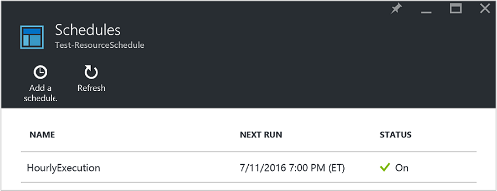
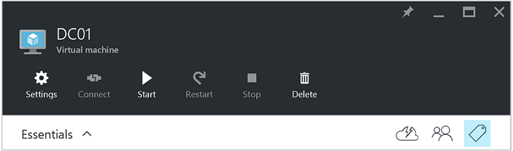
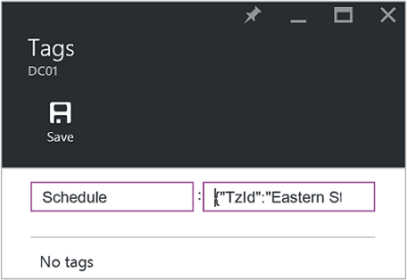
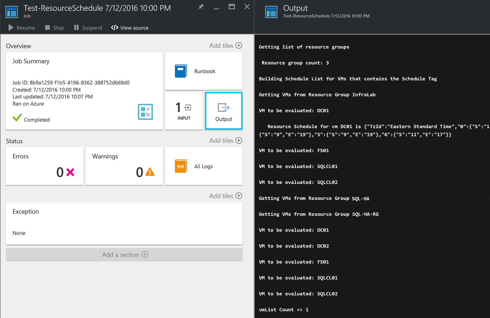

<properties
   pageTitle="Using JSON formatted tags to create a schedule for Azure VM startup and shutdown | Microsoft Azure"
   description="This article demonstrates how to use JSON strings on tags to automate scheduling of VM startup and shutdown."
   services="automation"
   documentationCenter=""
   authors="MGoedtel"
   manager="jwhit"
   editor="tysonn" />
<tags
   ms.service="automation"
   ms.devlang="na"
   ms.topic="article"
   ms.tgt_pltfrm="na"
   ms.workload="infrastructure-services"
   ms.date="07/18/2016"
   ms.author="magoedte;paulomarquesc" />

# Azure Automation scenario - using JSON formatted tags to create a schedule for Azure VM startup and shutdown

Commonly customers want to schedule the startup and shutdown of virtual machines to help reduce subscription costs or support business and technical requirements.  

The following scenario allows you to setup automated startup and shutdown of your VMs using a tag called Schedule at a resource group level or virtual machine level in Azure.  This schedule can be configured from Sunday to Saturday with a startup time and shutdown time.  While we do have some options out of the box, like using [Virtual Machine Scale Sets](../virtual-machine-scale-sets/virtual-machine-scale-sets-overview.md) with Auto Scale Settings that will allow scale in or out, and [DevTest Labs](../devtest-lab/devtest-lab-overview.md) service which have the built-in capability of scheduling startup and shutdown operations, these options only support specific scenarios and cannot be applied to IaaS VMs.   

When the Schedule tag is applied to a resource group, it will be applied to all virtual machines inside that resource group. If a schedule is also directly applied to a VM, the last schedule will take precedence in the following order:

1.  Schedule applied to a resource group
2.  Schedule applied to a resource group and virtual machine in the resource group
3.  Schedule applied to a virtual machine

This scenario essentially takes a JSON string with a specified format and add it as a the value for a tag called Schedule.  Then a runbook lists all resource groups and virtual machines and identifies the schedules for each VM based on the scenarios listed above, then it will loop through these VM's with schedules attached and evaluate what action it should be taken, which can be stopped, shutdown, or ignored.

These runbooks authenticate using the [Azure Run As account](../automation/automation-sec-configure-azure-runas-account.md).

## Getting the scenario

This scenario consists of four PowerShell Workflow runbooks that you can download from the [TechNet Gallery](https://gallery.technet.microsoft.com/Azure-Automation-Runbooks-84f0efc7) or the [GitHub](https://github.com/paulomarquesdacosta/azure-automation-scheduled-shutdown-and-startup) repository for this project. 

Runbook | Description 
----------|----------
Test-ResourceSchedule | Checks each Virtual Machine’s schedule (performs shutdown or startup of virtual machines depending on the schedule)
Add-ResourceSchedule | Adds the Schedule tag to a VM or resource group
Update-ResourceSchedule | Modifies an existing Schedule tag by replacing it by a new one
Remove-ResourceSchedule | Removes Schedule tag from a VM or resource group 

## Installing and configuring this scenario

### Install and publish the runbooks

After downloading the runbooks, you can import them using the procedure in [Importing runbook procedures](automation-creating-importing-runbook.md#importing-a-runbook-from-a-file-into-Azure-Automation).  Publish each runbook after they have been successfully imported into your Automation account.

### Adding a schedule to Test-ResourceSchedule

Follow these steps to enable the schedule to Test-ResourceSchedule runbook.  This is the runbook that tests which virtual machine will be started, shutdown or leave as is. 

1. From the Azure Portal, open your Automation account and click the  **Runbooks** tile.
2. On the **Test-ResourceSchedule** blade, click the **Schedules** tile.
3. On **Schedules** blade, click **Add a schedule**.
4. In the **Schedules** blade, select **Link a schedule to your runbook** and in the **Schedule** blade, select **Create a new schedule**.
5.  In the **New schedule** blade, type in the name of this schedule.  Example, HourlyExecution.
6. For the schedule **Start** schedule, set start time to a rounded hour increment.  
7. Select **Recurrence** and for **Reoccur every** interval select **1 hour** .
8. Verify the **Set expiration** is set to **No** and then click **Create** to save your new schedule.
9. In the **Schedule Runbook** options blade, select **Parameters and run settings** option and in the Test-ResourceSchedule **Parameters** blade, enter the name of your subscription in the **SubscriptionName** field.  This is the only parameter required for the runbook.  Click **OK** when complete.  
   

The runbook schedule should look like the following when completed:   

## Schedule JSON format

This solution basically takes a JSON string with a specified format and adds it as a the value for a tag called Schedule.  Then a runbook lists all resource groups and virtual machines and identifies the schedules for each virtual machine and will loop over these virtual machines with schedules attached and check what action it should be taken.  The following is an example of how it should be formatted.

    {
       "TzId": "Eastern Standard Time", 
        "0": {  
           "S": "11",
           "E": "17" 
        },
        "1": {
           "S": "9",
           "E": "19"
        },
        "2": {
           "S": "9",
           "E": "19"
        },
    }

Detailed information about this structure:

1. The format of this JSON structure is optimized to work around the 256 characters limitation of a single tag value in Azure

2. *TzId* represents the Time Zone of the virtual machine.  This ID can be obtained by using the TimeZoneInfo .NET class. in a PowerShell session - **[System.TimeZoneInfo]::GetSystemTimeZones()**.   

    

    - Week days are represented with a numeric value of 0 to 6.  The value 0 equals Sunday.
    - Start time is represented with the **S** attribute and its value is in a 24-hour format.
    - End or shutdown time is represented with the **E** attribute and its value is in a 24-hour format.

    If S and E attributes have a value of zero (0), the virtual mahine will be left in its present state at time of evaluation.   

3. If you want to skip evaluation for a specific day of the week, don’t add the section of related day of week.  In the following example, only Monday will be evaluated and the other days of the week will be ignored.
   
        {
          "TzId": "Eastern Standard Time",
           "1": {
             "S": "11",
             "E": "17"
           }
        }

## Tagging resource groups or VMs

In order to shutdown VMs, you need to tag them or the resource groups where they are located. Virtual machines that do not have a Schedule tag are not evaluated, therefore they are not started nor shutdown. There are two ways to tag resource groups or VMs with this solution, directly from the portal or using the **Add-ResourceSchedule**, **Update-ResourceSchedule**, and **Remove-ResourceSchedule** runbooks. 

### Tagging through the Portal

Follow these steps to tag a virtual machine or resource group in the Portal.

1. Flatten the JSON string and verify there aren't any spaces.  Your JSON string should look like this:

        {"TzId":"Eastern Standard Time","0":{"S":"11","E":"17"},"1":{"S":"9","E":"19"},"2": {"S":"9","E":"19"},"3":{"S":"9","E":"19"},"4":{"S":"9","E":"19"},"5":{"S":"9","E":"19"},"6":{"S":"11","E":"17"}}
   

2. Select a VM or resource group to apply this schedule by selecting the Tag icon.     
3. Tags are defined following a Key/Value pair.  Type **Schedule** in the **Key** field and paste the JSON string into **Value** field and then click **Save**.  Your new tag should now appear in the list of tags for your resource. 

### Tagging from PowerShell

All imported runbooks contains help information at the beginning of the script to describe how to execute the runbooks directly from PowerShell.  The Add-ScheduleResource and Update-ScheduleResource runbooks can be called from PowerShell by passing required parameters allowing you to create or update the Schedule tag on a VM or resource group outside of the portal.  

To create, add, and delete tags through PowerShell, you first need to [set up your PowerShell environment for Azure](../powershell-install-configure.md). Once you have completed the setup, you can proceed with the following steps.

### Creating a schedule tag with PowerShell

1. Open a PowerShell session and execute the following to authenticate with your Run As account and specify a subscription:   
    
        Conn = Get-AutomationConnection -Name AzureRunAsConnection
        Add-AzureRMAccount -ServicePrincipal -Tenant $Conn.TenantID `
        -ApplicationId $Conn.ApplicationID -CertificateThumbprint $Conn.CertificateThumbprint
        Select-AzureRmSubscription -SubscriptionName "MySubscription"
   
2. Define a schedule hash table. Here is an example of how it should be constructed:
    
        $schedule= @{ "TzId"="Eastern Standard Time"; "0"= @{"S"="11";"E"="17"};"1"= @{"S"="9";"E"="19"};"2"= @{"S"="9";"E"="19"};"3"= @{"S"="9";"E"="19"};"4"= @{"S"="9";"E"="19"};"5"= @{"S"="9";"E"="19"};"6"= @{"S"="11";"E"="17"}}

3. Define the parameters required by the runbook.  In the following example, we are targeting a VM:

        $params = @{"SubscriptionName"="MySubscription";"ResourceGroupName"="ResourceGroup01"; `
        "VmName"="VM01";"Schedule"=$schedule}

    If you’re tagging a resource group, just remove the *VMName* parameter from the $params hash table as follows:

        $params = @{"SubscriptionName"="MySubscription";"ResourceGroupName"="ResourceGroup01"; `
        "Schedule"=$schedule}

4. Execute the **Add-ResourceSchedule** runbook with the following parameters to create the Schedule tag:

        Start-AzureRmAutomationRunbook -Name "Add-ResourceSchedule" -Parameters $params `
        -AutomationAccountName "AutomationAccount" -ResourceGroupName "ResourceGroup01"

5. If you want to update a resource group or virtual machine tag, execute the **Update-ResourceSchedule** runbook with the following parameters:

        Start-AzureRmAutomationRunbook -Name "Update-ResourceSchedule" -Parameters $params `
        -AutomationAccountName "AutomationAccount" -ResourceGroupName "ResourceGroup01"

### Removing a schedule tag with PowerShell

1. Open a PowerShell session and execute the following to authenticate with your Run As account and select and specify a subscription:
    
        Conn = Get-AutomationConnection -Name AzureRunAsConnection
        Add-AzureRMAccount -ServicePrincipal -Tenant $Conn.TenantID `
        -ApplicationId $Conn.ApplicationID -CertificateThumbprint $Conn.CertificateThumbprint
        Select-AzureRmSubscription -SubscriptionName "MySubscription"

2. Define the parameters required by the runbook.  In the following example, we are targeting a VM:

        $params = @{"SubscriptionName"="MySubscription";"ResourceGroupName"="ResourceGroup01" ` 
        ;"VmName"="VM01"}

    If you’re removing a tag from a resource group, just remove the *VMName* parameter from the $params hash table as follows:

        $params = @{"SubscriptionName"="MySubscription";"ResourceGroupName"="ResourceGroup01"}

3. Execute the **Remove-ResourceSchedule** runbook to remove the Schedule tag:

        Start-AzureRmAutomationRunbook -Name "Remove-ResourceSchedule" -Parameters $params `
        -AutomationAccountName "AutomationAccount" -ResourceGroupName "ResourceGroup01"

4. If you want to update a resource group or virtual machine tag, execute the **Remove-ResourceSchedule** runbook with the following parameters:

        Start-AzureRmAutomationRunbook -Name "Remove-ResourceSchedule" -Parameters $params `
        -AutomationAccountName "AutomationAccount" -ResourceGroupName "ResourceGroup01"

>[AZURE.NOTE] It is recommended you proactively monitor these runbooks (and the virtual machine state) to verify that your virtual machines are being shutdown and started accordingly.  

You can view the details of the **Test-ResourceSchedule** runbook job in the Azure portal by selecting the Jobs tile of the runbook.  The Summary of the job will display the input parameters and the Output Stream in addition to general information about the job and any exceptions if they occurred.  The History will include messages from the Output Stream and Warning and Error Streams.  Select the Output tile to view detailed results from runbook execution.    

## Next steps

-  To get started with PowerShell workflow runbooks, see [My first PowerShell workflow runbook](automation-first-runbook-textual.md)
-  To know more about runbook types, their advantages and limitations, see [Azure Automation runbook types](automation-runbook-types.md)
-  For more information on PowerShell script support feature, see [Native PowerShell script support in Azure Automation](https://azure.microsoft.com/blog/announcing-powershell-script-support-azure-automation-2/)
-  To learn more about runbook logging and output, see [Runbook output and messages in Azure Automation](automation-runbook-output-and-messages.md)