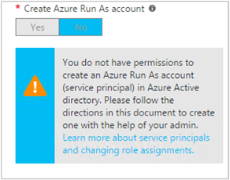

<properties
   pageTitle="Configure Azure AD User Account | Microsoft Azure"
   description="This article describes how to configure Azure AD User account credential for runbooks in Azure Automation to authenticate against ARM and ASM."
   services="automation"
   documentationCenter=""
   authors="MGoedtel"
   manager="jwhit"
   editor="tysonn"
   keywords="azure active directory user, azure service management, azure ad user account" />
<tags
   ms.service="automation"
   ms.devlang="na"
   ms.topic="get-started-article"
   ms.tgt_pltfrm="na"
   ms.workload="infrastructure-services"
   ms.date="05/10/2016"
   ms.author="magoedte" />

# Authenticate Runbooks with Azure Service Management and Resource Manager

This article describes the steps you must perform to configure an Azure AD User account for Azure Automation runbooks running against Azure Service Management (ASM) or Azure Resource Manager (ARM) resources.  While this continues to be a supported authentication identity for your ARM based runbooks, the recommended method is using the new Azure Run As account.       

## Create a new Azure Active Directory user

1. Log in to the Azure Classic Portal as a service administrator for the Azure subscription you want to manage.
2. Select **Active Directory**, and then select the name of your organization directory.
3. Select the **Users** tab, and then, in the command area, select **Add User**.
4. On the **Tell us about this user** page, under **Type of user**, select **New user in your organization**.
5. Enter a user name.  
6. Select the directory name that is associated with your Azure subscription on the Active Directory page.
7. On the **user profile** page, provide a first and last name, a user-friendly name, and User from the **Roles** list.  Do not **Enable Multi-Factor Authentication**.
8. Note the user’s full name and temporary password.
9. Select **Settings > Administrators > Add**.
10. Type the full user name of the user that you created.
11. Select the subscription that you want the user to manage.
12. Log out of Azure and then log back in with the account you just created. You will be prompted to change the user’s password.

## Create an Automation account in Azure Classic Portal
In this section, you will perform the following steps to create a new Azure Automation account in the Azure Portal that will be used with your runbooks managing resources in ASM and ARM mode.  

>[AZURE.NOTE] Automation accounts created with the Azure Classic Portal can be managed by both the Azure Classic and Azure Portal and either set of cmdlets. Once the account is created, it makes no difference how you create and manage resources within the account. If you are planning to continue to use the Azure Classic Portal, then you should use it instead of the Azure Portal to create any Automation accounts.

1. Log in to the Azure Classic Portal as a service administrator for the Azure subscription you want to manage.
2. Select **Automation**.
3. On the **Automation** page, select **Create an Automation Account**.
4. In the **Create an Automation Account** box, type in a name for your new Automation account and select a **Region** from the drop-down list.  
5. Click **OK** to accept your settings and create the account.
6. After it is created it will be listed on the **Automation** page.
7. Click on the account and it will bring you to the Dashboard page.  
8. On the Automation Dashboard page, select **Assets**.
9. On the **Assets** page, select **Add Settings** located at the bottom of the page.
10. On the **Add Settings** page, select **Add Credential**.
11. On the **Define Credential** page, select **Windows PowerShell Credential** from the **Credential Type** drop-down list and provide a name for the credential.
12. On the following **Define Credential** page type in the username of the AD user account created earlier in the **User Name** field and the password in the **Password** and **Confirm Password** fields. Click **OK** to save your changes.

## Create an Automation account in the Azure Portal

In this section, you will perform the following steps to create a new Azure Automation account in the Azure Portal that will be used with your runbooks managing resources in ARM mode.  

1. Log in to the Azure portal as a service administrator for the Azure subscription you want to manage.
2. Select **Automation Accounts**.
3. In the Automation Accounts blade, click **Add**. 
2. In the **Add Automation Account** blade, in the **Name** box type in a name for your new Automation account.
5. If you have more than one subscription, specify the one for the new account, as well as a new or existing **Resource group** and an Azure datacenter **Location**.
3. Select the value **No** for the **Create Azure Run As account** option, and click the **Create** button.  

    >[AZURE.NOTE] If you choose to not create the Run As account by selecting the option **No**, you will be presented with a warning message in the **Add Automation Account** blade.  While the account is created and assigned to the **Contributor** role in the subscription, it will not have a corresponding authentication identity within your subscriptions directory service and therefore, no access resources in your subscription.  This will prevent any runbooks referencing this account from being able to authenticate and perform tasks against ARM resources.

    

4. While Azure creates the Automation account, you can track the progress under **Notifications** from the menu.

When the creation of the credential is completed, you will then need to create a Credential Asset to associate the Automation Account with the AD User account created earlier.  Remember, we only created the Automation account and it is not associated with an authentication identity.  Perform the steps outlined in the [Credential assets in Azure Automation article](../automation/automation-credentials.md#creating-a-new-credential) and enter the value for **username** in the format **domain\user**.

## Use the credential in a runbook

You can retrieve the credential in a runbook using the [Get-AutomationPSCredential](http://msdn.microsoft.com/library/dn940015.aspx) activity and then use it with [Add-AzureAccount](http://msdn.microsoft.com/library/azure/dn722528.aspx) to connect to your Azure subscription. If the credential is an administrator of multiple Azure subscriptions, then you should also use [Select-AzureSubscription](http://msdn.microsoft.com/library/dn495203.aspx) to specify the correct one. This is shown in the sample Windows PowerShell below that will typically appear at the top of most Azure Automation runbooks.

    $cred = Get-AutomationPSCredential –Name "myuseraccount.onmicrosoft.com"
	Add-AzureAccount –Credential $cred
	Select-AzureSubscription –SubscriptionName "My Subscription"

You should repeat these lines after any [checkpoints](http://technet.microsoft.com/library/dn469257.aspx#bk_Checkpoints) in your runbook. If the runbook is suspended and then resumes on another worker, then it will need to perform the authentication again.

## Next Steps
* Review the different runbook types and steps for creating your own runbooks from the following article [Azure Automation runbook types](../automation/automation-runbook-types.md)
