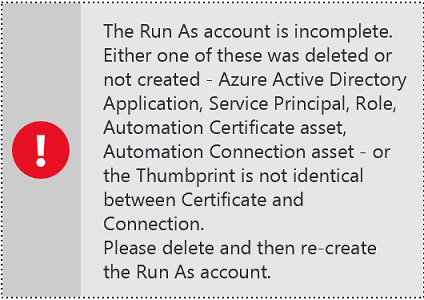

---
title: Configure an Azure Run As Account | Microsoft Docs
description: This tutorial walks you through the creation, testing, and example use of security-principal authentication in Azure Automation.
services: automation
documentationcenter: ''
author: mgoedtel
manager: carmonm
editor: ''
keywords: service principal name, setspn, azure authentication

ms.assetid: 2f783441-15c7-4ea0-ba27-d7daa39b1dd3
ms.service: automation
ms.workload: tbd
ms.tgt_pltfrm: na
ms.devlang: na
ms.topic: get-started-article
ms.date: 04/06/2017
ms.author: magoedte

ROBOTS: NOINDEX
redirect_url: /azure/automation/automation-offering-get-started
redirect_document_id: TRUE 

---

# Authenticate runbooks with an Azure Run As account
This article shows you how to configure an Azure Automation account in the Azure portal. To do so, you use the Run As account feature to authenticate runbooks managing resources in either Azure Resource Manager or Azure Service Management.

When you create an Automation account in the Azure portal, you automatically create two accounts:

* A Run As account. This account creates a service principal in Azure Active Directory (Azure AD) and a certificate. It also assigns the Contributor role-based access control (RBAC), which manages Resource Manager resources by using runbooks.
* A Classic Run As account. This account uploads a management certificate, which is used to manage Service Management or classic resources by using runbooks.

Creating an Automation account simplifies the process for you and helps you quickly start building and deploying runbooks to support your automation needs.

With Run As and Classic Run As accounts, you can:

* Provide a standardized way to authenticate with Azure when you manage Resource Manager or Service Management resources from runbooks in the Azure portal.
* Automate the use of global runbooks, which you can configure in Azure Alerts.

> [!NOTE]
> The [Azure Alert integration feature](../monitoring-and-diagnostics/insights-receive-alert-notifications.md) with Automation global runbooks requires an Automation account that's configured with a Run As account and a Classic Run As account. You can select an Automation account that already has defined Run As and Classic Run As accounts, or you can choose to create a new Automation account.
>  

This article shows how to create an Automation account from the Azure portal, update an Automation account by using Azure PowerShell, manage the account configuration, and authenticate in your runbooks.

Before you begin creating an Automation account, it's a good idea to understand and consider the following:

* Creating an Automation account does not affect Automation accounts you might have already created in either the classic or Resource Manager deployment model.
* The process works only for Automation accounts that you create in the Azure portal. Attempting to create an account from the Azure classic portal does not replicate the Run As account configuration.
* If you already have runbooks and assets (such as schedules or variables) in place to manage classic resources, and you want runbooks to authenticate with the new Classic Run As account, do either of the following:

  * To create a Classic Run As account, follow the instructions in the "Managing your Run As account" section. 
  * To update your existing account, use the PowerShell script in the "Update your Automation account by using PowerShell" section.
* To authenticate by using the new Run As account and Classic Run As Automation account, you  need to modify your existing runbooks with the example code provided in the section [Authentication code examples](#authentication-code-examples).

    >[!NOTE]
    >The Run As account is for authentication against Resource Manager resources using the certificate-based service principal. The Classic Run As account is for authenticating against Service Management resources with a management certificate.

## Create an Automation account from the Azure portal
In this section, you create an Azure Automation account from the Azure portal, which in turn creates both a Run As account and a Classic Run As account.

>[!NOTE]
>To create an Automation account, you must be a member of the Service Admins role or co-administrator of the subscription that is granting access to the subscription. You must also be added as a user to that subscription's default Active Directory instance. The account does not need to be assigned a privileged role.
>
>If you are not a member of the subscription’s Active Directory instance before you are added to the co-administrator role of the subscription, you will be added to Active Directory as a guest. In this instance, you will receive a “You do not have permissions to create…” warning on the **Add Automation Account** blade.
>
>Users who were added to the co-administrator role first can be removed from the subscription's Active Directory instance and re-added to make them a full User in Active Directory. To verify this situation from the **Azure Active Directory** pane in the Azure portal by selecting **Users and groups**, selecting **All users** and, after you select the specific user, selecting **Profile**. The value of the **User type** attribute under the users profile should not equal **Guest**.
>

1. Sign in to the Azure portal with an account that is a member of the subscription administrators role and co-administrator of the subscription.

2. Select **Automation Accounts**.

3. On the **Automation Accounts** blade, click **Add**.
The **Add Automation Account** blade opens.

 

   > [!NOTE]
   > If your account is not a member of the subscription administrators role and co-administrator of the subscription, the following warning is displayed on the **Add Automation Account** blade:
   >
   >
   >
   >

4. On the **Add Automation Account** blade, in the **Name** box, type a name for your new Automation account.

5. If you have more than one subscription, do the following:

    a. Under **Subscription**, specify one for the new account.

    b. Under **Resource Group**, click **Create new** or **Use existing**.

    c. Under **Location**, specify an Azure datacenter.

6. Under **Create Azure Run As account**, select **Yes**, and then click **Create**.

   > [!NOTE]
   > If you choose not to create the Run As account by selecting **No**, a warning message is displayed the **Add Automation Account** blade. Although the account is created in the Azure portal, it does not have a corresponding authentication identity within your classic or Resource Manager subscription directory service. Consequently, the account has no access to resources in your subscription. This scenario prevents any runbooks that reference this account from authenticating and performing tasks against resources in those deployment models.
   >
   > 
   >
   > Additionally, because the service principal is not created, the Contributor role is not assigned.
   >

7. While Azure creates the Automation account, you can track the progress under **Notifications** from the menu.

### Resources
When the Automation account is successfully created, several resources are automatically created for you. The resources are summarized in the following two tables:

#### Run As account resources

| Resource | Description |
| --- | --- |
| AzureAutomationTutorial Runbook | An example graphical runbook that demonstrates how to authenticate by using the Run As account and gets all the Resource Manager resources. |
| AzureAutomationTutorialScript Runbook | An example PowerShell runbook that demonstrates how to authenticate by using the Run As account and gets all the Resource Manager resources. |
| AzureRunAsCertificate | The certificate asset that's automatically created when you create an Automation account or use the following PowerShell script for an existing account. The certificate allows you to authenticate with Azure so that you can manage Azure Resource Manager resources from runbooks. The certificate has a one-year lifespan. |
| AzureRunAsConnection | The connection asset that's automatically created when you create an Automation account or use the PowerShell script for an existing account. |

#### Classic Run As account resources

| Resource | Description |
| --- | --- |
| AzureClassicAutomationTutorial Runbook | An example graphical runbook that gets all the VMs that are created using the classic deployment model in a subscription by using the Classic Run As account (certificate), and then writes the VM name and status. |
| AzureClassicAutomationTutorial Script Runbook | An example PowerShell runbook that gets all the classic VMs in a subscription by using the Classic Run As account (certificate), and then writes the VM name and status. |
| AzureClassicRunAsCertificate | The automatically created certificate asset that you use to authenticate with Azure so that you can manage Azure classic resources from runbooks. The certificate has a one-year lifespan. |
| AzureClassicRunAsConnection | The automatically created connection asset that you use to authenticate with Azure so that you can manage Azure classic resources from runbooks. |

## Verify Run As authentication
Perform a small test to confirm that you can successfully authenticate by using the new Run As account.

1. In the Azure portal, open the Automation account that you created earlier.

2. Click the **Runbooks** tile to open the list of runbooks.

3. Select the **AzureAutomationTutorialScript** runbook, and then click **Start** to start the runbook. The following events occur:
 * A [runbook job](automation-runbook-execution.md) is created, the **Job** blade is displayed, and the job status is displayed in the **Job Summary** tile.
 * The job status begins as **Queued**, indicating that it is waiting for a runbook worker in the cloud to become available.
 * The status becomes **Starting** when a worker claims the job.
 * The status becomes **Running** when the runbook starts running.
 * When the runbook job has finished running, you should see a status of **Completed**.

       
4. To see the detailed results of the runbook, click the **Output** tile.  
The **Output** blade is displayed, showing that the runbook has successfully authenticated and returned a list of all resources available in the resource group.

5. Close the **Output** blade to return to the **Job Summary** blade.

6. Close the **Job Summary** blade and the corresponding **AzureAutomationTutorialScript** runbook blade.

## Verify Classic Run As authentication
Perform a similar small test to confirm that you can successfully authenticate by using the new Classic Run As account.

1. In the Azure portal, open the Automation account that you created earlier.

2. Click the **Runbooks** tile to open the list of runbooks.

3. Select the **AzureClassicAutomationTutorialScript** runbook, and then click **Start** to  start the runbook. The following events occur:

 * A [runbook job](automation-runbook-execution.md) is created, the **Job** blade is displayed, and the job status is displayed in the **Job Summary** tile.
 * The job status begins as **Queued**, indicating that it is waiting for a runbook worker in the cloud to become available.
 * The status becomes **Starting** when a worker claims the job.
 * The status becomes **Running** when the runbook starts running.
 * When the runbook job has finished running, you should see a status of **Completed**.

     
4. To see the detailed results of the runbook, click the **Output** tile.  
The **Output** blade is displayed, showing that the runbook has successfully authenticated and returned a list of all classic VMs in the subscription.

5. Close the **Output** blade to return to the **Job Summary** blade.

6. Close the **Job Summary** blade and the corresponding **AzureAutomationTutorialScript** runbook blade.

## Managing your Run As account
At some point before your Automation account expires, you will need to renew the certificate. If you believe that the Run As account has been compromised, you can delete and re-create it. This section discusses how to perform these operations.

### Self-signed certificate renewal
The self-signed certificate that you created for the Run As account expires one year from the date of creation. You can renew it at any time before it expires. When you renew it, the current valid certificate is retained to ensure that any runbooks that are queued up or actively running, and that authenticate with the Run As account, are not negatively affected. The certificate remains valid until its expiration date.

> [!NOTE]
> If you have configured your Automation Run As account to use a certificate issued by your enterprise certificate authority and you use this option, the enterprise certificate will be replaced by a self-signed certificate.

To renew the certificate, do the following:

1. In the Azure portal, open the Automation account.

2. On the **Automation Account** blade, in the **Account properties** pane, under **Account Settings**, select **Run As Accounts**.

    
3. On the **Run As Accounts** properties blade, select either the Run As account or the Classic Run As account that you want to renew the certificate for.

4. On the **Properties** blade for the selected account, click **Renew certificate**.

    

5. While the certificate is being renewed, you can track the progress under **Notifications** from the menu.

### Delete a Run As or Classic Run As account
This section describes how to delete and re-create a Run As or Classic Run As account. When you perform this action, the Automation account is retained. After you delete a Run As or Classic Run As account, you can re-create it in the Azure portal.

1. In the Azure portal, open the Automation account.

2. On the **Automation account** blade, in the account properties pane, select **Run As Accounts**.

3. On the **Run As Accounts** properties blade, select either the Run As account or Classic Run As account that you want to delete. Then, on the **Properties** blade for the selected account, click **Delete**.

 

4. While the account is being deleted, you can track the progress under **Notifications** from the menu.

5. After the account has been deleted, you can re-create it on the **Run As Accounts** properties blade by selecting the create option **Azure Run As Account**.

 

### Misconfiguration
Some configuration items necessary for the Run As or Classic Run As account to function properly might have been deleted or created improperly during initial setup. The items include:

* Certificate asset
* Connection asset
* Run As account has been removed from the contributor role
* Service principal or application in Azure AD

In the preceding and other instances of misconfiguration, the Automation account detects the changes and displays a status of *Incomplete* on the **Run As Accounts** properties blade for the account.

When you select the Run As account, the account **Properties** pane displays the following error message:

.

You can quickly resolve these Run As account issues by deleting and re-creating the account.

## Update your Automation account by using PowerShell
You can use PowerShell to update your existing Automation account if:

* You create an Automation account but decline to create the Run As account.
* You already use an Automation account to manage Resource Manager resources and you want to update the account to include the Run As account for runbook authentication.
* You already use an Automation account to manage classic resources and you want to update it to use the Classic Run As account instead of creating a new account and migrating your runbooks and assets to it.   
* You want to create a Run As and a Classic Run As account by using a certificate issued by your enterprise certification authority (CA).

The script has the following prerequisites:

* The script can be run only on Windows 10 and Windows Server 2016 with Azure Resource Manager modules 2.01 and later. It is not supported on earlier versions of Windows.
* Azure PowerShell 1.0 and later. For information about the PowerShell 1.0 release, see [How to install and configure Azure PowerShell](/powershell/azure/overview).
* An Automation account, which is referenced as the value for the *–AutomationAccountName* and *-ApplicationDisplayName* parameters in the following PowerShell script.

To get the values for *SubscriptionID*, *ResourceGroup*, and *AutomationAccountName*, which are required parameters for the scripts, do the following:
1. In the Azure portal, select your Automation account on the **Automation account** blade, and then select **All settings**. 
2. On the **All settings** blade, under **Account Settings**, select **Properties**. 
3. Note the values on the **Properties** blade.

  

### Create a Run As account PowerShell script
This PowerShell script includes support for the following configurations:

* Create a Run As account by using a self-signed certificate.
* Create a Run As account and a Classic Run As account by using a self-signed certificate.
* Create a Run As account and a Classic Run As account by using an enterprise certificate.
* Create a Run As account and a Classic Run As account by using a self-signed certificate in the Azure Government cloud.

Depending on the configuration option you select, the script creates the following items.

**For Run As accounts:**

* Creates an Azure AD application to be exported with either the self-signed or enterprise certificate public key, creates a service principal account for the application in Azure AD, and assigns the Contributor role for the account in your current subscription. You can change this setting to Owner or any other role. For more information, see [Role-based access control in Azure Automation](automation-role-based-access-control.md).
* Creates an Automation certificate asset named *AzureRunAsCertificate* in the specified Automation account. The certificate asset holds the certificate private key that's used by the Azure AD application.
* Creates an Automation connection asset named *AzureRunAsConnection* in the specified Automation account. The connection asset holds the applicationId, tenantId, subscriptionId, and certificate thumbprint.

**For Classic Run As accounts:**

* Creates an Automation certificate asset named *AzureClassicRunAsCertificate* in the specified Automation account. The certificate asset holds the certificate private key used by the management certificate.
* Creates an Automation connection asset named *AzureClassicRunAsConnection* in the specified Automation account. The connection asset holds the subscription name, subscriptionId, and certificate asset name.

>[!NOTE]
> If you select either option for creating a Classic Run As account, after the script is executed, upload the public certificate (.cer file name extension) to the management store for the subscription that the Automation account was created in.
> 

To execute the script and upload the certificate, do the following:

1. Save the following script on your computer. In this example, save it with the filename *New-RunAsAccount.ps1*.

        #Requires -RunAsAdministrator
         Param (
        [Parameter(Mandatory=$true)]
        [String] $ResourceGroup,

        [Parameter(Mandatory=$true)]
        [String] $AutomationAccountName,

        [Parameter(Mandatory=$true)]
        [String] $ApplicationDisplayName,

        [Parameter(Mandatory=$true)]
        [String] $SubscriptionId,

        [Parameter(Mandatory=$true)]
        [Boolean] $CreateClassicRunAsAccount,

        [Parameter(Mandatory=$true)]
        [String] $SelfSignedCertPlainPassword,

        [Parameter(Mandatory=$false)]
        [String] $EnterpriseCertPathForRunAsAccount,

        [Parameter(Mandatory=$false)]
        [String] $EnterpriseCertPlainPasswordForRunAsAccount,

        [Parameter(Mandatory=$false)]
        [String] $EnterpriseCertPathForClassicRunAsAccount,

        [Parameter(Mandatory=$false)]
        [String] $EnterpriseCertPlainPasswordForClassicRunAsAccount,

        [Parameter(Mandatory=$false)]
        [ValidateSet("AzureCloud","AzureUSGovernment")]
        [string]$EnvironmentName="AzureCloud",

        [Parameter(Mandatory=$false)]
        [int] $SelfSignedCertNoOfMonthsUntilExpired = 12
        )

        function CreateSelfSignedCertificate([string] $keyVaultName, [string] $certificateName, [string] $selfSignedCertPlainPassword,
                                      [string] $certPath, [string] $certPathCer, [string] $selfSignedCertNoOfMonthsUntilExpired ) {
        $Cert = New-SelfSignedCertificate -DnsName $certificateName -CertStoreLocation cert:\LocalMachine\My `
           -KeyExportPolicy Exportable -Provider "Microsoft Enhanced RSA and AES Cryptographic Provider" `
           -NotAfter (Get-Date).AddMonths($selfSignedCertNoOfMonthsUntilExpired)

        $CertPassword = ConvertTo-SecureString $selfSignedCertPlainPassword -AsPlainText -Force
        Export-PfxCertificate -Cert ("Cert:\localmachine\my\" + $Cert.Thumbprint) -FilePath $certPath -Password $CertPassword -Force | Write-Verbose
        Export-Certificate -Cert ("Cert:\localmachine\my\" + $Cert.Thumbprint) -FilePath $certPathCer -Type CERT | Write-Verbose
        }

        function CreateServicePrincipal([System.Security.Cryptography.X509Certificates.X509Certificate2] $PfxCert, [string] $applicationDisplayName) {  
        $CurrentDate = Get-Date
        $keyValue = [System.Convert]::ToBase64String($PfxCert.GetRawCertData())
        $KeyId = (New-Guid).Guid

        $KeyCredential = New-Object  Microsoft.Azure.Commands.Resources.Models.ActiveDirectory.PSADKeyCredential
        $KeyCredential.StartDate = $CurrentDate
        $KeyCredential.EndDate= [DateTime]$PfxCert.GetExpirationDateString()
        $KeyCredential.EndDate = $KeyCredential.EndDate.AddDays(-1)
        $KeyCredential.KeyId = $KeyId
        $KeyCredential.CertValue  = $keyValue

        # Use key credentials and create an Azure AD application
        $Application = New-AzureRmADApplication -DisplayName $ApplicationDisplayName -HomePage ("http://" + $applicationDisplayName) -IdentifierUris ("http://" + $KeyId) -KeyCredentials $KeyCredential
        $ServicePrincipal = New-AzureRMADServicePrincipal -ApplicationId $Application.ApplicationId
        $GetServicePrincipal = Get-AzureRmADServicePrincipal -ObjectId $ServicePrincipal.Id

        # Sleep here for a few seconds to allow the service principal application to become active (ordinarily takes a few seconds)
        Sleep -s 15
        $NewRole = New-AzureRMRoleAssignment -RoleDefinitionName Contributor -ServicePrincipalName $Application.ApplicationId -ErrorAction SilentlyContinue
        $Retries = 0;
        While ($NewRole -eq $null -and $Retries -le 6)
        {
           Sleep -s 10
           New-AzureRMRoleAssignment -RoleDefinitionName Contributor -ServicePrincipalName $Application.ApplicationId | Write-Verbose -ErrorAction SilentlyContinue
           $NewRole = Get-AzureRMRoleAssignment -ServicePrincipalName $Application.ApplicationId -ErrorAction SilentlyContinue
           $Retries++;
        }
           return $Application.ApplicationId.ToString();
        }

        function CreateAutomationCertificateAsset ([string] $resourceGroup, [string] $automationAccountName, [string] $certifcateAssetName,[string] $certPath, [string] $certPlainPassword, [Boolean] $Exportable) {
        $CertPassword = ConvertTo-SecureString $certPlainPassword -AsPlainText -Force   
        Remove-AzureRmAutomationCertificate -ResourceGroupName $resourceGroup -AutomationAccountName $automationAccountName -Name $certifcateAssetName -ErrorAction SilentlyContinue
        New-AzureRmAutomationCertificate -ResourceGroupName $resourceGroup -AutomationAccountName $automationAccountName -Path $certPath -Name $certifcateAssetName -Password $CertPassword -Exportable:$Exportable  | write-verbose
        }

        function CreateAutomationConnectionAsset ([string] $resourceGroup, [string] $automationAccountName, [string] $connectionAssetName, [string] $connectionTypeName, [System.Collections.Hashtable] $connectionFieldValues ) {
        Remove-AzureRmAutomationConnection -ResourceGroupName $resourceGroup -AutomationAccountName $automationAccountName -Name $connectionAssetName -Force -ErrorAction SilentlyContinue
        New-AzureRmAutomationConnection -ResourceGroupName $ResourceGroup -AutomationAccountName $automationAccountName -Name $connectionAssetName -ConnectionTypeName $connectionTypeName -ConnectionFieldValues $connectionFieldValues
        }

        Import-Module AzureRM.Profile
        Import-Module AzureRM.Resources

        $AzureRMProfileVersion= (Get-Module AzureRM.Profile).Version
        if (!(($AzureRMProfileVersion.Major -ge 2 -and $AzureRMProfileVersion.Minor -ge 1) -or ($AzureRMProfileVersion.Major -gt 2)))
        {
           Write-Error -Message "Please install the latest Azure PowerShell and retry. Relevant doc url : https://docs.microsoft.com/powershell/azureps-cmdlets-docs/ "
           return
        }

        Login-AzureRmAccount -EnvironmentName $EnvironmentName
        $Subscription = Select-AzureRmSubscription -SubscriptionId $SubscriptionId

        # Create a Run As account by using a service principal
        $CertifcateAssetName = "AzureRunAsCertificate"
        $ConnectionAssetName = "AzureRunAsConnection"
        $ConnectionTypeName = "AzureServicePrincipal"

        if ($EnterpriseCertPathForRunAsAccount -and $EnterpriseCertPlainPasswordForRunAsAccount) {
        $PfxCertPathForRunAsAccount = $EnterpriseCertPathForRunAsAccount
        $PfxCertPlainPasswordForRunAsAccount = $EnterpriseCertPlainPasswordForRunAsAccount
        } else {
          $CertificateName = $AutomationAccountName+$CertifcateAssetName
          $PfxCertPathForRunAsAccount = Join-Path $env:TEMP ($CertificateName + ".pfx")
          $PfxCertPlainPasswordForRunAsAccount = $SelfSignedCertPlainPassword
          $CerCertPathForRunAsAccount = Join-Path $env:TEMP ($CertificateName + ".cer")
          CreateSelfSignedCertificate $KeyVaultName $CertificateName $PfxCertPlainPasswordForRunAsAccount $PfxCertPathForRunAsAccount $CerCertPathForRunAsAccount $SelfSignedCertNoOfMonthsUntilExpired
        }

        # Create a service principal
        $PfxCert = New-Object -TypeName System.Security.Cryptography.X509Certificates.X509Certificate2 -ArgumentList @($PfxCertPathForRunAsAccount, $PfxCertPlainPasswordForRunAsAccount)
        $ApplicationId=CreateServicePrincipal $PfxCert $ApplicationDisplayName

        # Create the Automation certificate asset
        CreateAutomationCertificateAsset $ResourceGroup $AutomationAccountName $CertifcateAssetName $PfxCertPathForRunAsAccount $PfxCertPlainPasswordForRunAsAccount $true

        # Populate the ConnectionFieldValues
        $SubscriptionInfo = Get-AzureRmSubscription -SubscriptionId $SubscriptionId
        $TenantID = $SubscriptionInfo | Select TenantId -First 1
        $Thumbprint = $PfxCert.Thumbprint
        $ConnectionFieldValues = @{"ApplicationId" = $ApplicationId; "TenantId" = $TenantID.TenantId; "CertificateThumbprint" = $Thumbprint; "SubscriptionId" = $SubscriptionId}

        # Create an Automation connection asset named AzureRunAsConnection in the Automation account. This connection uses the service principal.
        CreateAutomationConnectionAsset $ResourceGroup $AutomationAccountName $ConnectionAssetName $ConnectionTypeName $ConnectionFieldValues

        if ($CreateClassicRunAsAccount) {
            # Create a Run As account by using a service principal
            $ClassicRunAsAccountCertifcateAssetName = "AzureClassicRunAsCertificate"
            $ClassicRunAsAccountConnectionAssetName = "AzureClassicRunAsConnection"
            $ClassicRunAsAccountConnectionTypeName = "AzureClassicCertificate "
            $UploadMessage = "Please upload the .cer format of #CERT# to the Management store by following the steps below." + [Environment]::NewLine +
                    "Log in to the Microsoft Azure Management portal (https://manage.windowsazure.com) and select Settings -> Management Certificates." + [Environment]::NewLine +
                    "Then click Upload and upload the .cer format of #CERT#"

             if ($EnterpriseCertPathForClassicRunAsAccount -and $EnterpriseCertPlainPasswordForClassicRunAsAccount ) {
             $PfxCertPathForClassicRunAsAccount = $EnterpriseCertPathForClassicRunAsAccount
             $PfxCertPlainPasswordForClassicRunAsAccount = $EnterpriseCertPlainPasswordForClassicRunAsAccount
             $UploadMessage = $UploadMessage.Replace("#CERT#", $PfxCertPathForClassicRunAsAccount)
        } else {
             $ClassicRunAsAccountCertificateName = $AutomationAccountName+$ClassicRunAsAccountCertifcateAssetName
             $PfxCertPathForClassicRunAsAccount = Join-Path $env:TEMP ($ClassicRunAsAccountCertificateName + ".pfx")
             $PfxCertPlainPasswordForClassicRunAsAccount = $SelfSignedCertPlainPassword
             $CerCertPathForClassicRunAsAccount = Join-Path $env:TEMP ($ClassicRunAsAccountCertificateName + ".cer")
             $UploadMessage = $UploadMessage.Replace("#CERT#", $CerCertPathForClassicRunAsAccount)
             CreateSelfSignedCertificate $KeyVaultName $ClassicRunAsAccountCertificateName $PfxCertPlainPasswordForClassicRunAsAccount $PfxCertPathForClassicRunAsAccount $CerCertPathForClassicRunAsAccount $SelfSignedCertNoOfMonthsUntilExpired
        }

        # Create the Automation certificate asset
        CreateAutomationCertificateAsset $ResourceGroup $AutomationAccountName $ClassicRunAsAccountCertifcateAssetName $PfxCertPathForClassicRunAsAccount $PfxCertPlainPasswordForClassicRunAsAccount $false

        # Populate the ConnectionFieldValues
        $SubscriptionName = $subscription.Subscription.SubscriptionName
        $ClassicRunAsAccountConnectionFieldValues = @{"SubscriptionName" = $SubscriptionName; "SubscriptionId" = $SubscriptionId; "CertificateAssetName" = $ClassicRunAsAccountCertifcateAssetName}

        # Create an Automation connection asset named AzureRunAsConnection in the Automation account. This connection uses the service principal.
        CreateAutomationConnectionAsset $ResourceGroup $AutomationAccountName $ClassicRunAsAccountConnectionAssetName $ClassicRunAsAccountConnectionTypeName $ClassicRunAsAccountConnectionFieldValues

        Write-Host -ForegroundColor red $UploadMessage
        }

2. On your computer, click **Start**, and then start **Windows PowerShell** with elevated user rights.

3. From the elevated PowerShell command-line shell, go to the folder that contains the script you created in step 1.

4. Execute the script by using the parameter values for the configuration you require.

    **Create a Run As account by using a self-signed certificate**  
    `.\New-RunAsAccount.ps1 -ResourceGroup <ResourceGroupName> -AutomationAccountName <NameofAutomationAccount> -SubscriptionId <SubscriptionId> -ApplicationDisplayName <DisplayNameofAADApplication> -SelfSignedCertPlainPassword <StrongPassword> -CreateClassicRunAsAccount $false`

    **Create a Run As account and a Classic Run As account by using a self-signed certificate**  
    `.\New-RunAsAccount.ps1 -ResourceGroup <ResourceGroupName> -AutomationAccountName <NameofAutomationAccount> -SubscriptionId <SubscriptionId> -ApplicationDisplayName <DisplayNameofAADApplication> -SelfSignedCertPlainPassword <StrongPassword> -CreateClassicRunAsAccount $true`

    **Create a Run As account and a Classic Run As account by using an enterprise certificate**  
    `.\New-RunAsAccount.ps1 -ResourceGroup <ResourceGroupName> -AutomationAccountName <NameofAutomationAccount> -SubscriptionId <SubscriptionId> -ApplicationDisplayName <DisplayNameofAADApplication>  -SelfSignedCertPlainPassword <StrongPassword> -CreateClassicRunAsAccount $true -EnterpriseCertPathForRunAsAccount <EnterpriseCertPfxPathForRunAsAccount> -EnterpriseCertPlainPasswordForRunAsAccount <StrongPassword> -EnterpriseCertPathForClassicRunAsAccount <EnterpriseCertPfxPathForClassicRunAsAccount> -EnterpriseCertPlainPasswordForClassicRunAsAccount <StrongPassword>`

    **Create a Run As account and a Classic Run As account by using a self-signed certificate in the Azure Government cloud**  
    `.\New-RunAsAccount.ps1 -ResourceGroup <ResourceGroupName> -AutomationAccountName <NameofAutomationAccount> -SubscriptionId <SubscriptionId> -ApplicationDisplayName <DisplayNameofAADApplication> -SelfSignedCertPlainPassword <StrongPassword> -CreateClassicRunAsAccount $true  -EnvironmentName AzureUSGovernment`

    > [!NOTE]
    > After the script has executed, you will be prompted to authenticate with Azure. Sign in with an account that is a member of the subscription administrators role and co-administrator of the subscription.
    >
    >

After the script has executed successfully, note the following:
* If you created a Classic Run As account with a self-signed public certificate (.cer file), the script creates and saves it to the temporary files folder on your computer under the user profile *%USERPROFILE%\AppData\Local\Temp*, which you used to execute the PowerShell session.
* If you created a Classic Run As account with an enterprise public certificate (.cer file), use this certificate. Follow the instructions for [uploading a management API certificate to the Azure classic portal](../azure-api-management-certs.md), and then validate the credential configuration with Service Management resources by using the [sample code to authenticate with Service Management Resources](#sample-code-to-authenticate-with-service-management-resources). 
* If you did *not* create a Classic Run As account, authenticate with Resource Manager resources and validate the credential configuration by using the [sample code for authenticating with Service Management resources](#sample-code-to-authenticate-with-resource-manager-resources).

## Sample code to authenticate with Resource Manager resources
You can use the following updated sample code, taken from the *AzureAutomationTutorialScript* example runbook, to authenticate by using the Run As account to manage Resource Manager resources with your runbooks.

    $connectionName = "AzureRunAsConnection"
    $SubId = Get-AutomationVariable -Name 'SubscriptionId'
    try
    {
       # Get the connection "AzureRunAsConnection "
       $servicePrincipalConnection=Get-AutomationConnection -Name $connectionName         

       "Signing in to Azure..."
       Add-AzureRmAccount `
         -ServicePrincipal `
         -TenantId $servicePrincipalConnection.TenantId `
         -ApplicationId $servicePrincipalConnection.ApplicationId `
         -CertificateThumbprint $servicePrincipalConnection.CertificateThumbprint
       "Setting context to a specific subscription"     
       Set-AzureRmContext -SubscriptionId $SubId              
    }
    catch {
        if (!$servicePrincipalConnection)
        {
           $ErrorMessage = "Connection $connectionName not found."
           throw $ErrorMessage
         } else{
            Write-Error -Message $_.Exception
            throw $_.Exception
         }
    }

To help you to easily work between multiple subscriptions, the script includes two additional lines of code that support referencing a subscription context. A variable asset named *SubscriptionId* contains the ID of the subscription. After the `Add-AzureRmAccount` cmdlet statement, the [`Set-AzureRmContext`](/powershell/module/azurerm.profile/set-azurermcontext) cmdlet is stated with the parameter set *-SubscriptionId*. If the variable name is too generic, you can revise it to include a prefix or use another naming convention to make it easier to identify. Alternatively, you can use the parameter set *-SubscriptionName* instead of *-SubscriptionId* with a corresponding variable asset.

The cmdlet that you use for authenticating in the runbook, `Add-AzureRmAccount`, uses the *ServicePrincipalCertificate* parameter set. It authenticates by using the service principal certificate, not the user credentials.

## Sample code to authenticate with Service Management resources
You can use the following updated sample code, which is taken from the *AzureClassicAutomationTutorialScript* example runbook, to authenticate by using the Classic Run As account to manage classic resources with your runbooks.

    $ConnectionAssetName = "AzureClassicRunAsConnection"
    # Get the connection
    $connection = Get-AutomationConnection -Name $connectionAssetName        

    # Authenticate to Azure with certificate
    Write-Verbose "Get connection asset: $ConnectionAssetName" -Verbose
    $Conn = Get-AutomationConnection -Name $ConnectionAssetName
    if ($Conn -eq $null)
    {
       throw "Could not retrieve connection asset: $ConnectionAssetName. Assure that this asset exists in the Automation account."
    }

    $CertificateAssetName = $Conn.CertificateAssetName
    Write-Verbose "Getting the certificate: $CertificateAssetName" -Verbose
    $AzureCert = Get-AutomationCertificate -Name $CertificateAssetName
    if ($AzureCert -eq $null)
    {
       throw "Could not retrieve certificate asset: $CertificateAssetName. Assure that this asset exists in the Automation account."
    }

    Write-Verbose "Authenticating to Azure with certificate." -Verbose
    Set-AzureSubscription -SubscriptionName $Conn.SubscriptionName -SubscriptionId $Conn.SubscriptionID -Certificate $AzureCert
    Select-AzureSubscription -SubscriptionId $Conn.SubscriptionID

## Next steps
* [Application and service principal objects in Azure AD](../active-directory/active-directory-application-objects.md)
* [Role-based access control in Azure Automation](automation-role-based-access-control.md)
* [Certificates overview for Azure Cloud Services](../cloud-services/cloud-services-certs-create.md)
