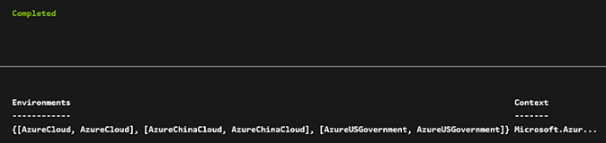

<properties
    pageTitle="Configure Azure Run As Account | Microsoft Azure"
    description="Tutorial that walks you through the creation, testing, and example use of security principal authentication in Azure Automation."
    services="automation"
    documentationCenter=""
    authors="mgoedtel"
    manager="jwhit"
    editor=""/>

<tags
    ms.service="automation"
    ms.workload="tbd"
    ms.tgt_pltfrm="na"
    ms.devlang="na"
    ms.topic="get-started-article"
    ms.date="04/20/2016"
    ms.author="magoedte"/>

# Authenticate Runbooks with Azure Run As account
This topic will show you how to configure an Automation account from the Azure portal using the new Run As account feature (also referred to as a service principal) to access Azure Resource Manager (ARM) resources in your subscription with Automation runbooks.  When you create a new Automation account in the Azure portal, it automatically creates a new service principal and assigned to the Contributor role-based access control (RBAC) role in the subscription by default.  This simplifies the process for you and helps you quickly start building and deploying runbooks to support your automation needs.      

Using a service principal, you can:

* Provide a standardized way to authenticate with Azure when managing Azure ARM resources using runbooks
* Automate the use of global runbooks configured in Azure Alerts


>[AZURE.NOTE] The Azure [Alert integration feature](../azure-portal/insights-receive-alert-notifications.md) with Automation Global Runbooks requires an Automation account that is configured with a service principal. You can either select an Automation account that already has a service principal user defined or choose to create a new one.


We will show you how to create the Automation account from both the Azure portal and update an account with a Run As account using Azure PowerShell, and how to authenticate with that service principal in your runbooks.  

## Create a new Automation Account from the Azure Portal
In this section, you will perform the following steps to create a new Azure Automation account and service principal from the Azure portal.

>[AZURE.NOTE] The user performing these steps *must* be a member of the Subscription Admins role.

1. Log in to the Azure portal as a service administrator for the Azure subscription you want to manage.
2. Select **Automation Accounts**.
3. In the Automation Accounts blade, click **Add**.<br>
4. In the **Add Automation Account** blade, in the **Name** box type in a name for your new Automation account.
5. If you have more than one subscription, specify the one for the new account, as well as a new or existing **Resource group** and an Azure datacenter **Location**.
6. Verify the value **Yes** is selected for the **Create Azure Run As account** option, and click the **Create** button.  

    

    >[AZURE.NOTE] If you choose to not create the Run As account by selecting the option **No**, you will be presented with a warning message in the **Add Automation Account** blade.  While the account is created and assigned to the **Contributor** role in the subscription, it will not have a corresponding authentication identity within your subscriptions directory service and therefore, no access resources in your subscription.  This will prevent any runbooks referencing this account from being able to authenticate and perform tasks against ARM resources.

    

    >[AZURE.NOTE] If you receive a permission denied error message after clicking the **Create** button, this is because your account is not a member of the Subscription admins role.  

7. While Azure creates the Automation account, you can track the progress under **Notifications** from the menu.

When complete, the Automation account is created with a Certificate asset named **AzureRunAsCertificate** that has a one year lifespan, and a Connection asset named **AzureRunAsConnection**.  

## Update an Automation Account using PowerShell
The procedure below updates an existing Automation account and creates the service principal using PowerShell.  This procedure is necessary if you created an account but declined to create the Run As account.

Before proceeding, please verify the following:

1. You have downloaded and installed the [Azure Active Directory Module for Windows PowerShell (64-bit version)](http://go.microsoft.com/fwlink/p/?linkid=236297)
2. You have created an automation account.  This account will be referenced as the value for parameters –AutomationAccountName and -ApplicationDisplayName in the script below.
3. You have installed the [Azure Automation Authoring Toolkit](https://www.powershellgallery.com/packages/AzureAutomationAuthoringToolkit/0.2.3.2)

```
Install-Module AzureAutomationAuthoringToolkit -Scope CurrentUser
```

The PowerShell script will configure the following:

* An Azure AD application that will be authenticated with the self-signed cert, create a service principal account for this application in Azure AD, and assigned the Contributor role (you could change this to Owner or any other role) for this account in your current subscription.  For further information, please review the [Role-based access control in Azure Automation](../automation/automation-role-based-access-control.md) article.  
* An Automation certificate asset in the specified automation account named **AzureRunAsCertificate**, which holds the certificate used in the service principal.
* An Automation connection asset in the specified automation account named **AzureRunAsConnection**, which holds the applicationId, tenantId, subscriptionId, and certificate thumbprint.  


### Run the PowerShell script

1. Save the following script on your computer.  In this example, save it with the filename **New-AzureServicePrincipal.ps1**.  

    ```
    #Requires - RunAsAdministrator
    Param (
    [Parameter(Mandatory=$true)]
    [String] $ResourceGroup,

    [Parameter(Mandatory=$true)]
    [String] $AutomationAccountName,

    [Parameter(Mandatory=$true)]
    [String] $ApplicationDisplayName,

    [Parameter(Mandatory=$true)]
    [String] $CertPlainPassword,

    [Parameter(Mandatory=$false)]
    [int] $NoOfMonthsUntilExpired = 12
    )

    Login-AzureRmAccount
    Import-Module AzureRM.Resources

    $CurrentDate = Get-Date
    $EndDate = $CurrentDate.AddMonths($NoOfMonthsUntilExpired)
    $KeyId = (New-Guid).Guid
    $CertPath = Join-Path $env:TEMP ($ApplicationDisplayName + ".pfx")

    $Cert = New-SelfSignedCertificate -DnsName $ApplicationDisplayName -CertStoreLocation cert:\LocalMachine\My -KeyExportPolicy Exportable -Provider "Microsoft Enhanced RSA and AES Cryptographic Provider"

    $CertPassword = ConvertTo-SecureString $CertPlainPassword -AsPlainText -Force
    Export-PfxCertificate -Cert ("Cert:\localmachine\my\" + $Cert.Thumbprint) -FilePath $CertPath -Password $CertPassword -Force | Write-Verbose

    $PFXCert = New-Object -TypeName System.Security.Cryptography.X509Certificates.X509Certificate -ArgumentList @($CertPath, $CertPlainPassword)
    $KeyValue = [System.Convert]::ToBase64String($PFXCert.GetRawCertData())

    $KeyCredential = New-Object  Microsoft.Azure.Commands.Resources.Models.ActiveDirectory.PSADKeyCredential
    $KeyCredential.StartDate = $CurrentDate
    $KeyCredential.EndDate= $EndDate
    $KeyCredential.KeyId = $KeyId
    $KeyCredential.Type = "AsymmetricX509Cert"
    $KeyCredential.Usage = "Verify"
    $KeyCredential.Value = $KeyValue

    # Use Key credentials
    $Application = New-AzureRmADApplication -DisplayName $ApplicationDisplayName -HomePage ("http://" + $ServicePrincipalDisplayName) -IdentifierUris ("http://" + $KeyId) -KeyCredentials $keyCredential

    New-AzureRMADServicePrincipal -ApplicationId $Application.ApplicationId | Write-Verbose
    Get-AzureRmADServicePrincipal | Where {$_.ApplicationId -eq $Application.ApplicationId} | Write-Verbose

    $NewRole = $null
    $Retries = 0;
    While ($NewRole -eq $null -and $Retries -le 2)
    {
      # Sleep here for a few seconds to allow the service principal application to become active (should only take a couple of seconds normally)
      Sleep 5
      New-AzureRMRoleAssignment -RoleDefinitionName Contributor -ServicePrincipalName $Application.ApplicationId | Write-Verbose
      Sleep 5
      $NewRole = Get-AzureRMRoleAssignment -ServicePrincipalName $Application.ApplicationId -ErrorAction SilentlyContinue
      $Retries++;
    }

    # Get the tenant id for this subscription
    $SubscriptionInfo = Get-AzureRmSubscription
    $TenantID = $SubscriptionInfo | Select TenantId -First 1

    # Create the automation resources
    New-AzureRmAutomationCertificate -ResourceGroupName $ResourceGroup -AutomationAccountName $AutomationAccountName -Path $CertPath -Name AzureRunAsCertificate -Password $CertPassword -Exportable | write-verbose

    # Create a Automation connection asset named AzureRunAsConnection in the Automation account. This connection uses the service principal.
    $ConnectionAssetName = "AzureRunAsConnection"
    $SubscriptionId = $SubscriptionInfo | Select SubscriptionId -First 1
    Remove-AzureRmAutomationConnection -ResourceGroupName $ResourceGroup -AutomationAccountName $AutomationAccountName -Name $ConnectionAssetName -Force -ErrorAction SilentlyContinue
    $ConnectionFieldValues = @{"ApplicationId" = $Application.ApplicationId; "TenantId" = $TenantID.TenantId; "CertificateThumbprint" = $Cert.Thumbprint; "SubscriptionId" = $SubscriptionId.SubscriptionId}
    New-AzureRmAutomationConnection -ResourceGroupName $ResourceGroup -AutomationAccountName $AutomationAccountName -Name $ConnectionAssetName -ConnectionTypeName AzureServicePrincipal -ConnectionFieldValues $ConnectionFieldValues
    ```
<br>
2. On your computer, start **Windows PowerShell** from the **Start** screen with elevated user rights.
3. From the elevated PowerShell command-line shell, navigate to the folder which contains the script created in Step 1 and execute the script changing the values for parameters *–ResourceGroup*, *-AutomationAccountName*, *-ApplicationDisplayName*, and *-CertPlainPassword*.<br>

    ```
    .\New-AzureServicePrincipal.ps1 -ResourceGroup <ResourceGroupName> `
     -AutomationAccountName <NameofAutomationAccount> `
     -ApplicationDisplayName <DisplayNameofAutomationAccount> `
     -CertPlainPassword "<StrongPassword>"
    ```   
<br>

    >[AZURE.NOTE] You will be prompted to authenticate with Azure after you execute the script.  You *must* log in with an account that is a Service administrator in the subscription.  
<br>
4. After the script completes successfully, proceed to the next section to test and verify the new credential configuration.

### Verify authentication
Next we will perform a small test to confirm you are able to successfully authenticate using the new service principal. If you’re unable to successfully authenticate, go back to Step 1 and confirm each of the previous steps again.    

1. In the Azure Portal, open the Automation account created earlier.  
2. Click on the **Runbooks** tile to open the list of runbooks.
3. Create a new runbook by clicking on the **Add a runbook** button and then in the **Add Runbook** blade, select **Create a new runbook**.
4. Give the runbook the name *Test-SecPrin-Runbook* and select PowerShell for the **Runbook Type**.  Click **Create** to create the runbook.
5. In the **Edit PowerShell Runbook** blade, paste the following code on the canvas:<br>

    ```
     $Conn = Get-AutomationConnection -Name AzureRunAsConnection `
     Add-AzureRMAccount -ServicePrincipal -Tenant $Conn.TenantID `
     -ApplicationId $Conn.ApplicationID -CertificateThumbprint $Conn.CertificateThumbprint
   ```  
<br>
6. Save the runbook by clicking **Save**.
7. Click **Test pane** to open the **Test** blade.
8. Click **Start** to start the test.
9. A [runbook job](automation-runbook-execution.md) is created and its status displayed in the pane.  
10. The job status will start as *Queued* indicating that it is waiting for a runbook worker in the cloud to become available. It will then move to *Starting* when a worker claims the job, and then *Running* when the runbook actually starts running.  
11. When the runbook job completes, its output is displayed. In our case, we should see a status of **Completed**.<br> <br>
12. Close the **Test** blade to return to the canvas.
13. Close the **Edit PowerShell Runbook** blade.
14. Close the **Test-SecPrin-Runbook** blade.

The above code used to verify if the new account is setup correctly, is what you will use in your PowerShell runbooks to authenticate in Azure Automation to manage ARM resources. Of course, you can continue to authenticate with the Automation account you've currently been using.  

## Next Steps
- For more information about Service Principals, refer to [Application Objects and Service Principal Objects](../active-directory/active-directory-application-objects.md).
- For more information about Role-based Access Control in Azure Automation, refer to [Role-based access control in Azure Automation](../automation/automation-role-based-access-control.md).
