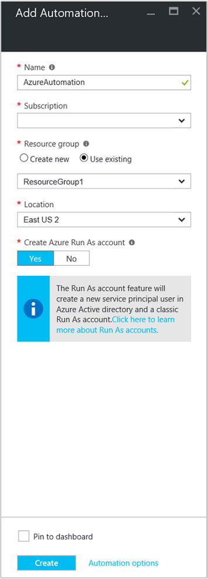

<properties
    pageTitle="Configure Azure Run As account | Microsoft Azure"
    description="Tutorial that walks you through the creation, testing, and example use of security principal authentication in Azure Automation."
    services="automation"
    documentationCenter=""
    authors="mgoedtel"
    manager="jwhit"
    editor=""
	keywords="service principal name, setspn, azure authentication"/>
<tags
    ms.service="automation"
    ms.workload="tbd"
    ms.tgt_pltfrm="na"
    ms.devlang="na"
    ms.topic="get-started-article"
    ms.date="07/29/2016"
    ms.author="magoedte"/>

# Authenticate runbooks with an Azure Run As account

This topic will show you how to configure an Azure Automation account from the Azure portal by using the  Run As account feature to authenticate runbooks that manage resources in either Azure Resource Manager or Azure Service Management.

The process that creates a new Automation account in the Azure portal also automatically:

- Creates a Run As account that:
    - Creates a new service principal in Azure Active Directory.
    - Creates a certificate.
    - Assigns the Contributor role-based access control (RBAC), which will be used to manage Resource Manager resources by using runbooks.   
- Creates   a Classic Run As account by uploading a management certificate, which will be used to manage Azure Service Management or classic resources by using runbooks.  

This simplifies the process for you and helps you quickly start to build and deploy runbooks to support your automation needs.      

When you use a Run As and Classic Run As account, you can:

- Provide a standardized way to authenticate with Azure when you manage Azure Resource Manager or Azure Service Management resources from runbooks in the Azure portal.  
- Automate the use of global runbooks that are configured in Azure Alerts.

>[AZURE.NOTE] The Azure [Alert integration feature](../azure-portal/insights-receive-alert-notifications.md) with Automation global runbooks requires an Automation account that is configured with a Run As and Classic Run As account. You can either select an Automation account that already has a defined Run As and Classic Run As account, or you can create a new account.

We will show you how to create the Automation account from the Azure portal, how to update an Automation account by using PowerShell, and  how to authenticate in your runbooks.

Before we do that, there are a few things that you should understand and consider:

- This does not affect existing Automation accounts that are already created in either the classic or Resource Manager deployment model.  
- This will only work for Automation accounts that you created through the Azure portal. If you attempt to create an account from the Azure classic portal, the account will not replicate the Run As account configuration.
- You might have runbooks and assets (for example, schedules and variables) that were previously created to manage classic resources, and you might want those runbooks to authenticate with the new Classic Run As account. You will need to migrate the runbooks to the new Automation account or update your existing account by using the PowerShell script later in this article.  
- To authenticate by using the new Run As account and Classic Run As Automation account, you will need to modify your existing runbooks with the example code later in this article.

    >[AZURE.NOTE] The Run As account is for authentication against Resource Manager resources by using the certificate-based service principal. The Classic Run As account is for authenticating against Service Management resources by using the management certificate.     

## Create a new Automation account from the Azure portal

In this section, you will create a new Azure Automation account by using the Azure portal. This creates both the Run As and Classic Run As accounts.  

>[AZURE.NOTE] To perform these steps, you *must* be a member of the Subscription Admins role and co-administrator of the subscription that is granting access to the subscription for the user. You must also add the user as a User to that subscription's default Azure Active Directory (Azure AD) instance. The account does not need to be assigned to a privileged role.

1. Sign in to the Azure portal with an account that is a member of the Subscription Admins role and a co-administrator of the subscription.
2. Select **Automation Accounts**.
3. In the Automation Accounts blade, click **Add**. 

    >[AZURE.NOTE] If you see the following warning in the **Add Automation Account** blade, your account is not a member of the Subscription Admins role and a co-admin of the subscription. 

4. In the **Add Automation Account** blade, in the **Name**, box type a name for your new Automation account.
5. If you have more than one subscription, specify one for the new account, a new or existing **Resource group**, and an Azure datacenter **Location**.
6. Verify that **Yes** is selected for the **Create Azure Run As account** option, and then click the **Create** button.  

    >[AZURE.NOTE] If you choose to not create the Run As account by selecting the **No** option, you will see a warning message in the **Add Automation Account** blade. Although the account is created in the Azure portal, it will not have a corresponding authentication identity within your classic or Resource Manager subscription directory service. Therefore, the account will not have access to resources in your subscription. This will prevent any runbooks that reference this account from being able to authenticate and perform tasks against resources in those deployment models.

    > 
    When the service principal is not created, the Contributor role will not be assigned.

7. While Azure creates the Automation account, you can track the progress under **Notifications** from the menu.

### Resources included

When the Automation account is successfully created, several resources are automatically created for you.  The following table summarizes resources for the Run As account. 

Resource|Description
----|----
AzureAutomationTutorial Runbook|An example PowerShell runbook that demonstrates how to authenticate by using the Run As account and then gets all the Resource Manager resources.
AzureAutomationTutorialScript Runbook|An example PowerShell runbook that demonstrates how to authenticate by using the Run As account and then gets all the Resource Manager resources.
AzureRunAsCertificate|A certificate asset that is automatically created during Automation account creation or by using the PowerShell script later in this article for an existing account. With the certificate, you can authenticate with Azure so that you can manage Azure Resource Manager resources from runbooks.  This certificate has a one-year lifespan.
AzureRunAsConnection|A connection asset that is automatically created during Automation account creation or by using the PowerShell script later in this article for an existing account.

The following table summarizes resources for the Classic Run As account. 

Resource|Description
----|----
AzureClassicAutomationTutorial Runbook|An example runbook that gets all the classic virtual machines (VMs) in a subscription by using the Classic Run As Account (certificate) and then returns the VM name and status.
AzureClassicAutomationTutorial Script Runbook|An example runbook that gets all the classic VMs in a subscription by using the Classic Run As Account (certificate) and then returns the VM name and status.
AzureClassicRunAsCertificate|A certificate asset that is automatically created and used to authenticate with Azure so that you can manage Azure classic resources from runbooks. This certificate has a one-year lifespan.
AzureClassicRunAsConnection|A connection asset that is automatically created and used to authenticate with Azure so that you can manage Azure classic resources from runbooks.  

## Verify Run As authentication

Next, we will perform a small test to confirm that you can successfully authenticate by using the new Run As account.     

1. In the Azure portal, open the Automation account that you created earlier.  
2. Click the **Runbooks** tile to open the list of runbooks.
3. Select the **AzureAutomationTutorialScript** runbook, and then click **Start** to start the runbook. You will receive a prompt to verify that you want to start the runbook.
4. A [runbook job](automation-runbook-execution.md) is created and the **Job** blade shows the job status in the **Job Summary** tile.  
    The job status will start as *Queued* to indicate that the job is waiting for a runbook worker in the cloud to become available. The status will move to *Starting* when a worker claims the job and then to *Running* when the runbook actually starts running.  
    When the runbook job finishes, the status is **Completed**.   
5. To see the detailed results of the runbook, click the **Output** tile. 
    In the **Output** blade, you should see that the account has successfully authenticated and returned a list of all resources that are available in the resource group.
6. Close the **Output** blade to return to the **Job Summary** blade.
7. Close the **Job Summary** and the corresponding **AzureAutomationTutorialScript** runbook blade.

## Verify Classic Run As authentication

Next, we will perform a small test to confirm that you can successfully authenticate by using the new Classic Run As account.     

1. In the Azure portal, open the Automation account that you created earlier.  
2. Click the **Runbooks** tile to open the list of runbooks.
3. Select the **AzureClassicAutomationTutorialScript** runbook, and then click **Start** to  start the runbook. You will receive a prompt to verify that you want to start the runbook.
4. A [runbook job](automation-runbook-execution.md) is created, the Job blade opens, and the job status is displayed in the **Job Summary** tile.  
    The job status will start as *Queued* to indicate that the job is waiting for a runbook worker in the cloud to become available. It will move to *Starting* when a worker claims the job and then to *Running* when the runbook actually starts running.  
    When the runbook job finishes, we should see a status of **Completed**.   
5. To see the detailed results of the runbook, click the **Output** tile. 
    In the **Output** blade, you should see that the account has successfully authenticated and returned a list of all classic VMs in the subscription.
6. Close the **Output** blade to return to the **Job Summary** blade.
7. Close the **Job Summary** and the corresponding **AzureClassicAutomationTutorialScript** runbook blade.

## Update an Automation account by using PowerShell

Here we provide you with the option to use PowerShell to update your existing Automation account if:

- You created an Automation account, but you declined to create the Run As account.
- You already have an Automation account to manage Resource Manager resources, and you want to update it to include the Run As account for runbook authentication.
- You already have an Automation account to manage classic resources, and you want to update it to use the Classic Run As instead of creating a new account and migrating your runbooks and assets to it.   

Before proceeding, verify the following:

- You have downloaded and installed [Windows Management Framework (WMF) 4.0](https://www.microsoft.com/download/details.aspx?id=40855) if you are running Windows 7.   
    If you are running Windows Server 2012 R2, Windows Server 2012, Windows Server 2008 R2, Windows 8.1, or Windows 7 SP1, [Windows Management Framework 5.0](https://www.microsoft.com/download/details.aspx?id=50395) is available for installation.
- You have installed Azure PowerShell 1.0. For information about this release and how to install it, see [How to install and configure Azure PowerShell](../powershell-install-configure.md).
- You have created an automation account. This account will be referenced as the value for *–AutomationAccountName* and *-ApplicationDisplayName* parameters in both scripts in the following sections.

To get the values for *SubscriptionID*, *ResourceGroup*, and *AutomationAccountName*, which are required parameters for the scripts, in the Azure portal, select your Automation account from the **Automation account** blade, and then select **All settings**. From the **All settings** blade, under **Account Settings**, select **Properties**. In the **Properties** blade, you can note these values.    

### Create a Run As account PowerShell script

The following PowerShell script will configure:

- An Azure AD application that will be authenticated with the self-signed certificate, create a service principal account for this application in Azure AD, and assign the Contributor role for this account in your current subscription. You can change Contributor to Owner or any other role. For further information, review the [Role-Based Access Control in Azure Automation](../automation/automation-role-based-access-control.md) article.
- An Automation certificate asset in the specified automation account named AzureRunAsCertificate. The asset holds the certificate that the service principal uses.
- An Automation connection asset in the specified automation account named AzureRunAsConnection. The asset holds the application ID, tenant ID, subscription ID, and certificate thumbprint.    

The following steps will walk you through the process of executing the script.

1. Save the following script on your computer. In this example, save it with the file name **New-AzureServicePrincipal.ps1**.  

        #Requires -RunAsAdministrator
        Param (
        [Parameter(Mandatory=$true)]
        [String] $ResourceGroup,

        [Parameter(Mandatory=$true)]
        [String] $AutomationAccountName,

        [Parameter(Mandatory=$true)]
        [String] $ApplicationDisplayName,

        [Parameter(Mandatory=$true)]
        [String] $SubscriptionId,

        [Parameter(Mandatory=$true)]
        [String] $CertPlainPassword,

        [Parameter(Mandatory=$false)]
        [int] $NoOfMonthsUntilExpired = 12
        )

        Login-AzureRmAccount
        Import-Module AzureRM.Resources
        Select-AzureRmSubscription -SubscriptionId $SubscriptionId

        $CurrentDate = Get-Date
        $EndDate = $CurrentDate.AddMonths($NoOfMonthsUntilExpired)
        $KeyId = (New-Guid).Guid
        $CertPath = Join-Path $env:TEMP ($ApplicationDisplayName + ".pfx")

        $Cert = New-SelfSignedCertificate -DnsName $ApplicationDisplayName -CertStoreLocation cert:\LocalMachine\My -KeyExportPolicy Exportable -Provider "Microsoft Enhanced RSA and AES Cryptographic Provider"

        $CertPassword = ConvertTo-SecureString $CertPlainPassword -AsPlainText -Force
        Export-PfxCertificate -Cert ("Cert:\localmachine\my\" + $Cert.Thumbprint) -FilePath $CertPath -Password $CertPassword -Force | Write-Verbose

        $PFXCert = New-Object -TypeName System.Security.Cryptography.X509Certificates.X509Certificate -ArgumentList @($CertPath, $CertPlainPassword)
        $KeyValue = [System.Convert]::ToBase64String($PFXCert.GetRawCertData())

        $KeyCredential = New-Object  Microsoft.Azure.Commands.Resources.Models.ActiveDirectory.PSADKeyCredential
        $KeyCredential.StartDate = $CurrentDate
        $KeyCredential.EndDate= $EndDate
        $KeyCredential.KeyId = $KeyId
        $KeyCredential.Type = "AsymmetricX509Cert"
        $KeyCredential.Usage = "Verify"
        $KeyCredential.Value = $KeyValue

        # Use Key credentials
        $Application = New-AzureRmADApplication -DisplayName $ApplicationDisplayName -HomePage ("http://" + $ApplicationDisplayName) -IdentifierUris ("http://" + $KeyId) -KeyCredentials $keyCredential

        New-AzureRMADServicePrincipal -ApplicationId $Application.ApplicationId | Write-Verbose
        Get-AzureRmADServicePrincipal | Where {$_.ApplicationId -eq $Application.ApplicationId} | Write-Verbose

        $NewRole = $null
        $Retries = 0;
        While ($NewRole -eq $null -and $Retries -le 6)
        {
           # Sleep here for a few seconds to allow the service principal application to become active (should only take a couple of seconds normally)
           Sleep 5
           New-AzureRMRoleAssignment -RoleDefinitionName Contributor -ServicePrincipalName $Application.ApplicationId | Write-Verbose -ErrorAction SilentlyContinue
           Sleep 10
           $NewRole = Get-AzureRMRoleAssignment -ServicePrincipalName $Application.ApplicationId -ErrorAction SilentlyContinue
           $Retries++;
        }

        # Get the tenant id for this subscription
        $SubscriptionInfo = Get-AzureRmSubscription -SubscriptionId $SubscriptionId
        $TenantID = $SubscriptionInfo | Select TenantId -First 1

        # Create the automation resources
        New-AzureRmAutomationCertificate -ResourceGroupName $ResourceGroup -AutomationAccountName $AutomationAccountName -Path $CertPath -Name AzureRunAsCertificate -Password $CertPassword -Exportable | write-verbose

        # Create an Automation connection asset named AzureRunAsConnection in the Automation account. This connection uses the service principal.
        $ConnectionAssetName = "AzureRunAsConnection"
        Remove-AzureRmAutomationConnection -ResourceGroupName $ResourceGroup -AutomationAccountName $AutomationAccountName -Name $ConnectionAssetName -Force -ErrorAction SilentlyContinue
        $ConnectionFieldValues = @{"ApplicationId" = $Application.ApplicationId; "TenantId" = $TenantID.TenantId; "CertificateThumbprint" = $Cert.Thumbprint; "SubscriptionId" = $SubscriptionId}
        New-AzureRmAutomationConnection -ResourceGroupName $ResourceGroup -AutomationAccountName $AutomationAccountName -Name $ConnectionAssetName -ConnectionTypeName AzureServicePrincipal -ConnectionFieldValues $ConnectionFieldValues

2. On your computer, start **Windows PowerShell** from the **Start** screen with elevated user rights.
3. From the elevated PowerShell command-line shell, go to the folder that contains the script that you created in Step 1 and execute the script. Change the values for the *–ResourceGroup*, *-AutomationAccountName*, *-ApplicationDisplayName*, *-SubscriptionId*, and *-CertPlainPassword* parameters. 

    >[AZURE.NOTE] You will be prompted to authenticate with Azure after you execute the script. You must sign in with an account that is a member of the Subscription Admins role and that is a co-admin of the subscription.

        .\New-AzureServicePrincipal.ps1 -ResourceGroup <ResourceGroupName>
        -AutomationAccountName <NameofAutomationAccount> `
        -ApplicationDisplayName <DisplayNameofAutomationAccount> `
        -SubscriptionId <SubscriptionId> `
        -CertPlainPassword "<StrongPassword>"  
 

After the script finishes successfully, refer to the [sample code](#sample-code-to-authenticate-with-resource-manager-resources) to authenticate with Resource Manager resources and validate credential configuration.

### Create a Classic Run As account PowerShell script

The following PowerShell script will configure:

- An Automation certificate asset in the specified automation account named **AzureClassicRunAsCertificate**. The asset holds the certificate that is used to authenticate your runbooks.
- An Automation connection asset in the specified automation account named **AzureClassicRunAsConnection**. The asset holds the subscription name, subscription ID, and certificate asset name.

The script will create a self-signed management certificate and save it to the temporary files folder on your computer under the user profile used to execute the PowerShell session: *%USERPROFILE%\AppData\Local\Temp*. After script execution, you will need to upload the Azure management certificate to the management store for the subscription that the Automation account was created in. The following steps will walk you through the process of executing the script and uploading the certificate.  

1. Save the following script on your computer. In this example, save it with the file name **New-AzureClassicRunAsAccount.ps1**.

        #Requires -RunAsAdministrator
        Param (
        [Parameter(Mandatory=$true)]
        [String] $ResourceGroup,

        [Parameter(Mandatory=$true)]
        [String] $AutomationAccountName,

        [Parameter(Mandatory=$true)]
        [String] $ApplicationDisplayName,

        [Parameter(Mandatory=$true)]
        [String] $SubscriptionId,

        [Parameter(Mandatory=$true)]
        [String] $CertPlainPassword,

        [Parameter(Mandatory=$false)]
        [int] $NoOfMonthsUntilExpired = 12
        )

        Login-AzureRmAccount
        Import-Module AzureRM.Resources
        $Subscription = Select-AzureRmSubscription -SubscriptionId $SubscriptionId
        $SubscriptionName = $subscription.Subscription.SubscriptionName

        $CurrentDate = Get-Date
        $EndDate = $CurrentDate.AddMonths($NoOfMonthsUntilExpired)
        $KeyId = (New-Guid).Guid
        $CertPath = Join-Path $env:TEMP ($ApplicationDisplayName + ".pfx")
        $CertPathCer = Join-Path $env:TEMP ($ApplicationDisplayName + ".cer")

        $Cert = New-SelfSignedCertificate -DnsName $ApplicationDisplayName -CertStoreLocation cert:\LocalMachine\My -KeyExportPolicy Exportable -Provider "Microsoft Enhanced RSA and AES Cryptographic Provider"

        $CertPassword = ConvertTo-SecureString $CertPlainPassword -AsPlainText -Force
        Export-PfxCertificate -Cert ("Cert:\localmachine\my\" + $Cert.Thumbprint) -FilePath $CertPath -Password $CertPassword -Force | Write-Verbose
        Export-Certificate -Cert ("Cert:\localmachine\my\" + $Cert.Thumbprint) -FilePath $CertPathCer -Type CERT | Write-Verbose

        # Create the automation resources
        $ClassicCertificateAssetName = "AzureClassicRunAsCertificate"
        New-AzureRmAutomationCertificate -ResourceGroupName $ResourceGroup -AutomationAccountName $AutomationAccountName -Path $CertPath -Name $ClassicCertificateAssetName  -Password $CertPassword -Exportable | write-verbose

        # Create an Automation connection asset named AzureClassicRunAsConnection in the Automation account. This connection uses ClassicCertificateAssetName.
        $ConnectionAssetName = "AzureClassicRunAsConnection"
        Remove-AzureRmAutomationConnection -ResourceGroupName $ResourceGroup -AutomationAccountName $AutomationAccountName -Name $ConnectionAssetName -Force -ErrorAction SilentlyContinue
        $ConnectionFieldValues = @{"SubscriptionName" = $SubscriptionName; "SubscriptionId" = $SubscriptionId; "CertificateAssetName" = $ClassicCertificateAssetName}
        New-AzureRmAutomationConnection -ResourceGroupName $ResourceGroup -AutomationAccountName $AutomationAccountName -Name $ConnectionAssetName -ConnectionTypeName AzureClassicCertificate -ConnectionFieldValues $ConnectionFieldValues

        Write-Host -ForegroundColor red "Please upload the cert $CertPathCer to the Management store by following the steps below."
        Write-Host -ForegroundColor red "Log in to the Microsoft Azure Management portal (https://manage.windowsazure.com) and select Settings -> Management Certificates."
        Write-Host -ForegroundColor red "Then click Upload and upload the certificate $CertPathCer"

2. On your computer, start **Windows PowerShell** from the **Start** screen with elevated user rights.  
3. From the elevated PowerShell command-line shell, go to the folder that contains the script that you created in Step 1, and execute the script. Change the values for the *–ResourceGroup*, *-AutomationAccountName*, *-ApplicationDisplayName*, *-SubscriptionId*, and *-CertPlainPassword* parameters. 

    >[AZURE.NOTE] You will be prompted to authenticate with Azure after you execute the script. You must sign in with an account that is a member of the Subscription Admins role and that is a co-admin of the subscription.

        .\New-AzureClassicRunAsAccount.ps1 -ResourceGroup <ResourceGroupName>
        -AutomationAccountName <NameofAutomationAccount> `
        -ApplicationDisplayName <DisplayNameofAutomationAccount> `
        -SubscriptionId <SubscriptionId> `
        -CertPlainPassword "<StrongPassword>"

After the script finishes successfully, you will need to copy the certificate that was created in your user profile **Temp** folder. Follow the steps to [upload a management API certificate](../azure-api-management-certs.md) to the Azure classic portal, and then refer to the [sample code](#sample-code-to-authenticate-with-service-management-resources) to validate credential configuration with Service Management resources.

## Sample code to authenticate with Resource Manager resources

You can use the following updated sample code, which is taken from the **AzureAutomationTutorialScript** example runbook, to authenticate by using the Run As account to manage Resource Manager resources with your runbooks.   

    $connectionName = "AzureRunAsConnection"
    $SubId = Get-AutomationVariable -Name 'SubscriptionId'
    try
    {
       # Get the connection "AzureRunAsConnection "
       $servicePrincipalConnection=Get-AutomationConnection -Name $connectionName         

       "Logging in to Azure..."
       Add-AzureRmAccount `
         -ServicePrincipal `
         -TenantId $servicePrincipalConnection.TenantId `
         -ApplicationId $servicePrincipalConnection.ApplicationId `
         -CertificateThumbprint $servicePrincipalConnection.CertificateThumbprint
	   "Setting context to a specific subscription"	 
	   Set-AzureRmContext -SubscriptionId $SubId	 		 
    }
    catch {
        if (!$servicePrincipalConnection)
        {
           $ErrorMessage = "Connection $connectionName not found."
           throw $ErrorMessage
         } else{
            Write-Error -Message $_.Exception
            throw $_.Exception
         }
    }

The script includes two additional lines of code to support referencing a subscription context so that you can easily work between multiple subscriptions. The *SubscriptionId* variable asset contains the ID of the subscription. After the Add-AzureRmAccount cmdlet statement, the [Set-AzureRmContext cmdlet](https://msdn.microsoft.com/library/mt619263.aspx) is stated with the *-SubscriptionId* parameter set. If the variable name is too generic, you can revise the name of the variable to include a prefix or other naming convention to make it easier to identify for your purposes. Alternatively, you can use the *-SubscriptionName* parameter set instead of *-SubscriptionId* and a corresponding variable asset.  

Notice that the cmdlet that is used to authenticate in the runbook, **Add-AzureRmAccount**, uses the *ServicePrincipalCertificate* parameter set. It authenticates by using the service principal certificate instead of credentials.  

## Sample code to authenticate with Service Management resources

You can use the following updated sample code, which is taken from the **AzureClassicAutomationTutorialScript** example runbook, to authenticate by using the Classic Run As account to manage classic resources with your runbooks.

    $ConnectionAssetName = "AzureClassicRunAsConnection"
    # Get the connection
    $connection = Get-AutomationConnection -Name $connectionAssetName        

    # Authenticate to Azure with certificate
    Write-Verbose "Get connection asset: $ConnectionAssetName" -Verbose
    $Conn = Get-AutomationConnection -Name $ConnectionAssetName
    if ($Conn -eq $null)
    {
       throw "Could not retrieve connection asset: $ConnectionAssetName. Assure that this asset exists in the Automation account."
    }

    $CertificateAssetName = $Conn.CertificateAssetName
    Write-Verbose "Getting the certificate: $CertificateAssetName" -Verbose
    $AzureCert = Get-AutomationCertificate -Name $CertificateAssetName
    if ($AzureCert -eq $null)
    {
       throw "Could not retrieve certificate asset: $CertificateAssetName. Assure that this asset exists in the Automation account."
    }

    Write-Verbose "Authenticating to Azure with certificate." -Verbose
    Set-AzureSubscription -SubscriptionName $Conn.SubscriptionName -SubscriptionId $Conn.SubscriptionID -Certificate $AzureCert
    Select-AzureSubscription -SubscriptionId $Conn.SubscriptionID

## Next steps

- For more information about service principals, refer to [Application Objects and Service Principal Objects](../active-directory/active-directory-application-objects.md).
- For more information about Role-Based Access Control in Azure Automation, refer to [Role-based access control in Azure Automation](../automation/automation-role-Based-access-control.md).
- For more information about certificates and Azure services, refer to [Certificates overview for Azure Cloud Services](../cloud-services/cloud-services-certs-create.md).
