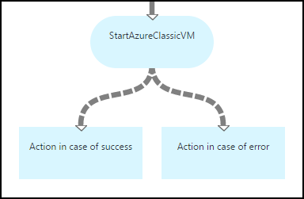
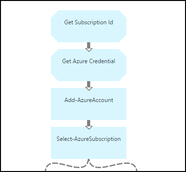
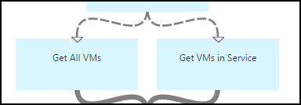
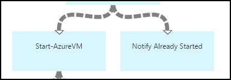
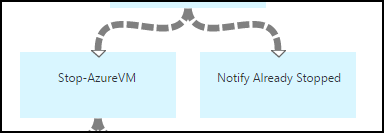
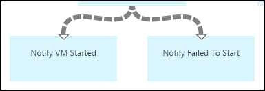

<properties 
	pageTitle="Starting and stopping virtual machines - Graph | Microsoft Azure"
	description="PowerShell Workflow version of Azure Automation scenario including runbooks to start and stop classic virtual machines."
	services="automation"
	documentationCenter=""
	authors="mgoedtel"
	manager="jwhit"
	editor="tysonn" />
<tags 
	ms.service="automation"
	ms.devlang="na"
	ms.topic="article"
	ms.tgt_pltfrm="na"
	ms.workload="infrastructure-services"
	ms.date="07/06/2016"
	ms.author="bwren" />

# Azure Automation scenario - starting and stopping virtual machines

This Azure Automation scenario includes runbooks to start and stop classic virtual machines.  You can use this scenario for any of the following:  

- Use the runbooks without modification in your own environment. 
- Modify the runbooks to perform customized functionality.  
- Call the runbooks from another runbook as part of an overall solution. 
- Use the runbooks as tutorials to learn runbook authoring concepts. 

> [AZURE.SELECTOR]
- [Graphical](automation-solution-startstopvm-graphical.md)
- [PowerShell Workflow](automation-solution-startstopvm-psworkflow.md)

This is the graphical runbook version of this scenario. It is also available using [PowerShell Workflow runbooks](automation-solution-startstopvm-psworkflow.md).

## Getting the scenario

This scenario consists of two two graphical runbooks that you can download from the following links.  See the [PowerShell Workflow version](automation-solution-startstopvm-psworkflow.md) of this scenario for links to the PowerShell Workflow runbooks.

| Runbook | Link | Type | Description |
|:---|:---|:---|:---|
| StartAzureClassicVM | [Start Azure Classic VM Graphical Runbook](https://gallery.technet.microsoft.com/scriptcenter/Start-Azure-Classic-VM-c6067b3d) | Graphical | Starts all classic virtual machines in an Azure subscription or all virtual machines with a particular service name. |
| StopAzureClassicVM | [Stop Azure Classic VM Graphical Runbook](https://gallery.technet.microsoft.com/scriptcenter/Stop-Azure-Classic-VM-397819bd) | Graphical | Stops all virtual machines in an automation account or all virtual machines with a particular service name.  |

## Installing and configuring the scenario

### 1. Install the runbooks

After downloading the runbooks, you can import them using the procedure in [Graphical runbook procedures](automation-graphical-authoring-intro.md#graphical-runbook-procedures).

### 2. Review the description and requirements
The runbooks include an activity called **Read Me** that includes a description and required assets.  You can view this information by selecting the **Read Me** activity and then the **Workflow Script** parameter.  You can also get the same information from this article. 

### 3. Configure assets
The runbooks require the following assets that you must create and populate with appropriate values.  The names are default.  You can use assets with different names if you specify those names in the [input parameters](#using-the-runbooks) when you start the runbook.

| Asset Type | Default Name | Description |
|:---|:---|:---|:---|
| [Credential](automation-credentials.md) | AzureCredential | Contains credentials for an account that has authority to start and stop virtual machines in the Azure subscription.  |
| [Variable](automation-variables.md) | AzureSubscriptionId | Contains the subscription ID of your Azure subscription. |

## Using the scenario

### Parameters

The runbooks each have the following [input parameters](automation-starting-a-runbook.md#runbook-parameters).  You must provide values for any mandatory parameters and can optionally provide values for other parameters depending on your requirements.

| Parameter | Type | Mandatory | Description |
|:---|:---|:---|:---|
| ServiceName | string | No | If a value is provided, then all virtual machines with that service name are started or stopped.  If no value is provided, then all classic virtual machines in the Azure subscription are started or stopped. |
| AzureSubscriptionIdAssetName | string | No | Contains the name of the [variable asset](#installing-and-configuring-the-scenario) that contains the subscription ID of your Azure subscription.  If you don't specify a value, *AzureSubscriptionId* is used.  |
| AzureCredentialAssetName | string | No | Contains the name of the [credential asset](#installing-and-configuring-the-scenario) that contains the credentials for the runbook to use.  If you don't specify a value, *AzureCredential* is used.  |

### Starting the runbooks

You can use any of the methods in [Starting a runbook in Azure Automation](automation-starting-a-runbook.md) to start either of the runbooks in this article.

The following sample commands uses Windows PowerShell to run **StartAzureClassicVM** to start all virtual machines with the service name *MyVMService*.

	$params = @{"ServiceName"="MyVMService"}
	Start-AzureAutomationRunbook –AutomationAccountName "MyAutomationAccount" –Name "StartAzureClassicVM" –Parameters $params

### Output

The runbooks will [output a message](automation-runbook-output-and-messages.md) for each virtual machine indicating whether or not the start or stop instruction was successfully submitted.  You can look for a specific string in the output to determine the result for each runbook.  The possible output strings are listed in the following table.

| Runbook | Condition | Message |
|:---|:---|:---|
| StartAzureClassicVM | Virtual machine is already running  | MyVM is already running |
| StartAzureClassicVM | Start request for virtual machine successfully submitted | MyVM has been started |
| StartAzureClassicVM | Start request for virtual machine failed  | MyVM failed to start |
| StopAzureClassicVM | Virtual machine is already running  | MyVM is already stopped |
| StopAzureClassicVM | Start request for virtual machine successfully submitted | MyVM has been started |
| StopAzureClassicVM | Start request for virtual machine failed  | MyVM failed to start |

Following is an image of using the **StartAzureClassicVM** as a [child runbook](automation-child-runbooks.md) in a sample graphical runbook.  This uses the conditional links in the following table.

| Link | Criteria |
|:---|:---|
| Success link | $ActivityOutput['StartAzureClassicVM'] -like "\* has been started"    |
| Error link   | $ActivityOutput['StartAzureClassicVM'] -notlike "\* has been started" |

## Detailed breakdown

Following is a detailed breakdown of the runbooks in this scenario.  You can use this information to either customize the runbooks or just to learn from them for authoring your own automation scenarios.
 

### Authentication

The runbook starts with activities to set the [credentials](automation-configuring.md#configuring-authentication-to-azure-resources) and Azure subscription that will be used for the rest of the runbook.

The first two activities, **Get Subscription Id** and **Get Azure Credential**, retrieve the [assets](#installing-the-runbook) that are used by the next two activities.  Those activities could directly specify the assets, but they need the asset names.  Since we are allowing the user to specify those names in the [input parameters](#using-the-runbooks), we need these activities to retrieve the assets with a name specified by an input parameter.

**Add-AzureAccount** sets the credentials that will be used for the rest of the runbook.  The credential asset that it retrieves from **Get Azure Credential** must have access to start and stop virtual machines in the Azure subscription.  The subscription that's used is selected by **Select-AzureSubscription** which uses the subscription Id from **Get Subscription Id**.

### Get virtual machines

The runbook needs to determine which virtual machines it will be working with and whether they are already started or stopped (depending on the runbook).   One of two activities will retrieve the VMs.  **Get VMs in Service** will run if the *ServiceName* input parameter for the runbook contains a value.  **Get All VMs** will run if the *ServiceName* input parameter for the runbook does not contain a value.  This logic is performed by the conditional links preceding each activity.

Both activities use the **Get-AzureVM** cmdlet.  **Get All VMs** uses the **ListAllVMs** parameter set to return all virtual machines.  **Get VMs in Service** uses the **GetVMByServiceAndVMName** parameter set and provides the **ServiceName** input parameter for the **ServiceName** parameter.  

### Merge VMs

The **Merge VMs** activity is required to provide input to **Start-AzureVM** which needs the name and service name of the vm(s) to start.  That input could come from either **Get All VMs** or **Get VMs in Service**, but **Start-AzureVM** can only specify one activity for its input.   

The scenario is to create **Merge VMs** which runs the **Write-Output** cmdlet.  The **InputObject** parameter for that cmdlet is a PowerShell Expression that combines the input of the previous two activities.  Only one of those activities will run, so only one set of output is expected.  **Start-AzureVM** can use that output for its input parameters. 

### Start/Stop virtual machines

 

Depending on the runbook, the next activities attempt to start or stop the runbook using **Start-AzureVM** or **Stop-AzureVM**.  Since the activity is preceded by a pipeline link, it will run once for each object returned from **Merge VMs**.  The link is conditional so that the activity will only run if the *RunningState* of the virtual machine is *Stopped* for **Start-AzureVM** and *Started* for **Stop-AzureVM**. If this condition is not met, then **Notify Already Started** or **Notify Already Stopped** is run to send a message using **Write-Output**.

### Send output

 

The final step in the runbook is to send output whether the start or stop request for each virtual machine was successfully submitted. There is a separate **Write-Output** activity for each, and we determine which one to run with conditional links.  **Notify VM Started** or **Notify VM Stopped** is run if *OperationStatus* is *Succeeded*.  If *OperationStatus* is any other value, then **Notify Failed To Start** or **Notify Failed to Stop** is run.

## Next steps

- [Graphical authoring in Azure Automation](automation-graphical-authoring-intro.md)
- [Child runbooks in Azure Automation](automation-child-runbooks.md) 
- [Runbook output and messages in Azure Automation](automation-runbook-output-and-messages.md)