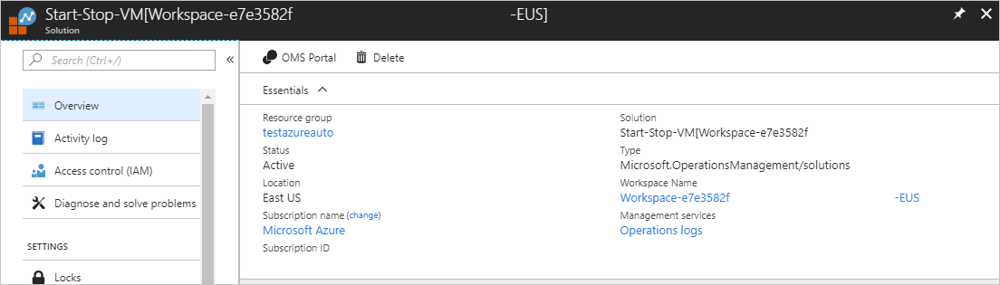

# Remove Start/Stop VMs during off-hours from Automation account

> [!NOTE]
> Start/Stop VM during off-hours version 1 is unavailable in the marketplace now as it will retire by 30 September 2023. We recommend you start using [version 2](../azure-functions/start-stop-vms/overview.md), which is now generally available. The new version offers all existing capabilities and provides new features, such as multi-subscription support from a single Start/Stop instance. If you have the version 1 solution already deployed, you can still use the feature, and we will provide support until 30 September 2023. The details of the announcement will be shared soon. 

After you enable the Start/Stop VMs during off-hours feature to manage the running state of your Azure VMs, you may decide to stop using it. Removing this feature can be done using one of the following methods based on the supported deployment models:

> [!NOTE]
> Before proceeding, verify there aren't any [Resource Manager locks](../azure-resource-manager/management/lock-resources.md) applied at the subscription, resource group, or resource which prevents accidental deletion or modification of critical resources. When you deploy the Start/Stop VMs during off-hours solution, it sets the lock level to **Cannot Delete** against several dependent resources in the Automation account (specifically its runbooks and variables). Any locks need to be removed before you can delete the Automation account.

## Delete the dedicated resource group

To delete the resource group, follow the steps outlined in the [Azure Resource Manager resource group and resource deletion](../azure-resource-manager/management/delete-resource-group.md) article.

## Delete the Automation account

To delete your Automation account dedicated to Start/Stop VMs during off-hours, perform the following steps.

1. Sign in to Azure at [https://portal.azure.com](https://portal.azure.com).

2. Navigate to your Automation account, and select **Linked workspace** under **Related resources**.

3. Select **Go to workspace**.

4. Click **Solutions** under **General**.

5. On the Solutions page, select **Start-Stop-VM[Workspace]**.

6. On the **VMManagementSolution[Workspace]** page, select **Delete** from the menu.

7. While the information is verified and the feature is deleted, you can track the progress under **Notifications**, chosen from the menu. You're returned to the Solutions page after the removal process.

### Unlink workspace from Automation account

There are two options for unlinking the Log Analytics workspace from your Automation account. You can perform this process from the Automation account or from the linked workspace.

To unlink from your Automation account, perform the following steps.

1. In the Azure portal, select **Automation Accounts**.

2. Open your Automation account and select **Linked workspace** under **Related Resources** on the left.

3. On the **Unlink workspace** page, select **Unlink workspace** and respond to prompts.

   

    While it attempts to unlink the Log Analytics workspace, you can track the progress under **Notifications** from the menu.

To unlink from the workspace, perform the following steps.

1. In the Azure portal, select **Log Analytics workspaces**.

2. From the workspace, select **Automation Account** under **Related Resources**.

3. On the Automation Account page, select **Unlink account** and respond to prompts.

While it attempts to unlink the Automation account, you can track the progress under **Notifications** from the menu.

### Delete Automation account

1. In the Azure portal, select **Automation Accounts**.

2. Open your Automation account and select **Delete** from the menu.

While the information is verified and the account is deleted, you can track the progress under **Notifications**, chosen from the menu.

## Delete the feature

To delete Start/Stop VMs during off-hours from your Automation account, perform the following steps. The Automation account and Log Analytics workspace aren't deleted as part of this process. If you don't want to keep the Log Analytics workspace, you must manually delete it. For more information about deleting your workspace, see [Delete and recover Azure Log Analytics workspace](../azure-monitor/logs/delete-workspace.md).

1. Navigate to your Automation account, and select **Linked workspace** under **Related resources**.

2. Select **Go to workspace**.

3. Click **Solutions** under **General**.

4. On the Solutions page, select **Start-Stop-VM[Workspace]**.

5. On the **VMManagementSolution[Workspace]** page, select **Delete** from the menu.

    

6. In the Delete Solution window, confirm that you want to delete the feature.

7. While the information is verified and the feature is deleted, you can track the progress under **Notifications**, chosen from the menu. You're returned to the Solutions page after the removal process.

8. If you don't want to keep the resources created by the feature or by you afterwards (such as, variables, schedules, etc.), you have to manually delete them from the account.

## Next steps

To re-enable this feature, see [Enable Start/Stop during off-hours](automation-solution-vm-management-enable.md).