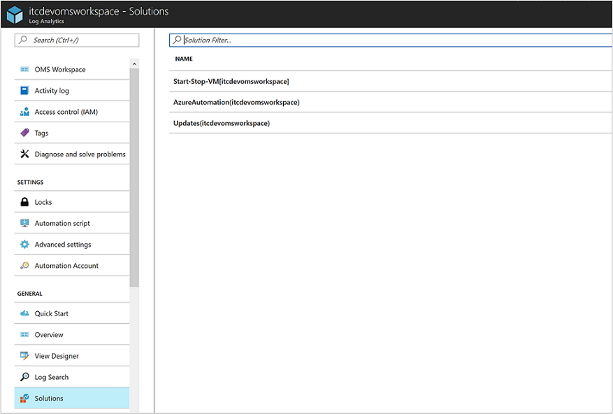
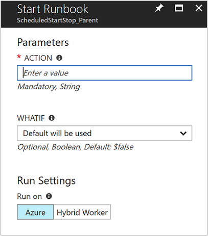

# Start/Stop VMs during off-hours solution in Azure Automation

The Start/Stop VMs during off-hours solution starts and stops your Azure virtual machines on user-defined schedules, provides insights through Log Analytics, and sends optional emails by leveraging [SendGrid](https://azuremarketplace.microsoft.com/marketplace/apps/SendGrid.SendGrid?tab=Overview). It supports both Azure Resource Manager and classic VMs for most scenarios. 

This solution provides a decentralized automation capability for customers who want to reduce their costs leveraging serverless, low cost resources. Features include:

* Schedule VMs to start/stop
* Schedule VMs to start/stop in ascending order using Azure Tags (not supported for  classic VMs)
* Auto stop VMs based on low CPU usage

## Prerequisites

- The runbooks work with an [Azure Run As account](automation-offering-get-started.md#authentication-methods).  The Run As account is the preferred authentication method since it uses certificate authentication instead of a password that may expire or change frequently.  

- This solution can only manage VMs that are in the same subscription as where the Automation account resides.  

- This solution only deploys to the following Azure regions - Australia Southeast, Canada Central, Central India, East US, Japan East, Southeast Asia, UK South, and West Europe.  
    
    > [!NOTE]
    > The runbooks managing the VM schedule can target VMs in any region.  

- To send email notifications when the start and stop VM runbooks complete, while onboarding from Azure Marketplace, you must select select **Yes** to deploy SendGrid. 

    > [!IMPORTANT]
    > SendGrid is a third party service, for support with SendGrid please contact [SendGrid](https://sendgrid.com/contact/).  
    >
   
    Limitations with SendGrid are the following:

    * Maximum of one SendGrid account per user per subscription
    * Maximum of two SendGrid accounts per subscription

If you have deployed a previous version of this solution, you will first need to delete it from your account before deploying this release.  

## Solution components

This solution includes preconfigured runbooks, schedules, and integration with Log Analytics that allows you to tailor the startup and shutdown of your virtual machines to suite your business needs. 

### Runbooks

The following table list the runbooks deployed to your Automation account.  It is not recommended that you make changes to the runbook code, but rather write your own runbook for new functionality.

> [!NOTE]
> Don’t directly run any runbook with the name “Child” appended at the end of it's name.
>

All parent runbooks includes the *WhatIf* parameter, which when set to **True**, supports detailing the exact behavior the runbook takes when run without the *WhatIf* parameter and validates the correct VMs are being targeted.  Runbooks only performs its defined actions when the *WhatIf* parameter is set to **False**. 

|**Runbook** | **Parameters** | **Description**|
| --- | --- | ---| 
|AutoStop_CreateAlert_Child | VMObject   AlertAction   WebHookURI | Called from the parent runbook only. Creates alerts on per resource basis for AutoStop scenario.| 
|AutoStop_CreateAlert_Parent | WhatIf: True or False   VMList | Creates or updates Azure alert rules on VMs in the targeted subscription or resource groups.   VMList: Comma separated list of VMs.  For example, *vm1,vm2,vm3*| 
|AutoStop_Disable | none | Disable AutoStop alerts and default schedule.| 
|AutoStop_StopVM_Child | WebHookData | Called from parent runbook only. Alert rules call this runbook and it does the work of stopping the VM.|  
|Bootstrap_Main | none | Used one time to set-up bootstrap configurations such as webhookURI which is typically not accessible from ARM. This runbook will be removed automatically if deployment has gone successfully.|  
|ScheduledStartStop_Child | VMName   Action: Stop or Start   ResourceGroupName | Called from parent runbook only. Does the actual execution of stop or start for scheduled stop.|  
|ScheduledStartStop_Parent | Action: Stop or Start   WhatIf: True or False | This will take effect on all VMs in the subscription unless you edit the **External_Start_ResourceGroupNames** and **External_Stop_ResourceGroupNames** which will restrict it to only execute on these target resource groups. You can also exclude specific VMs by updating the **External_ExcludeVMNames** variable. WhatIf behaves the same as in other runbooks.|  
|SequencedStartStop_Parent | Action: Stop or Start   WhatIf: True or False | Create a tag called **SequenceStart** and another tag called **SequenceStop** on each VM that you want to sequence start\\stop activity for. The value of the tag should be a positive integer (1,2,3) that corresponds to the order you want to start\\stop in ascending order. WhatIf behaves the same as in other runbooks.   **Note: VMs must be within resource groups defined External_Start_ResourceGroupNames, External_Stop_ResourceGroupNames, and External_ExcludeVMNames in Azure Automation variables and have the appropriate tags for actions to take effect.**|

### Variables

The following table list the variables created in your Automation account.  It is recommended that you only modify variables prefixed with **External**, modifying variables prefixed with **Internal** will cause undesirable effects.  

|**Variable** | **Description**|
---------|------------|
|External_AutoStop_Condition | This is the conditional operator required for configuring the condition before triggering an alert. Acceptable values are **GreaterThan**, **GreaterThanOrEqual**, **LessThan**, **LessThanOrEqual**.|  
|External_AutoStop_Description | Alert to stop the VM if the CPU % exceeds the threshold.|  
|External_AutoStop_MetricName | Name of the performance metric the Azure Alert rule is to be configured for.| 
|External_AutoStop_Threshold | Threshold for the Azure Alert rule specified in the variable *External_AutoStop_MetricName*. Percentage values can range from 1 to 100.|  
|External_AutoStop_TimeAggregationOperator | The time aggregation operator which will be applied to the selected window size to evaluate the condition. Acceptable values are **Average**, **Minimum**, **Maximum**, **Total**, **Last**.|  
|External_AutoStop_TimeWindow | The window size over which Azure will analyze selected metric for triggering an alert. This parameter accepts input in timespan format. Possible values are from five minutes to six hours.|  
|External_EmailFromAddress | Specifies the sender of the email.|  
|External_EmailSubject | Specifies the text for the subject line of the email.|  
|External_EmailToAddress | Specifies the recipient(s) of the email. Separate names using a comma.|  
|External_ExcludeVMNames | Enter VM names to be excluded, separating names using a comma with no spaces.|  
|External_IsSendEmail | Specifies option to send email notification upon completion.  Specify **Yes** or **No** to not send email.  This option should be **No** if you did not create SendGrid during the initial deployment.|  
|External_Start_ResourceGroupNames | Specifies one or more resource groups, separating values using a comma, targeted for Start actions.|  
|External_Stop_ResourceGroupNames | Specifies one ore more resource groups, separating values with comma, targeted for Stop actions.|  
|Internal_AutomationAccountName | Specifies the name of the Automation account.|  
|Internal_AutoSnooze_WebhookUri | Specifies Webhook URI called for the AutoStop scenario.|  
|Internal_AzureSubscriptionId | Specifies the Azure Subscription Id.|  
|Internal_ResourceGroupName | Specifies the Azure Automation account resource group name.|  
|Internal_SendGridAccountName | Specifies the SendGrid account name.|  
|Internal_SendGridPassword | Specifies the SendGrid account password.|  

 

Across all scenarios, the **External_Start_ResourceGroupNames**,  **External_Stop_ResourceGroupNames**, and **External_ExcludeVMNames** variables are necessary for targeting VMs with the exception of providing a comma separated list of VMs for the **AutoStop_CreateAlert_Parent** runbook. That is, your VMs must reside in target resource groups for start/stop actions to occur. The logic works a bit like Azure policy, in that you can target at the subscription or resource group and have actions inherited by  newly created VMs. This approach avoids having to maintain a separate schedule for every VM and manage start/stop in scale.

### Schedules

The following table lists each of the default schedules created in your Automation account.  You can modify them or create your own custom schedules.  By default each of these schedules are disabled except for **Scheduled_StartVM** and **Scheduled-StopVM**.

It is not recommended to enable all schedules, as this could create an overlap as to which schedule performs an action.  Rather, it would be best to determine which optimizations you wish to perform and modify accordingly.  See the example scenarios in the overview section for further explanation.   

|**ScheduleName** | **Frequency** | **Description**|
|--- | --- | ---|
|Schedule_AutoStop_CreateAlert_Parent | Runs every eight hours | Runs the AutoStop_CreateAlert_Parent runbook every 8 hours, which in turn will stop VM’s based values in “External_Start_ResourceGroupNames”, “External_Stop_ResourceGroupNames”, and “External_ExcludeVMNames” in Azure Automation variables.  Alternatively, you can specify a comma separated list of VMs using the "VMList" parameter.|  
|Scheduled_StopVM | User Defined, Every Day | Runs the Scheduled_Parent runbook with a parameter of “Stop” every day at the given time.  Will Automatically stop all VM’s that meet the rules defined via Asset Variables.  Recommend enabling the sister schedule, Scheduled-StartVM.|  
|Scheduled_StartVM | User Defined, Every Day | Runs the Scheduled_Parent runbook with a parameter of *Start* every day at the given time.  Will automatically start all VM’s that meet the rules defined and part of the appropriate variables.  It is recommended you enable the sister schedule, **Scheduled-StopVM**.|
|Sequenced-StopVM | 1:00AM (UTC), Every Friday | Runs the Sequenced_Parent runbook with a parameter of *Stop* every Friday at the given time.  Will sequentially (ascending) stop all VM’s with a tag of **SequenceStop** defined and part of the appropriate variables.  Refer to Runbooks section for more details on tag values and asset variables.  It is recommend  you enable the sister schedule, **Sequenced-StartVM**.|
|Sequenced-StartVM | 1:00PM (UTC), Every Monday | Runs the Sequenced_Parent runbook with a parameter of *Start* every Monday at the specified time.  Will sequentially (descending) start all VM’s with a tag of **SequenceStart** defined and part of the appropriate variables.  Refer to Runbooks section for more details on tag values and asset variables.  It is recommended you enable the sister schedule, **Sequenced-StopVM**.|

 

## Configuration

Perform the following steps to add the Start/Stop VMs during off-hours [Preview] solution to your Automation account and then configure the variables to customize the solution.

1. In the Azure portal, click **New**.     
2. In the Marketplace pane, type **Start VM**. As you begin typing, the list filters based on your input. Select **Start/Stop VMs during off-hours [Preview]** from the search results.  
3. In the **Start/Stop VMs during off-hours [Preview]** pane for the selected solution, review the summary information and then click **Create**.  
4. The **Add Solution** pane appears where you are prompted to configure the solution before you can import it into your Automation subscription.     
5.  On the **Add Solution** blade, select **Workspace** and here you select an OMS workspace that is linked to the same Azure subscription that the Automation account is in or create a new workspace.  If you do not have a workspace, you can select **Create New Workspace** and on the **OMS Workspace** pane perform the following: 
   - Specify a name for the new **OMS Workspace**.
   - Select a **Subscription** to link to by selecting from the drop-down list if the default selected is not appropriate.
   - For **Resource Group**, you can create a new resource group or select an existing resource group.  
   - Select a **Location**.  Currently the only locations provided for selection are **Australia Southeast**, **Canada Central**, **Central India**, **East US**, **Japan East**, **Southeast Asia**, **UK South**, and **West Europe**.
   - Select a **Pricing tier**.  The solution is offered in two tiers: free and OMS paid tier.  The free tier has a limit on the amount of data collected daily, retention period, and runbook job runtime minutes.  The OMS paid tier does not have a limit on the amount of data collected daily.  

        > [!NOTE]
        > While the Per GB (Standalone) paid tier is displayed as an option, it is not applicable.  If you select it and proceed with the creation of this solution in your subscription, it will fail.  This will be addressed when this solution is officially released. If you use this solution, it will only use automation job minutes and log ingestion.  The solution does not add additional OMS nodes to your environment.  

6. After providing the required information on the **OMS workspace** blade, click **Create**.  While the information is verified and the workspace is created, you can track its progress under **Notifications** from the menu.  You will be returned to the **Add Solution** blade.  
7. On the **Add Solution** blade, select **Automation Account**.  If you are creating a new OMS workspace, you will be required to also create a new Automation account that will be associated with the new OMS workspace specified earlier, including your Azure subscription, resource group and region.  You can select **Create an Automation account** and on the **Add Automation account** blade, provide the following: 
  - In the **Name** field, enter the name of the Automation account.

    All other options are automatically populated based on the OMS workspace selected and these options cannot be modified.  An Azure Run As account is the default authentication method for the runbooks included in this solution.  Once you click **OK**, the configuration options are validated and the Automation account is created.  You can track its progress under **Notifications** from the menu. 

    Otherwise, you can select an existing Automation Run As account.  Note that the account you select cannot already be linked to another OMS workspace, otherwise a message will be presented in the blade to inform you.  If it is already linked, you will need to select a different Automation Run As account or create a new one.    

8. Finally on the **Add Solution** blade, select **Configuration** and the **Parameters** blade appears.       On the **Parameters** blade, you are prompted to:  
   - Specify the **Target ResourceGroup Names**, which is a resource group name that contains VMs to be managed by this solution.  You can enter more than one name and separate each using a comma (values are not case-sensitive).  Using a wildcard is supported if you want to target VMs in all resource groups in the subscription.
   - Specity the **VM Exclude List (string)**, which is the name of on or more virtual machines from the target resource group.  You can enter more than one name and separate each using a comma (values are not case-sensitive).  Using a wildcard is supported.
   - Select a **Schedule** which is a recurring date and time for starting and stopping the VM's in the target resource group(s).  By default, the schedule is configured to the UTC time zone and selecting a different region is not available.  If you wish to configure the schedule to your specific time zone after configuring the solution, see [Modifying the startup and shutdown schedule](#modifying-the-startup-and-shutdown-schedule) below.
   - To receive **Email notifications** from SendGrid, accept the default value of **Yes** and provide a valid email address.  If you select **No** and later you decide you want to receive email notifications, you will need to re-deploy the solution again from Azure marketplace.  

10. Once you have completed configuring the initial settings required for the solution, select **Create**.  All settings will be validated and then it will attempt to deploy the solution in your subscription.  This process can take several seconds to complete and you can track its progress under **Notifications** from the menu. 

## Collection frequency

Automation job log and job stream data is ingested into the Log Analytics repository every five minutes.  

## Using the solution

When you add the VM Management solution, in your Log Analytics workspace from the Azure Portal, the **StartStopVM View** tile is added to your dashboard.  This tile displays a count and graphical representation of the runbooks jobs for the solution that have started and completed successfully.     

In your Automation account, you can access and manage the solution by selecting the **Workspace** option and on the Log Analytics page, select **Solutions** from the left pane.  On the **Solutions** page, select the solution **Start-Stop-VM[Workspace]** from the list.     

Selecting the solution will display the **Start-Stop-VM[Workspace]** solution blade, where you can review important details such as the **StartStopVM** tile, like in your Log Analytics workspace, which displays a count and graphical representation of the runbook jobs for the solution that have started and have completed successfully.     

From here you can also perform further analysis of the job records by clicking on the donut tile and from the solution dashboard it shows job history, pre-defined log search queries, and switch to the Log Analytics Advanced portal to search based on your search queries.  

All parent runbooks includes the *WhatIf* parameter, which when set to **True**, supports detailing the exact behavior the runbook takes when run without the *WhatIf* parameter and validates the correct VMs are being targeted.  Runbooks only performs its defined actions when the *WhatIf* parameter is set to **False**.  

### Scenario 1: Daily stop/start VMs across a subscription or target resource groups 

This is the default configuration when you first deploy the solution.  For example, you can configure it to stop all VMs across a subscription in the evening when you leave work and start them in the morning when you are back in the office. When you configure the schedules **Scheduled-StartVM" and **Scheduled-StopVM** during deployment, they start and stop targeted VMs.
>[!NOTE]
>The time zone is your current time zone when you configure the schedule time parameter; however it is stored in UTC format in Azure Automation.  You do not have to do any time zone conversion as this is handled during the deployment.

You control which VMs are in scope by configuring the two variables - **External_Start_ResourceGroupNames**, **External_Stop_ResourceGroupNames, and **External_ExcludeVMNames**.  

>[!NOTE]
> The value for variable **Target ResourceGroup Names**" is stored as the value for both **External_Start_ResourceGroupNames** and **External_Stop_ResourceGroupNames** variables. For further granularity, you can modify each of these variables to target different resource groups.  For start action use **External_Start_ResourceGroupNames** and for stop action use **External_Stop_ResourceGroupNames** instead. New VMs are automatically added to the start and stop schedules.

To test and validate your configuration, manually start the **ScheduledStartStop_Parent** runbook and set the *ACTION* parameter to **start** or **stop** and the *WhatIf* parameter to **true**.     This allows you to preview the action that would take place and make any changes as necessary before implementing against production VMs.  Once you are comfortable, you can manually execute the runbook with the parameter set to **false** or let the Automation schedule **Schedule-StartVM** and **Schedule-StopVM** run automatically following your prescribed schedule.

### Scenario 2: Sequence the stop/start VMs across a subscription using tags
In an environment that includes two or more components on multiple VMs supporting a distributed workload, supporting the sequence of which components are started/stopped in order is important.  You can accomplish this by performing the following steps.

1. Adding a **SequenceStart** and **SequenceStop** tag with a positive integer value to VMs across your subscription that are targeted in **External_Start_ResourceGroupNames** and **External_Stop*ResourceGroupNames** variables.  The start and stop actions will be performed in ascending order.  To learn how to tag a VM, see [Tag a Windows Virtual Machine in Azure](../virtual-machines/windows/tag.md) and [Tag a Linux Virtual Machine in Azure](../virtual-machines/linux/tag.md)
2. Modify the schedules **Sequenced-StartVM** and **Sequenced-StopVM** to the date and time to meet your requirements and enable the schedule.  

To test and validate your configuration, manually start the **SequencedStartStop_Parent** runbook and set the *ACTION* parameter to **start** or **stop** and the *WhatIf* parameter to **True**.     This allows you to preview the action that would take place and make any changes as necessary before implementing against production VMs.  Once you are comfortable, you can manually execute the runbook with the parameter set to **false** or let the Automation schedule **Sequenced-StartVM** and **Sequenced-StopVM** run automatically following your prescribed schedule.  

### Scenario 3: Auto stop/start VMs across a subscription based on CPU utilization
To help manage cost of running VMs in your subscription, this solution can help by evaluating Azure VMs that aren't used during non-peak periods, such as after hours, and automatically shut them down if processor utilization is less than x%.  

By default, the solution is pre-configured to evaluate the Percentage CPU metric and if average utilization is 5% or less.  This is controlled by the following variables and can be modified if their default values do not meet your requirements:

* External_AutoStop_MetricName
* External_AutoStop_Threshold
* External_AutoStop_TimeAggregationOperator
* External_AutoStop_TimeWindow

You can only enable either targeting the action against a subscription and resource group, or specific list of VMs, but not both.  

#### Target the stop action against a subscription and resource group

1. Configure the **External_Stop_ResourceGroupNames** and **External_ExcludeVMNames** variables to specify the target VMs.  
2. Enable and update the **Schedule_AutoStop_CreateAlert_Parent** schedule.
3. Run the **AutoStop_CreateAlert_Parent** runbook with the *ACTION* parameter set to **start** and the *WhatIf* parameter set to **True** to preview your changes.

#### Target stop action by VM list

1. Run the **AutoStop_CreateAlert_Parent** runbook with the *ACTION* parameter set to **start**, add a comma separated list of VMs in the *VMList* parameter, and the *WhatIf* parameter set to **True** to preview your changes.  
2. Configure the **External_ExcludeVMNames** parameter with a comma separated list of VMs (VM1,VM2,VM3).
3. This scenario does not honor the **External_Start_ResourceGroupNames** and **External_Stop_ResourceGroupnames** varabies.  For this scenario, you will need to create you own Automation schedule. For details, see [scheduling a runbook in Azure Automation](../automation/automation-schedules.md).

Now that you have a schedule for stopping VMs based on CPU utilization, you need to enable one of the below schedules to start them.

* Target start action by Subscription and Resource Group.  See the steps in [Scenario #1](#scenario-1:-daily-stop/start-vms-across-a-subscription-or-target-resource-groups) for testing and enabling **Scheduled-StartVM** schedule.
* Target start action by Subscription, Resource Group, and Tag.  See the steps in [Scenario #2](#scenario-2:-sequence-the-stop/start-vms-across-a-subscription-using-tags) for testing and enabling "Sequenced-StartVM" schedule.

### Configuring e-mail notifications

To configure email notifications after the solution is deployed, you can modify the following three variables:

* External_EmailFromAddress - specify the sender email address
* External_EmailToAddress - a comma separated list of email addresses (user@hotmail.com, user@outlook.com) to receive notification emails
* External_IsSendEmail - If set to **Yes**, you will receive emails and to disable email notifications, set value to **No**.   

### Modifying the startup and shutdown schedules

Managing the startup and shutdown schedules in this solution follows the same steps as outlined in [Scheduling a runbook in Azure Automation](automation-schedules.md).     

## Log Analytics records

Automation creates two types of records in the OMS repository.

### Job logs

Property | Description|
----------|----------|
Caller |  Who initiated the operation.  Possible values are either an email address or system for scheduled jobs.|
Category | Classification of the type of data.  For Automation, the value is JobLogs.|
CorrelationId | GUID that is the Correlation Id of the runbook job.|
JobId | GUID that is the Id of the runbook job.|
operationName | Specifies the type of operation performed in Azure.  For Automation, the value will be Job.|
resourceId | Specifies the resource type in Azure.  For Automation, the value is the Automation account associated with the runbook.|
ResourceGroup | Specifies the resource group  name of the runbook job.|
ResourceProvider | Specifies the Azure service that supplies the resources you can deploy and manage.  For Automation, the value is Azure Automation.|
ResourceType | Specifies the resource type in Azure.  For Automation, the value is the Automation account associated with the runbook.|
resultType | The status of the runbook job.  Possible values are: - Started - Stopped - Suspended - Failed - Succeeded|
resultDescription | Describes the runbook job result state.  Possible values are: - Job is started - Job Failed - Job Completed|
RunbookName | Specifies the name of the runbook.|
SourceSystem | Specifies the source system for the data submitted.  For Automation, the value will be :OpsManager|
StreamType | Specifies the type of event. Possible values are: - Verbose - Output - Error - Warning|
SubscriptionId | Specifies the subscription ID of the job.
Time | Date and time when the runbook job executed.|

### Job streams

Property | Description|
----------|----------|
Caller |  Who initiated the operation.  Possible values are either an email address or system for scheduled jobs.|
Category | Classification of the type of data.  For Automation, the value is JobStreams.|
JobId | GUID that is the Id of the runbook job.|
operationName | Specifies the type of operation performed in Azure.  For Automation, the value will be Job.|
ResourceGroup | Specifies the resource group  name of the runbook job.|
resourceId | Specifies the resource Id in Azure.  For Automation, the value is the Automation account associated with the runbook.|
ResourceProvider | Specifies the Azure service that supplies the resources you can deploy and manage.  For Automation, the value is Azure Automation.|
ResourceType | Specifies the resource type in Azure.  For Automation, the value is the Automation account associated with the runbook.|
resultType | The result of the runbook job at the time the event was generated.  Possible values are: - InProgress|
resultDescription | Includes the output stream from the runbook.|
RunbookName | The name of the runbook.|
SourceSystem | Specifies the source system for the data submitted.  For Automation, the value will be OpsManager|
StreamType | The type of job stream. Possible values are: -Progress - Output - Warning - Error - Debug - Verbose|
Time | Date and time when the runbook job executed.|

When you perform any log search that returns records of category of **JobLogs** or **JobStreams**, you can select the **JobLogs** or **JobStreams** view which displays a set of tiles summarizing the updates returned by the search.

## Sample log searches

The following table provides sample log searches for job records collected by this solution. 

Query | Description|
----------|----------|
Find jobs for runbook ScheduledStartStop_Parent that have completed successfully | search Category == "JobLogs" &#124; where ( RunbookName_s == "ScheduledStartStop_Parent" ) &#124; where ( ResultType == "Completed" )  &#124; summarize AggregatedValue = count() by ResultType, bin(TimeGenerated, 1h) &#124; sort by TimeGenerated desc|
Find jobs for runbook SequencedStartStop_Parent that have completed successfully | search Category == "JobLogs" &#124; where ( RunbookName_s == "SequencedStartStop_Parent" ) &#124; where ( ResultType == "Completed" )  &#124; summarize AggregatedValue = count() by ResultType, bin(TimeGenerated, 1h) &#124; sort by TimeGenerated desc

## Removing the solution

If you decide you no longer need to use the solution any further, you can delete it from the Automation account.  Deleting the solution will only remove the runbooks, it will not delete the schedules or variables that were created when the solution was added.  Those assets you will need to delete manually if you are not using them with other runbooks.  

To delete the solution, perform the following steps:

1.  From your Automation account, select **Workspace** from the left pane.  
2.  On the **Solutions** page, select the solution **Start-Stop-VM[Workspace]**.  On the **VMManagementSolution[Workspace]** page, from the menu click **Delete**.   
3.  In the **Delete Solution** window, confirm you want to delete the solution.
4.  While the information is verified and the solution is deleted, you can track its progress under **Notifications** from the menu.  You will be returned to the **Solutions** page after the process to remove solution starts.  

The Automation account and Log Analytics workspace are not deleted as part of this process.  If you do not want to retain the Log Analytics workspace, you will need to manually delete it.  This can be accomplished also from the Azure portal.   From the home-screen in the Azure portal, select **Log Analytics** and then on the **Log Analytics** blade, select the workspace and click **Delete** from the menu on the workspace settings blade.  
      
## Next steps

- To learn more about how to construct different search queries and review the Automation job logs with Log Analytics, see [Log searches in Log Analytics](../log-analytics/log-analytics-log-searches.md)
- To learn more about runbook execution, how to monitor runbook jobs, and other technical details, see [Track a runbook job](automation-runbook-execution.md)
- To learn more about Log Analytics and data collection sources, see [Collecting Azure storage data in Log Analytics overview](../log-analytics/log-analytics-azure-storage.md)

   

