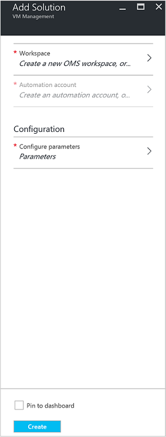
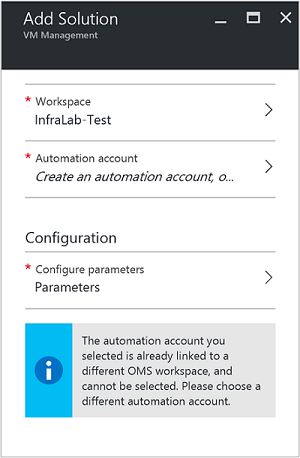
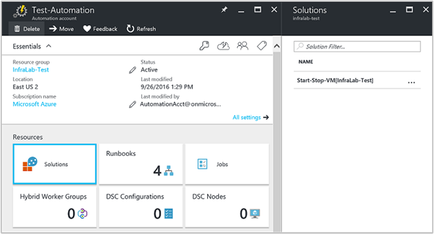
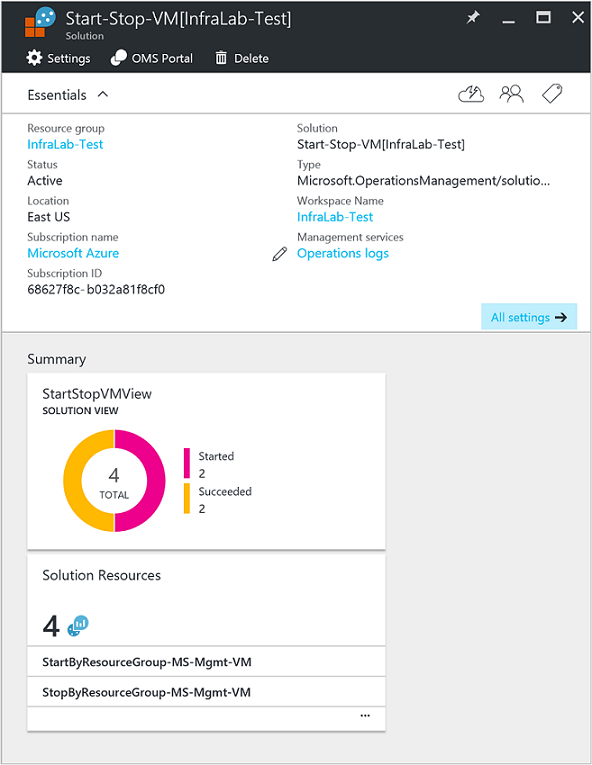

# Start/Stop VMs during off-hours [Preview] solution in Automation

The Start/Stop VMs during off-hours [Preview] solution starts and stops your Azure Resource Manager virtual machines on a user-defined schedule and provides insight into the success of the Automation jobs that start and stop your virtual machines with OMS Log Analytics.  

## Prerequisites

- The runbooks work with an [Azure Run As account](automation-offering-get-started.md#authentication-methods).  The Run As account is the preferred authentication method since it uses certificate authentication instead of a password that may expire or change frequently.  

- This solution can only manage VMs that are in the same subscription as where the Automation account resides.  

- This solution only deploys to the following Azure regions - Australia Southeast, East US, Southeast Asia, and West Europe.  The runbooks that manage the VM schedule can target VMs in any region.  

- To send email notifications when the start and stop VM runbooks complete, an Office 365  business-class subscription is required.  

## Solution components

This solution consists of the following resources that will be imported and added to your Automation account.

### Runbooks

Runbook | Description|
--------|------------|
CleanSolution-MS-Mgmt-VM | This runbook will remove all contained resources, and schedules when you go to delete the solution from your subscription.|  
SendMailO365-MS-Mgmt | This runbook sends an email through Office 365 Exchange.|
StartByResourceGroup-MS-Mgmt-VM | This runbook is intended to start VMs (both classic and ARM based VMs) that resides in a given list of Azure resource group(s).
StopByResourceGroup-MS-Mgmt-VM | This runbook is intended to stop VMs (both classic and ARM based VMs) that resides in a given list of Azure resource group(s).|
 

### Variables

Variable | Description|
---------|------------|
**SendMailO365-MS-Mgmt** Runbook ||
SendMailO365-IsSendEmail-MS-Mgmt | Specifies if StartByResourceGroup-MS-Mgmt-VM and StopByResourceGroup-MS-Mgmt-VM runbooks can send email notification upon completion.  Select **True** to enable and **False** to disable email alerting. Default value is **False**.| 
**StartByResourceGroup-MS-Mgmt-VM** Runbook ||
StartByResourceGroup-ExcludeList-MS-Mgmt-VM | Enter VM names to be excluded from management operation; separate names by using semi-colon(;) with no spaces. Values are case-sensitive and wildcard (asterisk) is supported.|
StartByResourceGroup-SendMailO365-EmailBodyPreFix-MS-Mgmt | Text that can be appended to the beginning of the email message body.|
StartByResourceGroup-SendMailO365-EmailRunBookAccount-MS-Mgmt | Specifies the name of the Automation Account that contains the Email runbook.  **Do not modify this variable.**|
StartByResourceGroup-SendMailO365-EmailRunbookName-MS-Mgmt | Specifies the name of the email runbook.  This is used by the StartByResourceGroup-MS-Mgmt-VM and StopByResourceGroup-MS-Mgmt-VM runbooks to send email.  **Do not modify this variable.**|
StartByResourceGroup-SendMailO365-EmailRunbookResourceGroup-MS-Mgmt | Specifies the name of the Resource group that contains the Email runbook.  **Do not modify this variable.**|
StartByResourceGroup-SendMailO365-EmailSubject-MS-Mgmt | Specifies the text for the subject line of the email.|  
StartByResourceGroup-SendMailO365-EmailToAddress-MS-Mgmt | Specifies the recipient(s) of the email.  Enter separate names by using semi-colon(;) with no spaces.|
StartByResourceGroup-TargetResourceGroups-MS-Mgmt-VM | Enter VM names to be excluded from management operation; separate names by using semi-colon(;) with no spaces. Values are case-sensitive and wildcard (asterisk) is supported.  Default value (asterisk) will include all resource groups in the subscription.|
StartByResourceGroup-TargetSubscriptionID-MS-Mgmt-VM | Specifies the subscription that contains VMs to be managed by this solution.  This must be the same subscription where the Automation account of this solution resides.|
**StopByResourceGroup-MS-Mgmt-VM** Runbook ||
StopByResourceGroup-ExcludeList-MS-Mgmt-VM | Enter VM names to be excluded from management operation; separate names by using semi-colon(;) with no spaces. Values are case-sensitive and wildcard (asterisk) is supported.|
StopByResourceGroup-SendMailO365-EmailBodyPreFix-MS-Mgmt | Text that can be appended to the beginning of the email message body.|
StopByResourceGroup-SendMailO365-EmailRunBookAccount-MS-Mgmt | Specifies the name of the Automation Account that contains the Email runbook.  **Do not modify this variable.**|
StopByResourceGroup-SendMailO365-EmailRunbookResourceGroup-MS-Mgmt | Specifies the name of the Resource group that contains the Email runbook.  **Do not modify this variable.**|
StopByResourceGroup-SendMailO365-EmailSubject-MS-Mgmt | Specifies the text for the subject line of the email.|  
StopByResourceGroup-SendMailO365-EmailToAddress-MS-Mgmt | Specifies the recipient(s) of the email.  Enter separate names by using semi-colon(;) with no spaces.|
StopByResourceGroup-TargetResourceGroups-MS-Mgmt-VM | Enter VM names to be excluded from management operation; separate names by using semi-colon(;) with no spaces. Values are case-sensitive and wildcard (asterisk) is supported.  Default value (asterisk) will include all resource groups in the subscription.|
StopByResourceGroup-TargetSubscriptionID-MS-Mgmt-VM | Specifies the subscription that contains VMs to be managed by this solution.  This must be the same subscription where the Automation account of this solution resides.|  
 

### Schedules

Schedule | Description|
---------|------------|
StartByResourceGroup-Schedule-MS-Mgmt | Schedule for StartByResourceGroup runbook, which performs the startup of VMs managed by this solution. When created, it defaults to UTC time zone.|
StopByResourceGroup-Schedule-MS-Mgmt | Schedule for StopByResourceGroup runbook, which performs the shutdown of VMs managed by this solution. When created, it defaults to UTC time zone.|

### Credentials

Credential | Description|
-----------|------------|
O365Credential | Specifies a valid Office 365 user account to send email.  Only required if variable SendMailO365-IsSendEmail-MS-Mgmt is set to **True**.

## Configuration

Perform the following steps to add the Start/Stop VMs during off-hours [Preview] solution to your Automation account and then configure the variables to customize the solution.

1. From the home-screen in the Azure portal, select the **Marketplace** tile.  If the tile is no longer pinned to your home-screen, from the left navigation pane, select **New**.  
2. In the Marketplace blade, type **Start VM** in the search box, and then select the solution **Start/Stop VMs during off-hours [Preview]** from the search results.  
3. In the **Start/Stop VMs during off-hours [Preview]** blade for the selected solution, review the summary information and then click **Create**.  
4. The **Add Solution** blade appears where you are prompted to configure the solution before you can import it into your Automation subscription.     
5.  On the **Add Solution** blade, select **Workspace** and here you select an OMS workspace that is linked to the same Azure subscription that the Automation account is in or create a new OMS workspace.  If you do not have an OMS workspace, you can select **Create New Workspace** and on the **OMS Workspace** blade perform the following: 
   - Specify a name for the new **OMS Workspace**.
   - Select a **Subscription** to link to by selecting from the drop-down list if the default selected is not appropriate.
   - For **Resource Group**, you can create a new resource group or select an existing resource group.  
   - Select a **Location**.  Currently the only locations provided for selection are **Australia Southeast**, **East US**, **Southeast Asia**, and **West Europe**.
   - Select a **Pricing tier**.  The solution is offered in two tiers: free and OMS paid tier.  The free tier has a limit on the amount of data collected daily, retention period, and runbook job runtime minutes.  The OMS paid tier does not have a limit on the amount of data collected daily.  

        > [!NOTE]
        > While the Standalone paid tier is displayed as an option, it is not applicable.  If you select it and proceed with the creation of this solution in your subscription, it will fail.  This will be addressed when this solution is officially released. If you use this solution, it will only use automation job minutes and log ingestion.  The solution does not add additional OMS nodes to your environment.  

6. After providing the required information on the **OMS workspace** blade, click **Create**.  While the information is verified and the workspace is created, you can track its progress under **Notifications** from the menu.  You will be returned to the **Add Solution** blade.  
7. On the **Add Solution** blade, select **Automation Account**.  If you are creating a new OMS workspace, you will be required to also create a new Automation account that will be associated with the new OMS workspace specified earlier, including your Azure subscription, resource group and region.  You can select **Create an Automation account** and on the **Add Automation account** blade, provide the following: 
  - In the **Name** field, enter the name of the Automation account.

    All other options are automatically populated based on the OMS workspace selected and these options cannot be modified.  An Azure Run As account is the default authentication method for the runbooks included in this solution.  Once you click **OK**, the configuration options are validated and the Automation account is created.  You can track its progress under **Notifications** from the menu. 

    Otherwise, you can select an existing Automation Run As account.  Note that the account you select cannot already be linked to another OMS workspace, otherwise a message will be presented in the blade to inform you.  If it is already linked, you will need to select a different Automation Run As account or create a new one.    

8. Finally on the **Add Solution** blade, select **Configuration** and the **Parameters** blade appears.  On the **Parameters** blade, you are prompted to:  
   - Specify the **Target ResourceGroup Names**, which is a resource group name that contains VMs to be managed by this solution.  You can enter more than one name and separate each using a semi-colon (values are case-sensitive).  Using a wildcard is supported if you want to target VMs in all resource groups in the subscription.
   - Select a **Schedule** which is a recurring date and time for starting and stopping the VM's in the target resource group(s).  By default, the schedule is configured to the UTC time zone and selecting a different region is not available.  If you wish to configure the schedule to your specific time zone after configuring the solution, see [Modifying the startup and shutdown schedule](#modifying-the-startup-and-shutdown-schedule) below.    

10. Once you have completed configuring the initial settings required for the solution, select **Create**.  All settings will be validated and then it will attempt to deploy the solution in your subscription.  This process can take several seconds to complete and you can track its progress under **Notifications** from the menu. 

## Collection frequency

Automation job log and job stream data is ingested into the OMS repository every five minutes.  

## Using the solution

When you add the VM Management solution, in your OMS workspace the **StartStopVM View** tile will be added to your OMS dashboard.  This tile displays a count and graphical representation of the runbooks jobs for the solution that have started and have completed successfully.     

In your Automation account, you can access and manage the solution by selecting the **Solutions** tile and then from the **Solutions** blade, selecting the solution **Start-Stop-VM[Workspace]** from the list.     

Selecting the solution will display the **Start-Stop-VM[Workspace]** solution blade, where you can review important details such as the **StartStopVM** tile, like in your OMS workspace, which displays a count and graphical representation of the runbooks jobs for the solution that have started and have completed successfully.     

From here you can also open your OMS workspace and perform further analysis of the job records.  Just click **All settings**, and in the **Settings** blade, select **Quick Start** and then in the **Quick Start** blade select **OMS Portal**.   This will open a new tab or new browser session and present your OMS workspace associated with your Automation account and subscription.  

### Configuring e-mail notifications

To enable email notifications when the start and stop VM runbooks complete, you will need to modify the **O365Credential** credential and at a minimum, the following variables:

 - SendMailO365-IsSendEmail-MS-Mgmt
 - StartByResourceGroup-SendMailO365-EmailToAddress-MS-Mgmt
 - StopByResourceGroup-SendMailO365-EmailToAddress-MS-Mgmt

To configure the **O365Credential** credential, perform the following steps:

1. From your automation account, click **All Settings** at the top of the window. 
2. On the **Settings** blade under the section **Automation Resources**, select **Assets**. 
3. On the **Assets** blade, select the **Credential** tile and from the **Credential** blade, select the **O365Credential**.  
4. Enter a valid Office 365 username and password and then click **Save** to save your changes.  

To configure the variables highlighted earlier, perform the following steps:

1. From your automation account, click **All Settings** at the top of the window. 
2. On the **Settings** blade under the section **Automation Resources**, select **Assets**. 
3. On the **Assets** blade, select the **Variables** tile and from the **Variables** blade, select the variable listed above and then modify its value following the description for it specified in the [variable](##variables) section earlier.  
4. Click **Save** to save the changes to the variable.   

### Modifying the startup and shutdown schedule

Managing the startup and shutdown schedule in this solution follows the same steps as outlined in [Scheduling a runbook in Azure Automation](automation-schedules.md).  Remember, you cannot modify the schedule configuration.  You will need to disable the existing schedule and then create a new one and then link to the **StartByResourceGroup-MS-Mgmt-VM** or **StopByResourceGroup-MS-Mgmt-VM** runbook that you want the schedule to apply to.   

## Log Analytics records

Automation creates two types of records in the OMS repository.

### Job logs

Property | Description|
----------|----------|
Caller |  Who initiated the operation.  Possible values are either an email address or system for scheduled jobs.|
Category | Classification of the type of data.  For Automation, the value is JobLogs.|
CorrelationId | GUID that is the Correlation Id of the runbook job.|
JobId | GUID that is the Id of the runbook job.|
operationName | Specifies the type of operation performed in Azure.  For Automation, the value will be Job.|
resourceId | Specifies the resource type in Azure.  For Automation, the value is the Automation account associated with the runbook.|
ResourceGroup | Specifies the resource group  name of the runbook job.|
ResourceProvider | Specifies the Azure service that supplies the resources you can deploy and manage.  For Automation, the value is Azure Automation.|
ResourceType | Specifies the resource type in Azure.  For Automation, the value is the Automation account associated with the runbook.|
resultType | The status of the runbook job.  Possible values are: - Started - Stopped - Suspended - Failed - Succeeded|
resultDescription | Describes the runbook job result state.  Possible values are: - Job is started - Job Failed - Job Completed|
RunbookName | Specifies the name of the runbook.|
SourceSystem | Specifies the source system for the data submitted.  For Automation, the value will be :OpsManager|
StreamType | Specifies the type of event. Possible values are: - Verbose - Output - Error - Warning|
SubscriptionId | Specifies the subscription ID of the job.
Time | Date and time when the runbook job executed.|

### Job streams

Property | Description|
----------|----------|
Caller |  Who initiated the operation.  Possible values are either an email address or system for scheduled jobs.|
Category | Classification of the type of data.  For Automation, the value is JobStreams.|
JobId | GUID that is the Id of the runbook job.|
operationName | Specifies the type of operation performed in Azure.  For Automation, the value will be Job.|
ResourceGroup | Specifies the resource group  name of the runbook job.|
resourceId | Specifies the resource Id in Azure.  For Automation, the value is the Automation account associated with the runbook.|
ResourceProvider | Specifies the Azure service that supplies the resources you can deploy and manage.  For Automation, the value is Azure Automation.|
ResourceType | Specifies the resource type in Azure.  For Automation, the value is the Automation account associated with the runbook.|
resultType | The result of the runbook job at the time the event was generated.  Possible values are: - InProgress|
resultDescription | Includes the output stream from the runbook.|
RunbookName | The name of the runbook.|
SourceSystem | Specifies the source system for the data submitted.  For Automation, the value will be OpsManager|
StreamType | The type of job stream. Possible values are: -Progress - Output - Warning - Error - Debug - Verbose|
Time | Date and time when the runbook job executed.|

When you perform any log search that returns records of category of **JobLogs** or **JobStreams**, you can select the **JobLogs** or **JobStreams** view which displays a set of tiles summarizing the updates returned by the search.

## Sample log searches

The following table provides sample log searches for job records collected by this solution. 

Query | Description|
----------|----------|
Find jobs for runbook StartVM that have completed successfully | Category=JobLogs RunbookName_s="StartByResourceGroup-MS-Mgmt-VM" ResultType=Succeeded &#124; measure count() by JobId_g|
Find jobs for runbook StopVM that have completed successfully | Category=JobLogs RunbookName_s="StartByResourceGroup-MS-Mgmt-VM" ResultType=Failed &#124; measure count() by JobId_g
Show job status over time for StartVM and StopVM runbooks | Category=JobLogs RunbookName_s="StartByResourceGroup-MS-Mgmt-VM" OR "StopByResourceGroup-MS-Mgmt-VM" NOT(ResultType="started") | measure Count() by ResultType interval 1day|

## Removing the solution

If you decide you no longer need to use the solution any further, you can delete it from the Automation account.  Deleting the solution will only remove the runbooks, it will not delete the schedules or variables that were created when the solution was added.  Those assets you will need to delete manually if you are not using them with other runbooks.  

To delete the solution, perform the following steps:

1.  From your automation account, select the **Solutions** tile.  
2.  On the **Solutions** blade, select the solution **Start-Stop-VM[Workspace]**.  On the **VMManagementSolution[Workspace]** blade, from the menu click **Delete**.   
3.  In the **Delete Solution** window, confirm you want to delete the solution.
4.  While the information is verified and the solution is deleted, you can track its progress under **Notifications** from the menu.  You will be returned to the **VMManagementSolution[Workspace]** blade after the process to remove solution starts.  

The Automation account and OMS workspace are not deleted as part of this process.  If you do not want to retain the OMS workspace, you will need to manually delete it.  This can be accomplished also from the Azure portal.   From the home-screen in the Azure portal, select **Log Analytics** and then on the **Log Analytics** blade, select the workspace and click **Delete** from the menu on the workspace settings blade.  
      
## Next steps

- To learn more about how to construct different search queries and review the Automation job logs with Log Analytics, see [Log searches in Log Analytics](../log-analytics/log-analytics-log-searches.md)
- To learn more about runbook execution, how to monitor runbook jobs, and other technical details, see [Track a runbook job](automation-runbook-execution.md)
- To learn more about OMS Log Analytics and data collection sources, see [Collecting Azure storage data in Log Analytics overview](../log-analytics/log-analytics-azure-storage.md)

   

