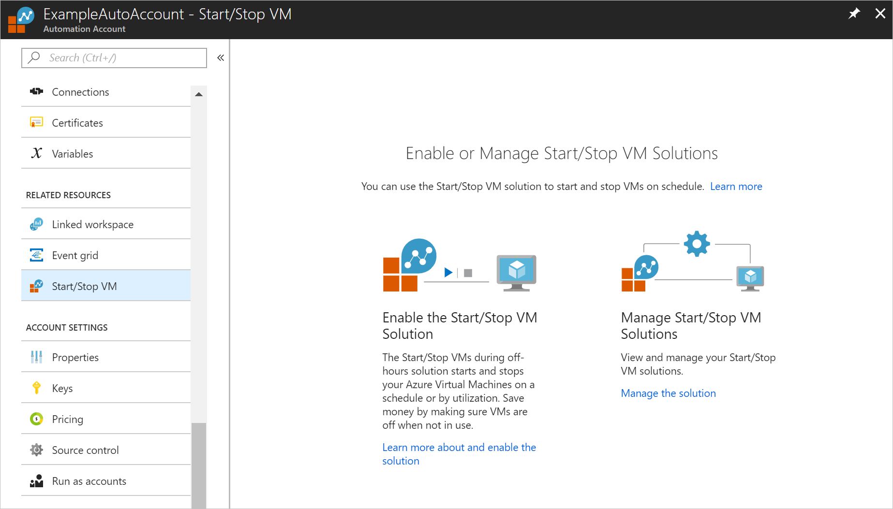
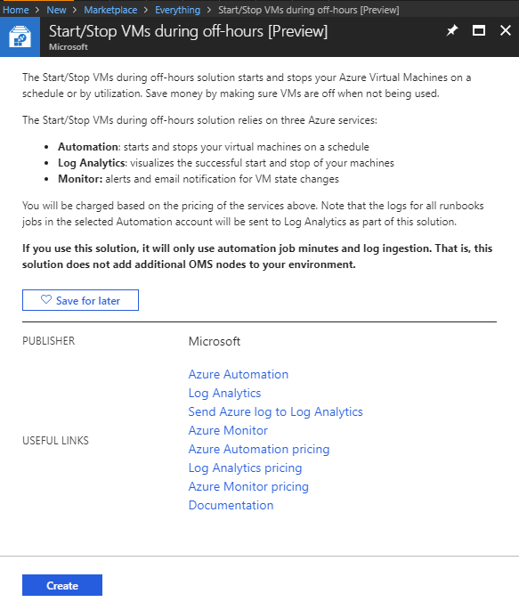
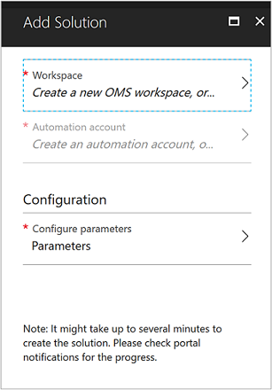
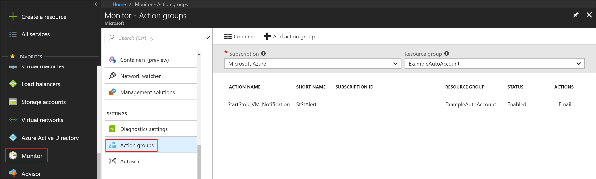
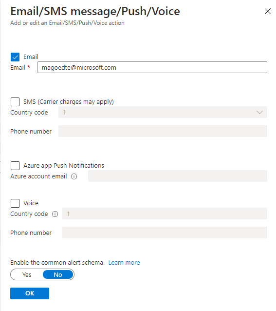
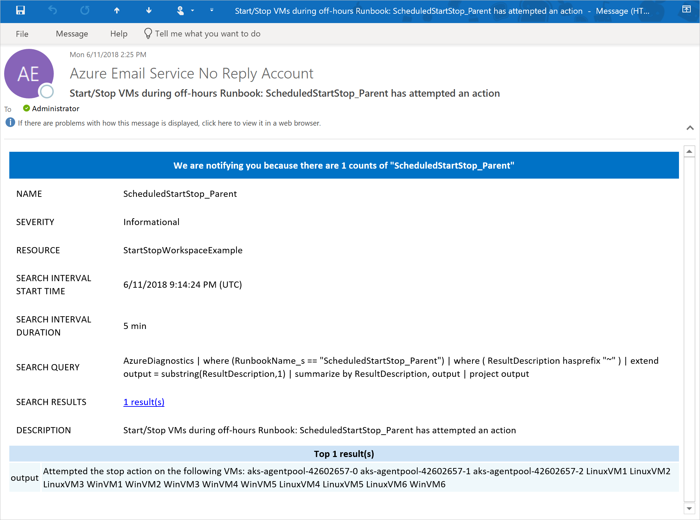

# Start/Stop VMs during off-hours solution in Azure Automation

The Start/Stop VMs during off-hours solution starts and stops your Azure virtual machines on user-defined schedules, provides insights through Azure Monitor logs, and sends optional emails by using [action groups](../azure-monitor/platform/action-groups.md). It supports both Azure Resource Manager and classic VMs for most scenarios.

> [!NOTE]
> The Start/Stop VMs during off-hours solution has been tested with the Azure modules that are imported into your Automation Account when you deploy the solution. The solution does currently not work with newer versions of the Azure module. This only affects the Automation Account that you use to run the Start/Stop VMs during off-hours solution. You can still use newer versions of the Azure module in your other Automation Accounts, as described in [How to update Azure PowerShell modules in Azure Automation](automation-update-azure-modules.md)

This solution provides a decentralized low-cost automation option for users who want to optimize their VM costs. With this solution, you can:

- Schedule VMs to start and stop.
- Schedule VMs to start and stop in ascending order by using Azure Tags (not supported for classic VMs).
- Autostop VMs based on low CPU usage.

The following are limitations to the current solution:

- This solution manages VMs in any region, but can only be used in the same subscription as your Azure Automation account.
- This solution is available in Azure and AzureGov to any region that supports a Log Analytics workspace, an Azure Automation account, and Alerts. AzureGov regions currently do not support email functionality.

> [!NOTE]
> If you are using the solution for classic VMs, then all your VMs will be processed sequentially per cloud service. Virtual machines are still processed in parallel across different cloud services.
>
> Azure Cloud Solution Provider (Azure CSP) subscriptions support only the Azure Resource Manager model, non-Azure Resource Manager services are not available in the program. When the Start/Stop solution runs you may receive errors as it has cmdlets to manage classic resources. To learn more about CSP, see [Available services in CSP subscriptions](https://docs.microsoft.com/azure/cloud-solution-provider/overview/azure-csp-available-services#comments). If you use a CSP subscription, you should modify the [**External_EnableClassicVMs**](#variables) variable to **False** after deployment.

[!INCLUDE [azure-monitor-log-analytics-rebrand](../../includes/azure-monitor-log-analytics-rebrand.md)]

## Prerequisites

The runbooks for this solution work with an [Azure Run As account](automation-create-runas-account.md). The Run As account is the preferred authentication method, because it uses certificate authentication instead of a password that might expire or change frequently.

It is recommended to use a separate Automation Account for the Start/Stop VM solution. This is because Azure module versions are frequently upgraded, and their parameters may change. The Start/Stop VM solution is not upgraded on the same cadence so it may not work with newer versions of the cmdlets that it uses. It is recommended to test module updates in a test Automation Account prior to importing them in your production Automation Account.

### Permissions needed to deploy

There are certain permissions that a user must have to deploy the Start/Stop VMs during off hours solution. These permissions are different if using a pre-created Automation Account and Log Analytics workspace or creating new ones during deployment. If you are a Contributor on the subscription and a Global Administrator in your Azure Active Directory tenant, you do not need to configure the following permissions. If you do not have those rights or need to configure a custom role, see the permissions required below.

#### Pre-existing Automation Account and Log Analytics account

To deploy the Start/Stop VMs during off hours solution to an Automation Account and Log Analytics the user deploying the solution requires the following permissions on the **Resource Group**. To learn more about roles, see [Custom roles for Azure resources](../role-based-access-control/custom-roles.md).

| Permission | Scope|
| --- | --- |
| Microsoft.Automation/automationAccounts/read | Resource Group |
| Microsoft.Automation/automationAccounts/variables/write | Resource Group |
| Microsoft.Automation/automationAccounts/schedules/write | Resource Group |
| Microsoft.Automation/automationAccounts/runbooks/write | Resource Group |
| Microsoft.Automation/automationAccounts/connections/write | Resource Group |
| Microsoft.Automation/automationAccounts/certificates/write | Resource Group |
| Microsoft.Automation/automationAccounts/modules/write | Resource Group |
| Microsoft.Automation/automationAccounts/modules/read | Resource Group |
| Microsoft.automation/automationAccounts/jobSchedules/write | Resource Group |
| Microsoft.Automation/automationAccounts/jobs/write | Resource Group |
| Microsoft.Automation/automationAccounts/jobs/read | Resource Group |
| Microsoft.OperationsManagement/solutions/write | Resource Group |
| Microsoft.OperationalInsights/workspaces/* | Resource Group |
| Microsoft.Insights/diagnosticSettings/write | Resource Group |
| Microsoft.Insights/ActionGroups/Write | Resource Group |
| Microsoft.Insights/ActionGroups/read | Resource Group |
| Microsoft.Resources/subscriptions/resourceGroups/read | Resource Group |
| Microsoft.Resources/deployments/* | Resource Group |

#### New Automation Account and a new Log Analytics workspace

To deploy the Start/Stop VMs during off hours solution to a new Automation Account and Log Analytics workspace the user deploying the solution needs the permissions defined in the preceding section as well as the following permissions:

- Co-administrator on subscription - This is only needed to create the Classic Run As Account
- Be part of the [Azure Active Directory](../active-directory/users-groups-roles/directory-assign-admin-roles.md) **Application Developer** role. For more details on configuring Run As Accounts, see [Permissions to configure Run As accounts](manage-runas-account.md#permissions).
- Contributor on the subscription or the following permissions.

| Permission |Scope|
| --- | --- |
| Microsoft.Authorization/Operations/read | Subscription|
| Microsoft.Authorization/permissions/read |Subscription|
| Microsoft.Authorization/roleAssignments/read | Subscription |
| Microsoft.Authorization/roleAssignments/write | Subscription |
| Microsoft.Authorization/roleAssignments/delete | Subscription |
| Microsoft.Automation/automationAccounts/connections/read | Resource Group |
| Microsoft.Automation/automationAccounts/certificates/read | Resource Group |
| Microsoft.Automation/automationAccounts/write | Resource Group |
| Microsoft.OperationalInsights/workspaces/write | Resource Group |

## Deploy the solution

Perform the following steps to add the Start/Stop VMs during off-hours solution to your Automation account, and then configure the variables to customize the solution.

1. From an Automation Account, select **Start/Stop VM** under **Related Resources**. From here, you can click **Learn more about and enable the solution**. If you already have a Start/Stop VM solution deployed, you can select it by clicking **Manage the solution** and finding it in the list.

   

   > [!NOTE]
   > You can also create it from anywhere in the Azure portal, by clicking **Create a resource**. In the Marketplace page, type a keyword such as **Start** or **Start/Stop**. As you begin typing, the list filters based on your input. Alternatively, you can type in one or more keywords from the full name of the solution and then press Enter. Select **Start/Stop VMs during off-hours** from the search results.

2. In the **Start/Stop VMs during off-hours** page for the selected solution, review the summary information and then click **Create**.

   

3. The **Add Solution** page appears. You are prompted to configure the solution before you can import it into your Automation subscription.

   

4. On the **Add Solution** page, select **Workspace**. Select a Log Analytics workspace that's linked to the same Azure subscription that the Automation account is in. If you don't have a workspace, select **Create New Workspace**. On the **Log Analytics workspace** page, perform the following steps:
   - Specify a name for the new **Log Analytics workspace**, such as "ContosoLAWorkspace".
   - Select a **Subscription** to link to by selecting from the drop-down list, if the default selected is not appropriate.
   - For **Resource Group**, you can create a new resource group or select an existing one.
   - Select a **Location**. Currently, the only locations available are **Australia Southeast**, **Canada Central**, **Central India**, **East US**, **Japan East**, **Southeast Asia**, **UK South**, **West Europe**, and **West US 2**.
   - Select a **Pricing tier**. Choose the **Per GB (Standalone)** option. Azure Monitor logs has updated [pricing](https://azure.microsoft.com/pricing/details/log-analytics/) and the Per GB tier is the only option.

   > [!NOTE]
   > When enabling solutions, only certain regions are supported for linking a Log Analytics workspace and an Automation Account.
   >
   > For a list of the supported mapping pairs, see [Region mapping for Automation Account and Log Analytics workspace](how-to/region-mappings.md).

5. After providing the required information on the **Log Analytics workspace** page, click **Create**. You can track its progress under **Notifications** from the menu, which returns you to the **Add Solution** page when done.
6. On the **Add Solution** page, select **Automation account**. If you're creating a new Log Analytics workspace, you can create a new Automation account to be associated with it, or select an existing Automation Account that is not already linked to a Log Analytics workspace. Select an existing Automation Account or click **Create an Automation account**, and on the **Add Automation account** page, provide the following information:
   - In the **Name** field, enter the name of the Automation account.

     All other options are automatically populated based on the Log Analytics workspace selected. These options cannot be modified. An Azure Run As account is the default authentication method for the runbooks included in this solution. After you click **OK**, the configuration options are validated and the Automation account is created. You can track its progress under **Notifications** from the menu.

7. Finally, on the **Add Solution** page, select **Configuration**. The **Parameters** page appears.

   

   Here, you're prompted to:
   - Specify the **Target ResourceGroup Names**. These values are resource group names that contain VMs to be managed by this solution. You can enter more than one name and separate each by using a comma (values are not case-sensitive). Using a wildcard is supported if you want to target VMs in all resource groups in the subscription. This value is stored in the **External_Start_ResourceGroupNames** and **External_Stop_ResourceGroupNames** variables.
   - Specify the **VM Exclude List (string)**. This value is the name of one or more virtual machines from the target resource group. You can enter more than one name and separate each by using a comma (values are not case-sensitive). Using a wildcard is supported. This value is stored in the **External_ExcludeVMNames** variable.
   - Select a **Schedule**. Select a date and time for your schedule. A reoccurring daily schedule will be created starting with the time that you selected. Selecting a different region is not available. To configure the schedule to your specific time zone after configuring the solution, see [Modifying the startup and shutdown schedule](#modify-the-startup-and-shutdown-schedules).
   - To receive **Email notifications** from an action group, accept the default value of **Yes** and provide a valid email address. If you select **No** but decide at a later date that you want to receive email notifications, you can update the [action group](../azure-monitor/platform/action-groups.md) that is created with valid email addresses separated by a comma. You also need to enable the following alert rules:

     - AutoStop_VM_Child
     - Scheduled_StartStop_Parent
     - Sequenced_StartStop_Parent

     > [!IMPORTANT]
     > The default value for **Target ResourceGroup Names** is a **&ast;**. This targets all VMs in a subscription. If you do not want the solution to target all the VMs in your subscription this value needs to be updated to a list of resource group names prior to enabling the schedules.

8. After you have configured the initial settings required for the solution, click **OK** to close the **Parameters** page and select **Create**. After all settings are validated, the solution is deployed to your subscription. This process can take several seconds to finish, and you can track its progress under **Notifications** from the menu.

> [!NOTE]
> If you have an Azure Cloud Solution Provider (Azure CSP) subscription, after deployment is complete, in your Automation Account, go to **Variables** under **Shared Resources** and set the [**External_EnableClassicVMs**](#variables) variable to **False**. This stops the solution from looking for Classic VM resources.

## Scenarios

The solution contains three distinct scenarios. These scenarios are:

### Scenario 1: Start/Stop VMs on a schedule

This scenario is the default configuration when you first deploy the solution. For example, you can configure it to stop all VMs across a subscription when you leave work in the evening, and start them in the morning when you are back in the office. When you configure the schedules **Scheduled-StartVM** and **Scheduled-StopVM** during deployment, they start and stop targeted VMs. Configuring this solution to just stop VMs is supported, see [Modify the startup and shutdown schedules](#modify-the-startup-and-shutdown-schedules) to learn how to configure a custom schedule.

> [!NOTE]
> The time zone is your current time zone when you configure the schedule time parameter. However, it is stored in UTC format in Azure Automation. You do not have to do any time zone conversion as this is handled during the deployment.

You control which VMs are in scope by configuring the following variables: **External_Start_ResourceGroupNames**, **External_Stop_ResourceGroupNames**, and **External_ExcludeVMNames**.

You can enable either targeting the action against a subscription and resource group, or targeting a specific list of VMs, but not both.

#### Target the start and stop actions against a subscription and resource group

1. Configure the **External_Stop_ResourceGroupNames** and **External_ExcludeVMNames** variables to specify the target VMs.
2. Enable and update the **Scheduled-StartVM** and **Scheduled-StopVM** schedules.
3. Run the **ScheduledStartStop_Parent** runbook with the ACTION parameter set to **start** and the WHATIF parameter set to **True** to preview your changes.

#### Target the start and stop action by VM list

1. Run the **ScheduledStartStop_Parent** runbook with the ACTION parameter set to **start**, add a comma-separated list of VMs in the *VMList* parameter, and then set the WHATIF parameter to **True**. Preview your changes.
1. Configure the **External_ExcludeVMNames** parameter with a comma-separated list of VMs (VM1, VM2, VM3).
1. This scenario does not honor the **External_Start_ResourceGroupNames** and **External_Stop_ResourceGroupnames** variables. For this scenario, you need to create your own Automation schedule. For details, see [Scheduling a runbook in Azure Automation](../automation/automation-schedules.md).

> [!NOTE]
> The value for **Target ResourceGroup Names** is stored as the value for both **External_Start_ResourceGroupNames** and **External_Stop_ResourceGroupNames**. For further granularity, you can modify each of these variables to target different resource groups. For start action, use **External_Start_ResourceGroupNames**, and for stop action, use **External_Stop_ResourceGroupNames**. VMs are automatically added to the start and stop schedules.

### Scenario 2: Start/Stop VMS in sequence by using tags

In an environment that includes two or more components on multiple VMs supporting a distributed workload, supporting the sequence in which components are started and stopped in order is important. You can accomplish this scenario by performing the following steps:

#### Target the start and stop actions against a subscription and resource group

1. Add a **sequencestart** and a **sequencestop** tag with a positive integer value to VMs that are targeted in **External_Start_ResourceGroupNames** and **External_Stop_ResourceGroupNames** variables. The start and stop actions are performed in ascending order. To learn how to tag a VM, see [Tag a Windows Virtual Machine in Azure](../virtual-machines/windows/tag.md) and [Tag a Linux Virtual Machine in Azure](../virtual-machines/linux/tag.md).
1. Modify the schedules **Sequenced-StartVM** and **Sequenced-StopVM** to the date and time that meet your requirements and enable the schedule.
1. Run the **SequencedStartStop_Parent** runbook with the ACTION parameter set to **start** and the WHATIF parameter set to **True** to preview your changes.
1. Preview the action and make any necessary changes before implementing against production VMs. When ready, manually execute the runbook with the parameter set to **False**, or let the Automation schedule **Sequenced-StartVM** and **Sequenced-StopVM** run automatically following your prescribed schedule.

#### Target the start and stop action by VM list

1. Add a **sequencestart** and a **sequencestop** tag with a positive integer value to VMs you plan to add to the **VMList** parameter.
1. Run the **SequencedStartStop_Parent** runbook with the ACTION parameter set to **start**, add a comma-separated list of VMs in the *VMList* parameter, and then set the WHATIF parameter to **True**. Preview your changes.
1. Configure the **External_ExcludeVMNames** parameter with a comma-separated list of VMs (VM1, VM2, VM3).
1. This scenario does not honor the **External_Start_ResourceGroupNames** and **External_Stop_ResourceGroupnames** variables. For this scenario, you need to create your own Automation schedule. For details, see [Scheduling a runbook in Azure Automation](../automation/automation-schedules.md).
1. Preview the action and make any necessary changes before implementing against production VMs. When ready, manually execute the monitoring-and-diagnostics/monitoring-action-groupsrunbook with the parameter set to **False**, or let the Automation schedule **Sequenced-StartVM** and **Sequenced-StopVM** run automatically following your prescribed schedule.

### Scenario 3: Start/Stop automatically based on CPU utilization

This solution can help manage the cost of running virtual machines in your subscription by evaluating Azure VMs that aren't used during non-peak periods, such as after hours, and automatically shutting them down if processor utilization is less than x%.

By default, the solution is pre-configured to evaluate the percentage CPU metric to see if average utilization is 5 percent or less. This scenario is controlled by the following variables and can be modified if the default values do not meet your requirements:

- External_AutoStop_MetricName
- External_AutoStop_Threshold
- External_AutoStop_TimeAggregationOperator
- External_AutoStop_TimeWindow

You can enable either targeting the action against a subscription and resource group, or targeting a specific list of VMs, but not both.

#### Target the stop action against a subscription and resource group

1. Configure the **External_Stop_ResourceGroupNames** and **External_ExcludeVMNames** variables to specify the target VMs.
1. Enable and update the **Schedule_AutoStop_CreateAlert_Parent** schedule.
1. Run the **AutoStop_CreateAlert_Parent** runbook with the ACTION parameter set to **start** and the WHATIF parameter set to **True** to preview your changes.

#### Target the start and stop action by VM list

1. Run the **AutoStop_CreateAlert_Parent** runbook with the ACTION parameter set to **start**, add a comma-separated list of VMs in the *VMList* parameter, and then set the WHATIF parameter to **True**. Preview your changes.
1. Configure the **External_ExcludeVMNames** parameter with a comma-separated list of VMs (VM1, VM2, VM3).
1. This scenario does not honor the **External_Start_ResourceGroupNames** and **External_Stop_ResourceGroupnames** variables. For this scenario, you need to create your own Automation schedule. For details, see [Scheduling a runbook in Azure Automation](../automation/automation-schedules.md).

Now that you have a schedule for stopping VMs based on CPU utilization, you need to enable one of the following schedules to start them.

- Target start action by subscription and resource group. See the steps in [Scenario 1](#scenario-1-startstop-vms-on-a-schedule) for testing and enabling **Scheduled-StartVM** schedules.
- Target start action by subscription, resource group, and tag. See the steps in [Scenario 2](#scenario-2-startstop-vms-in-sequence-by-using-tags) for testing and enabling **Sequenced-StartVM** schedules.

## Solution components

This solution includes preconfigured runbooks, schedules, and integration with Azure Monitor logs so you can tailor the startup and shutdown of your virtual machines to suit your business needs.

### Runbooks

The following table lists the runbooks deployed to your Automation account by this solution. Do not make changes to the runbook code. Instead, write your own runbook for new functionality.

> [!IMPORTANT]
> Do not directly run any runbook with "child" appended to its name.

All parent runbooks include the _WhatIf_ parameter. When set to **True**, _WhatIf_ supports detailing the exact behavior the runbook takes when run without the _WhatIf_ parameter and validates the correct VMs are being targeted. A runbook only performs its defined actions when the _WhatIf_ parameter is set to **False**.

|Runbook | Parameters | Description|
| --- | --- | ---|
|AutoStop_CreateAlert_Child | VMObject   AlertAction   WebHookURI | Called from the parent runbook. This runbook creates alerts on a per-resource basis for the AutoStop scenario.|
|AutoStop_CreateAlert_Parent | VMList  WhatIf: True or False  | Creates or updates Azure alert rules on VMs in the targeted subscription or resource groups.   VMList: Comma-separated list of VMs. For example, _vm1, vm2, vm3_.  *WhatIf* validates the runbook logic without executing.|
|AutoStop_Disable | none | Disables AutoStop alerts and default schedule.|
|AutoStop_StopVM_Child | WebHookData | Called from the parent runbook. Alert rules call this runbook to stop the VM.|
|Bootstrap_Main | none | Used one time to set up bootstrap configurations such as webhookURI, which are typically not accessible from Azure Resource Manager. This runbook is removed automatically upon successful deployment.|
|ScheduledStartStop_Child | VMName   Action: Start or Stop   ResourceGroupName | Called from the parent runbook. Executes a start or stop action for the scheduled stop.|
|ScheduledStartStop_Parent | Action: Start or Stop  VMList   WhatIf: True or False | This setting affects all VMs in the subscription. Edit the **External_Start_ResourceGroupNames** and **External_Stop_ResourceGroupNames** to only execute on these targeted resource groups. You can also exclude specific VMs by updating the **External_ExcludeVMNames** variable.  VMList: Comma-separated list of VMs. For example, _vm1, vm2, vm3_.  _WhatIf_ validates the runbook logic without executing.|
|SequencedStartStop_Parent | Action: Start or Stop   WhatIf: True or False VMList| Create tags named **sequencestart** and **sequencestop** on each VM for which you want to sequence start/stop activity. These tag names are case-sensitive. The value of the tag should be a positive integer (1, 2, 3) that corresponds to the order in which you want to start or stop.   VMList: Comma-separated list of VMs. For example, _vm1, vm2, vm3_.   _WhatIf_ validates the runbook logic without executing.   **Note**: VMs must be within resource groups defined as External_Start_ResourceGroupNames, External_Stop_ResourceGroupNames, and External_ExcludeVMNames in Azure Automation variables. They must have the appropriate tags for actions to take effect.|

### Variables

The following table lists the variables created in your Automation account. Only modify variables prefixed with **External**. Modifying variables prefixed with **Internal** causes undesirable effects.

|Variable | Description|
|---------|------------|
|External_AutoStop_Condition | The conditional operator required for configuring the condition before triggering an alert. Acceptable values are **GreaterThan**, **GreaterThanOrEqual**, **LessThan**, and **LessThanOrEqual**.|
|External_AutoStop_Description | The alert to stop the VM if the CPU percentage exceeds the threshold.|
|External_AutoStop_MetricName | The name of the performance metric for which the Azure Alert rule is to be configured.|
|External_AutoStop_Threshold | The threshold for the Azure Alert rule specified in the variable _External_AutoStop_MetricName_. Percentage values can range from 1 to 100.|
|External_AutoStop_TimeAggregationOperator | The time aggregation operator, which is applied to the selected window size to evaluate the condition. Acceptable values are **Average**, **Minimum**, **Maximum**, **Total**, and **Last**.|
|External_AutoStop_TimeWindow | The window size during which Azure analyzes selected metrics for triggering an alert. This parameter accepts input in timespan format. Possible values are from 5 minutes to 6 hours.|
|External_EnableClassicVMs| Specifies whether Classic VMs are targeted by the solution. The default value is True. This should be set to False for CSP subscriptions.|
|External_ExcludeVMNames | Enter VM names to be excluded, separating names by using a comma with no spaces. This is limited to 140 VMs. If you add more than 140 VMs to this comma separated list, VMs that are set to be excluded may be inadvertently started or stopped.|
|External_Start_ResourceGroupNames | Specifies one or more resource groups, separating values by using a comma, targeted for start actions.|
|External_Stop_ResourceGroupNames | Specifies one or more resource groups, separating values by using a comma, targeted for stop actions.|
|Internal_AutomationAccountName | Specifies the name of the Automation account.|
|Internal_AutoSnooze_WebhookUri | Specifies Webhook URI called for the AutoStop scenario.|
|Internal_AzureSubscriptionId | Specifies the Azure Subscription ID.|
|Internal_ResourceGroupName | Specifies the Automation account resource group name.|

Across all scenarios, the **External_Start_ResourceGroupNames**,  **External_Stop_ResourceGroupNames**, and **External_ExcludeVMNames** variables are necessary for targeting VMs, with the exception of providing a comma-separated list of VMs for the **AutoStop_CreateAlert_Parent**, **SequencedStartStop_Parent**, and **ScheduledStartStop_Parent** runbooks. That is, your VMs must reside in target resource groups for start and stop actions to occur. The logic works similar to Azure policy, in that you can target the subscription or resource group and have actions inherited by newly created VMs. This approach avoids having to maintain a separate schedule for every VM and manage starts and stops in scale.

### Schedules

The following table lists each of the default schedules created in your Automation account. You can modify them or create your own custom schedules. By default, all of the schedules are disabled except for **Scheduled_StartVM** and **Scheduled_StopVM**.

You should not enable all schedules, because this might create overlapping schedule actions. It's best to determine which optimizations you want to perform and modify accordingly. See the example scenarios in the overview section for further explanation.

|Schedule name | Frequency | Description|
|--- | --- | ---|
|Schedule_AutoStop_CreateAlert_Parent | Every 8 hours | Runs the AutoStop_CreateAlert_Parent runbook every 8 hours, which in turn stops the VM-based values in External_Start_ResourceGroupNames, External_Stop_ResourceGroupNames, and External_ExcludeVMNames in Azure Automation variables. Alternatively, you can specify a comma-separated list of VMs by using the VMList parameter.|
|Scheduled_StopVM | User defined, daily | Runs the Scheduled_Parent runbook with a parameter of _Stop_ every day at the specified time. Automatically stops all VMs that meet the rules defined by asset variables. Enable the related schedule, **Scheduled-StartVM**.|
|Scheduled_StartVM | User defined, daily | Runs the Scheduled_Parent runbook with a parameter of _Start_ every day at the specified time. Automatically starts all VMs that meet the rules defined by the appropriate variables. Enable the related schedule, **Scheduled-StopVM**.|
|Sequenced-StopVM | 1:00 AM (UTC), every Friday | Runs the Sequenced_Parent runbook with a parameter of _Stop_ every Friday at the specified time. Sequentially (ascending) stops all VMs with a tag of **SequenceStop** defined by the appropriate variables. For more information on tag values and asset variables, see the Runbooks section. Enable the related schedule, **Sequenced-StartVM**.|
|Sequenced-StartVM | 1:00 PM (UTC), every Monday | Runs the Sequenced_Parent runbook with a parameter of _Start_ every Monday at the specified time. Sequentially (descending) starts all VMs with a tag of **SequenceStart** defined by the appropriate variables. For more information on tag values and asset variables, see the Runbooks section. Enable the related schedule, **Sequenced-StopVM**.|

## Azure Monitor logs records

Automation creates two types of records in the Log Analytics workspace: job logs and job streams.

### Job logs

|Property | Description|
|----------|----------|
|Caller |  Who initiated the operation. Possible values are either an email address or system for scheduled jobs.|
|Category | Classification of the type of data. For Automation, the value is JobLogs.|
|CorrelationId | GUID that is the Correlation ID of the runbook job.|
|JobId | GUID that is the ID of the runbook job.|
|operationName | Specifies the type of operation performed in Azure. For Automation, the value is Job.|
|resourceId | Specifies the resource type in Azure. For Automation, the value is the Automation account associated with the runbook.|
|ResourceGroup | Specifies the resource group  name of the runbook job.|
|ResourceProvider | Specifies the Azure service that supplies the resources you can deploy and manage. For Automation, the value is Azure Automation.|
|ResourceType | Specifies the resource type in Azure. For Automation, the value is the Automation account associated with the runbook.|
|resultType | The status of the runbook job. Possible values are: - Started - Stopped - Suspended - Failed - Succeeded|
|resultDescription | Describes the runbook job result state. Possible values are: - Job is started - Job Failed - Job Completed|
|RunbookName | Specifies the name of the runbook.|
|SourceSystem | Specifies the source system for the data submitted. For Automation, the value is OpsManager|
|StreamType | Specifies the type of event. Possible values are: - Verbose - Output - Error - Warning|
|SubscriptionId | Specifies the subscription ID of the job.
|Time | Date and time when the runbook job executed.|

### Job streams

|Property | Description|
|----------|----------|
|Caller |  Who initiated the operation. Possible values are either an email address or system for scheduled jobs.|
|Category | Classification of the type of data. For Automation, the value is JobStreams.|
|JobId | GUID that is the ID of the runbook job.|
|operationName | Specifies the type of operation performed in Azure. For Automation, the value is Job.|
|ResourceGroup | Specifies the resource group  name of the runbook job.|
|resourceId | Specifies the resource ID in Azure. For Automation, the value is the Automation account associated with the runbook.|
|ResourceProvider | Specifies the Azure service that supplies the resources you can deploy and manage. For Automation, the value is Azure Automation.|
|ResourceType | Specifies the resource type in Azure. For Automation, the value is the Automation account associated with the runbook.|
|resultType | The result of the runbook job at the time the event was generated. A possible value is: - InProgress|
|resultDescription | Includes the output stream from the runbook.|
|RunbookName | The name of the runbook.|
|SourceSystem | Specifies the source system for the data submitted. For Automation, the value is OpsManager.|
|StreamType | The type of job stream. Possible values are: - Progress - Output - Warning - Error - Debug - Verbose|
|Time | Date and time when the runbook job executed.|

When you perform any log search that returns category records of **JobLogs** or **JobStreams**, you can select the **JobLogs** or **JobStreams** view, which displays a set of tiles summarizing the updates returned by the search.

## Sample log searches

The following table provides sample log searches for job records collected by this solution.

|Query | Description|
|----------|----------|
|Find jobs for runbook ScheduledStartStop_Parent that have finished successfully | <code>search Category == "JobLogs"  &#124;  where ( RunbookName_s == "ScheduledStartStop_Parent" )  &#124;  where ( ResultType == "Completed" )   &#124;  summarize AggregatedValue = count() by ResultType, bin(TimeGenerated, 1h)  &#124;  sort by TimeGenerated desc</code>|
|Find jobs for runbook SequencedStartStop_Parent that have finished successfully | <code>search Category == "JobLogs"  &#124;  where ( RunbookName_s == "SequencedStartStop_Parent" )  &#124;  where ( ResultType == "Completed" )  &#124;  summarize AggregatedValue = count() by ResultType, bin(TimeGenerated, 1h)  &#124;  sort by TimeGenerated desc</code>|

## Viewing the solution

To access the solution, navigate to your Automation Account, select **Workspace** under **RELATED RESOURCES**. On the log analytics page, select **Solutions** under **GENERAL**. On the **Solutions** page, select the solution **Start-Stop-VM[workspace]** from the list.

Selecting the solution displays the **Start-Stop-VM[workspace]** solution page. Here you can review important details such as the **StartStopVM** tile. As in your Log Analytics workspace, this tile displays a count and a graphical representation of the runbook jobs for the solution that have started and have finished successfully.

From here, you can perform further analysis of the job records by clicking the donut tile. The solution dashboard shows job history and pre-defined log search queries. Switch to the log analytics advanced portal to search based on your search queries.

## Configure email notifications

To change email notifications after the solution is deployed, modify action group that was created during deployment.  

> [!NOTE]
> Subscriptions in the Azure Government Cloud do not support the email functionality of this solution.

In the Azure portal, navigate to Monitor -> Action groups. Select the action group titled **StartStop_VM_Notication**.

On the **StartStop_VM_Notification** page, click **Edit details** under **Details**. This opens the **Email/SMS/Push/Voice** page. Update the email address and click **OK** to save your changes.

Alternatively you can add additional actions to the action group, to learn more about action groups, see [action groups](../azure-monitor/platform/action-groups.md)

The following is an example email that is sent when the solution shuts down virtual machines.

## Add/Exclude VMs

The solution provides the ability to add VMs to be targeted by the solution or specifically exclude machines from the solution.

### Add a VM

There are a couple options that you can use to make sure that a VM is included in the Start/Stop solution when it runs.

* Each of the parent [runbooks](#runbooks) of the solution have a **VMList** parameter. You can pass a comma separated list of VM names to this parameter when scheduling the appropriate parent runbook for your situation and these VMs will be included when the solution runs.

* To select multiple VMs, set the **External_Start_ResourceGroupNames** and **External_Stop_ResourceGroupNames** with the resource group names that contain the VMs you want to start or stop. You can also set this value to `*`, to have the solution run against all resource groups in the subscription.

### Exclude a VM

To exclude a VM from the solution, you can add it to the **External_ExcludeVMNames** variable. This variable is a comma separated list of specific VMs to exclude from the Start/Stop solution. This list is limited to 140 VMs. If you add more than 140 VMs to this comma separated list, VMs that are set to be excluded may be inadvertently started or stopped.

## Modify the startup and shutdown schedules

Managing the startup and shutdown schedules in this solution follows the same steps as outlined in [Scheduling a runbook in Azure Automation](automation-schedules.md). There needs to be a separate schedule to start and to stop VMs.

Configuring the solution to just stop VMs at a certain time is supported. In this scenario you just create a **Stop** schedule and no corresponding **Start** scheduled. To do this, you need to:

1. Ensure you have added the resource groups for the VMs to shut down in the **External_Stop_ResourceGroupNames** variable.
2. Create your own schedule for the time you want to shut down the VMs.
3. Navigate to the **ScheduledStartStop_Parent** runbook and click **Schedule**. This allows you to select the schedule you created in the preceding step.
4. Select **Parameters and run settings** and set the ACTION parameter to "Stop".
5. Click **OK** to save your changes.

## Update the solution

If you have deployed a previous version of this solution, you must first delete it from your account before deploying an updated release. Follow the steps to [remove the solution](#remove-the-solution) and then follow the steps above to [deploy the solution](#deploy-the-solution).

## Remove the solution

If you decide you no longer need to use the solution, you can delete it from the Automation account. Deleting the solution only removes the runbooks. It does not delete the schedules or variables that were created when the solution was added. Those assets you need to delete manually if you are not using them with other runbooks.

To delete the solution, perform the following steps:

1. From your Automation account, under **Related resources**, select **Linked workspace**.
1. Select **Go to workspace**.
1. Under **General**, select **Solutions**. 
1. On the **Solutions** page, select the solution **Start-Stop-VM[Workspace]**. On the **VMManagementSolution[Workspace]** page, from the menu, select **Delete**.   
1. In the **Delete Solution** window, confirm that  you want to delete the solution.
1. While the information is verified and the solution is deleted, you can track its progress under **Notifications** from the menu. You are returned to the **Solutions** page after the process to remove the solution starts.

The Automation account and Log Analytics workspace are not deleted as part of this process. If you do not want to retain the Log Analytics workspace, you need to manually delete it. This can be accomplished from the Azure portal:

1. From the  Azure portal home screen, select **Log Analytics workspaces**.
1. On the **Log Analytics workspaces** page, select the workspace.
1. Select **Delete** from the menu on the workspace settings page.

If you do not want to retain the Azure Automation account components, you can manually delete each. For the list of runbooks, variables, and schedules created by the solution, see the [Solution components](#solution-components).

## Next steps

- To learn more about how to construct different search queries and review the Automation job logs with Azure Monitor logs, see [Log searches in Azure Monitor logs](../log-analytics/log-analytics-log-searches.md).
- To learn more about runbook execution, how to monitor runbook jobs, and other technical details, see [Track a runbook job](automation-runbook-execution.md).
- To learn more about Azure Monitor logs and data collection sources, see [Collecting Azure storage data in Azure Monitor logs overview](../azure-monitor/platform/collect-azure-metrics-logs.md).
