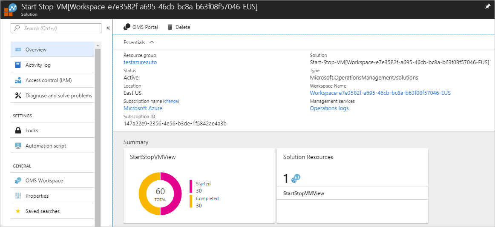

# Start/Stop VMs during off-hours overview

The Start/Stop VMs during off-hours feature start or stops enabled Azure VMs. It starts or stops machines on user-defined schedules, provides insights through Azure Monitor logs, and sends optional emails by using [action groups](../azure-monitor/platform/action-groups.md). The feature can be enabled on both Azure Resource Manager and classic VMs for most scenarios. 

This feature uses [Start-AzVm](https://docs.microsoft.com/powershell/module/az.compute/start-azvm) cmdlet to start VMs. It uses [Stop-AzVM](https://docs.microsoft.com/powershell/module/az.compute/stop-azvm) for stopping VMs.

> [!NOTE]
> While the runbooks have been updated to use the new Azure Az module cmdlets, they use the AzureRM prefix alias.

> [!NOTE]
> Start/Stop VMs during off-hours has been updated to support the newest versions of the Azure modules that are available. The updated version of this feature, available in the Marketplace, doesn’t support AzureRM modules because we have migrated from AzureRM to Az modules.

The feature provides a decentralized low-cost automation option for users who want to optimize their VM costs. You can use the feature to:

- [Schedule VMs to start and stop](automation-solution-vm-management-config.md#schedule).
- Schedule VMs to start and stop in ascending order by [using Azure Tags](automation-solution-vm-management-config.md#tags). This activity is not supported for classic VMs.
- Autostop VMs based on [low CPU usage](automation-solution-vm-management-config.md#cpuutil).

The following are limitations with the current feature:

- It manages VMs in any region, but can only be used in the same subscription as your Azure Automation account.
- It is available in Azure and Azure Government for any region that supports a Log Analytics workspace, an Azure Automation account, and alerts. Azure Government regions currently don't support email functionality.

## Prerequisites

The runbooks for the Start/Stop VMs during off hours feature work with an [Azure Run As account](automation-create-runas-account.md). The Run As account is the preferred authentication method because it uses certificate authentication instead of a password that might expire or change frequently.

We recommend that you use a separate Automation account for working with VMs enabled for the Start/Stop VMs during off-hours feature. Azure module versions are frequently upgraded, and their parameters might change. The feature isn't upgraded on the same cadence and it might not work with newer versions of the cmdlets that it uses. You're recommended to test module updates in a test Automation account before importing them into your production Automation account(s).

## Permissions

You must have certain permissions to enable VMs for the Start/Stop VMs during off-hours feature. The permissions are different depending on whether the feature uses a pre-created Automation account and Log Analytics workspace or creates a new account and workspace. 

You don't need to configure permissions if you're a Contributor on the subscription and a Global Administrator in your Azure Active Directory (AD) tenant. If you don't have these rights or need to configure a custom role, make sure that you have the permissions described below.

### Permissions for pre-existing Automation account and Log Analytics workspace

To enable VMs for the Start/Stop VMs during off-hours feature using an existing Automation account and Log Analytics workspace, you need the following permissions on the Resource Group scope. To learn more about roles, see [Custom roles for Azure resources](../role-based-access-control/custom-roles.md).

| Permission | Scope|
| --- | --- |
| Microsoft.Automation/automationAccounts/read | Resource Group |
| Microsoft.Automation/automationAccounts/variables/write | Resource Group |
| Microsoft.Automation/automationAccounts/schedules/write | Resource Group |
| Microsoft.Automation/automationAccounts/runbooks/write | Resource Group |
| Microsoft.Automation/automationAccounts/connections/write | Resource Group |
| Microsoft.Automation/automationAccounts/certificates/write | Resource Group |
| Microsoft.Automation/automationAccounts/modules/write | Resource Group |
| Microsoft.Automation/automationAccounts/modules/read | Resource Group |
| Microsoft.automation/automationAccounts/jobSchedules/write | Resource Group |
| Microsoft.Automation/automationAccounts/jobs/write | Resource Group |
| Microsoft.Automation/automationAccounts/jobs/read | Resource Group |
| Microsoft.OperationsManagement/solutions/write | Resource Group |
| Microsoft.OperationalInsights/workspaces/* | Resource Group |
| Microsoft.Insights/diagnosticSettings/write | Resource Group |
| Microsoft.Insights/ActionGroups/Write | Resource Group |
| Microsoft.Insights/ActionGroups/read | Resource Group |
| Microsoft.Resources/subscriptions/resourceGroups/read | Resource Group |
| Microsoft.Resources/deployments/* | Resource Group |

### Permissions for new Automation account and new Log Analytics workspace

You can enable VMs for the Start/Stop VMs during off-hours feature using a new Automation account and Log Analytics workspace. In this case, you need the permissions defined in the preceding section as well as the permissions defined in this section. You also require the following roles:

- Co-Administrator on subscription. This role is required to create the Classic Run As account if you are going to manage classic VMs. [Classic Run As accounts](automation-create-standalone-account.md#create-a-classic-run-as-account) are no longer created by default.
- Membership in the [Azure AD](../active-directory/users-groups-roles/directory-assign-admin-roles.md) Application Developer role. For more information on configuring Run As Accounts, see [Permissions to configure Run As accounts](manage-runas-account.md#permissions).
- Contributor on the subscription or the following permissions.

| Permission |Scope|
| --- | --- |
| Microsoft.Authorization/Operations/read | Subscription|
| Microsoft.Authorization/permissions/read |Subscription|
| Microsoft.Authorization/roleAssignments/read | Subscription |
| Microsoft.Authorization/roleAssignments/write | Subscription |
| Microsoft.Authorization/roleAssignments/delete | Subscription || Microsoft.Automation/automationAccounts/connections/read | Resource Group |
| Microsoft.Automation/automationAccounts/certificates/read | Resource Group |
| Microsoft.Automation/automationAccounts/write | Resource Group |
| Microsoft.OperationalInsights/workspaces/write | Resource Group |

## Components

The Start/Stop VMs during off-hours feature include preconfigured runbooks, schedules, and integration with Azure Monitor logs. You can use these elements to tailor the startup and shutdown of your VMs to suit your business needs.

### Runbooks

The following table lists the runbooks that the feature deploys to your Automation account. Do NOT make changes to the runbook code. Instead, write your own runbook for new functionality.

> [!IMPORTANT]
> Don't directly run any runbook with **child** appended to its name.

All parent runbooks include the `WhatIf` parameter. When set to True, the parameter supports detailing the exact behavior the runbook takes when run without the parameter and validates that the correct VMs are targeted. A runbook only performs its defined actions when the `WhatIf` parameter is set to False.

|Runbook | Parameters | Description|
| --- | --- | ---|
|AutoStop_CreateAlert_Child | VMObject   AlertAction   WebHookURI | Called from the parent runbook. This runbook creates alerts on a per-resource basis for the Auto-Stop scenario.|
|AutoStop_CreateAlert_Parent | VMList  WhatIf: True or False  | Creates or updates Azure alert rules on VMs in the targeted subscription or resource groups.   `VMList` is a comma-separated list of VMs (with no whitespaces), for example, `vm1,vm2,vm3`.  `WhatIf` enables validation of runbook logic without executing.|
|AutoStop_Disable | None | Disables Auto-Stop alerts and default schedule.|
|AutoStop_VM_Child | WebHookData | Called from the parent runbook. Alert rules call this runbook to stop a classic VM.|
|AutoStop_VM_Child_ARM | WebHookData |Called from the parent runbook. Alert rules call this runbook to stop a VM.  |
|ScheduledStartStop_Base_Classic | CloudServiceName  Action: Start or Stop  VMList  | Performs action start or stop in classic VM group by Cloud Services. |
|ScheduledStartStop_Child | VMName   Action: Start or Stop   ResourceGroupName | Called from the parent runbook. Executes a start or stop action for the scheduled stop.|
|ScheduledStartStop_Child_Classic | VMName  Action: Start or Stop  ResourceGroupName | Called from the parent runbook. Executes a start or stop action for the scheduled stop for classic VMs. |
|ScheduledStartStop_Parent | Action: Start or Stop  VMList   WhatIf: True or False | Starts or stops all VMs in the subscription. Edit the variables `External_Start_ResourceGroupNames` and `External_Stop_ResourceGroupNames` to only execute on these targeted resource groups. You can also exclude specific VMs by updating the `External_ExcludeVMNames` variable.|
|SequencedStartStop_Parent | Action: Start or Stop   WhatIf: True or False VMList| Creates tags named **sequencestart** and **sequencestop** on each VM for which you want to sequence start/stop activity. These tag names are case-sensitive. The value of the tag should be a list of positive integers, for example, `1,2,3`, that corresponds to the order in which you want to start or stop.  **Note**: VMs must be within resource groups defined in `External_Start_ResourceGroupNames`, `External_Stop_ResourceGroupNames`, and `External_ExcludeVMNames` variables. They must have the appropriate tags for actions to take effect.|

### Variables

The following table lists the variables created in your Automation account. Only modify variables prefixed with `External`. Modifying variables prefixed with `Internal` causes undesirable effects.

> [!NOTE]
> Limitations on VM name and resource group are largely a result of variable size. See [Variable assets in Azure Automation](https://docs.microsoft.com/azure/automation/shared-resources/variables).

|Variable | Description|
|---------|------------|
|External_AutoStop_Condition | The conditional operator required for configuring the condition before triggering an alert. Acceptable values are `GreaterThan`, `GreaterThanOrEqual`, `LessThan`, and `LessThanOrEqual`.|
|External_AutoStop_Description | The alert to stop the VM if the CPU percentage exceeds the threshold.|
|External_AutoStop_Frequency | The evaluation frequency for rule. This parameter accepts input in timespan format. Possible values are from 5 minutes to 6 hours. |
|External_AutoStop_MetricName | The name of the performance metric for which the Azure Alert rule is to be configured.|
|External_AutoStop_Severity | Severity of the metric alert, which can range from 0 to 4. |
|External_AutoStop_Threshold | The threshold for the Azure Alert rule specified in the variable `External_AutoStop_MetricName`. Percentage values range from 1 to 100.|
|External_AutoStop_TimeAggregationOperator | The time aggregation operator applied to the selected window size to evaluate the condition. Acceptable values are `Average`, `Minimum`, `Maximum`, `Total`, and `Last`.|
|External_AutoStop_TimeWindow | The size of the window during which Azure analyzes selected metrics for triggering an alert. This parameter accepts input in timespan format. Possible values are from 5 minutes to 6 hours.|
|External_EnableClassicVMs| Value specifying if classic VMs are targeted by the feature. The default value is True. Set this variable to False for Azure Cloud Solution Provider (CSP) subscriptions. Classic VMs require a [Classic Run As account](automation-create-standalone-account.md#create-a-classic-run-as-account).|
|External_ExcludeVMNames | Comma-separated list of VM names to exclude, limited to 140 VMs. If you add more than 140 VMs to the list, VMs specified for exclusion might be inadvertently started or stopped.|
|External_Start_ResourceGroupNames | Comma-separated list of one or more resource groups that are targeted for start actions.|
|External_Stop_ResourceGroupNames | Comma-separated list of one or more resource groups that are targeted for stop actions.|
|External_WaitTimeForVMRetrySeconds |The wait time in seconds for the actions to be performed on the VMs for the **SequencedStartStop_Parent** runbook. This variable allows the runbook to wait for child operations for a specified number of seconds before proceeding with the next action. The maximum wait time is 10800, or three hours. The default value is 2100 seconds.|
|Internal_AutomationAccountName | Specifies the name of the Automation account.|
|Internal_AutoSnooze_ARM_WebhookURI | The webhook URI called for the AutoStop scenario for VMs.|
|Internal_AutoSnooze_WebhookUri | The webhook URI called for the AutoStop scenario for classic VMs.|
|Internal_AzureSubscriptionId | The Azure subscription ID.|
|Internal_ResourceGroupName | The Automation account resource group name.|

>[!NOTE]
>For the variable `External_WaitTimeForVMRetryInSeconds`, the default value has been updated from 600 to 2100. 

Across all scenarios, the variables `External_Start_ResourceGroupNames`,  `External_Stop_ResourceGroupNames`, and `External_ExcludeVMNames` are necessary for targeting VMs, except for the comma-separated VM lists for the **AutoStop_CreateAlert_Parent**, **SequencedStartStop_Parent**, and **ScheduledStartStop_Parent** runbooks. That is, your VMs must belong to target resource groups for start and stop actions to occur. The logic works similar to Azure Policy, in that you can target the subscription or resource group and have actions inherited by newly created VMs. This approach avoids having to maintain a separate schedule for every VM and manage starts and stops in scale.

### Schedules

The following table lists each of the default schedules created in your Automation account. You can modify them or create your own custom schedules. By default, all schedules are disabled except for the **Scheduled_StartVM** and **Scheduled_StopVM** schedules.

Don't enable all schedules, because doing so might create overlapping schedule actions. It's best to determine which optimizations you want to do and modify them accordingly. See the example scenarios in the overview section for further explanation.

|Schedule name | Frequency | Description|
|--- | --- | ---|
|Schedule_AutoStop_CreateAlert_Parent | Every 8 hours | Runs the **AutoStop_CreateAlert_Parent** runbook every 8 hours, which in turn stops the VM-based values in `External_Start_ResourceGroupNames`, `External_Stop_ResourceGroupNames`, and `External_ExcludeVMNames` variables. Alternatively, you can specify a comma-separated list of VMs by using the `VMList` parameter.|
|Scheduled_StopVM | User-defined, daily | Runs the **ScheduledStopStart_Parent** runbook with a parameter of `Stop` every day at the specified time. Automatically stops all VMs that meet the rules defined by variable assets. Enable the related schedule **Scheduled-StartVM**.|
|Scheduled_StartVM | User-defined, daily | Runs the **ScheduledStopStart_Parent** runbook with a parameter value of `Start` every day at the specified time. Automatically starts all VMs that meet the rules defined by variable assets. Enable the related schedule **Scheduled-StopVM**.|
|Sequenced-StopVM | 1:00 AM (UTC), every Friday | Runs the **Sequenced_StopStop_Parent** runbook with a parameter value of `Stop` every Friday at the specified time. Sequentially (ascending) stops all VMs with a tag of **SequenceStop** defined by the appropriate variables. For more information on tag values and asset variables, see [Runbooks](#runbooks). Enable the related schedule, **Sequenced-StartVM**.|
|Sequenced-StartVM | 1:00 PM (UTC), every Monday | Runs the **SequencedStopStart_Parent** runbook with a parameter value of `Start` every Monday at the specified time. Sequentially (descending) starts all VMs with a tag of **SequenceStart** defined by the appropriate variables. For more information on tag values and variable assets, see [Runbooks](#runbooks). Enable the related schedule, **Sequenced-StopVM**.

## Use the feature with classic VMs

If you are using the Start/Stop VMs during off-hours feature for classic VMs, Automation processes all your VMs sequentially per cloud service. VMs are still processed in parallel across different cloud services. 

For use of the feature with classic VMs, you need a Classic Run As account, which is not created by default. For instructions on creating a Classic Run As account, see [Create a Classic Run As account](automation-create-standalone-account.md#create-a-classic-run-as-account).

If you have more than 20 VMs per cloud service, here are some recommendations:

* Create multiple schedules with the parent runbook **ScheduledStartStop_Parent** and specifying 20 VMs per schedule. 
* In the schedule properties, use the `VMList` parameter to specify VM names as a comma-separated list (no whitespaces). 

Otherwise, if the Automation job for this feature runs more than three hours, it's temporarily unloaded or stopped per the [fair share](automation-runbook-execution.md#fair-share) limit.

Azure CSP subscriptions support only the Azure Resource Manager model. Non-Azure Resource Manager services are not available in the program. When the Start/Stop VMs during off-hours feature runs, you might receive errors since it has cmdlets to manage classic resources. To learn more about CSP, see [Available services in CSP subscriptions](https://docs.microsoft.com/azure/cloud-solution-provider/overview/azure-csp-available-services). If you use a CSP subscription, you should set the [External_EnableClassicVMs](#variables) variable to False after deployment.

[!INCLUDE [azure-monitor-log-analytics-rebrand](../../includes/azure-monitor-log-analytics-rebrand.md)]

## Enable the feature

To begin using the feature, follow the steps in [Enable Start/Stop VMs during off-hours](automation-solution-vm-management-enable.md).

## View the feature

Use one of the following mechanisms to access the enabled feature:

* From your Automation account, select **Start/Stop VM** under **Related Resources**. On the Start/Stop VM page, select **Manage the solution** under **Manage Start/Stop VM Solutions**.

* Navigate to the Log Analytics workspace linked to your Automation account. After after selecting the workspace, choose **Solutions** from the left pane. On the Solutions page, select **Start-Stop-VM[workspace]** from the list.  

Selecting the feature displays the Start-Stop-VM[workspace] page. Here you can review important details, such as the information in the **StartStopVM** tile. As in your Log Analytics workspace, this tile displays a count and a graphical representation of the runbook jobs for the feature that have started and have finished successfully.

You can perform further analysis of the job records by clicking the donut tile. The dashboard shows job history and predefined log search queries. Switch to the log analytics advanced portal to search based on your search queries.

## Update the feature

If you've deployed a previous version of Start/Stop VMs during off-hours, delete it from your account before deploying an updated release. Follow the steps to [remove the feature](#remove-the-feature) and then follow the steps to [enable it](automation-solution-vm-management-enable.md).

## Remove the feature

If you no longer need to use the feature, you can delete it from the Automation account. Deleting the feature only removes the associated runbooks. It doesn't delete the schedules or variables that were created when the feature was added. 

To delete Start/Stop VMs during off-hours:

1. From your Automation account, select **Linked workspace** under **Related resources**.

2. Select **Go to workspace**.

3. Click **Solutions** under **General**. 

4. On the Solutions page, select **Start-Stop-VM[Workspace]**. 

5. On the VMManagementSolution[Workspace] page, select **Delete** from the menu.   

6. In the Delete Solution window, confirm that you want to delete the feature.

7. While the information is verified and the feature is deleted, you can track the progress under **Notifications**, chosen from the menu. You're returned to the Solutions page after the removal process.

8. The Automation account and Log Analytics workspace aren't deleted as part of this process. If you don't want to keep the Log Analytics workspace, you must manually delete it from the Azure portal:

    1. Search for and select **Log Analytics workspaces**.

    2. On the Log Analytics workspace page, select the workspace.

    3. Select **Delete** from the menu.

    4. If you don't want to keep the Azure Automation account [feature components](#components), you can manually delete each.

## Next steps

To enable the feature on VMs in your environment, see [Enable Start/Stop VMs during off-hours](automation-solution-vm-management-enable.md).
