<properties 
    pageTitle=" Source Control integration in Azure Automation | Microsoft Azure"
    description="This article describes source control integration with GitHub in Azure Automation."
    services="automation"
    documentationCenter=""
    authors="mgoedtel"
    manager="jwhit"
    editor="tysonn" />    
<tags 
    ms.service="automation"
    ms.devlang="na"
    ms.topic="article"
    ms.tgt_pltfrm="na"
    ms.workload="infrastructure-services"
    ms.date="05/23/2016"
    ms.author="magoedte;sngun" />

# Source control integration in Azure Automation

Source control integration allows you to associate runbooks in your Automation account to a GitHub source control repository. Source control allows you to easily collaborate with your team, track changes, and roll back to earlier versions of your runbooks. For example, source control allows you to sync different branches in source control to your development, test or production Automation accounts, making it easy to promote code that has been tested in your development environment to your production Automation account.

Source control allows you to push code from Azure Automation to source control or pull your runbooks from source control to Azure Automation. This article describes how to set up source control in your Azure Automation environment. We will start by configuring Azure Automation to access your GitHub repository and walk through different operations that can be done using source control integration. 

>[AZURE.NOTE] Source control supports pulling and pushing [PowerShell Workflow runbooks](automation-runbook-types.md#powershell-workflow-runbooks) as well as [PowerShell runbooks](automation-runbook-types.md#powershell-runbooks). [Graphical runbooks](automation-runbook-types.md#graphical-runbooks) are not yet supported.  

There are two simple steps required to configure source control for your Automation account, and only one if you already have a GitHub account. They are:
## Step 1 – Create a GitHub repository

If you already have a GitHub account and a repository that you want to link to Azure Automation, then login to your existing account and start from step 2 below. Otherwise, navigate to [GitHub](https://github.com/), sign up for a new account and [create a new repository](https://help.github.com/articles/create-a-repo/).

## Step 2 – Set up source control in Azure Automation

1. From the Automation Account blade in the Azure portal, click **Set Up Source Control.** 
 
    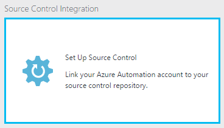

2. The **Source Control** blade opens, where you can configure your GitHub account details. Below is the list of parameters to configure:  

    |**Parameter**            |**Description** |
    |:---|:---| 
    |Choose Source   | Select the source. Currently, only **GitHub** is supported. |
    |Authorization | Click the **Authorize** button to grant Azure Automation access to your GitHub repository. If you are already logged in to your GitHub account in a different window, then the credentials of that account are used. Once authorization is successful, the blade will show your GitHub username under **Authorization Property**. |
    |Choose repository | Select a GitHub repository from the list of available repositories. |
    |Choose branch | Select a branch from the list of available branches. Only the **master** branch is shown if you haven’t created any branches. |
    |Runbook folder path | The runbook folder path specifies the path in the GitHub repository from which you want to push or pull your code. It must be entered in the format **/foldername/subfoldername**. Only runbooks in the runbook folder path will be synced to your Automation account. Runbooks in the subfolders of the runbook folder path will **NOT** be synced. Use **/** to sync all the runbooks under the repository. |

3. For example, if you have a repository named **PowerShellScripts** that contains a folder named **RootFolder**, which contains a folder named **SubFolder**. You can use the following strings to sync each folder level:

    1. To sync runbooks from **repository**, runbook folder path is */*
    2. To sync runbooks from **RootFolder**, runbook folder path is */RootFolder*
    3. To sync runbooks from **SubFolder**, runbook folder path is */RootFolder/SubFolder*.
  

4. After you configure the parameters, they are displayed on the **Set Up Source Control blade.**  
 
    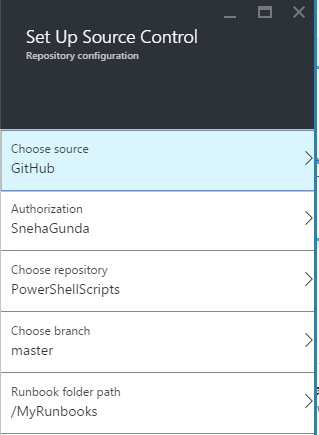

5. Once you click OK, source control integration is now configured for your Automation account and should be updated with your GitHub information. You can now click on this part to view all of your source control sync job history.  

    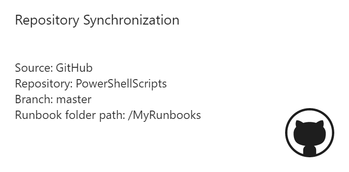

6. After you set up source control, the following Automation resources will be created in your Automation account:  
 Two [variable assets](automation-variables.md) are created.  
      
    * The variable **Microsoft.Azure.Automation.SourceControl.Connection** contains the values of the connection string, as shown below.  

    |**Parameter**            |**Value** |
    |:---|:---|
    | Name  | Microsoft.Azure.Automation.SourceControl.Connection |
    | Type | String |
    | Value  | {"Branch":\<*Your branch name*>,"RunbookFolderPath":\<*Runbook folder path*>,"ProviderType":\<*has a value 1 for GitHub*>,"Repository":\<*Name of your repository*>,"Username":\<*Your GitHub user name*>} |   

    * The variable **Microsoft.Azure.Automation.SourceControl.OAuthToken**, contains the secure encrypted value of your OAuthToken.  

    |**Parameter**            |**Value** |
    |:---|:---|
    | Name  | Microsoft.Azure.Automation.SourceControl.OAuthToken |
    | Type | Unknown(Encrypted) |
    | Value | <*Encrypted OAuthToken*> |  

    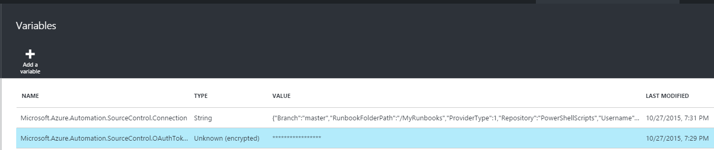  

    * **Automation Source Control** is added as an authorized application to your GitHub account. To view the application: From your GitHub home page, navigate to your **profile** > **Settings** > **Applications**. This application allows Azure Automation to sync your GitHub repository to an Automation account.  

    

## Using Source Control in Automation

### Check-in a runbook from Azure Automation to source control

Runbook check-in allows you to push the changes you have made to a runbook in Azure Automation into your source control repository. Below are the steps to check-in a runbook:

1. From your Automation Account, [create a new textual runbook](automation-first-runbook-textual.md), or [edit an existing, textual runbook](automation-edit-textual-runbook.md). This runbook can be either a PowerShell Workflow or a PowerShell script runbook.  

2. After you edit your runbook, save it and click **check-in** from the **Edit** blade.  

    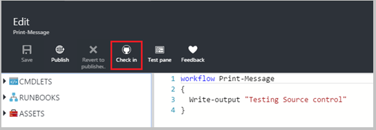

     >[AZURE.NOTE] Check-in from Azure Automation will overwrite the code that currently exists in your source control. The Git equivalent command line instruction to check-in is **git add + git commit + git push**  

3. When you click **check-in**, you will be prompted with a confirmation message, click yes to continue.  

    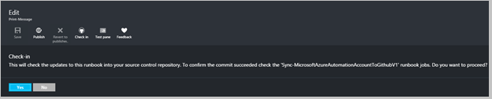

4. Check-in starts the source control runbook: **Sync-MicrosoftAzureAutomationAccountToGitHubV1**. This runbook connects to GitHub and pushes changes from Azure Automation to your repository. To view the check-in job history, go back to the **Source Control Integration** tab and click to open the Repository Synchronization blade. This blade shows all of your source control jobs.  Select the job you want to view and click to view the details.  

    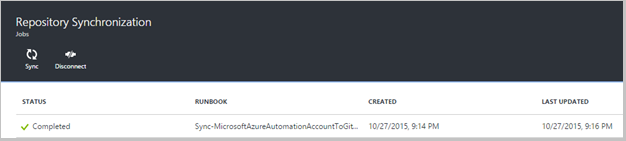

    >[AZURE.NOTE] Source control runbooks are special Automation runbooks that you cannot view or edit. While they will not show up on your runbook list, you will see sync jobs showing up on your jobs list.
 
5. The name of the modified runbook is sent as an input parameter to the check-in runbook. You can [view the job details](automation-runbook-execution.md#viewing-job-status-using-the-azure-management-portal) by expanding runbook in **Repository Synchronization** blade.  

    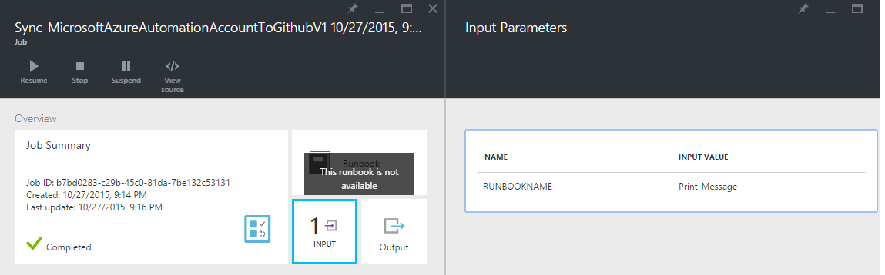

6. Refresh your GitHub repository once the job completes to view the changes.  There should be a commit in your repository with a commit message: **Updated *Runbook Name* in Azure Automation.**  

### Sync runbooks from source control to Azure Automation 

The sync button on the Repository Synchronization blade allows you to pull all the runbooks in the runbook folder path of your repository to your Automation account. The same repository can be synced to more than one Automation account. Below are the steps to sync a runbook:

1. From the Automation account where you set up source control, open the **Source Control Integration/Repository Synchronization blade** and click **Sync** then you will be prompted with a confirmation message, click **Yes** to continue.  

    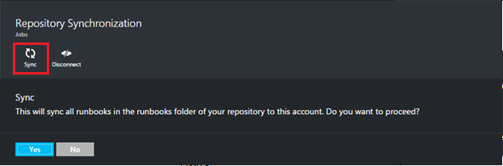

2. Sync starts the runbook: **Sync-MicrosoftAzureAutomationAccountFromGitHubV1**. This runbook connects to GitHub and pulls the changes from your repository to Azure Automation. You should see a new job on the **Repository Synchronization** blade for this action. To view details about the sync job, click to open the job details blade.  
 
    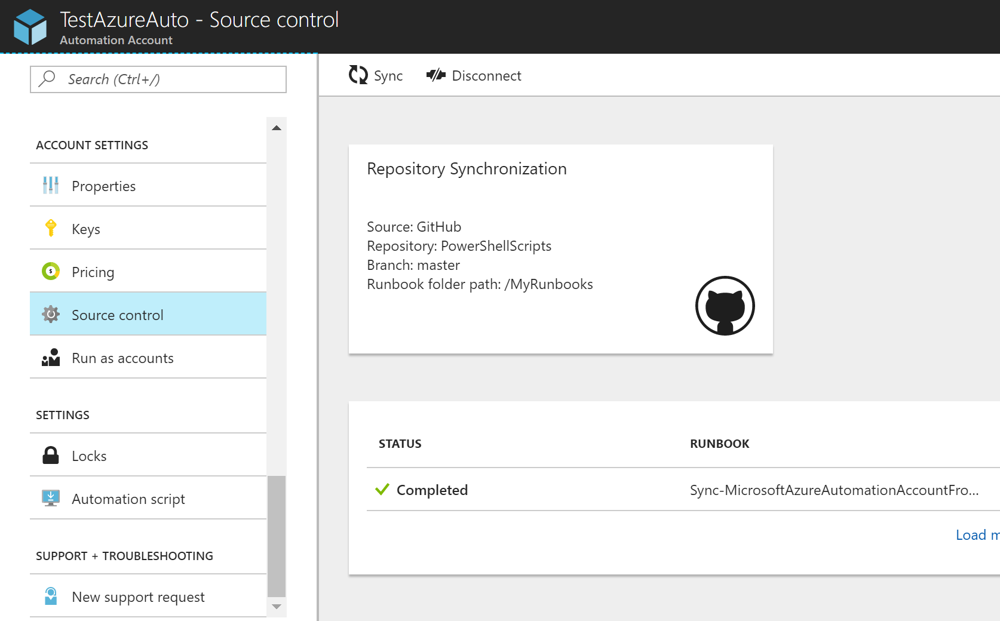

 
    >[AZURE.NOTE] A sync from source control overwrites the draft version of the runbooks that currently exist in your Automation account for **ALL** runbooks that are currently in source control. The Git equivalent command line instruction to sync is **git pull**

## Troubleshooting source control problems

If there are any errors with a check-in or sync job, the job status should be suspended and you can view more details about the error in the job blade.  The **All Logs** part will show you all the PowerShell streams associated with that job. This will provide you with the details needed to help you fix any problems with your check-in or sync. It will also show you the sequence of actions that occurred while syncing or checking-in a runbook.  

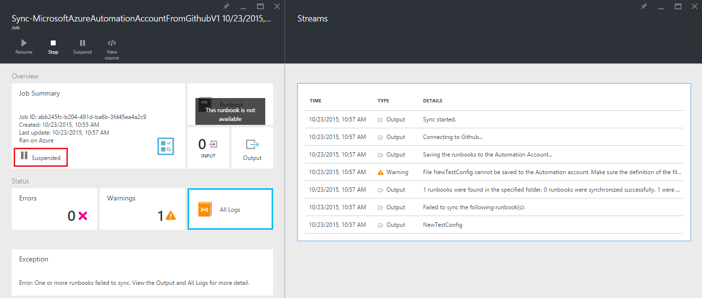

## Disconnecting source control

To disconnect from your GitHub account, open the Repository Synchronization blade and click **Disconnect**. Once you disconnect source control, runbooks that were synced earlier will still remain in your Automation account but the Repository Synchronization blade will not be enabled.  

  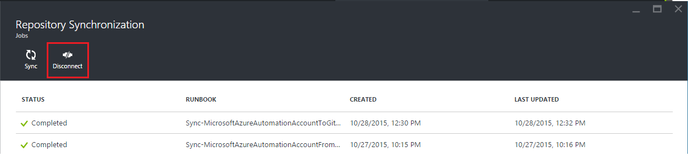

## Next Steps

For more information about source control integration, see the following resources:  
- [Azure Automation: Source Control Integration in Azure Automation](https://azure.microsoft.com/blog/azure-automation-source-control-13/)  
- [Vote for your favorite source control system](https://www.surveymonkey.com/r/?sm=2dVjdcrCPFdT0dFFI8nUdQ%3d%3d)  
- [Azure Automation: Integrating Runbook Source Control using Visual Studio Team Services](https://azure.microsoft.com/blog/azure-automation-integrating-runbook-source-control-using-visual-studio-online/)  
