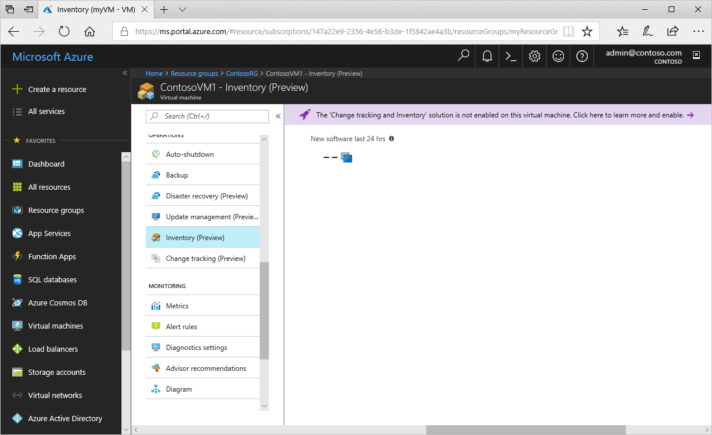
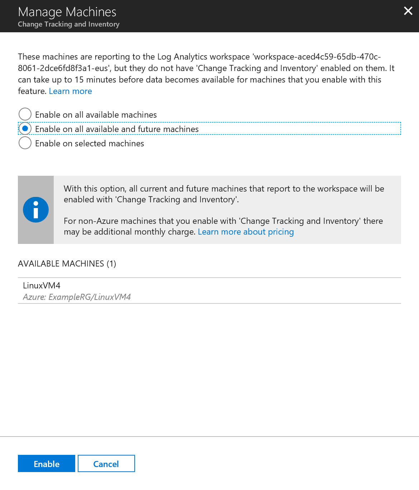
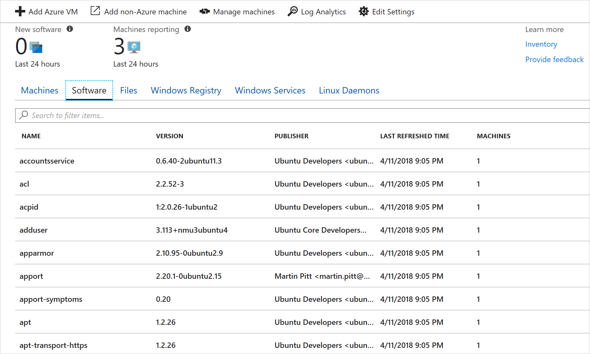

# Discover what software is installed on your VMs

In this tutorial, you learn how to use the Azure Automation Change Tracking and Inventory feature to find out what software is installed in your environment. You can collect and view inventory for software, files, Linux daemons, Windows services, and Windows Registry keys on your computers. Tracking the configurations of your machines can help you pinpoint operational issues across your environment and better understand the state of your machines.

In this tutorial you learn how to:

> [!div class="checklist"]
> * Enable Change Tracking and Inventory
> * Enable an Azure VM
> * Enable a non-Azure VM
> * View installed software
> * Search inventory logs for installed software

## Prerequisites

To complete this tutorial, you need:

* An Azure subscription. If you don't have one yet, you can [activate your MSDN subscriber benefits](https://azure.microsoft.com/pricing/member-offers/msdn-benefits-details/) or sign up for a [free account](https://azure.microsoft.com/free/?WT.mc_id=A261C142F).
* An [Automation account](automation-offering-get-started.md) to hold the watcher and action runbooks and the Watcher task.
* A [virtual machine](../virtual-machines/windows/quick-create-portal.md) to enable for the feature.

## Log in to Azure

Log in to the Azure portal at https://portal.azure.com.

## Enable Change Tracking and Inventory

First you need to enable Change tracking and Inventory for this tutorial. If you've previously enabled the feature, this step is not necessary.

>[!NOTE]
>If the fields are grayed out, another Automation feature is enabled for the VM, and you must use same workspace and Automation account.

1. Navigate to your Automation account and select **Inventory** or **Change tracking** under **Configuration Management**.

2. Choose the [Log Analytics](../log-analytics/log-analytics-overview.md?toc=%2fazure%2fautomation%2ftoc.json) workspace. This workspace collects data that is generated by features such as Change Tracking and Inventory. The workspace provides a single location to review and analyze data from multiple sources.

[!INCLUDE [azure-monitor-log-analytics-rebrand](../../includes/azure-monitor-log-analytics-rebrand.md)]

3. Select the Automation account to use.

4. Configure the location for the deployment.

5. Click **Enable** to deploy the feature for your VM. 

    

During setup, the VM is provisioned with the Log Analytics agent for Windows and a [Hybrid Runbook Worker](automation-hybrid-runbook-worker.md). Enabling Change Tracking and Inventory can take up to 15 minutes. During this time, you shouldn't close the browser window.

After the feature is enabled, information about installed software and changes on the VM flows to Azure Monitor logs. It can take between 30 minutes and 6 hours for the data to be available for analysis.

## Add an Azure VM to Change Tracking and Inventory

1. In your Automation account, navigate to **Inventory** or **Change tracking** under **Configuration Management**.

2. Select **+ Add Azure VM**.

3. Select your VM from the list of VMs. 

4. Click **Enable** to enable Change Tracking and Inventory on the VM. The Log Analytics agent for Windows is deployed to the VM and configures the VM to talk to the Log Analytics workspace. The setup operation can take a few minutes. 

5. At this point, if desired, you can select a new VM from the list to enable for the feature.

## Add a non-Azure machine to Change Tracking and Inventory

To enable non-Azure machines for the feature:

1. Install the [Log Analytics agent for Windows](../azure-monitor/platform/agent-windows.md) or [Log Analytics agent for Linux](automation-linux-hrw-install.md), depending on your operating system. 

2. Navigate to your Automation account and go to **Inventory** or **Change tracking** under **Configuration Management**. 

3. Click **Manage Machines**. You're presented with a list of the machines reporting to your Log Analytics workspace that do not have the Change Tracking and Inventory enabled. Select the appropriate option for your environment:

    * **Enable on all available machines** - This option enables the feature on all the machines reporting to your Log Analytics workspace at this time.
    * **Enable on all available machines and future machines** - This option enables the feature on all machines reporting to your Log Analytics workspace and subsequently on all future machines added to the workspace.
    * **Enable on selected machines** - This option enables the feature only on the machines that you have selected.

    

## View installed software

Once the Change Tracking and Inventory feature is enabled, you can view the results on the Inventory page.

1. In your Automation account, select **Inventory** under **Configuration Management**.

2. On the Inventory page, click on the **Software** tab.

3. Note a table that lists the software that has been found. The software is grouped by software name and version. The high-level details for each software record are viewable in the table. These details include the software name, version, publisher, last refreshed time (the most recent refresh time reported by a machine in the group), and machines (the count of machines with that software).

    

4. Click on a row to view the properties of the software record and the names of the machines with that software.

5. To look for a specific software or group of software, you can search in the text box directly above the software list.
The filter allows you to search based off the software name, version, or publisher. For instance, searching for **Contoso** returns all software with a name, publisher, or version containing **Contoso**.

## Search inventory logs for installed software

Change Tracking and Inventory generates log data that is sent to Azure Monitor logs. To search the logs by running queries, select **Log Analytics** at the top of the Inventory page. Inventory data is stored under the type `ConfigurationData`.

The following example Log Analytics query returns the inventory results for the publisher Microsoft Corporation.

```loganalytics
ConfigurationData
| where ConfigDataType == "Software"
| where Publisher == "Microsoft Corporation"
| summarize arg_max(TimeGenerated, *) by SoftwareName, Computer
```

To learn more about running and searching log files in Azure Monitor logs, see [Azure Monitor logs](../azure-monitor/log-query/log-query-overview.md).

## See the software inventory for a single machine

To see the software inventory for a single machine, you can access Inventory from the Azure VM resource page or use Azure Monitor logs to filter down to the corresponding machine. The following example Log Analytics query returns the list of software for a machine named **ContosoVM**.

```loganalytics
ConfigurationData
| where ConfigDataType == "Software"
| summarize arg_max(TimeGenerated, *) by SoftwareName, CurrentVersion
| where Computer =="ContosoVM"
| render table
| summarize by Publisher, SoftwareName
```

## Next steps

In this tutorial you learned how view software inventory:

> [!div class="checklist"]
> * Enable Change Tracking and Inventory
> * Enable an Azure VM
> * Enable a non-Azure VM
> * View installed software
> * Search inventory logs for installed software

Continue to the overview for the Change Tracking and Inventory feature to learn more about it.

> [!div class="nextstepaction"]
> [Change Tracking and Inventory overview](change-tracking.md)
