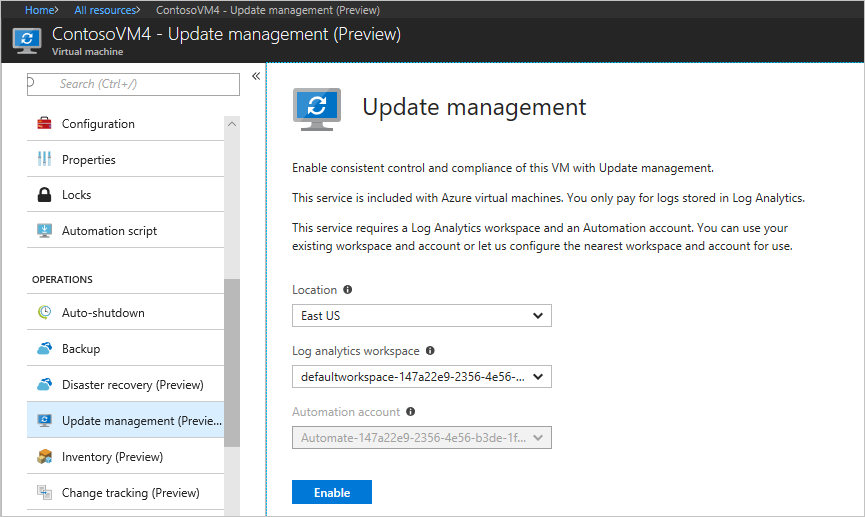
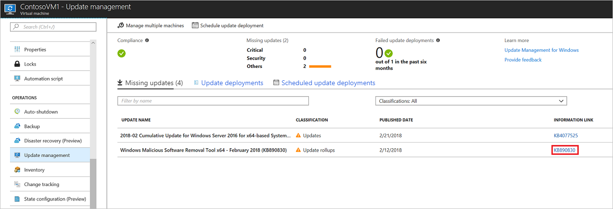
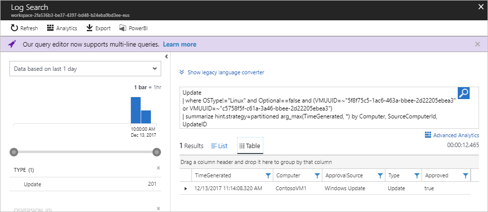
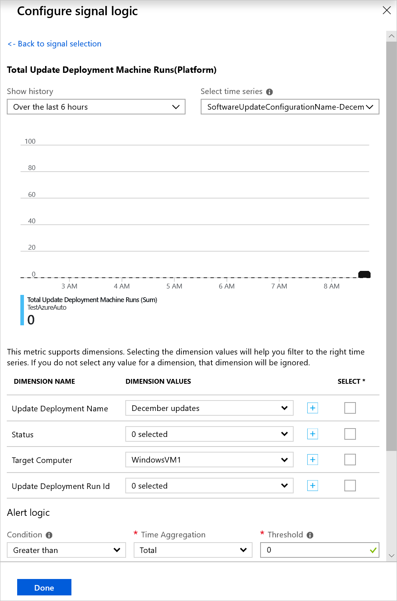
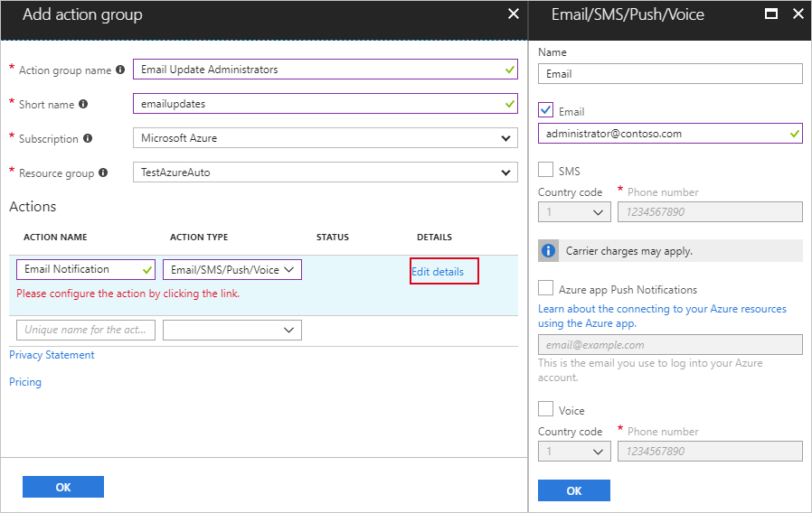
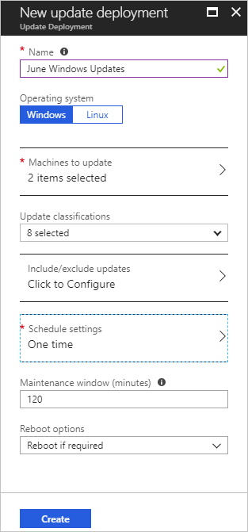
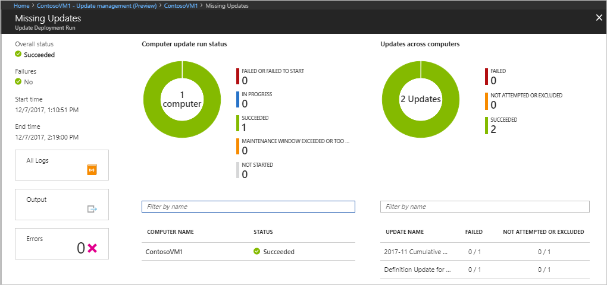
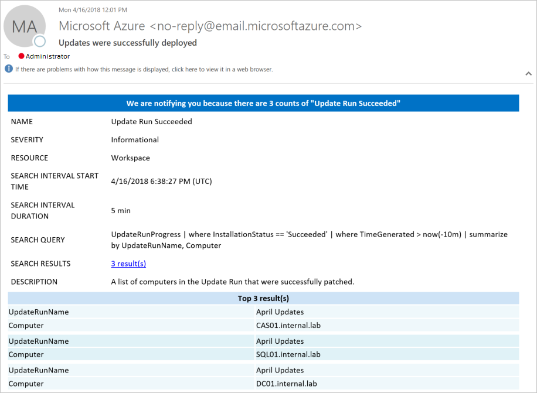

# Manage updates and patches for your Azure VMs

You can use the Update Management solution to manage updates and patches for your virtual machines. In this tutorial, you learn how to quickly assess the status of available updates, schedule installation of required updates, review deployment results, and create an alert to verify that updates apply successfully.

For pricing information, see [Automation pricing for Update Management](https://azure.microsoft.com/pricing/details/automation/).

In this tutorial, you learn how to:

> [!div class="checklist"]
> * Onboard a VM for Update Management
> * View an update assessment
> * Configure alerting
> * Schedule an update deployment
> * View the results of a deployment

## Prerequisites

To complete this tutorial, you need:

* An Azure subscription. If you don't have one yet, you can [activate your monthly Azure credit for Visual Studio subscribers](https://azure.microsoft.com/pricing/member-offers/msdn-benefits-details/) or sign up for a [free account](https://azure.microsoft.com/free/?WT.mc_id=A261C142F).
* An [Azure Automation account](automation-offering-get-started.md) to hold the watcher and action runbooks and the Watcher Task.
* A [virtual machine](../virtual-machines/windows/quick-create-portal.md) to onboard.

## Sign in to Azure

Sign in to the Azure portal at https://portal.azure.com.

## Enable Update Management

First, enable Update Management on your VM for this tutorial:

1. In the [Azure portal](https://portal.azure.com) menu, select **Virtual machines** or search for and select **Virtual machines** from the **Home** page.
1. Select the VM for which you want to enable Update Management.
1. On the VM page, under **OPERATIONS**, select **Update management**. The **Enable Update Management** pane opens.

Validation is performed to determine whether Update Management is enabled for this VM. This validation includes checks for a Log Analytics workspace and linked Automation account, and whether the Update Management solution is enabled in the workspace.

A [Log Analytics](../azure-monitor/platform/data-platform-logs.md) workspace is used to collect data that's generated by features and services like Update Management. The workspace provides a single location to review and analyze data from multiple sources.

The validation process also checks to see whether the VM is provisioned with the Log Analytics agent and Automation Hybrid Runbook Worker. This agent is used to communicate with Azure Automation and to obtain information about the update status. The agent requires port 443 to be open to communicate with the Azure Automation service and to download updates.

If any of the following prerequisites were found to be missing during onboarding, they're automatically added:

* [Log Analytics](../azure-monitor/platform/data-platform-logs.md) workspace
* An [Automation account](./automation-offering-get-started.md)
* A [Hybrid Runbook Worker](./automation-hybrid-runbook-worker.md) (enabled on the VM)

Under **Update Management**, set the location, Log Analytics workspace, and Automation account to use. Then, select **Enable**. If these options aren't available, it means that another automation solution is enabled for the VM. In that case, the same workspace and Automation account must be used.

Enabling the solution can take up to a few minutes. During this time, don't close the browser window. After the solution is enabled, information about missing updates on the VM flows to Azure Monitor logs. It can take between 30 minutes and 6 hours for the data to be available for analysis.

## View update assessment

After Update Management is enabled, the **Update management** pane opens. If any updates are identified as missing, a list of missing updates is shown on the **Missing updates** tab.

Under **INFORMATION LINK**, select the update link to open the support article for the update. You can learn important information about the update.

Click anywhere else on the update to open the **Log Search** pane for the selected update. The query for the log search is predefined for that specific update. You can modify this query or create your own query to view detailed information about the updates that are deployed or missing in your environment.

## Configure alerts

In this step, you learn to set up an alert to let you know the status of an update deployment.

### Alert conditions

In your Automation Account, under **Monitoring** go to **Alerts**, and then click **+ New alert rule**.

Your Automation Account is already selected as the resource. If you want to change it you can click **Select** and on the **Select a resource** page, select **Automation Accounts** in the **Filter by resource type** dropdown. Select your Automation Account, and then select **Done**.

Click **Add condition** to select the signal that is appropriate for your update deployment. The following table shows the details of the two available signals for update deployments:

|Signal Name|Dimensions|Description|
|---|---|---|
|**Total Update Deployment Runs**|- Update Deployment Name - Status|This signal is used to alert on the overall status of an update deployment.|
|**Total Update Deployment Machine Runs**|- Update Deployment Name - Status - Target Computer - Update Deployment Run ID|This signal is used to alert on the status of an update deployment targeted at specific machines|

For the dimension values, select a valid value from the list. If the value you are looking for is not in the list, click the **\+** sign next to the dimension and type in the custom name. You can then select the value you want to look for. If you want to select all values from a dimension, click the **Select \*** button. If you do not choose a value for a dimension, that dimension will be ignored during evaluation.

Under **Alert logic**, for **Threshold**, enter **1**. When you're finished, select **Done**.

### Alert details

Under **2. Define alert details**, enter a name and description for the alert. Set **Severity** to **Informational(Sev 2)** for a successful run, or **Informational(Sev 1)** for a failed run.

Under **Action groups**, select **Create New**. An action group is a group of actions that you can use across multiple alerts. The actions can include but are not limited to email notifications, runbooks, webhooks, and many more. To learn more about action groups, see [Create and manage action groups](../azure-monitor/platform/action-groups.md).

In the **Action group name** box, enter a name for the alert and a short name. The short name is used in place of a full action group name when notifications are sent by using this group.

Under **Actions**, enter a name for the action, like **Email Notifications**. Under **ACTION TYPE**, select **Email/SMS/Push/Voice**. Under **DETAILS**, select **Edit details**.

In the **Email/SMS/Push/Voice** pane, enter a name. Select the **Email** check box, and then enter a valid email address.

In the **Email/SMS/Push/Voice** pane, select **OK**. In the **Add action group** pane, select **OK**.

To customize the subject of the alert email,  under **Create rule**, under **Customize Actions**, select **Email subject**. When you're finished, select **Create alert rule**. The alert tells you when an update deployment succeeds, and which machines were part of that update deployment run.

## Schedule an update deployment

Next, schedule a deployment that follows your release schedule and service window to install updates. You can choose which update types to include in the deployment. For example, you can include critical or security updates and exclude update rollups.

>[!NOTE]
>When you schedule an update deployment, it creates a [schedule](shared-resources/schedules.md) resource linked to the **Patch-MicrosoftOMSComputers** runbook that handles the update deployment on the target machines. If you delete the schedule resource from the Azure portal or using PowerShell after creating the deployment, it breaks the scheduled update deployment and presents an error when you attempt to reconfigure it from the portal. You can only delete the schedule resource by deleting the corresponding deployment schedule.  
>

To schedule a new update deployment for the VM, go to **Update management**, and then select **Schedule update deployment**.

Under **New update deployment**, specify the following information:

* **Name**: Enter a unique name for the update deployment.

* **Operating system**: Select the OS to target for the update deployment.

* **Groups to update (preview)**: Define a query based on a combination of subscription, resource groups, locations, and tags to build a dynamic group of Azure VMs to include in your deployment. To learn more, see [Dynamic Groups](automation-update-management-groups.md)

* **Machines to update**: Select a Saved search, Imported group, or pick Machine from the drop-down and select individual machines. If you choose **Machines**, the readiness of the machine is shown in the **UPDATE AGENT READINESS** column. To learn about the different methods of creating computer groups in Azure Monitor logs, see [Computer groups in Azure Monitor logs](../azure-monitor/platform/computer-groups.md)

* **Update classification**: Select the types of software that the update deployment included in the deployment. For this tutorial, leave all types selected.

  The classification types are:

   |OS  |Type  |
   |---------|---------|
   |Windows     | Critical updates Security updates Update rollups Feature packs Service packs Definition updates Tools Updates        |
   |Linux     | Critical and security updates Other updates       |

   For a description of the classification types, see [update classifications](automation-view-update-assessments.md#update-classifications).

* **Updates to include/exclude** - This opens the **Include/Exclude** page. Updates to be included or excluded are on separate tabs.

> [!NOTE]
> It is important to know that exclusions override inclusions. For instance, if you define an exclusion rule of `*`, then no patches or packages are installed as they are all excluded. Excluded patches still show as missing from the machine. For Linux machines if a package is included but has a dependent package that was excluded, the package is not installed.

> [!NOTE]
> You cannot specify updates that have been superseded for inclusion with the update deployment.
>

* **Schedule settings**: The **Schedule Settings** pane opens. The default start time is 30 minutes after the current time. You can set the start time to any time from 10 minutes in the future.

   You can also specify whether the deployment occurs once, or set up a recurring schedule. Under **Recurrence**, select **Once**. Leave the default as 1 day and select **OK**. This sets up a recurring schedule.

* **Pre-scripts + Post-scripts**: Select the scripts to run before and after your deployment. To learn more, see [Manage Pre and Post scripts](pre-post-scripts.md).

* **Maintenance window (minutes)**: Leave the default value. Maintenance windows control the amount of time allowed for updates to install. Consider the following details when specifying a maintenance window.

  * Maintenance windows control how many updates are attempted to be installed.
  * Update Management does not stop installing new updates if the end of a maintenance window is approaching.
  * Update Management does not terminate in-progress updates if when the maintenance window is exceeded.
  * If the maintenance window is exceeded on Windows, it is often because of a service pack update taking a long time to install.

  > [!NOTE]
  > To avoid updates being applied outside of a maintenance window on Ubuntu, reconfigure the Unattended-Upgrade package to disable automatic updates. For information about how to configure the package, see [Automatic Updates topic in the Ubuntu Server Guide](https://help.ubuntu.com/lts/serverguide/automatic-updates.html).

* **Reboot options**: This setting determines how reboots should be handled. Available options are:
  * Reboot if required (Default)
  * Always reboot
  * Never reboot
  * Only reboot - will not install updates

> [!NOTE]
> The Registry keys listed under [Registry keys used to manage restart](/windows/deployment/update/waas-restart#registry-keys-used-to-manage-restart) can cause a reboot event if **Reboot Control** is set to **Never Reboot**.

When you're finished configuring the schedule, select **Create**.

You're returned to the status dashboard. Select **Scheduled Update deployments** to show the deployment schedule you created.

> [!NOTE]
> Update Management supports deploying first party updates and pre-downloading patches. This requires changes on the systems being patched, see [first party and pre-download support](automation-configure-windows-update.md) to learn how to configure these settings on your systems.

**Update Deployments** can also be created programmatically. To learn how to create an **Update Deployment** with the REST API, see [Software Update Configurations - Create](/rest/api/automation/softwareupdateconfigurations/create). There is also a sample runbook that can be used to create a weekly **Update Deployment**. To learn more about this runbook, see [Create a weekly update deployment for one or more VMs in a resource group](https://gallery.technet.microsoft.com/scriptcenter/Create-a-weekly-update-2ad359a1).

## View results of an update deployment

After the scheduled deployment starts, you can see the status for that deployment on the **Update deployments** tab under **Update management**. The status is **In progress** when the deployment is currently running. When the deployment finishes, if it's successful, the status changes to **Succeeded**. When there are failures with one or more updates in the deployment, the status is **Partially failed**.

Select the completed update deployment to see the dashboard for that update deployment.

Under **Update results**, a summary provides the total number of updates and deployment results on the VM. The table on the right shows a detailed breakdown of each update and the installation results.

The following list shows the available values:

* **Not attempted**: The update wasn't installed because there was insufficient time available based on the maintenance window duration defined.
* **Succeeded**: The update succeeded.
* **Failed**: The update failed.

Select **All logs** to see all log entries that the deployment created.

Select **Output** to see the job stream of the runbook responsible for managing the update deployment on the target VM.

Select **Errors** to see detailed information about any errors from the deployment.

When your update deployment is successful, an email that's similar to the following example is sent to show success of the deployment:

## Next steps

In this tutorial, you learned how to:

> [!div class="checklist"]
> * Onboard a VM for Update Management
> * View an update assessment
> * Configure alerting
> * Schedule an update deployment
> * View the results of a deployment

Continue to the overview for the Update Management solution.

> [!div class="nextstepaction"]
> [Update Management solution](../operations-management-suite/oms-solution-update-management.md?toc=%2fazure%2fautomation%2ftoc.json)

