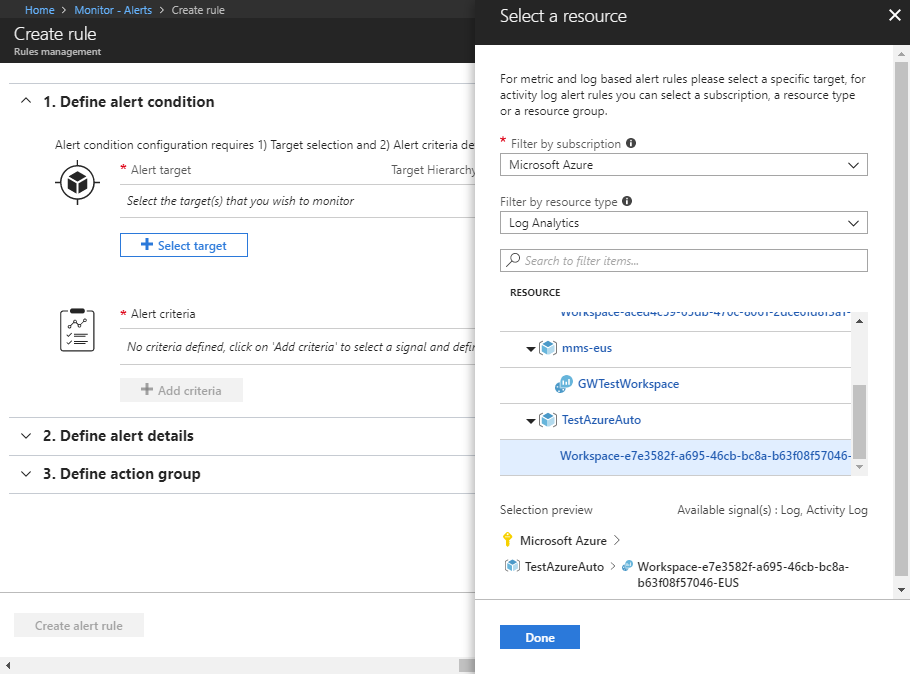
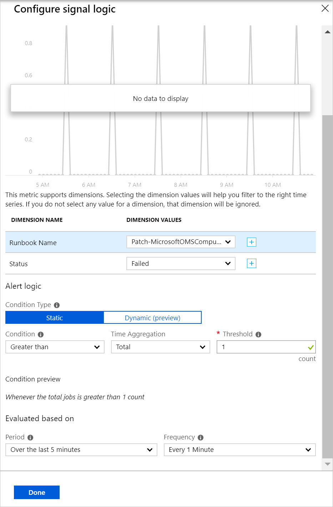

# Manage Windows updates by using Azure Automation

You can use the Update Management solution to manage updates and patches for your virtual machines. In this tutorial, you learn how to quickly assess the status of available updates, schedule installation of required updates, review deployment results, and create an alert to verify that updates apply successfully.

For pricing information, see [Automation pricing for Update Management](https://azure.microsoft.com/pricing/details/automation/).

In this tutorial, you learn how to:

> [!div class="checklist"]
> * Onboard a VM for Update Management
> * View an update assessment
> * Configure alerting
> * Schedule an update deployment
> * View the results of a deployment

## Prerequisites

To complete this tutorial, you need:

* An Azure subscription. If you don't have one yet, you can [activate your monthly Azure credit for Visual Studio subscribers](https://azure.microsoft.com/pricing/member-offers/msdn-benefits-details/) or sign up for a [free account](https://azure.microsoft.com/free/?WT.mc_id=A261C142F).
* An [Azure Automation account](automation-offering-get-started.md) to hold the watcher and action runbooks and the Watcher Task.
* A [virtual machine](../virtual-machines/windows/quick-create-portal.md) to onboard.

## Sign in to Azure

Sign in to the Azure portal at https://portal.azure.com.

## Enable Update Management

First, enable Update Management on your VM for this tutorial:

1. In the Azure portal, in the left menu, select **Virtual machines**. Select a VM from the list.
2. On the VM page, under **OPERATIONS**, select **Update management**. The **Enable Update Management** pane opens.

Validation is performed to determine whether Update Management is enabled for this VM. This validation includes checks for an Azure Log Analytics workspace and linked Automation account, and whether the Update Management solution is in the workspace.

A [Log Analytics](../log-analytics/log-analytics-overview.md?toc=%2fazure%2fautomation%2ftoc.json) workspace is used to collect data that's generated by features and services like Update Management. The workspace provides a single location to review and analyze data from multiple sources.

The validation process also checks to see whether the VM is provisioned with the Microsoft Monitoring Agent (MMA) and Automation Hybrid Runbook Worker. This agent is used to communicate with Azure Automation and to obtain information about the update status. The agent requires port 443 to be open to communicate with the Azure Automation service and to download updates.

If any of the following prerequisites were found to be missing during onboarding, they're automatically added:

* [Log Analytics](../log-analytics/log-analytics-overview.md?toc=%2fazure%2fautomation%2ftoc.json) workspace
* An [Automation account](./automation-offering-get-started.md)
* A [Hybrid Runbook Worker](./automation-hybrid-runbook-worker.md) (enabled on the VM)

Under **Update Management**, set the location, Log Analytics workspace, and Automation account to use. Then, select **Enable**. If these options aren't available, it means that another automation solution is enabled for the VM. In that case, the same workspace and Automation account must be used.


Enabling the solution can take up to a few minutes. During this time, don't close the browser window. After the solution is enabled, information about missing updates on the VM flows to Log Analytics. It can take between 30 minutes and 6 hours for the data to be available for analysis.

## View update assessment

After Update Management is enabled, the **Update management** pane opens. If any updates are missing, a list of missing updates is shown on the **Missing updates** tab.

Under **INFORMATION LINK**, select the update link to open the support article for the update in a new window. You can learn important information about the update in this window.


Click anywhere else on the update to open the **Log Search** pane for the selected update. The query for the log search is predefined for that specific update. You can modify this query or create your own query to view detailed information about the updates that are deployed or missing in your environment.


## Configure alerts

In this step, you learn to set up an alert to let you know when updates have been successfully deployed through a Log Analytics query or by tracking the master runbook for Update Management for deployments that failed.

### Alert conditions

For each type of alert, there are different alert conditions that need to be defined.

#### Log Analytics query alert

For successful deployments, you can create an alert based on a Log Analytics query. For failed deployments, you can use the [Runbook alert](#runbook-alert) steps to alert when the master runbook that orchestrators update deployments fails. You can write a custom query for additional alerts to cover many different scenarios.

In the Azure portal, go to **Monitor**, and then select **Create Alert**.

Under **1. Define alert condition**, click **Select target**. Under **Filter by resource type**, select **Log Analytics**. Select your Log Analytics workspace, and then select **Done**.



Select **Add criteria**.

Under **Configure signal logic**, in the table, select **Custom log search**. Enter the following query in the **Search query** text box:

```loganalytics
UpdateRunProgress
| where InstallationStatus == 'Succeeded'
| where TimeGenerated > now(-10m)
| summarize by UpdateRunName, Computer
```
This query returns the computers and the update run name that completed in the specified timeframe.

Under **Alert logic**, for **Threshold**, enter **1**. When you're finished, select **Done**.


#### Runbook alert

For failed deployments you must alert on the failure of the master runbook.
In the Azure portal, go to **Monitor**, and then select **Create Alert**.

Under **1. Define alert condition**, click **Select target**. Under **Filter by resource type**, select **Automation Accounts**. Select your Automation Account, and then select **Done**.

For **Runbook Name**, click the **\+** sign and enter **Patch-MicrosoftOMSComputers** as a custom name. For **Status**, choose **Failed** or click the **\+** sign to enter **Failed**.



Under **Alert logic**, for **Threshold**, enter **1**. When you're finished, select **Done**.

### Alert details

Under **2. Define alert details**, enter a name and description for the alert. Set **Severity** to **Informational(Sev 2)** for a successful run, or **Informational(Sev 1)** for a failed run.


Under **3. Define action group**, select **New action group**. An action group is a group of actions that you can use across multiple alerts. The actions can include but are not limited to email notifications, runbooks, webhooks, and many more. To learn more about action groups, see [Create and manage action groups](../monitoring-and-diagnostics/monitoring-action-groups.md).

In the **Action group name** box, enter a name for the alert and a short name. The short name is used in place of a full action group name when notifications are sent by using this group.

Under **Actions**, enter a name for the action, like **Email Notifications**. Under **ACTION TYPE**, select **Email/SMS/Push/Voice**. Under **DETAILS**, select **Edit details**.

In the **Email/SMS/Push/Voice** pane, enter a name. Select the **Email** check box, and then enter a valid email address.


In the **Email/SMS/Push/Voice** pane, select **OK**. In the **Add action group** pane, select **OK**.

To customize the subject of the alert email,  under **Create rule**, under **Customize Actions**, select **Email subject**. When you're finished, select **Create alert rule**. The alert tells you when an update deployment succeeds, and which machines were part of that update deployment run.

## Schedule an update deployment

Next, schedule a deployment that follows your release schedule and service window to install updates. You can choose which update types to include in the deployment. For example, you can include critical or security updates and exclude update rollups.

To schedule a new update deployment for the VM, go to **Update management**, and then select **Schedule update deployment**.

Under **New update deployment**, specify the following information:

* **Name**: Enter a unique name for the update deployment.

* **Operating system**: Select the OS to target for the update deployment.

* **Groups to update (preview)**: Define a query based on a combination of subscription, resource groups, locations, and tags to build a dynamic group of Azure VMs to include in your deployment. To learn more see, [Dynamic Groups](automation-update-management.md#using-dynamic-groups)

* **Machines to update**: Select a Saved search, Imported group, or pick Machine from the drop-down and select individual machines. If you choose **Machines**, the readiness of the machine is shown in the **UPDATE AGENT READINESS** column. To learn about the different methods of creating computer groups in Log Analytics, see [Computer groups in Log Analytics](../log-analytics/log-analytics-computer-groups.md)

* **Update classification**: Select the types of software that the update deployment included in the deployment. For this tutorial, leave all types selected.

  The classification types are:

   |OS  |Type  |
   |---------|---------|
   |Windows     | Critical updates</br>Security updates</br>Update rollups</br>Feature packs</br>Service packs</br>Definition updates</br>Tools</br>Updates        |
   |Linux     | Critical and security updates</br>Other updates       |

   For a description of the classification types, see [update classifications](automation-update-management.md#update-classifications).

* **Updates to include/exclude** - This opens the **Include/Exclude** page. Updates to be included or excluded are on separate tabs. For additional information on how inclusion is handled, see [inclusion behavior](automation-update-management.md#inclusion-behavior)

* **Schedule settings**: The **Schedule Settings** pane opens. The default start time is 30 minutes after the current time. You can set the start time to any time from 10 minutes in the future.

   You can also specify whether the deployment occurs once, or set up a recurring schedule. Under **Recurrence**, select **Once**. Leave the default as 1 day and select **OK**. This sets up a recurring schedule.

* **Pre-scripts + Post-scripts**: Select the scripts to run before and after your deployment. To learn more, see [Manage Pre and Post scripts](pre-post-scripts.md).
* **Maintenance window (minutes)**: Leave the default value. You can set the window of time that you want the update deployment to occur within. This setting helps ensure that changes are performed within your defined service windows.

* **Reboot options**: This setting
determines how reboots should be handled. Available options are:
  * Reboot if required (Default)
  * Always reboot
  * Never reboot
  * Only reboot - will not install updates

When you're finished configuring the schedule, select **Create**.


You're returned to the status dashboard. Select **Scheduled Update deployments** to show the deployment schedule you created.

## View results of an update deployment

After the scheduled deployment starts, you can see the status for that deployment on the **Update deployments** tab under **Update management**. The status is **In progress** when the deployment is currently running. When the deployment finishes, if it's successful, the status changes to **Succeeded**. When there are failures with one or more updates in the deployment, the status is **Partially failed**.

Select the completed update deployment to see the dashboard for that update deployment.


Under **Update results**, a summary provides the total number of updates and deployment results on the VM. The table on the right shows a detailed breakdown of each update and the installation results.

The following list shows the available values:

* **Not attempted**: The update wasn't installed because there was insufficient time available based on the maintenance window duration defined.
* **Succeeded**: The update succeeded.
* **Failed**: The update failed.

Select **All logs** to see all log entries that the deployment created.

Select **Output** to see the job stream of the runbook responsible for managing the update deployment on the target VM.

Select **Errors** to see detailed information about any errors from the deployment.

When your update deployment is successful, an email that's similar to the following example is sent to show success of the deployment:


## Next steps

In this tutorial, you learned how to:

> [!div class="checklist"]
> * Onboard a VM for Update Management
> * View an update assessment
> * Configure alerting
> * Schedule an update deployment
> * View the results of a deployment

Continue to the overview for the Update Management solution.

> [!div class="nextstepaction"]
> [Update Management solution](../operations-management-suite/oms-solution-update-management.md?toc=%2fazure%2fautomation%2ftoc.json)
