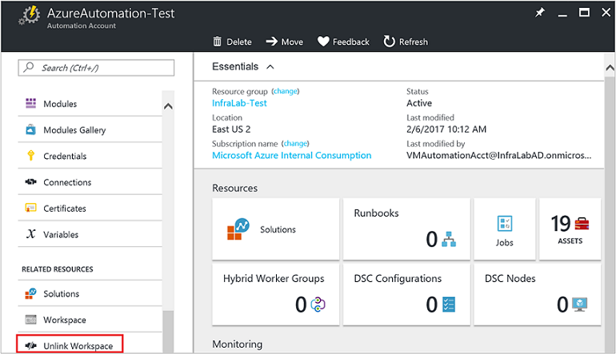
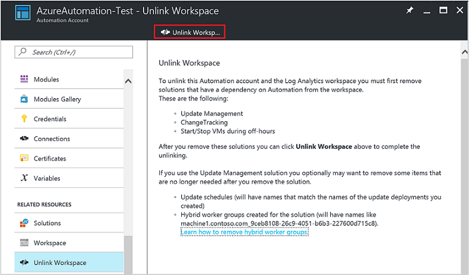

# How to unlink your Automation account from a Log Analytics workspace

Azure Automation integrates with Log Analytics to not only support proactive monitoring of your runbook jobs across all of your Automation accounts, but is also required when you import the following solutions that are dependent on Log Analytics:

* [Update Management](../operations-management-suite/oms-solution-update-management.md)
* [Change Tracking](../log-analytics/log-analytics-change-tracking.md)
* [Start/Stop VMs during off-hours](automation-solution-vm-management.md)
 
If you decide you no longer wish to integrate your Automation account with Log Analytics, you can unlink your account directly from the Azure portal.  Before you proceed, you will first need to remove the solutions mentioned earlier, otherwise this process will be prevented from proceeding.  Review the topic for the particular solution you have imported to understand the steps required to remove it.  

After you remove these solutions you can perform the following steps to unlink your Automation account.

## Unlink workspace

1. From the Azure portal, open your Automation account, and in the Automation account blade, in the account blade, select **Unlink workspace**.       
2. On the Unlink workspace blade, click **Unlink worksapce**.   .    You will receive a prompt verifying you wish to proceed.  
3. While Azure Automation attempts to unlink the account your Log Analytics workspace, you can track the progress under **Notifications** from the menu.

If you used the Update Management solution, optionally you may want to remove the following items that are no longer needed after you remove the solution.

* Update schedules.  Each will have names that match the update deployments you created)

* Hybrid worker groups created for the solution.  Each will be named similarly to  machine1.contoso.com_9ceb8108-26c9-4051-b6b3-227600d715c8).

If you used the Start/Stop VMs during off-hours solution, optionally you may want to remove the following items that are no longer needed after you remove the solution.

* Start and stop VM runbook schedules 
* Start and stop VM runbooks
* Variables   

## Next steps

To reconfigure your Automation account to integrate with OMS Log Analytics, see [Forward job status and job streams from Automation to Log Analytics (OMS)](automation-manage-send-joblogs-log-analytics.md). 