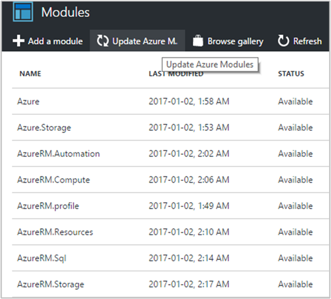
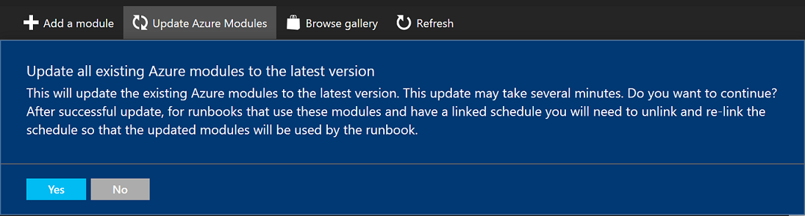
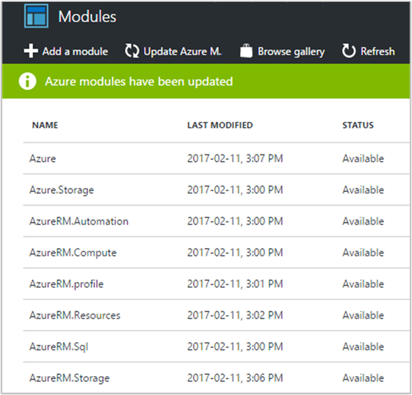

# How to update Azure PowerShell modules in Azure Automation

The most common Azure PowerShell modules are provided by default in each Automation account. The Azure team updates the Azure modules regularly, so in the Automation account you are provided a way to update the modules in the account when new versions are available from the portal.

Because modules are updated regularly by the product group, changes can occur with the  included cmdlets, which may negatively impact your runbooks depending on the type of change, such as renaming a parameter or deprecating a cmdlet entirely. To avoid impacting your runbooks and the processes they automate, it is recommended that you test and validate before proceeding. If you do not have a dedicated Automation account intended for this purpose, consider creating one so that you can test many different scenarios and permutations during the development of your runbooks, in addition to iterative changes such as updating the PowerShell modules. After the results are validated and you have applied any changes required, proceed with coordinating the migration of any runbooks that required modification and perform the following update as described in production.

> [!NOTE]
> A new Automation account might not contain the latest modules.

## Updating Azure Modules

1. In the Modules page of your Automation account, there is an option called **Update Azure Modules**. It is always enabled.   

  > [!NOTE]
  > Before updating your Azure modules it is recommended that you update them in a test Automation Account to ensure that your existing scripts work as expected before updating your Azure modules.
  >
  > The **Update Azure Modules** button is only available in the public cloud. It is not available in the [sovereign regions](https://azure.microsoft.com/global-infrastructure/). Please see [alternative ways to update your modules](#alternative-ways-to-update-your-modules) section to learn more.

2. Click **Update Azure Modules**, a confirmation notification is shown that asks if you want to continue.   

3. Click **Yes** and the module update process begins. The update process takes about 15-20 minutes to update the following modules:

  * Azure
  *	Azure.Storage
  *	AzureRm.Automation
  *	AzureRm.Compute
  *	AzureRm.Profile
  *	AzureRm.Resources
  *	AzureRm.Sql
  * AzureRm.Storage

    If the modules are already up-to-date, then the process completes in a few seconds. When the update process completes, you are notified.   

    The .NET core AzureRm modules (AzureRm.*.Core) are not supported in Azure Automation and can't be imported.

> [!NOTE]
> Azure Automation uses the latest modules in your Automation account when a new scheduled job is run.  

If you use cmdlets from these Azure PowerShell modules in your runbooks, you want to run this update process every month or so to make sure that you have the latest modules. Azure Automation uses the AzureRunAsConnection connection to authenticate when updating the modules, if the service principal is expired or no longer exists on the subscription level, the module update will fail.

## Alternative ways to update your modules

As mentioned, the **Update Azure Modules** button is not available in the sovereign clouds, it is only available in the global Azure cloud. This is due to the fact that the latest version of the Azure PowerShell modules from the PowerShell Gallery may not work with the Resource Manager services currently deployed in these clouds.

Updating the modules can still be done by importing the [Update-AzureModule.ps1](https://github.com/azureautomation/runbooks/blob/master/Utility/ARM/Update-AzureModule.ps1) runbook into your Automation Account and running it.

Use the `AzureRmEnvironment` parameter to pass the correct environment to the runbook.  Acceptable values are **AzureCloud**, **AzureChinaCloud**, **AzureGermanCloud**, and **AzureUSGovernmentCloud**. If you do not pass a value to this parameter, the runbook will default to the Azure public cloud **AzureCloud**.

If you want to use a specific Azure PowerShell module version instead of the latest available on the PowerShell Gallery, pass these versions to the optional `ModuleVersionOverrides` parameter of the **Update-AzureModule** runbook. For examples, see the  [Update-AzureModule.ps1](https://github.com/azureautomation/runbooks/blob/master/Utility/ARM/Update-AzureModule.ps1) runbook. Azure PowerShell modules that are not mentioned in the `ModuleVersionOverrides` parameter are updated with the latest module versions on the PowerShell Gallery. If nothing is passed to the `ModuleVersionOverrides` parameter, all modules are updated with the latest module versions on the PowerShell Gallery, which is the behavior of the **Update Azure Modules** button.

## Next steps

* To learn more about Integration Modules and how to create custom modules to further integrate Automation with other systems, services, or solutions, see [Integration Modules](automation-integration-modules.md).

* Consider source control integration using [GitHub Enterprise](automation-scenario-source-control-integration-with-github-ent.md) or [Azure DevOps](automation-scenario-source-control-integration-with-vsts.md) to centrally manage and control releases of your Automation runbook and configuration portfolio.  
