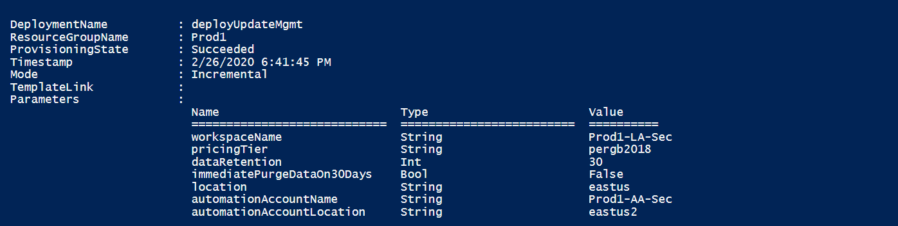

# Enable Update Management using Azure Resource Manager template

You can use an [Azure Resource Manager template](../azure-resource-manager/templates/template-syntax.md) to enable the Azure Automation Update Management feature in your resource group. This article provides a sample template that automates the following:

* Creation of a Azure Monitor Log Analytics workspace.
* Creation of an Azure Automation account.
* Linking the Automation account to the Log Analytics workspace, if not already linked.
* Enabling Update Management.

The template does not automate enabling Update Management on one or more Azure or non-Azure VMs.

If you already have a Log Analytics workspace and Automation account deployed in a supported region in your subscription, they are not linked. Using this template successfully creates the link and deploys Update Management.

## API versions

The following table lists the API versions for the resources used in this template.

| Resource | Resource type | API version |
|:---|:---|:---|
| Workspace | workspaces | 2020-03-01-preview |
| Automation account | automation | 2018-06-30 | 
| Solution | solutions | 2015-11-01-preview |

## Before using the template

If you choose to install and use PowerShell locally, this article requires the Azure PowerShell Az module. Run `Get-Module -ListAvailable Az` to find the version. If you need to upgrade, see [Install the Azure PowerShell module](/powershell/azure/install-az-ps). If you are running PowerShell locally, you also need to run [Connect-AzAccount](https://docs.microsoft.com/powershell/module/az.accounts/connect-azaccount?view=azps-3.7.0) to create a connection with Azure. With Azure PowerShell, deployment uses [New-AzResourceGroupDeployment](/powershell/module/az.resources/new-azresourcegroupdeployment).

If you choose to install and use the CLI locally, this article requires that you are running the Azure CLI version 2.1.0 or later. Run `az --version` to find the version. If you need to install or upgrade, see [Install Azure CLI](https://docs.microsoft.com/cli/azure/install-azure-cli?view=azure-cli-latest). With Azure CLI, this deployment uses [az group deployment create](https://docs.microsoft.com/cli/azure/group/deployment?view=azure-cli-latest#az-group-deployment-create). 

The JSON template is configured to prompt you for:

* The name of the workspace.
* The region in which to create the workspace.
* To enable resource or workspace permissions.
* The name of the Automation account.
* The region in which to create the account.

The JSON template specifies a default value for the other parameters that are likely to be used for a standard configuration in your environment. You can store the template in an Azure storage account for shared access in your organization. For further information about working with templates, see [Deploy resources with Resource Manager templates and Azure CLI](../azure-resource-manager/templates/deploy-cli.md).

The following parameters in the template are set with a default value for the Log Analytics workspace:

* sku - defaults to the new Per-GB pricing tier released in the April 2018 pricing model
* data retention - defaults to thirty days

>[!WARNING]
>If creating or configuring a Log Analytics workspace in a subscription that has opted into the new April 2018 pricing model, the only valid Log Analytics pricing tier is **PerGB2018**.
>

The JSON template specifies a default value for the other parameters that would likely be used as a standard configuration in your environment. You can store the template in an Azure storage account for shared access in your organization. For further information about working with templates, see [Deploy resources with Resource Manager templates and Azure CLI](../azure-resource-manager/templates/deploy-cli.md).

It is important to understand the following configuration details if you are new to Azure Automation and Azure Monitor, in order to avoid errors when attempting to create, configure, and use a Log Analytics workspace linked to your new Automation account.

* Review [Additional details](../azure-monitor/platform/template-workspace-configuration.md#create-a-log-analytics-workspace) to fully understand workspace configuration options, such as access control mode, pricing tier, retention, and capacity reservation level.

* Because only certain regions are supported for linking a Log Analytics workspace and an Automation account in your subscription, review [Workspace mappings](how-to/region-mappings.md) to specify the supported regions inline or in a parameters file.

* If you are new to Azure Monitor logs and have not deployed a workspace already, you should review the [workspace design](../azure-monitor/platform/design-logs-deployment.md) guidance to learn about access control, and understand the design implementation strategies we recommend for your organization.

## Deploy template

1. Copy and paste the following JSON syntax into your file:

    ```json
    {
    "$schema": "https://schema.management.azure.com/schemas/2015-01-01/deploymentTemplate.json#",
    "contentVersion": "1.0.0.0",
    "parameters": {
        "workspaceName": {
            "type": "string",
            "metadata": {
                "description": "Workspace name"
            }
        },
        "sku": {
            "type": "string",
            "allowedValues": [
                "pergb2018",
                "Free",
                "Standalone",
                "PerNode",
                "Standard",
                "Premium"
            ],
            "defaultValue": "pergb2018",
            "metadata": {
                "description": "Pricing tier: perGB2018 or legacy tiers (Free, Standalone, PerNode, Standard or Premium) which are not available to all customers."
            }
        },
        "dataRetention": {
            "type": "int",
            "defaultValue": 30,
            "minValue": 7,
            "maxValue": 730,
            "metadata": {
                "description": "Number of days of retention. Workspaces in the legacy Free pricing tier can only have 7 days."
            }
        },
        "location": {
            "type": "string",
            "metadata": {
                "description": "Specifies the location in which to create the workspace."
            }
        },
        "resourcePermissions": {
              "type": "bool",
              "metadata": {
                "description": "true to use resource or workspace permissions. false to require workspace permissions."
              }
        },
        "automationAccountName": {
            "type": "string",
            "metadata": {
                "description": "Automation account name"
            }
        },
        "automationAccountLocation": {
            "type": "string",
            "metadata": {
                "description": "Specify the location in which to create the Automation account."
            }
        }
    },
    "variables": {
        "Updates": {
            "name": "[concat('Updates', '(', parameters('workspaceName'), ')')]",
            "galleryName": "Updates"
        }
    },
    "resources": [
        {
        "type": "Microsoft.OperationalInsights/workspaces",
            "name": "[parameters('workspaceName')]",
            "apiVersion": "2020-03-01-preview",
            "location": "[parameters('location')]",
            "properties": {
                "sku": {
                    "name": "[parameters('sku')]",
                },
                "retentionInDays": "[parameters('dataRetention')]",
                "features": {
                    "searchVersion": 1,
                    "legacy": 0,
                    "enableLogAccessUsingOnlyResourcePermissions": true
                }
            },
            "resources": [
                {
                    "apiVersion": "2015-11-01-preview",
                    "location": "[parameters('location')]",
                    "name": "[variables('Updates').name]",
                    "type": "Microsoft.OperationsManagement/solutions",
                    "id": "[concat('/subscriptions/', subscription().subscriptionId, '/resourceGroups/', resourceGroup().name, '/providers/Microsoft.OperationsManagement/solutions/', variables('Updates').name)]",
                    "dependsOn": [
                        "[concat('Microsoft.OperationalInsights/workspaces/', parameters('workspaceName'))]"
                    ],
                    "properties": {
                        "workspaceResourceId": "[resourceId('Microsoft.OperationalInsights/workspaces/', parameters('workspaceName'))]"
                    },
                    "plan": {
                        "name": "[variables('Updates').name]",
                        "publisher": "Microsoft",
                        "promotionCode": "",
                        "product": "[concat('OMSGallery/', variables('Updates').galleryName)]"
                    }
                }
            ]
        },
        {
            "type": "Microsoft.Automation/automationAccounts",
            "apiVersion": "2018-06-30",
            "name": "[parameters('automationAccountName')]",
            "location": "[parameters('automationAccountLocation')]",
            "dependsOn": [],
            "tags": {},
            "properties": {
                "sku": {
                    "name": "Basic"
                }
            },
        },
        {
            "apiVersion": "2020-03-01-preview",
            "type": "Microsoft.OperationalInsights/workspaces/linkedServices",
            "name": "[concat(parameters('workspaceName'), '/' , 'Automation')]",
            "location": "[parameters('location')]",
            "dependsOn": [
                "[concat('Microsoft.OperationalInsights/workspaces/', parameters('workspaceName'))]",
                "[concat('Microsoft.Automation/automationAccounts/', parameters('automationAccountName'))]"
            ],
            "properties": {
                "resourceId": "[resourceId('Microsoft.Automation/automationAccounts/', parameters('automationAccountName'))]"
            }
        }
      ]
    }
    ```

2. Edit the template to meet your requirements. Consider creating a [Resource Manager parameters file](../azure-resource-manager/templates/parameter-files.md) instead of passing parameters as inline values.

3. Save this file to a local folder as **deployUMSolutiontemplate.json**.

4. You are ready to deploy this template. You can use either PowerShell or the Azure CLI. When you're prompted for a workspace and Automation account name, provide a name that is globally unique across all Azure subscriptions.

    **PowerShell**

    ```powershell
    New-AzResourceGroupDeployment -Name <deployment-name> -ResourceGroupName <resource-group-name> -TemplateFile deployUMSolutiontemplate.json
    ```

    **Azure CLI**

    ```cli
    az group deployment create --resource-group <my-resource-group> --name <my-deployment-name> --template-file deployUMSolutiontemplate.json
    ```

    The deployment can take a few minutes to complete. When it finishes, you see a message similar to the following that includes the result:

    

## Next steps

* To use Update Management for VMs, see [Manage updates and patches for your Azure VMs](automation-tutorial-update-management.md).

* If you no longer need the Log Analytics workspace, see instructions in [Unlink workspace from Automation account for Update Management](automation-unlink-workspace-update-management.md).

* To delete VMs from Update Management, see [Remove VMs from Update Management](automation-remove-vms-from-update-management.md).
