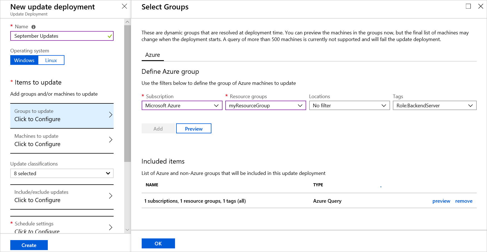
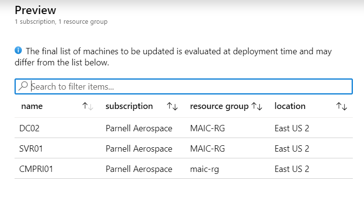
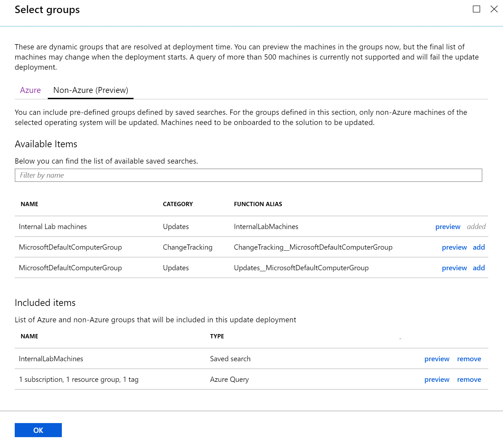

# Use dynamic groups with Update Management

Update Management provides the ability to target a dynamic group of Azure or Non-Azure VMs for update deployments. These groups are evaluated at deployment time so you do not have to edit your deployment to add machines.

## Azure machines

These groups are defined by a query, when an update deployment begins, the members of that group are evaluated. Dynamic groups do not work with classic VMs. When defining your query, the following items can be used together to populate the dynamic group:

* Subscription
* Resource groups
* Locations
* Tags

To preview the results of a dynamic group, click the **Preview** button. This preview shows the group membership at that time, in this example, we are searching for machines with the tag **Role** is equal to **BackendServer**. If more machines have this tag added, they will be added to any future deployments against that group.

## Non-Azure machines

For Non-Azure machines, saved searches also referred to as computer groups are used to create the dynamic group. To learn how to create a saved search, see [Creating a computer group](../azure-monitor/platform/computer-groups.md#creating-a-computer-group). Once your group is created you can select it from the list of saved searches. Click **Preview** to preview the computers in the saved search at that time.

## Next steps

After creating a dynamic group, you can [Create an Update Deployment](automation-tutorial-update-management.md)
