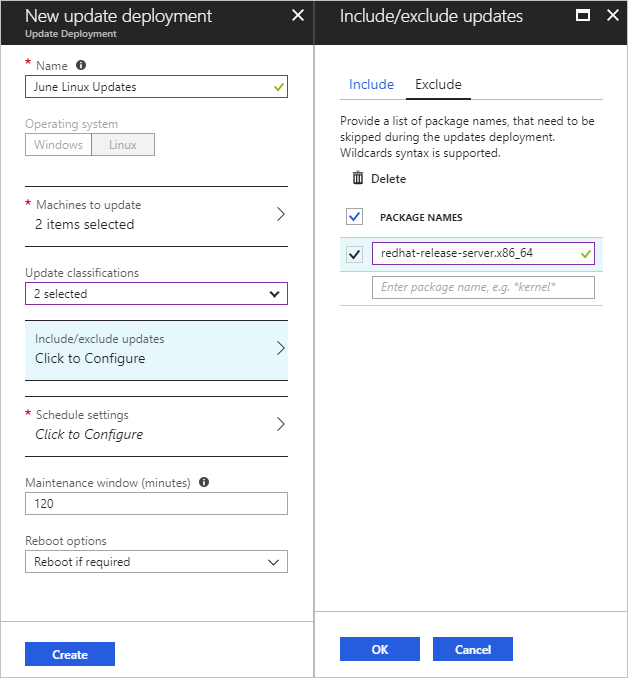

# Update Management solution in Azure

You can use the Update Management solution in Azure Automation to manage operating system updates for your Windows and Linux computers in Azure, in on-premises environments, and in other cloud providers. You can quickly assess the status of available updates on all agent computers and manage the process of installing required updates for servers.

You can enable Update Management for virtual machines (VMs) directly from your Azure Automation account. To learn how, see [Manage updates for multiple virtual machines](manage-update-multi.md). You can also enable Update Management for a VM from the virtual machine page in the Azure portal. This scenario is available for [Linux](../virtual-machines/linux/tutorial-config-management.md#enable-update-management) and [Windows](../virtual-machines/windows/tutorial-config-management.md#enable-update-management) VMs.

> [!NOTE]
> The Update Management solution requires linking a Log Analytics workspace to your Automation account. For a definitive list of supported regions, see [Azure Workspace mappings](./how-to/region-mappings.md). The region mappings don't affect the ability to manage VMs in a separate region from your Automation account.

[!INCLUDE [azure-monitor-log-analytics-rebrand](../../includes/azure-monitor-log-analytics-rebrand.md)]

## Solution overview

Computers that are managed by Update Management use the following configurations to perform assessment and to update deployments:

* Microsoft Monitoring Agent (MMA) for Windows or Linux
* PowerShell Desired State Configuration (DSC) for Linux
* Automation Hybrid Runbook Worker
* Microsoft Update or Windows Server Update Services (WSUS) for Windows computers

The following diagram illustrates how the solution assesses and applies security updates to all connected Windows Server and Linux computers in a workspace:


Update Management can be used to natively onboard machines in multiple subscriptions in the same tenant.

After a package is released, it takes 2 to 3 hours for the patch to show up for Linux machines for assessment. For Windows machines, it takes 12 to 15 hours for the patch to show up for assessment after it's been released.

After a computer completes a scan for update compliance, the agent forwards the information in bulk to Azure Monitor logs. On a Windows computer, the compliance scan is run every 12 hours by default.

In addition to the scan schedule, the scan for update compliance is initiated within 15 minutes of the MMA being restarted, before update installation, and after update installation.

For a Linux computer, the compliance scan is performed every hour by default. If the MMA agent is restarted, a compliance scan is initiated within 15 minutes.

The solution reports how up-to-date the computer is based on what source you're configured to sync with. If the Windows computer is configured to report to WSUS, depending on when WSUS last synced with Microsoft Update, the results might differ from what Microsoft Update shows. This behavior is the same for Linux computers that are configured to report to a local repo instead of to a public repo.

> [!NOTE]
> To properly report to the service, Update Management requires certain URLs and ports to be enabled. To learn more about these requirements, see [Network planning for Hybrid Workers](automation-hybrid-runbook-worker.md#network-planning).

You can deploy and install software updates on computers that require the updates by creating a scheduled deployment. Updates classified as *Optional* aren't included in the deployment scope for Windows computers. Only required updates are included in the deployment scope.

The scheduled deployment defines which target computers receive the applicable updates. It does so either by explicitly specifying certain computers or by selecting a [computer group](../azure-monitor/platform/computer-groups.md) that's based on log searches of a specific set of computers (or on an [Azure query](automation-update-management-query-logs.md) that dynamically selects Azure VMs based on specified criteria). These groups differ from [scope configuration](../azure-monitor/insights/solution-targeting.md), which is used only to determine which machines get the management packs that enable the solution.

You also specify a schedule to approve and set a time period during which updates can be installed. This period is called the maintenance window. A 20-minute span of the maintenance window is reserved for reboots, assuming one is needed and you selected the appropriate reboot option. If patching takes longer than expected and there's less than 20 minutes in the maintenance window, a reboot won't occur.

Updates are installed by runbooks in Azure Automation. You can't view these runbooks, and they don’t require any configuration. When an update deployment is created, it creates a schedule that starts a master update runbook at the specified time for the included computers. The master runbook starts a child runbook on each agent to install the required updates.

At the date and time specified in the update deployment, the target computers execute the deployment in parallel. Before installation, a scan is run to verify that the updates are still required. For WSUS client computers, if the updates aren't approved in WSUS, update deployment fails.

Having a machine registered for Update Management in more than one Log Analytics workspace (multihoming) isn't supported.

## Clients

### Supported client types

The following table lists the supported operating systems for update assessments. Patching requires a Hybrid Runbook Worker. For information on Hybrid Runbook Worker requirements, see the installation guides for installing a [Windows Hybrid Runbook Worker](automation-windows-hrw-install.md#installing-the-windows-hybrid-runbook-worker) and a [Linux Hybrid Runbook Worker](automation-linux-hrw-install.md#installing-a-linux-hybrid-runbook-worker).

|Operating system  |Notes  |
|---------|---------|
|Windows Server 2019 (Datacenter/Datacenter Core/Standard)<br><br>Windows Server 2016 (Datacenter/Datacenter Core/Standard)<br><br>Windows Server 2012 R2(Datacenter/Standard)<br><br>Windows Server 2012 || 
|Windows Server 2008 R2 (RTM and SP1 Standard)| Update Management only supports performing assessments for this operating system, patching is not supported as the [Hybrid Runbook Worker](automation-windows-hrw-install.md#installing-the-windows-hybrid-runbook-worker) is not supported for Windows Server 2008 R2. |
|CentOS 6 (x86/x64) and 7 (x64)      | Linux agents must have access to an update repository. Classification-based patching requires `yum` to return security data that CentOS doesn't have in its RTM releases. For more information on classification-based patching on CentOS, see [Update classifications on Linux](automation-view-update-assessments.md#linux-2).          |
|Red Hat Enterprise 6 (x86/x64) and 7 (x64)     | Linux agents must have access to an update repository.        |
|SUSE Linux Enterprise Server 11 (x86/x64) and 12 (x64)     | Linux agents must have access to an update repository.        |
|Ubuntu 14.04 LTS, 16.04 LTS, and 18.04 (x86/x64)      |Linux agents must have access to an update repository.         |

> [!NOTE]
> Azure virtual machine scale sets can be managed through Update Management. Update Management works on the instances themselves and not on the base image. You'll need to schedule the updates in an incremental way, so that not all the VM instances are updated at once.
> You can add nodes for virtual machine scale sets by following the steps under [Onboard a non-Azure machine](automation-tutorial-installed-software.md#onboard-a-non-azure-machine).

### Unsupported client types

The following table lists unsupported operating systems:

|Operating system  |Notes  |
|---------|---------|
|Windows client     | Client operating systems (such as Windows 7 and Windows 10) aren't supported.        |
|Windows Server 2016 Nano Server     | Not supported.       |
|Azure Kubernetes Service Nodes | Not supported. Use the patching process described in [Apply security and kernel updates to Linux nodes in Azure Kubernetes Service (AKS)](../aks/node-updates-kured.md)|

### Client requirements

The following information describes OS-specific client requirements. For additional guidance, see [Network planning](#ports).

#### Windows

Windows agents must be configured to communicate with a WSUS server, or they must have access to Microsoft Update.

You can use Update Management with Configuration Manager. To learn more about integration scenarios, see [Integrate Configuration Manager with Update Management](oms-solution-updatemgmt-sccmintegration.md#configuration). The [Windows agent](../azure-monitor/platform/agent-windows.md) is required. The agent is installed automatically if you're onboarding an Azure VM.

By default, Windows VMs that are deployed from the Azure Marketplace are set to receive automatic updates from Windows Update Service. This behavior doesn't change when you add this solution or add Windows VMs to your workspace. If you don't actively manage updates by using this solution, the default behavior (to automatically apply updates) applies.

> [!NOTE]
> A user can modify Group Policy so that machine reboots can be performed only by the user, not by the system. Managed machines can get stuck if Update Management doesn't have rights to reboot the machine without manual interaction from the user.
>
> For more information, see [Configure Group Policy settings for Automatic Updates](https://docs.microsoft.com/windows-server/administration/windows-server-update-services/deploy/4-configure-group-policy-settings-for-automatic-updates).

#### Linux

For Linux, the machine must have access to an update repository. The update repository can be private or public. TLS 1.1 or TLS 1.2 is required to interact with Update Management. A Log Analytics Agent for Linux that's configured to report to more than one Log Analytics workspace isn't supported with this solution. The machine must also have Python 2.x installed.

For information about how to install the Log Analytics Agent for Linux and to download the latest version, see [Log Analytics Agent for Linux](https://github.com/microsoft/oms-agent-for-linux). For information about how to install the Log Analytics Agent for Windows, see [Connect Windows computers to Azure Monitor](../log-analytics/log-analytics-windows-agent.md).

VMs that were created from the on-demand Red Hat Enterprise Linux (RHEL) images that are available in the Azure Marketplace are registered to access the [Red Hat Update Infrastructure (RHUI)](../virtual-machines/virtual-machines-linux-update-infrastructure-redhat.md) that's deployed in Azure. Any other Linux distribution must be updated from the distribution's online file repository by using the distribution's supported methods.

## Permissions

To create and manage update deployments, you need specific permissions. To learn about these permissions, see [Role-based access – Update Management](automation-role-based-access-control.md#update-management).

## Solution components

The solution consists of the following resources. The resources are added to your Automation account. They're either directly connected agents or in an Operations Manager-connected management group.

### Hybrid Worker groups

After you enable this solution, any Windows computer that's directly connected to your Log Analytics workspace is automatically configured as a Hybrid Runbook Worker to support the runbooks that are included in this solution.

Each Windows computer that's managed by the solution is listed in the **Hybrid worker groups** pane as a **System hybrid worker group** for the Automation account. The solutions use the *Hostname FQDN_GUID* naming convention. You can't target these groups with runbooks in your account. If you try, the attempt fails. These groups are intended to support only the management solution.

You can add the Windows computers to a Hybrid Runbook Worker group in your Automation account to support Automation runbooks if you use the same account for both the solution and the Hybrid Runbook Worker group membership. This functionality was added in version 7.2.12024.0 of the Hybrid Runbook Worker.

### Management packs

If your System Center Operations Manager management group is connected to a Log Analytics workspace, the following management packs are installed in Operations Manager. These management packs are also installed on directly connected Windows computers after you add the solution. You don't need to configure or manage these management packs.

* Microsoft System Center Advisor Update Assessment Intelligence Pack (Microsoft.IntelligencePacks.UpdateAssessment)
* Microsoft.IntelligencePack.UpdateAssessment.Configuration (Microsoft.IntelligencePack.UpdateAssessment.Configuration)
* Update Deployment MP

> [!NOTE]
> Assume that you have an Operations Manager 1807 or 2019 management group with agents configured at the Management Group level to associate them with a workspace. The current workaround to get them to show up is to override **IsAutoRegistrationEnabled** to **True** in the **Microsoft.IntelligencePacks.AzureAutomation.HybridAgent.Init** rule.

For more information about how solution management packs are updated, see [Connect Operations Manager to Azure Monitor logs](../azure-monitor/platform/om-agents.md).

> [!NOTE]
> For systems with the Operations Manger Agent: For an agent to be fully managed by Update Management, the agent must be updated to the MMA. To learn how to update the agent, see [How to upgrade an Operations Manager agent](https://docs.microsoft.com/system-center/scom/deploy-upgrade-agents). In environments that use Operations Manager, you must be running System Center Operations Manager 2012 R2 UR 14 or later.

## Data collection

### Supported agents

The following table describes the connected sources that this solution supports:

| Connected source | Supported | Description |
| --- | --- | --- |
| Windows agents |Yes |The solution collects information about system updates from Windows agents and then initiates installation of required updates. |
| Linux agents |Yes |The solution collects information about system updates from Linux agents and then initiates installation of required updates on supported distributions. |
| Operations Manager management group |Yes |The solution collects information about system updates from agents in a connected management group.<br/><br/>A direct connection from the Operations Manager agent to Azure Monitor logs isn't required. Data is forwarded from the management group to the Log Analytics workspace. |

### Collection frequency

A scan is performed twice per day for each managed Windows computer. Every 15 minutes, the Windows API is called to query for the last update time to determine whether the status has changed. If the status has changed, a compliance scan is initiated.

A scan is performed every hour for each managed Linux computer.

It can take between 30 minutes and 6 hours for the dashboard to display updated data from managed computers.

The average data usage by Azure Monitor logs for a machine using Update Management is approximately 25 megabytes (MB) per month. This value is only an approximation and is subject to change, depending on your environment. We recommend that you monitor your environment to keep track of your exact usage.

## <a name="ports"></a>Network planning

The following addresses are required specifically for Update Management. Communication to these addresses occurs over port 443.

|Azure Public  |Azure Government  |
|---------|---------|
|*.ods.opinsights.azure.com     |*.ods.opinsights.azure.us         |
|*.oms.opinsights.azure.com     | *.oms.opinsights.azure.us        |
|*.blob.core.windows.net|*.blob.core.usgovcloudapi.net|
|*.azure-automation.net|*.azure-automation.us|

For Windows machines, you must also allow traffic to any endpoints required by Windows Update. You can find an updated list of required endpoints in [Issues related to HTTP/Proxy](/windows/deployment/update/windows-update-troubleshooting#issues-related-to-httpproxy). If you have a local [Windows Update server](/windows-server/administration/windows-server-update-services/plan/plan-your-wsus-deployment), you must also allow traffic to the server specified in your [WSUS key](/windows/deployment/update/waas-wu-settings#configuring-automatic-updates-by-editing-the-registry).

For Red Hat Linux machines, see [IPs for the RHUI content delivery servers](../virtual-machines/linux/update-infrastructure-redhat.md#the-ips-for-the-rhui-content-delivery-servers) for required endpoints. For other Linux distributions, see your provider documentation.

For more information about ports that the Hybrid Runbook Worker requires, see [Hybrid Worker role ports](automation-hybrid-runbook-worker.md#hybrid-worker-role).

We recommend that you use the addresses listed when defining exceptions. For IP addresses, you can download [Microsoft Azure Datacenter IP ranges](https://www.microsoft.com/download/details.aspx?id=41653). This file is updated weekly, and it reflects the currently deployed ranges and any upcoming changes to the IP ranges.

Follow the instructions in [Connect computers without internet access](../azure-monitor/platform/gateway.md) to configure machines that don't have internet access.

## View update assessments

In your Automation account, select **Update Management** to view the status of your machines.

This view provides information about your machines, missing updates, update deployments, and scheduled update deployments. In the **COMPLIANCE** column, you can see the last time the machine was assessed. In the **UPDATE AGENT READINESS** column, you can check the health of the update agent. If there's an issue, select the link to go to troubleshooting documentation that can help you correct the problem.

To run a log search that returns information about the machine, update, or deployment, select the corresponding item in the list. The **Log Search** pane opens with a query for the item selected:


## View missing updates

Select **Missing updates** to view the list of updates that are missing from your machines. Each update is listed and can be selected. Information about the number of machines that require the update, the operating system, and a link for more information is shown. The **Log search** pane shows more details about the updates.


## Update classifications

The following tables list the update classifications in Update Management, with a definition for each classification.

### Windows

|Classification  |Description  |
|---------|---------|
|Critical updates     | An update for a specific problem that addresses a critical, non-security-related bug.        |
|Security updates     | An update for a product-specific, security-related issue.        |
|Update rollups     | A cumulative set of hotfixes that are packaged together for easy deployment.        |
|Feature packs     | New product features that are distributed outside a product release.        |
|Service packs     | A cumulative set of hotfixes that are applied to an application.        |
|Definition updates     | An update to virus or other definition files.        |
|Tools     | A utility or feature that helps complete one or more tasks.        |
|Updates     | An update to an application or file that currently is installed.        |

### <a name="linux-2"></a>Linux

|Classification  |Description  |
|---------|---------|
|Critical and security updates     | Updates for a specific problem or a product-specific, security-related issue.         |
|Other updates     | All other updates that aren't critical in nature or that aren't security updates.        |

For Linux, Update Management can distinguish between critical updates and security updates in the cloud while displaying assessment data due to data enrichment in the cloud. For patching, Update Management relies on classification data available on the machine. Unlike other distributions, CentOS does not have this information available in the RTM version. If you have CentOS machines configured to return security data for the following command, Update Management can patch based on classifications.

```bash
sudo yum -q --security check-update
```

There's currently no supported method to enable native classification-data availability on CentOS. At this time, only best-effort support is provided to customers who might have enabled this on their own. 

To classify updates on Red Hat Enterprise version 6, you need to install the yum-security plugin. On Red Hat Enterprise Linux 7, the plugin is already a part of yum itself, there is no need to install anything. For further information, see the following Red Hat [knowledge article](https://access.redhat.com/solutions/10021).

## Integrate with Configuration Manager

Customers who have invested in Microsoft Endpoint Configuration Manager for managing PCs, servers, and mobile devices also rely on the strength and maturity of Configuration Manager to help them manage software updates. Configuration Manager is part of their software update management (SUM) cycle.

To learn how to integrate the management solution with Configuration Manager, see [Integrate Configuration Manager with Update Management](oms-solution-updatemgmt-sccmintegration.md).

### Third-party patches on Windows

Update Management relies on the locally configured update repository to patch supported Windows systems. This is either WSUS or Windows Update. Tools like [System Center Updates Publisher](https://docs.microsoft.com/configmgr/sum/tools/updates-publisher) (Updates Publisher) allow you to publish custom updates into WSUS. This scenario allows Update Management to patch machines that use Configuration Manager as their update repository with third-party software. To learn how to configure Updates Publisher, see [Install Updates Publisher](https://docs.microsoft.com/configmgr/sum/tools/install-updates-publisher).

## Patch Linux machines

The following sections explain potential issues with patching Linux distros.

### Unexpected OS-level upgrades

On some Linux variants, such as Red Hat Enterprise Linux, OS-level upgrades might occur through packages. This might lead to Update Management runs where the OS version number changes. Because Update Management uses the same methods to update packages that an administrator would use locally on the Linux computer, this behavior is intentional.

To avoid updating the OS version through Update Management runs, use the **Exclusion** feature.

In Red Hat Enterprise Linux, the package name to exclude is redhat-release-server.x86_64.



### Critical/security patches aren't applied

When you deploy updates to a Linux machine, you can select update classifications. This option filters the updates that are applied to the machine that meet the specified criteria. This filter is applied locally on the machine when the update is deployed.

Because Update Management performs update enrichment in the cloud, some updates can be flagged in Update Management as having a security impact, even though the local machine doesn't have that information. As a result, if you apply critical updates to a Linux machine, there might be updates that aren't marked as having a security impact on that machine and therefore the updates aren't applied. However, Update Management might still report that machine as non-compliant because it has additional information about the relevant update.

Deploying updates by update classification doesn't work on RTM versions of CentOS. To properly deploy updates for CentOS, select all classifications to make sure updates are applied. For SUSE, selecting *only* **Other updates** as the classification can cause some security updates to also be installed if security updates related to zypper (package manager) or its dependencies are required first. This behavior is a limitation of zypper. In some cases, you might be required to rerun the update deployment. To verify, check the update log.

### <a name="multi-tenant"></a>Cross-tenant update deployments

If you have machines in another Azure tenant reporting to Update Management that you need to patch, you'll have to use the following workaround to get them scheduled. You can use the [New-AzureRmAutomationSchedule](/powershell/module/azurerm.automation/new-azurermautomationschedule) cmdlet with the `-ForUpdate` switch to create a schedule, and use the [New-AzureRmAutomationSoftwareUpdateConfiguration](/powershell/module/azurerm.automation/new-azurermautomationsoftwareupdateconfiguration
) cmdlet and pass the machines in the other tenant to the `-NonAzureComputer` parameter. The following example shows how to do this:

```azurepowershell-interactive
$nonAzurecomputers = @("server-01", "server-02")

$startTime = ([DateTime]::Now).AddMinutes(10)

$sched = New-AzureRmAutomationSchedule -ResourceGroupName mygroup -AutomationAccountName myaccount -Name myupdateconfig -Description test-OneTime -OneTime -StartTime $startTime -ForUpdate

New-AzureRmAutomationSoftwareUpdateConfiguration  -ResourceGroupName $rg -AutomationAccountName <automationAccountName> -Schedule $sched -Windows -NonAzureComputer $nonAzurecomputers -Duration (New-TimeSpan -Hours 2) -IncludedUpdateClassification Security,UpdateRollup -ExcludedKbNumber KB01,KB02 -IncludedKbNumber KB100
```

## <a name="onboard"></a>Enable Update Management

To begin patching systems, you need to enable the Update Management solution. There are many ways to onboard machines to Update Management. The following are the recommended and supported ways to onboard the solution:

* [From a virtual machine](automation-onboard-solutions-from-vm.md)
* [From browsing multiple machines](automation-onboard-solutions-from-browse.md)
* [From your Automation account](automation-onboard-solutions-from-automation-account.md)
* [With an Azure Automation runbook](automation-onboard-solutions.md)

## Next steps

Use the following tutorial to learn how to manage updates for your Windows VMs:

> [!div class="nextstepaction"]
> [Manage updates and patches for your Azure Windows VMs](automation-tutorial-update-management.md)

* Use log searches in [Azure Monitor logs](../log-analytics/log-analytics-log-searches.md) to view detailed update data.
* [Create alerts](automation-tutorial-update-management.md#configure-alerts) for update deployment status.

* To learn how to interact with Update Management through the REST API, see [Software update configurations](/rest/api/automation/softwareupdateconfigurations).
* To learn how to troubleshoot Update Management, see [Troubleshooting Update Management](troubleshoot/update-management.md).
