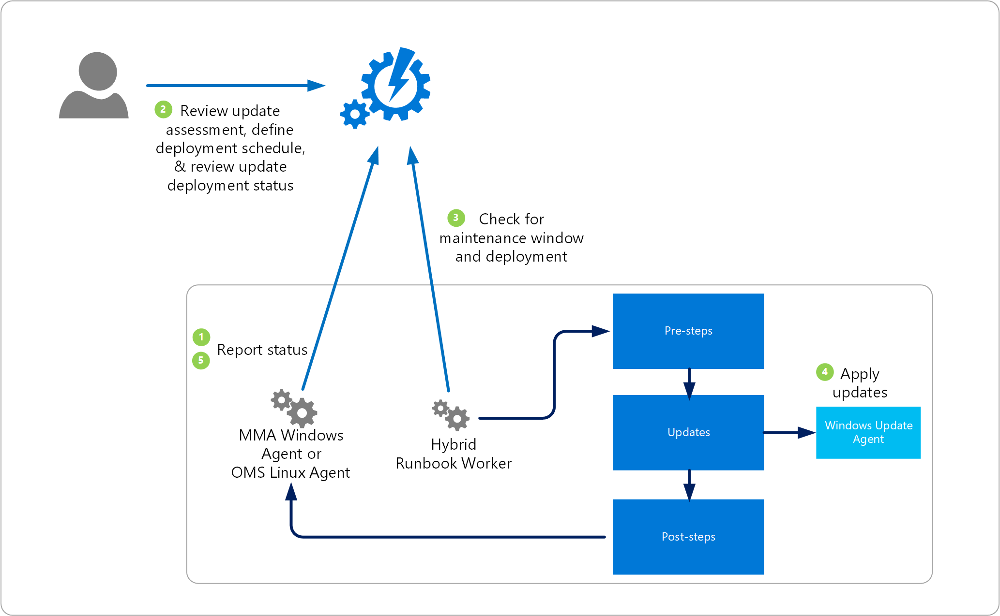

# Update Management overview

You can use Update Management in Azure Automation to manage operating system updates for your Windows and Linux machines in Azure, in on-premises environments, and in other cloud environments. You can quickly assess the status of available updates on all agent machines and manage the process of installing required updates for servers.

You can enable Update Management for VMs in the following ways:

* From your [Azure Automation account](automation-onboard-solutions-from-automation-account.md) for one or more Azure machines.
* Manually for non-Azure machines.
* For a single Azure VM from the Virtual machine page in the Azure portal. This scenario is available for [Linux](../virtual-machines/linux/tutorial-config-management.md#enable-update-management) and [Windows](../virtual-machines/windows/tutorial-config-management.md#enable-update-management) VMs.
* For [multiple Azure VMs](manage-update-multi.md) by selecting them from the Virtual machines page in the Azure portal.

> [!NOTE]
> Update Management requires linking a Log Analytics workspace to your Automation account. For a definitive list of supported regions, see [Azure Workspace mappings](how-to/region-mappings.md). The region mappings don't affect the ability to manage VMs in a separate region from your Automation account.

An [Azure Resource Manager template](automation-update-management-deploy-template.md) is available to help you deploy Update Management to a new or existing Automation account and Log Analytics workspace in your subscription.

> [!NOTE]
> You can't use a machine configured with Update Management to run custom scripts from Azure Automation. This machine can only run the Microsoft-signed update script. 

## About Update Management

Machines that are managed by Update Management use the following configurations to perform assessment and to update deployments:

* Log Analytics agent for Windows or Linux
* PowerShell Desired State Configuration (DSC) for Linux
* Automation Hybrid Runbook Worker
* Microsoft Update or Windows Server Update Services (WSUS) for Windows machines

The following diagram illustrates how Update Management assesses and applies security updates to all connected Windows Server and Linux machines in a workspace:



Update Management can be used to natively deploy machines in multiple subscriptions in the same tenant.

After a package is released, it takes 2 to 3 hours for the patch to show up for Linux machines for assessment. For Windows machines, it takes 12 to 15 hours for the patch to show up for assessment after it's been released.

After a machine completes a scan for update compliance, the agent forwards the information in bulk to Azure Monitor logs. On a Windows machine, the compliance scan is run every 12 hours by default.

In addition to the scan schedule, the scan for update compliance is started within 15 minutes of the Log Analytics agent being restarted, before update installation, and after update installation.

For a Linux machine, the compliance scan is performed every hour by default. If the Log Analytics agent is restarted, a compliance scan is started within 15 minutes.

Update Management reports how up to date the machine is based on what source you're configured to sync with. If the Windows machine is configured to report to WSUS, depending on when WSUS last synced with Microsoft Update, the results might differ from what Microsoft Update shows. This behavior is the same for Linux machines that are configured to report to a local repo instead of to a public repo.

> [!NOTE]
> To properly report to the service, Update Management requires certain URLs and ports to be enabled. To learn more about these requirements, see [Network configuration](https://docs.microsoft.com/azure/automation/automation-hybrid-runbook-worker#network-planning).

You can deploy and install software updates on machines that require the updates by creating a scheduled deployment. Updates classified as optional aren't included in the deployment scope for Windows machines. Only required updates are included in the deployment scope.

The scheduled deployment defines which target machines receive the applicable updates. It does so either by explicitly specifying certain machines or by selecting a [computer group](https://docs.microsoft.com/azure/azure-monitor/platform/computer-groups) that's based on log searches of a specific set of machines (or on an [Azure query](automation-update-management-query-logs.md) that dynamically selects Azure VMs based on specified criteria). These groups differ from [scope configuration](https://docs.microsoft.com/azure/azure-monitor/insights/solution-targeting), which is used to control the targeting of machines that receive the configuration to enable Update Management. This prevents them from performing and reporting update compliance, and install approved required updates.

While defining a deployment, you also specify a schedule to approve and set a time period during which updates can be installed. This period is called the maintenance window. A 20-minute span of the maintenance window is reserved for reboots, assuming one is needed and you selected the appropriate reboot option. If patching takes longer than expected and there's less than 20 minutes in the maintenance window, a reboot won't occur.

Updates are installed by runbooks in Azure Automation. You can't view these runbooks, and they don't require any configuration. When an update deployment is created, it creates a schedule that starts a master update runbook at the specified time for the included machines. The master runbook starts a child runbook on each agent to install the required updates.

At the date and time specified in the update deployment, the target machines execute the deployment in parallel. Before installation, a scan is run to verify that the updates are still required. For WSUS client machines, if the updates aren't approved in WSUS, update deployment fails.
Having a machine registered for Update Management in more than one Log Analytics workspace (also referred to as multihoming) isn't supported.

## Clients

### Supported client types

The following table lists the supported operating systems for update assessments. Patching requires a Hybrid Runbook Worker. For information on Hybrid Runbook Worker requirements, see [Deploy a Windows Hybrid Runbook Worker](automation-windows-hrw-install.md) and a [Deploy a Linux Hybrid Runbook Worker](automation-linux-hrw-install.md).

> [!NOTE]
> Update assessment of Linux machines is only supported in certain regions as listed in the Automation account and Log Analytics workspace [mappings table](https://docs.microsoft.com/azure/automation/how-to/region-mappings#supported-mappings). 

|Operating system  |Notes  |
|---------|---------|
|Windows Server 2019 (Datacenter/Datacenter Core/Standard)<br><br>Windows Server 2016 (Datacenter/Datacenter Core/Standard)<br><br>Windows Server 2012 R2(Datacenter/Standard)<br><br>Windows Server 2012 || 
|Windows Server 2008 R2 (RTM and SP1 Standard)| Update Management only supports assessments for this operating system. Patching is not supported as the [Hybrid Runbook Worker](automation-windows-hrw-install.md) is not supported for Windows Server 2008 R2. |
|CentOS 6 (x86/x64) and 7 (x64)      | Linux agents require access to an update repository. Classification-based patching requires `yum` to return security data that CentOS doesn't have in its RTM releases. For more information on classification-based patching on CentOS, see [Update classifications on Linux](automation-view-update-assessments.md#linux-2).          |
|Red Hat Enterprise 6 (x86/x64) and 7 (x64)     | Linux agents require access to an update repository.        |
|SUSE Linux Enterprise Server 11 (x86/x64) and 12 (x64)     | Linux agents require access to an update repository.        |
|Ubuntu 14.04 LTS, 16.04 LTS, and 18.04 (x86/x64)      |Linux agents require access to an update repository.         |

> [!NOTE]
> Azure virtual machine scale sets can be managed through Update Management. Update Management works on the instances themselves and not on the base image. You'll need to schedule the updates in an incremental way, so that not all the VM instances are updated at once. You can add nodes for virtual machine scale sets by following the steps under [Add a non-Azure machine to Change Tracking and Inventory](automation-tutorial-installed-software.md#add-a-non-azure-machine-to-change-tracking-and-inventory).

### Unsupported client types

The following table lists unsupported operating systems:

|Operating system  |Notes  |
|---------|---------|
|Windows client     | Client operating systems (such as Windows 7 and Windows 10) aren't supported.<br> For Azure Windows Virtual Desktop (WVD), the recommended method<br> to manage updates is [Windows Update for Business](https://docs.microsoft.com/windows/deployment/update/waas-manage-updates-wufb) for Windows 10 client machine patch management. |
|Windows Server 2016 Nano Server     | Not supported.       |
|Azure Kubernetes Service Nodes | Not supported. Use the patching process described in [Apply security and kernel updates to Linux nodes in Azure Kubernetes Service (AKS)](../aks/node-updates-kured.md)|

### Client requirements

The following information describes operating system-specific client requirements. For additional guidance, see [Network planning](#ports).  To understand client requirements for TLS 1.2, see [TLS 1.2 enforcement for Azure Automation](automation-managing-data.md#tls-12-enforcement-for-azure-automation).

#### Windows

Windows agents must be configured to communicate with a WSUS server, or they require access to Microsoft Update. For information about how to install the Log Analytics agent for Windows, see [Connect Windows computers to Azure Monitor](../log-analytics/log-analytics-windows-agent.md).

You can use Update Management with Microsoft Endpoint Configuration Manager. To learn more about integration scenarios, see [Integrate Update Management with Windows Endpoint Configuration Manager](updatemgmt-mecmintegration.md). The [Log Analytics agent for Windows](../azure-monitor/platform/agent-windows.md) is required for Windows servers managed by sites in your Configuration Manager environment. 

By default, Windows VMs that are deployed from the Azure Marketplace are set to receive automatic updates from Windows Update Service. This behavior doesn't change when you add Windows VMs to your workspace. If you don't actively manage updates by using Update Management, the default behavior (to automatically apply updates) applies.

> [!NOTE]
> You can modify Group Policy so that machine reboots can be performed only by the user, not by the system. Managed machines can get stuck if Update Management doesn't have rights to reboot the machine without manual interaction from the user. For more information, see [Configure Group Policy settings for Automatic Updates](https://docs.microsoft.com/windows-server/administration/windows-server-update-services/deploy/4-configure-group-policy-settings-for-automatic-updates).

#### Linux

For Linux, the machine requires access to an update repository, either private or public. TLS 1.1 or TLS 1.2 is required to interact with Update Management. Update Management doesn't support a Log Analytics agent for Linux that's configured to report to more than one Log Analytics workspace. The machine must also have Python 2.x installed.

> [!NOTE]
> Update assessment of Linux machines is only supported in certain regions. See the Automation account and Log Analytics workspace [mappings table](https://docs.microsoft.com/azure/automation/how-to/region-mappings#supported-mappings). 

For information about how to install the Log Analytics agent for Linux and to download the latest version, see [Log Analytics agent for Linux](../azure-monitor/platform/agent-linux.md). 

VMs created from the on-demand Red Hat Enterprise Linux (RHEL) images that are available in the Azure Marketplace are registered to access the [Red Hat Update Infrastructure (RHUI)](../virtual-machines/workloads/redhat/redhat-rhui.md) that's deployed in Azure. Any other Linux distribution must be updated from the distribution's online file repository by using methods supported by the distribution.

## Permissions

To create and manage update deployments, you need specific permissions. To learn about these permissions, see [Role-based access – Update Management](automation-role-based-access-control.md#update-management-permissions).

## Update Management components

Update Management uses the resources described in this section. These resources are automatically added to your Automation account when you enable Update Management.

### Hybrid Runbook Worker groups

After you enable Update Management, any Windows machine that's directly connected to your Log Analytics workspace is automatically configured as a Hybrid Runbook Worker to support the runbooks that support Update Management.

Each Windows machine that's managed by Update Management is listed in the Hybrid worker groups pane as a System hybrid worker group for the Automation account. The groups use the `Hostname FQDN_GUID` naming convention. You can't target these groups with runbooks in your account. If you try, the attempt fails. These groups are intended to support only Update Management.

You can add the Windows machine to a Hybrid Runbook Worker group in your Automation account to support Automation runbooks if you use the same account for Update Management and the Hybrid Runbook Worker group membership. This functionality was added in version 7.2.12024.0 of the Hybrid Runbook Worker.

### Management packs

If your Operations Manager management group is [connected to a Log Analytics workspace](../azure-monitor/platform/om-agents.md), the following management packs are installed in Operations Manager. These management packs are also installed for Update Management on directly connected Windows machines. You don't need to configure or manage these management packs.

* Microsoft System Center Advisor Update Assessment Intelligence Pack (Microsoft.IntelligencePacks.UpdateAssessment)
* Microsoft.IntelligencePack.UpdateAssessment.Configuration (Microsoft.IntelligencePack.UpdateAssessment.Configuration)
* Update Deployment MP

> [!NOTE]
> If you have an Operations Manager 1807 or 2019 management group connected to a Log Analytics workspace with agents configured in the management group to collect log data, you need to override the parameter `IsAutoRegistrationEnabled` and set it to True in the **Microsoft.IntelligencePacks.AzureAutomation.HybridAgent.Init** rule.

For more information about updates to management packs, see [Connect Operations Manager to Azure Monitor logs](../azure-monitor/platform/om-agents.md).

> [!NOTE]
> For Update Management to fully manage machines with the Log Analytics agent, you must update to the Log Analytics agent for Windows or the Log Analytics agent for Linux. To learn how to update the agent, see [How to upgrade an Operations Manager agent](https://docs.microsoft.com/system-center/scom/deploy-upgrade-agents). In environments that use Operations Manager, you must be running System Center Operations Manager 2012 R2 UR 14 or later.

## Data collection

### Supported sources

The following table describes the connected sources that Update Management supports:

| Connected source | Supported | Description |
| --- | --- | --- |
| Windows agents |Yes |Update Management collects information about system updates from Windows agents and then starts installation of required updates. |
| Linux agents |Yes |Update Management collects information about system updates from Linux agents and then starts installation of required updates on supported distributions. |
| Operations Manager management group |Yes |Update Management collects information about system updates from agents in a connected management group.<br/><br/>A direct connection from the Operations Manager agent to Azure Monitor logs isn't required. Data is forwarded from the management group to the Log Analytics workspace. |

### Collection frequency

Update Management scans managed machines for data using the following rules. It can take between 30 minutes and 6 hours for the dashboard to display updated data from managed machines.

* Each Windows machine - Update Management does a scan twice per day for each machine. Every 15 minutes, it queries the Windows API for the last update time to determine whether the status has changed. If the status has changed, Update Management starts a compliance scan.

* Each Linux machine - Update Management does a scan every hour.

The average data usage by Azure Monitor logs for a machine using Update Management is approximately 25 MB per month. This value is only an approximation and is subject to change, depending on your environment. We recommend that you monitor your environment to keep track of your exact usage. For more information to analyze data usage, see [Manage usage and cost](../azure-monitor/platform/manage-cost-storage.md).

## <a name="ports"></a>Network planning

The following addresses are required specifically for Update Management. Communication to these addresses occurs over port 443.

|Azure Public  |Azure Government  |
|---------|---------|
|*.ods.opinsights.azure.com    | *.ods.opinsights.azure.us         |
|*.oms.opinsights.azure.com     | *.oms.opinsights.azure.us        |
|*.blob.core.windows.net | *.blob.core.usgovcloudapi.net|
|*.azure-automation.net | *.azure-automation.us|

For Windows machines, you must also allow traffic to any endpoints required by Windows Update. You can find an updated list of required endpoints in [Issues related to HTTP/Proxy](/windows/deployment/update/windows-update-troubleshooting#issues-related-to-httpproxy). If you have a local [Windows Update server](/windows-server/administration/windows-server-update-services/plan/plan-your-wsus-deployment), you must also allow traffic to the server specified in your [WSUS key](/windows/deployment/update/waas-wu-settings#configuring-automatic-updates-by-editing-the-registry).

For Red Hat Linux machines, see [IPs for the RHUI content delivery servers](../virtual-machines/workloads/redhat/redhat-rhui.md#the-ips-for-the-rhui-content-delivery-servers) for required endpoints. For other Linux distributions, see your provider documentation.

For more information about ports required for the Hybrid Runbook Worker, see [Update Management addresses for Hybrid Runbook Worker](automation-hybrid-runbook-worker.md#update-management-addresses-for-hybrid-runbook-worker).

We recommend that you use the addresses listed when defining exceptions. For IP addresses, you can download [Microsoft Azure Datacenter IP ranges](https://www.microsoft.com/download/details.aspx?id=41653). This file is updated weekly, and it reflects the currently deployed ranges and any upcoming changes to the IP ranges.

Follow the instructions in [Connect computers without internet access](../azure-monitor/platform/gateway.md) to configure machines that don't have internet access.

## Update classifications

The following table defines the classifications that Update Management supports for Windows updates. 

|Classification  |Description  |
|---------|---------|
|Critical updates     | An update for a specific problem that addresses a critical, non-security-related bug.        |
|Security updates     | An update for a product-specific, security-related issue.        |
|Update rollups     | A cumulative set of hotfixes that are packaged together for easy deployment.        |
|Feature packs     | New product features that are distributed outside a product release.        |
|Service packs     | A cumulative set of hotfixes that are applied to an application.        |
|Definition updates     | An update to virus or other definition files.        |
|Tools     | A utility or feature that helps complete one or more tasks.        |
|Updates     | An update to an application or file that currently is installed.        |

The next table defines the supported classifications for Linux updates.

|Classification  |Description  |
|---------|---------|
|Critical and security updates     | Updates for a specific problem or a product-specific, security-related issue.         |
|Other updates     | All other updates that aren't critical in nature or that aren't security updates.        |

For Linux, Update Management can distinguish between critical updates and security updates in the cloud while displaying assessment data due to data enrichment in the cloud. For patching, Update Management relies on classification data available on the machine. Unlike other distributions, CentOS does not have this information available in the RTM version. If you have CentOS machines configured to return security data for the following command, Update Management can patch based on classifications.

```bash
sudo yum -q --security check-update
```

There's currently no supported method to enable native classification-data availability on CentOS. At this time, only best-effort support is provided to customers who might have enabled this feature on their own. 

To classify updates on Red Hat Enterprise version 6, you need to install the yum-security plugin. On Red Hat Enterprise Linux 7, the plugin is already a part of yum itself and there's no need to install anything. For more information, see the following Red Hat [knowledge article](https://access.redhat.com/solutions/10021).

## Integrate Update Management with Configuration Manager

Customers who have invested in Microsoft Endpoint Configuration Manager for managing PCs, servers, and mobile devices also rely on the strength and maturity of Configuration Manager to help manage software updates. To learn how to integrate Update Management with Configuration Manager, see [Integrate Update Management with Windows Endpoint Configuration Manager](updatemgmt-mecmintegration.md).

## Third-party updates on Windows

Update Management relies on the locally configured update repository to update supported Windows systems, either WSUS or Windows Update. Tools such as [System Center Updates Publisher](https://docs.microsoft.com/configmgr/sum/tools/updates-publisher) allow you to import and publish custom updates with WSUS. This scenario allows Update Management to update machines that use Configuration Manager as their update repository with third-party software. To learn how to configure Updates Publisher, see [Install Updates Publisher](https://docs.microsoft.com/configmgr/sum/tools/install-updates-publisher).

## Enable Update Management

An Azure [Resource Manager template](automation-update-management-deploy-template.md) is available to help you deploy Update Management to a new or existing Automation account and Azure Monitor Log Analytics workspace in your subscription. It does not configure the scope of machines that should be managed, this is performed as a separate step after using the template.

Here are the ways that you can enable Update Management and select machines to be managed:

* [From a virtual machine](automation-onboard-solutions-from-vm.md)
* [From browsing multiple machines](automation-onboard-solutions-from-browse.md)
* [From an Azure Automation account](automation-onboard-solutions.md)

## Next steps

* For details of working with Update Management, see [Manage updates and patches for your Azure VMs](automation-tutorial-update-management.md).

* Review commonly asked questions about Update Management in the [Azure Automation frequently asked questions](automation-faq.md).
