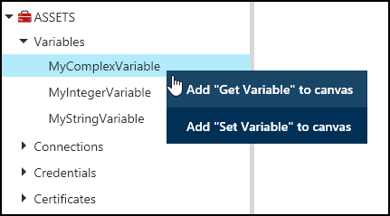
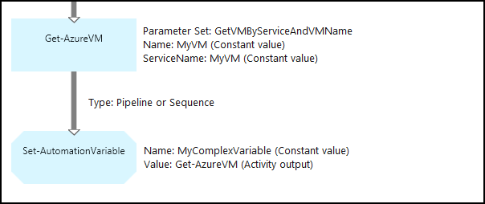
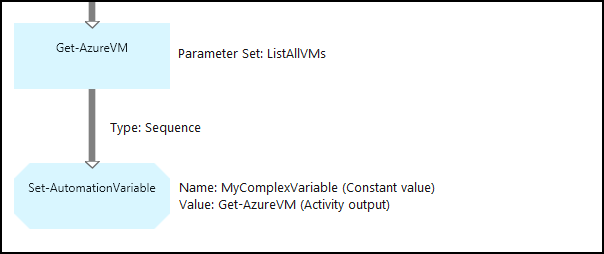
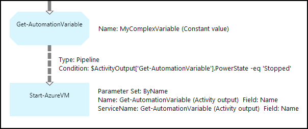

<properties 
   pageTitle="Variable assets in Azure Automation | Microsoft Azure"
   description="Variable assets are values that are available to all runbooks and DSC configurations in Azure Automation.  This article explains the details of variables and how to work with them in both textual and graphical authoring."
   services="automation"
   documentationCenter=""
   authors="mgoedtel"
   manager="jwhit""
   editor="tysonn" />
<tags 
   ms.service="automation"
   ms.devlang="na"
   ms.topic="article"
   ms.tgt_pltfrm="na"
   ms.workload="infrastructure-services"
   ms.date="05/24/2016"
   ms.author="magoedte;bwren" />

# Variable assets in Azure Automation

Variable assets are values that are available to all runbooks and DSC configurations in your automation account. They can be created, modified, and retrieved from the Azure portal, Windows PowerShell, and from within a runbook or DSC configuration. Automation variables are useful for the following scenarios:

- Share a value between multiple runbooks or DSC configurations.

- Share a value between multiple jobs from the same runbook or DSC configuration.

- Manage a value from the portal or from the Windows PowerShell command line that is used by runbooks or DSC configurations.

Automation variables are persisted so that they continue to be available even if the runbook or DSC configuration fails.  This also allows a value to be set by one runbook that is then used by another, or is used by the same runbook or DSC configuration the next time that it is run.

When a variable is created, you can specify that it be stored encrypted.  When a variable is encrypted, it is stored securely in Azure Automation, and its value cannot be retrieved from the [Get-AzureAutomationVariable](http://msdn.microsoft.com/library/dn913772.aspx) cmdlet that ships as part of the Azure PowerShell module.  The only way that an encrypted value can be retrieved is from the **Get-AutomationVariable** activity in a runbook or DSC configuration.

>[AZURE.NOTE]Secure assets in Azure Automation include credentials, certificates, connections, and encrypted variables. These assets are encrypted and stored in the Azure Automation using a unique key that is generated for each automation account. This key is encrypted by a master certificate and stored in Azure Automation. Before storing a secure asset, the key for the automation account is decrypted using the master certificate and then used to encrypt the asset.

## Variable types

When you create a variable with the Azure portal, you must specify a data type from the dropdown list so the portal can display the appropriate control for entering the variable value. The variable is not restricted to this data type, but you must set the variable using Windows PowerShell if you want to specify a value of a different type. If you specify **Not defined**, then the value of the variable will be set to **$null**, and you must set the value with the [Set-AzureAutomationVariable](http://msdn.microsoft.com/library/dn913767.aspx) cmdlet or **Set-AutomationVariable** activity.  You cannot create or change the value for a complex variable type in the portal, but you can provide a value of any type using Windows PowerShell. Complex types will be returned as a [PSCustomObject](http://msdn.microsoft.com/library/system.management.automation.pscustomobject.aspx).

You can store multiple values to a single variable by creating an array or hashtable and saving it to the variable.

## Cmdlets and workflow activities

The cmdlets in the following table are used to create and manage Automation variables with Windows PowerShell. They ship as part of the [Azure PowerShell module](../powershell-install-configure.md) which is available for use in Automation runbooks and DSC configuration.

|Cmdlets|Description|
|:---|:---|
|[Get-AzureAutomationVariable](http://msdn.microsoft.com/library/dn913772.aspx)|Retrieves the value of an existing variable.|
|[New-AzureAutomationVariable](http://msdn.microsoft.com/library/dn913771.aspx)|Creates a new variable and sets its value.|
|[Remove-AzureAutomationVariable](http://msdn.microsoft.com/library/dn913775.aspx)|Removes an existing variable.|
|[Set-AzureAutomationVariable](http://msdn.microsoft.com/library/dn913767.aspx)|Sets the value for an existing variable.|

The workflow activities in the following table are used to access Automation variables in a runbook. They are only available for use in a runbook or DSC configuration, and do not ship as part of the Azure PowerShell module.

|Workflow Activities|Description|
|:---|:---|
|Get-AutomationVariable|Retrieves the value of an existing variable.|
|Set-AutomationVariable|Sets the value for an existing variable.|

>[AZURE.NOTE] You should avoid using variables in the –Name parameter of **Get-AutomationVariable**  in a runbook or DSC configuration since this can complicate discovering dependencies between runbooks or DSC configuration, and Automation variables at design time.

## Creating a new Automation variable

### To create a new variable with the Azure portal

1. From your automation account, click **Assets** at the top of the window.
1. At the bottom of the window, click **Add Setting**.
1. Click **Add Variable**.
1. Complete the wizard and click the checkbox to save the new variable.

### To create a new variable with the Azure portal

1. From your automation account, click the **Assets** part to open the **Assets** blade.
1. Click the **Variables** part to open the **Variables** blade.
1. Click **Add a variable** at the top of the blade.
1. Complete the form and click **Create** to save the new variable.

### To create a new variable with Windows PowerShell

The [New-AzureAutomationVariable](http://msdn.microsoft.com/library/dn913771.aspx) cmdlet creates a new variable and sets its initial value. You can retrieve the value using [Get-AzureAutomationVariable](http://msdn.microsoft.com/library/dn913772.aspx). If the value is a simple type, then that same type is returned. If it’s a complex type, then a **PSCustomObject** is returned.

The following sample commands show how to create a variable of type string and then return its value.

	New-AzureAutomationVariable –AutomationAccountName "MyAutomationAccount" –Name 'MyStringVariable' –Encrypted $false –Value 'My String'
	$string = (Get-AzureAutomationVariable –AutomationAccountName "MyAutomationAccount" –Name 'MyStringVariable').Value

The following sample commands show how to create a variable with a complex type and then return its properties. In this case, a virtual machine object from **Get-AzureVM** is used.

	$vm = Get-AzureVM –ServiceName "MyVM" –Name "MyVM"
	New-AzureAutomationVariable –AutomationAccountName "MyAutomationAccount" –Name "MyComplexVariable" –Encrypted $false –Value $vm
	
	$vmValue = (Get-AzureAutomationVariable –AutomationAccountName "MyAutomationAccount" –Name "MyComplexVariable").Value
	$vmName = $vmValue.Name
	$vmIpAddress = $vmValue.IpAddress

## Using a variable in a runbook or DSC configuration

Use the **Set-AutomationVariable** activity to set the value of an Automation variable in a runbook or DSC configuration, and the **Get-AutomationVariable** to retrieve it.  You shouldn't use the **Set-AzureAutomationVariable** or  **Get-AzureAutomationVariable** cmdlets in a runbook or DSC configuration since they are less efficient than the workflow activities.  You also cannot retrieve the value of secure variables with **Get-AzureAutomationVariable**.  The only way to create a new variable from within a runbook or DSC configuration is to use the [New-AzureAutomationVariable](http://msdn.microsoft.com/library/dn913771.aspx)  cmdlet.

### Textual runbook samples

#### Setting and retrieving a simple value from a variable

The following sample commands show how to set and retrieve a variable in a textual runbook. In this sample, it is assumed that variables of type integer named *NumberOfIterations* and *NumberOfRunnings* and a variable of type string named *SampleMessage* have already been created.

	$NumberOfIterations = Get-AutomationVariable -Name 'NumberOfIterations'
	$NumberOfRunnings = Get-AutomationVariable -Name 'NumberOfRunnings'
	$SampleMessage = Get-AutomationVariable -Name 'SampleMessage'
	
	Write-Output "Runbook has been run $NumberOfRunnings times."
	
	for ($i = 1; $i -le $NumberOfIterations; $i++) {
	   Write-Output "$i`: $SampleMessage"
	}
	Set-AutomationVariable –Name NumberOfRunnings –Value ($NumberOfRunnings += 1)

#### Setting and retrieving a complex object in a variable

The following sample code shows how to update a variable with a complex value in a textual runbook. In this sample, an Azure virtual machine is retrieved with **Get-AzureVM** and saved to an existing Automation variable.  As explained in [Variable types](#variable-types), this is stored as a PSCustomObject.

	$vm = Get-AzureVM -ServiceName "MyVM" -Name "MyVM"
	Set-AutomationVariable -Name "MyComplexVariable" -Value $vm

In the following code, the value is retrieved from the variable and used to start the virtual machine.

	$vmObject = Get-AutomationVariable -Name "MyComplexVariable"
	if ($vmObject.PowerState -eq 'Stopped') {
	   Start-AzureVM -ServiceName $vmObject.ServiceName -Name $vmObject.Name
	}

#### Setting and retrieving a collection in a variable

The following sample code shows how to use a variable with a collection of complex values in a textual runbook. In this sample, multiple Azure virtual machines are retrieved with **Get-AzureVM** and saved to an existing Automation variable.  As explained in [Variable types](#variable-types), this is stored as a collection of PSCustomObjects.

	$vms = Get-AzureVM | Where -FilterScript {$_.Name -match "my"}     
    Set-AutomationVariable -Name 'MyComplexVariable' -Value $vms

In the following code, the collection is retrieved from the variable and used to start each virtual machine.

	$vmValues = Get-AutomationVariable -Name "MyComplexVariable"
	ForEach ($vmValue in $vmValues)
	{
	   if ($vmValue.PowerState -eq 'Stopped') {
	      Start-AzureVM -ServiceName $vmValue.ServiceName -Name $vmValue.Name
	   }
	}

### Graphical runbook samples

In a graphical runbook, you add the **Get-AutomationVariable** or **Set-AutomationVariable** by right-clicking on the variable in the Library pane of the graphical editor and selecting the activity you want.

#### Setting values in a variable

The following image shows sample activities to update a variable with a simple value in a graphical runbook. In this sample, a single Azure virtual machine is retrieved with **Get-AzureVM** and the computer name is saved to an existing Automation variable with a type of String.  It doesn't matter whether the [link is a pipeline or sequence](automation-graphical-authoring-intro.md#links-and-workflow) since we only expect a single object in the output.

The following image shows the activities used to update a variable with a complex value in a graphical runbook. The only change from the previous example is not specifying a **Field path** for the **Activity output** on the **Set-AutomationVariable** activity so that the object is stored instead of just a property of the object.  As explained in [Variable types](#variable-types), this is stored as a PSCustomObject.

The following image shows similar functionality as the previous example, with multiple virtual machines saved to the variable.  A [sequence link](automation-graphical-authoring-intro.md#links-and-workflow) must be used here so that the **Set-AutomationVariable** activity receives the entire set of virtual machines as one collection.  If a [pipeline link](automation-graphical-authoring-intro.md#links-and-workflow) was used, then the **Set-AutomationVariable** activity would run separately for each object with the result being that only the last virtual machine in the collection would be saved.  As explained in [Variable types](#variable-types), this is stored as a collection of PSCustomObjects.

#### Retrieving values from a variable

The following image shows sample activities that retrieve and use a variable in a graphical runbook.  The first activity retrieves the virtual machines that were saved to the variable in the previous example.  The link needs to be a [pipeline](automation-graphical-authoring-intro.md#links-and-workflow) so that the **Start-AzureVM** activity runs once for each object sent from the **Get-AutomationVariable** activity.  This will work the same whether a a single object or multiple objects are stored in the variable.  The **Start-AzureVM** activity uses properties of the PSCustomObject that represents each virtual machine. 

The following image shows how to filter the objects that are stored to a variable in a graphical runbook.  A [condition](automation-graphical-authoring-intro.md#links-and-workflow) is added to the link in the previous example to filter only those virtual machines that were stopped when the variable was set.

## Next Steps

- To learn more about connecting activities together in graphical authoring, see [Links in graphical authoring](automation-graphical-authoring-intro.md#links-and-workflow)
- To get started with Graphical runbooks, see [My first graphical runbook](automation-first-runbook-graphical.md) 
