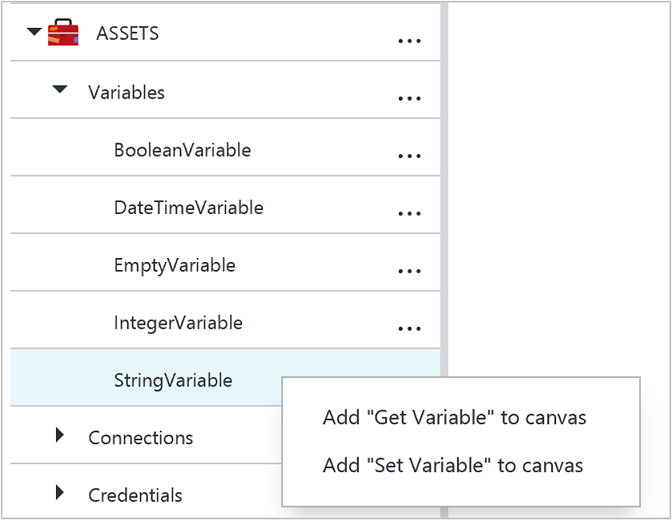
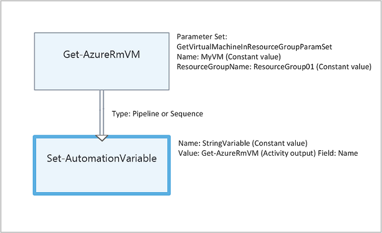

# Variable assets in Azure Automation

Variable assets are values that are available to all runbooks and DSC configurations in your automation account. They can be created, modified, and retrieved from the Azure portal, Windows PowerShell, and from within a runbook or DSC configuration. Automation variables are useful for the following scenarios:

- Share a value between multiple runbooks or DSC configurations.

- Share a value between multiple jobs from the same runbook or DSC configuration.

- Manage a value from the portal or from the Windows PowerShell command line that is used by runbooks or DSC configurations, such as a set of common configuration items like specific list of VM names, a specific resource group,  an AD domain name, etc.  

Automation variables are persisted so that they continue to be available even if the runbook or DSC configuration fails.  This also allows a value to be set by one runbook that is then used by another, or is used by the same runbook or DSC configuration the next time that it is run.

When a variable is created, you can specify that it be stored encrypted.  When a variable is encrypted, it is stored securely in Azure Automation, and its value cannot be retrieved from the [Get-AzureRmAutomationVariable](https://msdn.microsoft.com/library/mt603849.aspx) cmdlet that ships as part of the Azure PowerShell module.  The only way that an encrypted value can be retrieved is from the **Get-AutomationVariable** activity in a runbook or DSC configuration.

> [!NOTE]
> Secure assets in Azure Automation include credentials, certificates, connections, and encrypted variables. These assets are encrypted and stored in the Azure Automation using a unique key that is generated for each automation account. This key is encrypted by a master certificate and stored in Azure Automation. Before storing a secure asset, the key for the automation account is decrypted using the master certificate and then used to encrypt the asset.

## Variable types

When you create a variable with the Azure portal, you must specify a data type from the drop-down list so the portal can display the appropriate control for entering the variable value. The variable is not restricted to this data type, but you must set the variable using Windows PowerShell if you want to specify a value of a different type. If you specify **Not defined**, then the value of the variable will be set to **$null**, and you must set the value with the [Set-AzureAutomationVariable](http://msdn.microsoft.com/library/dn913767.aspx) cmdlet or **Set-AutomationVariable** activity.  You cannot create or change the value for a complex variable type in the portal, but you can provide a value of any type using Windows PowerShell. Complex types will be returned as a [PSCustomObject](http://msdn.microsoft.com/library/system.management.automation.pscustomobject.aspx).

You can store multiple values to a single variable by creating an array or hashtable and saving it to the variable.

The following are a list of variable types available in Automation:

* String
* Integer
* DateTime
* Boolean
* Null

## Scripting the creation and management of variables

The cmdlets in the following table are used to create and manage Automation variables with Windows PowerShell. They ship as part of the [Azure PowerShell module](../powershell-install-configure.md) which is available for use in Automation runbooks and DSC configuration.

|Cmdlets|Description|
|:---|:---|
|[Get-AzureRmAutomationVariable](https://msdn.microsoft.com/library/mt603849.aspx)|Retrieves the value of an existing variable.|
|[New-AzureRmAutomationVariable](https://msdn.microsoft.com/library/mt603613.aspx)|Creates a new variable and sets its value.|
|[Remove-AzureRmAutomationVariable](https://msdn.microsoft.com/library/mt619354.aspx)|Removes an existing variable.|
|[Set-AzureRmAutomationVariable](https://msdn.microsoft.com/library/mt603601.aspx)|Sets the value for an existing variable.|

The workflow activities in the following table are used to access Automation variables in a runbook. They are only available for use in a runbook or DSC configuration, and do not ship as part of the Azure PowerShell module.

|Workflow Activities|Description|
|:---|:---|
|Get-AutomationVariable|Retrieves the value of an existing variable.|
|Set-AutomationVariable|Sets the value for an existing variable.|

> [!NOTE] 
> You should avoid using variables in the –Name parameter of **Get-AutomationVariable**  in a runbook or DSC configuration since this can complicate discovering dependencies between runbooks or DSC configuration, and Automation variables at design time.

The functions in the following table are used to access and retrieve variables in a Python2 runbook. 

|Python2 Functions|Description|
|:---|:---|
|automationassets.get_automation_variable|Retrieves the value of an existing variable. |
|automationassets.set_automation_variable|Sets the value for an existing variable. |

> [!NOTE] 
> You must import the "automationassets" module at the top of your Python runbook in order to access the asset functions.

## Creating a new Automation variable

### To create a new variable with the Azure portal

1. From your Automation account, click the **Assets** tile and then on the **Assets** blade, select **Variables**.
2. On the **Variables** tile, select **Add a variable**.
3. Complete the options on the **New Variable** blade and click **Create** save the new variable.

### To create a new variable with Windows PowerShell

The [New-AzureRmAutomationVariable](https://msdn.microsoft.com/library/mt603613.aspx) cmdlet creates a new variable and sets its initial value. You can retrieve the value using [Get-AzureRmAutomationVariable](https://msdn.microsoft.com/library/mt603849.aspx). If the value is a simple type, then that same type is returned. If it’s a complex type, then a **PSCustomObject** is returned.

The following sample commands show how to create a variable of type string and then return its value.

	New-AzureRmAutomationVariable -ResourceGroupName "ResouceGroup01" 
    –AutomationAccountName "MyAutomationAccount" –Name 'MyStringVariable' `
    –Encrypted $false –Value 'My String'
	$string = (Get-AzureRmAutomationVariable -ResourceGroupName "ResouceGroup01" `
    –AutomationAccountName "MyAutomationAccount" –Name 'MyStringVariable').Value

The following sample commands show how to create a variable with a complex type and then return its properties. In this case, a virtual machine object from **Get-AzureRmVm** is used.

	$vm = Get-AzureRmVm -ResourceGroupName "ResourceGroup01" –Name "VM01"
	New-AzureRmAutomationVariable –AutomationAccountName "MyAutomationAccount" –Name "MyComplexVariable" –Encrypted $false –Value $vm
	
	$vmValue = (Get-AzureRmAutomationVariable -ResourceGroupName "ResourceGroup01" `
    –AutomationAccountName "MyAutomationAccount" –Name "MyComplexVariable").Value
	$vmName = $vmValue.Name
	$vmIpAddress = $vmValue.IpAddress

## Using a variable in a runbook or DSC configuration

Use the **Set-AutomationVariable** activity to set the value of an Automation variable in a PowerShell runbook or DSC configuration, and the **Get-AutomationVariable** to retrieve it.  You shouldn't use the **Set-AzureAutomationVariable** or  **Get-AzureAutomationVariable** cmdlets in a runbook or DSC configuration since they are less efficient than the workflow activities.  You also cannot retrieve the value of secure variables with **Get-AzureAutomationVariable**.  The only way to create a new variable from within a runbook or DSC configuration is to use the [New-AzureAutomationVariable](http://msdn.microsoft.com/library/dn913771.aspx)  cmdlet.

### Textual runbook samples

#### Setting and retrieving a simple value from a variable

The following sample commands show how to set and retrieve a variable in a textual runbook. In this sample, it is assumed that variables of type integer named *NumberOfIterations* and *NumberOfRunnings* and a variable of type string named *SampleMessage* have already been created.

	$NumberOfIterations = Get-AzureRmAutomationVariable -ResourceGroupName "ResouceGroup01" –AutomationAccountName "MyAutomationAccount" -Name 'NumberOfIterations'
	$NumberOfRunnings = Get-AzureRmAutomationVariable -ResourceGroupName "ResouceGroup01" –AutomationAccountName "MyAutomationAccount" -Name 'NumberOfRunnings'
	$SampleMessage = Get-AutomationVariable -Name 'SampleMessage'
	
	Write-Output "Runbook has been run $NumberOfRunnings times."
	
	for ($i = 1; $i -le $NumberOfIterations; $i++) {
	   Write-Output "$i`: $SampleMessage"
	}
	Set-AzureRmAutomationVariable -ResourceGroupName "ResouceGroup01" –AutomationAccountName "MyAutomationAccount" –Name NumberOfRunnings –Value ($NumberOfRunnings += 1)

#### Setting and retrieving a complex object in a variable

The following sample code shows how to update a variable with a complex value in a textual runbook. In this sample, an Azure virtual machine is retrieved with **Get-AzureVM** and saved to an existing Automation variable.  As explained in [Variable types](#variable-types), this is stored as a PSCustomObject.

    $vm = Get-AzureVM -ServiceName "MyVM" -Name "MyVM"
    Set-AutomationVariable -Name "MyComplexVariable" -Value $vm

In the following code, the value is retrieved from the variable and used to start the virtual machine.

    $vmObject = Get-AutomationVariable -Name "MyComplexVariable"
    if ($vmObject.PowerState -eq 'Stopped') {
       Start-AzureVM -ServiceName $vmObject.ServiceName -Name $vmObject.Name
    }

#### Setting and retrieving a collection in a variable

The following sample code shows how to use a variable with a collection of complex values in a textual runbook. In this sample, multiple Azure virtual machines are retrieved with **Get-AzureVM** and saved to an existing Automation variable.  As explained in [Variable types](#variable-types), this is stored as a collection of PSCustomObjects.

    $vms = Get-AzureVM | Where -FilterScript {$_.Name -match "my"}     
    Set-AutomationVariable -Name 'MyComplexVariable' -Value $vms

In the following code, the collection is retrieved from the variable and used to start each virtual machine.

    $vmValues = Get-AutomationVariable -Name "MyComplexVariable"
    ForEach ($vmValue in $vmValues)
    {
       if ($vmValue.PowerState -eq 'Stopped') {
          Start-AzureVM -ServiceName $vmValue.ServiceName -Name $vmValue.Name
       }
    }
    
#### Setting and retrieving a variable in Python2
The following sample code shows how to use a variable, set a variable, and handle an exception for a non-existent variable in a Python2 runbook.

	import automationassets
	from automationassets import AutomationAssetNotFound

	# get a variable
	value = automationassets.get_automation_variable("test-variable")
	print value

	# set a variable (value can be int/bool/string)
	automationassets.set_automation_variable("test-variable", True)
	automationassets.set_automation_variable("test-variable", 4)
	automationassets.set_automation_variable("test-variable", "test-string")

	# handle a non-existent variable exception
	try:
	    value = automationassets.get_automation_variable("non-existing variable")
	except AutomationAssetNotFound:
	    print "variable not found"

### Graphical runbook samples

In a graphical runbook, you add the **Get-AutomationVariable** or **Set-AutomationVariable** by right-clicking on the variable in the Library pane of the graphical editor and selecting the activity you want.

#### Setting values in a variable
The following image shows sample activities to update a variable with a simple value in a graphical runbook. In this sample, a single Azure virtual machine is retrieved with **Get-AzureRmVM** and the computer name is saved to an existing Automation variable with a type of String.  It doesn't matter whether the [link is a pipeline or sequence](automation-graphical-authoring-intro.md#links-and-workflow) since we only expect a single object in the output.

## Next Steps

* To learn more about connecting activities together in graphical authoring, see [Links in graphical authoring](automation-graphical-authoring-intro.md#links-and-workflow)
* To get started with Graphical runbooks, see [My first graphical runbook](automation-first-runbook-graphical.md) 

