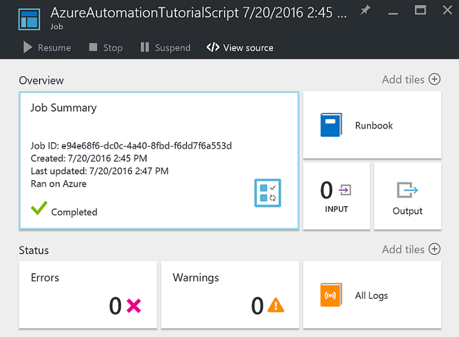
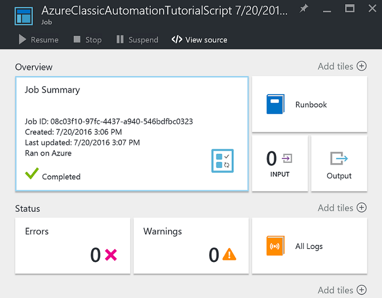

# Test Azure Automation Run As account authentication
After an Automation account is successfully created, you can perform a simple test to confirm you are able to successfully authenticate in Azure Resource Manager or Azure classic deployment using your newly created or updated Automation Run As account.    

## Automation Run As authentication

1. In the Azure portal, open the Automation account created earlier.  
2. Click on the **Runbooks** tile to open the list of runbooks.
3. Select the **AzureAutomationTutorialScript** runbook and then click **Start** to start the runbook.  You will receive a prompt verifying you wish to start the runbook.
4. A [runbook job](automation-runbook-execution.md) is created, the Job blade is displayed, and the job status displayed in the **Job Summary** tile.  
5. The job status will start as *Queued* indicating that it is waiting for a runbook worker in the cloud to become available. It will then move to *Starting* when a worker claims the job, and then *Running* when the runbook actually starts running.  
6. When the runbook job completes, we should see a status of **Completed**.   
7. To see the detailed results of the runbook, click on the **Output** tile.
8. In the **Output** blade, you should see it has successfully authenticated and returned a list of all resources available in the resource group.
9. Close the **Output** blade to return to the **Job Summary** blade.
10. Close the **Job Summary** and the corresponding **AzureAutomationTutorialScript** runbook blade.

## Classic Run As authentication
Perform the following steps if you will be managing resources in the classic deployment model, to confirm you are able to successfully authenticate using the new Classic Run As account.     

1. In the Azure portal, open the Automation account created earlier.  
2. Click on the **Runbooks** tile to open the list of runbooks.
3. Select the **AzureClassicAutomationTutorialScript** runbook and then click **Start** to  start the runbook.  You will receive a prompt verifying you wish to start the runbook.
4. A [runbook job](automation-runbook-execution.md) is created, the Job blade is displayed, and the job status displayed in the **Job Summary** tile.  
5. The job status will start as *Queued* indicating that it is waiting for a runbook worker in the cloud to become available. It will then move to *Starting* when a worker claims the job, and then *Running* when the runbook actually starts running.  
6. When the runbook job completes, we should see a status of **Completed**.      
7. To see the detailed results of the runbook, click on the **Output** tile.
8. In the **Output** blade, you should see it has successfully authenticated and returned a list of all classic VM’s in the subscription.
9. Close the **Output** blade to return to the **Job Summary** blade.
10. Close the **Job Summary** and the corresponding **AzureClassicAutomationTutorialScript** runbook blade.

## Next steps
* To get started with PowerShell runbooks, see [My first PowerShell runbook](automation-first-runbook-textual-powershell.md).
* To learn more about Graphical Authoring, see [Graphical authoring in Azure Automation](automation-graphical-authoring-intro.md).
