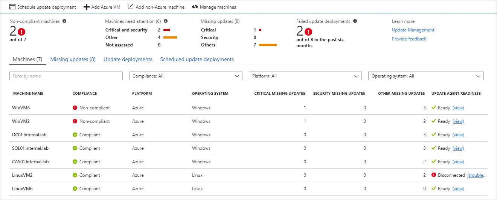
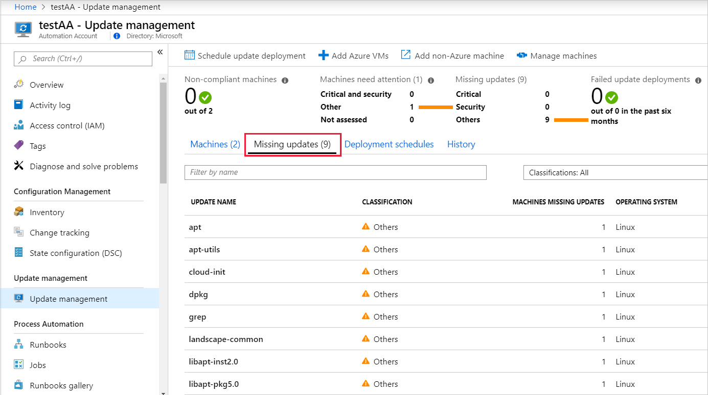

# View update assessments

In your Azure Automation account, select **Update Management** to view the status of your machines.

This view provides information about your machines, missing updates, update deployments, and scheduled update deployments. In the **COMPLIANCE** column, you can see the last time the machine was assessed. In the **UPDATE AGENT READINESS** column, you can see the health of the update agent. If there's an issue, select the link to go to troubleshooting documentation that can help you correct the problem.

To run a log search that returns information about the machine, update, or deployment, select the corresponding item in the list. The Log Search pane opens with a query for the item selected.



## View missing updates

Select **Missing updates** to view the list of updates that are missing from your machines. Each update is listed and can be selected. Information about the number of machines that require the update, operating system details, and a link for more information are all shown. The Log Search pane also shows more details about the updates.



## Work with update classifications

The following tables list the supported update classifications in Update Management, with a definition for each classification.

### Windows

|Classification  |Description  |
|---------|---------|
|Critical updates     | Updates for specific problems that address critical, non-security-related bugs.        |
|Security updates     | Updates for product-specific, security-related issues.        |
|Update rollups     | Sets of hotfixes that are packaged together for easy deployment.        |
|Feature packs     | New product features that are distributed outside a product release.        |
|Service packs     | Sets of hotfixes that are applied to an application.        |
|Definition updates     | Updates to virus or other definition files.        |
|Tools     | Utilities or features that help complete one or more tasks.        |
|Updates     | Updates to applications or files that are installed currently.        |

### <a name="linux-2"></a>Linux

|Classification  |Description  |
|---------|---------|
|Critical and security updates     | Updates for a specific problem or a product-specific, security-related issue.         |
|Other updates     | All other updates that aren't critical in nature or that aren't security updates.        |

For Linux, Update Management can distinguish between critical updates and security updates in the cloud while displaying assessment data. (This granularity is possible because of data enrichment in the cloud.) For patching, Update Management relies on classification data available on the machine. Unlike other distributions, CentOS doesn't have this information available in the RTM versions of the product. If you have CentOS machines configured to return security data for the following command, Update Management can patch based on classifications:

```bash
sudo yum -q --security check-update
```

There's currently no supported method to enable native classification-data availability on CentOS. At this time, only best-effort support is provided to customers who have enabled this functionality on their own.

To classify updates on Red Hat Enterprise version 6, you need to install the yum-security plugin. On Red Hat Enterprise Linux 7, the plugin is already a part of yum itself, there is no need to install anything. For further information, see the following Red Hat [knowledge article](https://access.redhat.com/solutions/10021).

## Next steps

For general information, see [Manage updates and patches for your Azure VMs](automation-tutorial-update-management.md).
