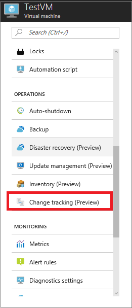
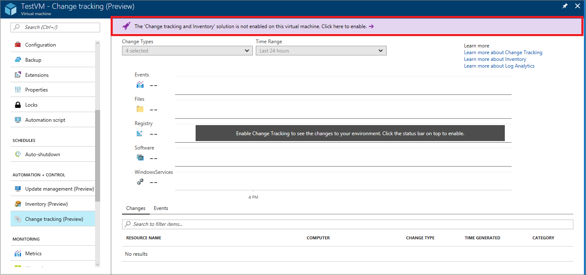
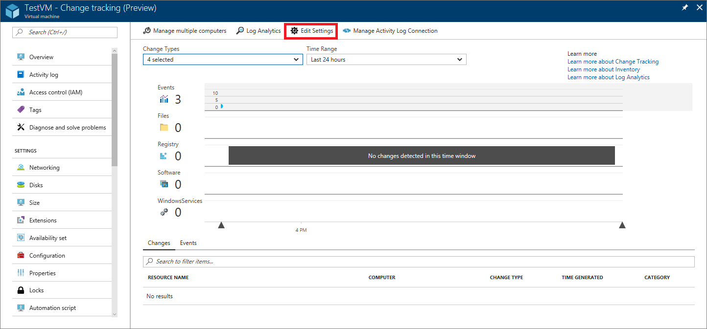
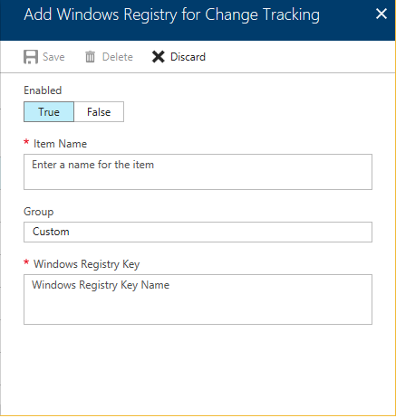
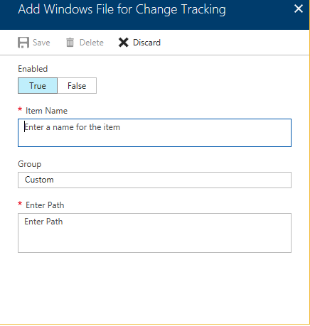
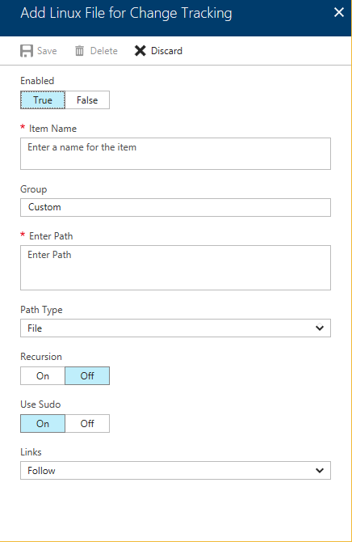
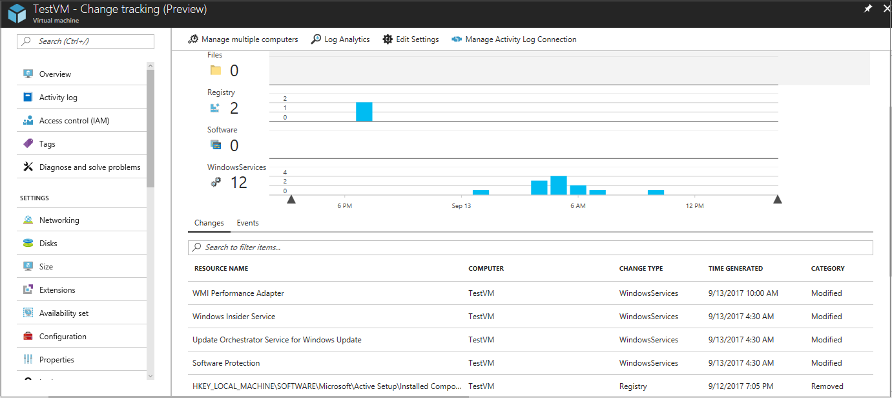
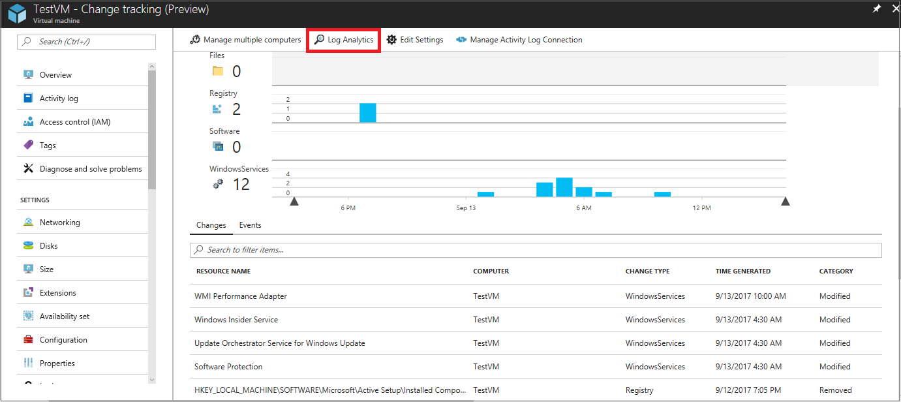

# Track changes in your Azure virtual machines

By enabling change tracking, you can track changes to files and Windows registry keys on your virtual machines. Identifying configuration changes can help you pinpoint operational issues.

You can enable change tracking directly from your Azure virtual machine.

If you do not have an Azure virtual machine, you can create one by following the instructions in the [Windows quickstart](../virtual-machines/windows/quick-create-portal.md)
or [Linux quickstart](../virtual-machines/linux/quick-create-portal.md) article.

## Sign in to the Azure portal
Sign in to the [Azure portal](https://portal.azure.com/).

## Enable change tracking for an Azure virtual machine

1. In the left pane of the Azure portal, select **Virtual machines**.
2. In the list, select a virtual machine.
3. In the virtual machine window, under **Operations**, select **Change tracking**. 

     
    The **Enable Update Management** window opens.

    Validation is performed to determine whether change tracking is enabled for this virtual machine. If change tracking is not enabled, a banner is displayed, giving you the option to enable the solution.

   

4. To enable the solution, select the banner. If you do not have the following items, they are added automatically:

   * [Log Analytics](../log-analytics/log-analytics-overview.md) workspace
   * [Automation](../automation/automation-offering-get-started.md) account

5. Select a Log Analytics work space to store data logs from change tracking, select an Automation account to track changes, and then select **Enable**.  
    A status bar notifies you that the solution is being enabled. This process can take up to 15 minutes.

## Configure change tracking

After change tracking is enabled, the **Change tracking** window appears. 

To choose which files and registry keys to track, select **Edit settings**.

   

   The **Workspace Configuration** window opens. 

In the **Workspace Configuration** window, add the Windows registry keys, Windows files, or Linux files to be tracked, as outlined in the next three sections.

### Add a Windows registry key

1. On the **Windows Registry** tab, select **Add**.  
    The **Add Windows Registry for Change Tracking** window opens.

   

2. Under **Enabled**, select **True**.
3. In the **Item Name** box, enter a friendly name.
4. (Optional) In the **Group** box, enter a group name.
5. In the **Windows Registry Key** box, enter the name of the registry key you want to track.
6. Select **Save**.

### Add a Windows file

1. On the **Windows Files** tab, select **Add**.  
    The **Add Windows File for Change Tracking** window opens.

   

2. Under **Enabled**, select **True**.
3. In the **Item Name** box, enter a friendly name.
4. (Optional) In the **Group** box, enter a group name.
5. In the **Enter Path** box, enter the full path and file name of the file you want to track.
6. Select **Save**.

### Add a Linux file

1. On the **Linux Files** tab, select **Add**.  
    The **Add Linux File for Change Tracking** window opens.

   

2. Under **Enabled**, select **True**.
3. In the **Item Name** box, enter a friendly name.
4. (Optional) In the **Group** box, enter a group name.
5. In the **Enter Path** box, enter the full path and file name of the file you want to track.
6. In the **Path Type** box, select either **File** or **Directory**.
7. Under **Recursion**, to track changes for the specified path and all files and paths under it, select **On**. To track only the selected path or file, select **Off**.
8. Under **Use Sudo**, to track files that require the `sudo` command to access, select **On**. Otherwise, select **Off**.
9. Select **Save**.

## View changes

In the **Change tracking** window, you can view the changes in each of the various categories for your virtual machine over time.

   

You can select the categories and time range of changes to view. At the top of the window, you can view a graphical representation of changes over time. At the bottom of the window, you can view a list of recent changes.

## View change-tracking log data

Change tracking generates log data that is sent to Log Analytics. To search the logs by running queries, select **Log Analytics** at the top of the **Change tracking** window.

   

To learn more about running and searching log files in Log Analytics, see [Log Analytics](../log-analytics/log-analytics-overview.md).

## Next steps

* To learn more about change tracking, see [Track software changes in your environment with the Change Tracking solution](../log-analytics/log-analytics-change-tracking.md).
* To learn more about managing updates for your virtual machines, see [Update Management solution in OMS](../operations-management-suite/oms-solution-update-management.md).
