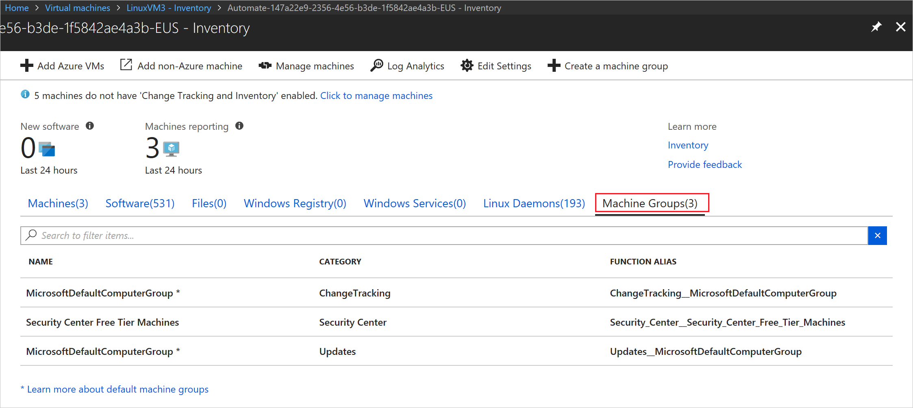
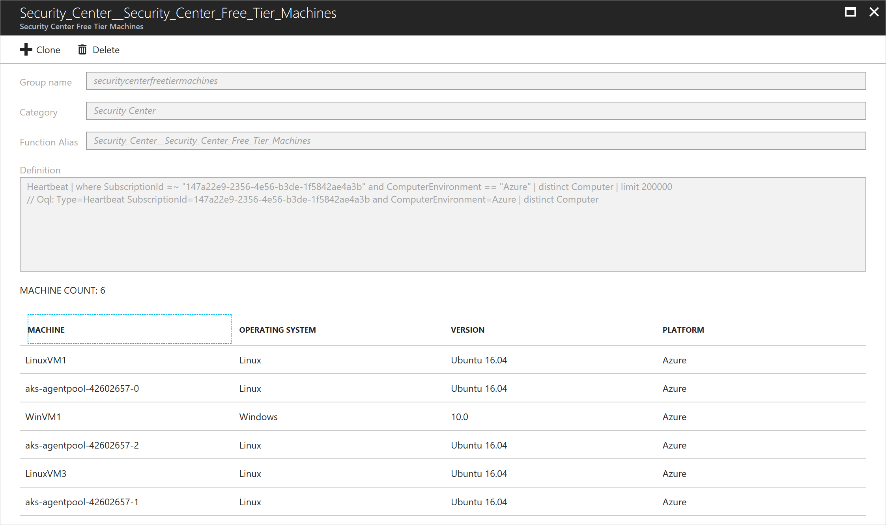
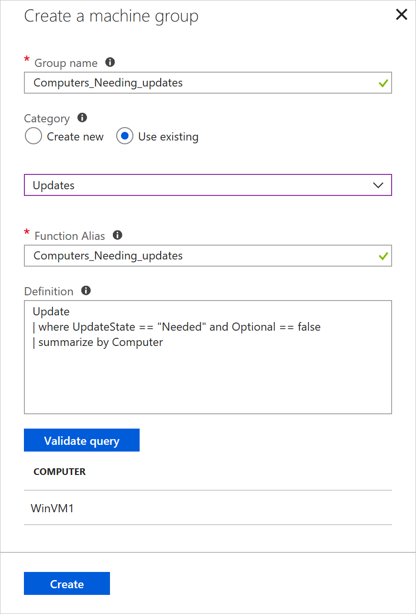

# Manage inventory collection from VMs

You can enable inventory tracking for an Azure VM from the resource page of the machine. You can collect and view the following inventory information on your computers:

- Windows updates, Windows applications, services, files, and registry keys
- Linux software packages, daemons, and files

Azure Automation Change Tracking and Inventory provides a browser-based user interface for setting up and configuring inventory collection.

## Before you begin

If you don't have an Azure subscription, [create a free account](https://azure.microsoft.com/free/).

This article assumes that you have a VM to enable with Change Tracking and Inventory. If you don't have an Azure VM, you can [create a VM](../virtual-machines/windows/quick-create-portal.md).

## Sign in to the Azure portal

Sign in to the [Azure portal](https://portal.azure.com/).

## Enable inventory collection from the VM resource page

1. In the left pane of the Azure portal, select **Virtual machines**.
2. In the list of VMs, select a machine.
3. On the **Resource** menu, under **Operations**, select **Inventory**.
4. Select a Log Analytics workspace for storing your data logs.
    If no workspace is available to you for that region, you are prompted to create a default workspace and automation account.
5. To start enabling your computer, select **Enable**.

   

    A status bar notifies you that the Change Tracking and Inventory feature is being enabled. This process can take up to 15 minutes. During this time, you can close the window, or you can keep it open and it notifies you when the feature is enabled. You can monitor the deployment status from the notifications pane.

   

When the deployment is complete, the status bar disappears. The system is still collecting inventory data, and the data might not be visible yet. A full collection of data can take 24 hours.

## Configure your inventory settings

By default, software, Windows services, and Linux daemons are configured for collection. To collect Windows registry and file inventory, configure the inventory collection settings.

1. On the Inventory page, click **Edit Settings** at the top of the page.
2. To add a new collection setting, go to the setting category that you want to add by selecting the **Windows Registry**, **Windows Files**, or **Linux Files** tab.
3. Select the appropriate category and click **Add** at the top of the page.

The following sections provide information about each property that can be configured for the various categories.

### Windows Registry

|Property  |Description  |
|---------|---------|
|Enabled     | Determines if the setting is applied        |
|Item Name     | Friendly name of the file to be tracked        |
|Group     | A group name for logically grouping files        |
|Windows Registry Key   | The path to check for the file For example: "HKEY_LOCAL_MACHINE\SOFTWARE\Microsoft\Windows\CurrentVersion\Explorer\User Shell Folders\Common Startup"      |

### Windows Files

|Property  |Description  |
|---------|---------|
|Enabled     | True if the setting is applied, and False otherwise.        |
|Item Name     | The friendly name of the file to be tracked.        |
|Group     | A group name for logically grouping files.       |
|Enter Path     | The path to check for the file, for example, **c:\temp\myfile.txt**.

### Linux Files

|Property  |Description  |
|---------|---------|
|Enabled     | True if the setting is applied, and False otherwise.        |
|Item Name     | The friendly name of the file to be tracked.        |
|Group     | A group name for logically grouping files.        |
|Enter Path     | The path to check for the file, for example, **/etc/*.conf**.       |
|Path Type     | The type of item to be tracked. Values are File and Directory.        |
|Recursion     | True if recursion is used when looking for the item to be tracked, and False otherwise.        |
|Use sudo     | True if sudo is used when checking for the item, and False otherwise.         |
|Links     | Value indicating how symbolic links are dealt with when traversing directories. Possible values are:   Ignore - Ignores symbolic links and does not include the files/directories referenced Follow - Follows the symbolic links during recursion and also includes the files/directories referenced Manage - Follows the symbolic links and allows alter the treatment of returned content      |

## Manage machine groups

Inventory allows you to create and view machine groups in Azure Monitor logs. Machine groups are collections of machines defined by a query in Azure Monitor logs.

[!INCLUDE [azure-monitor-log-analytics-rebrand](../../includes/azure-monitor-log-analytics-rebrand.md)]

To view your machine groups select the **Machine groups** tab on the Inventory page.

Selecting a machine group from the list opens the Machine groups page. This page shows details about the machine group. These details include the Azure Monitor log query that is used to define the group. At the bottom of the page, is a paged list of the machines that are part of that group.

Click **+ Clone** to clone the machine group. You must give the group a new name and alias for the group. The definition can be altered at this time. After changing the query, click **Validate query** to preview the machines that would be selected. When you are happy with the group, click **Create** to create the machine group.

If you want to create a new machine group, click **+ Create a machine group**. This button opens the **Create a machine group** page, where you can define your new group. Click **Create** to create the group.

## Disconnect your VM from management

To remove your VM from Change Tracking and Inventory management:

1. In the left pane of the Azure portal, select **Log Analytics**, and then select the workspace that you used when enabling your VM for Change Tracking and Inventory.
2. On the **Log Analytics** page, open the **Resource** menu.
3. Select **Virtual Machines** under **Workspace Data Sources**.
4. In the list, select the VM that you want to disconnect. The machine has a green check mark next to **This workspace** in the **OMS Connection** column.

   >[!NOTE]
   >Operations Management Suite (OMS) is now referred to as Azure Monitor logs.

5. At the top of the next page, click **Disconnect**.
6. In the confirmation window, click **Yes** to disconnect the machine from management.

>[!NOTE]
>Machines are still shown after you have unenrolled them because we report on all machines inventoried in the last 24 hours. After disconnecting the machine, you need to wait 24 hours before they are no longer listed.

## Next steps

* For details of working with the feature, see [Manage Change Tracking and Inventory](change-tracking-file-contents.md).
* To find out more about tracking software changes, see [Track software changes in your environment with Change Tracking](../log-analytics/log-analytics-change-tracking.md).
* To troubleshoot general problems with the feature, see [Troubleshoot Change Tracking and Inventory issues](troubleshoot/change-tracking.md).