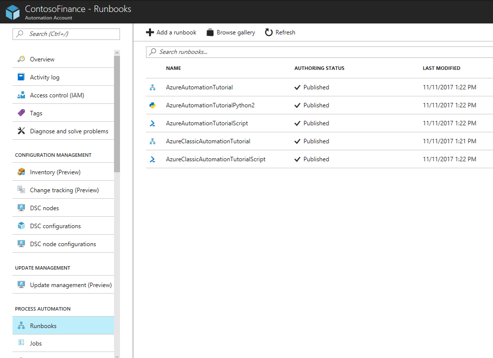
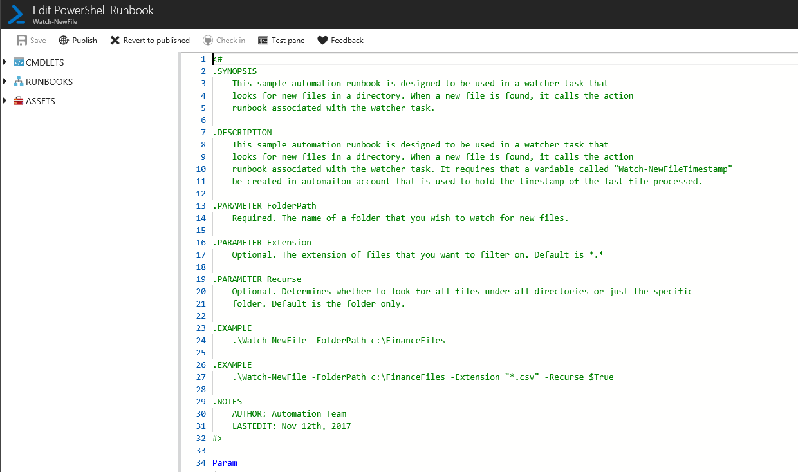
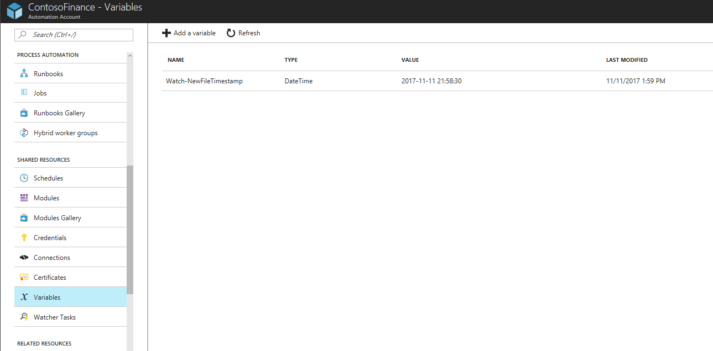
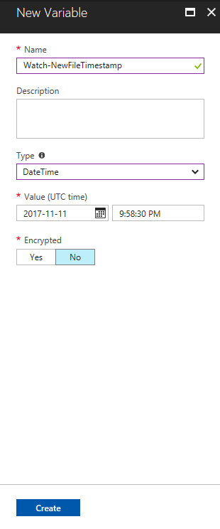
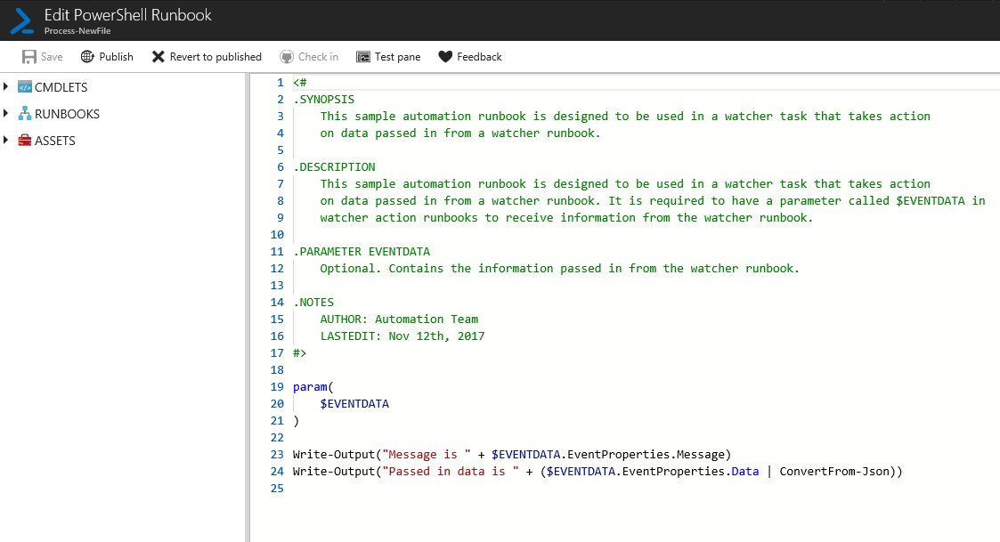
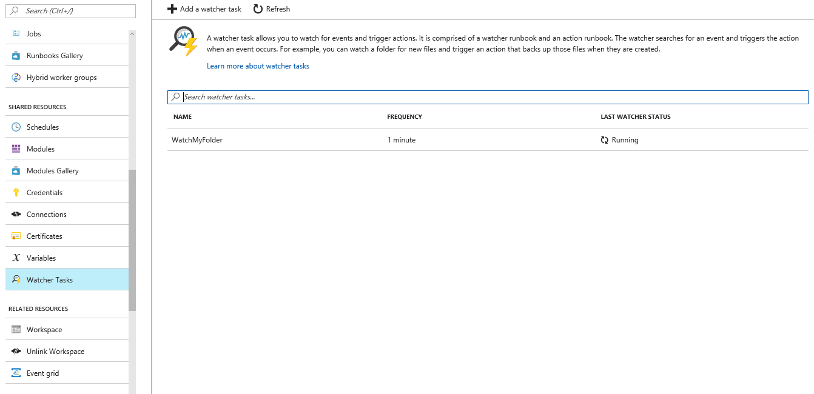
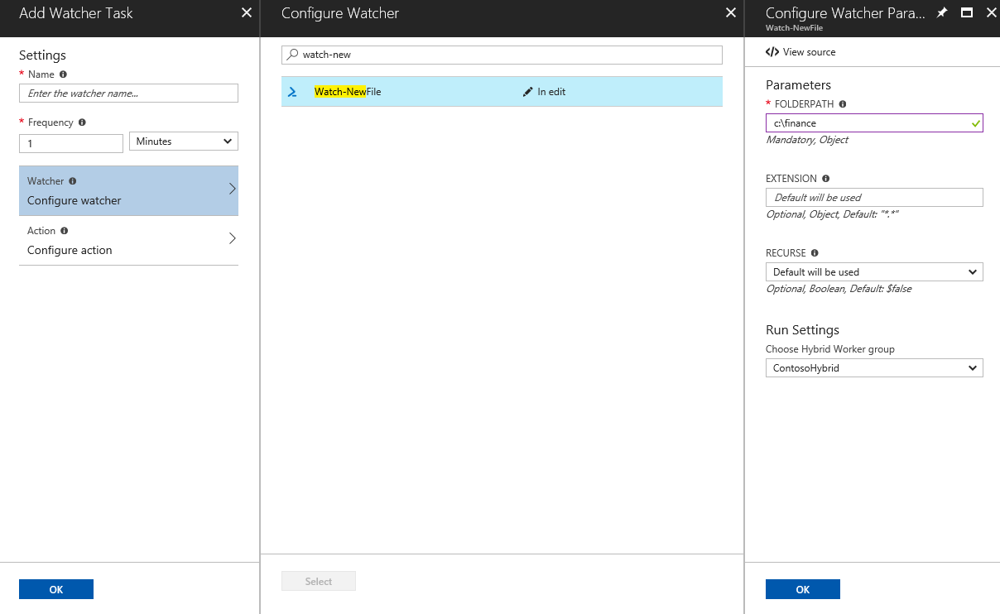
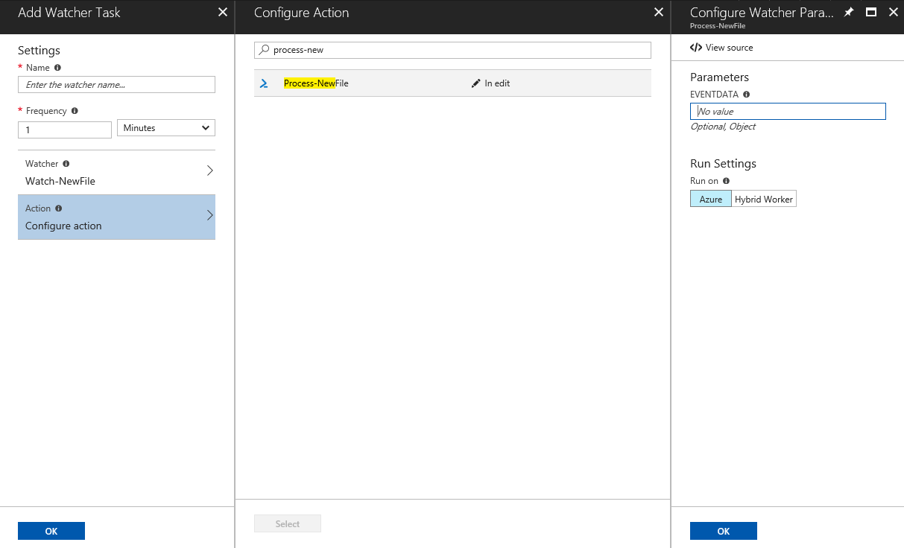

# Azure Automation watcher tasks enable you to respond to events happening in your local datacenter.

In this tutorial, you learn how to create a new watcher task to:

> [!div class="checklist"]
> * Create a watcher runbook that looks for new files in a directory.
> * Create an Automation variable to keep the last time a file was processed by the watcher.
> * Create an action runbook that is called when the watcher runbook finds a new file.
> * Create a watcher task that selects the watcher runbook and action runbook.
> * Trigger a watcher by adding a new file to a directory.
> * Inspect the output from the action runbook that shows information on the new file.	

## Prerequisites

To complete this tutorial, the following are required.
+ Azure subscription. If you don't have one yet, you can [activate your MSDN subscriber benefits](https://azure.microsoft.com/pricing/member-offers/msdn-benefits-details/) or sign up for a [free account](https://azure.microsoft.com/free/?WT.mc_id=A261C142F).
+ [Automation account](automation-offering-get-started.md) to hold the watcher and action runbooks and the Watcher Task.
+ A [hybrid runbook worker](automation-hybrid-runbook-worker.md) where the watcher task runs.

## Create a Watcher runbook that looks for new files:
1.	Open the Automation account, and click on the Runbooks page.
2.	Click on the “Browse gallery” button.

3.	Search for “Watch-NewFile” and import the runbook into the Automation account.

4.	Click on “Edit” to view the Runbook source and click on the “Publish” button.

## Create an Automation variable to keep the last time a file was processed by the watcher.
1.	Open up the variables page under SHARED RESOURCES and click on “Add variable”

2.	Enter “Watch-NewFileTimestamp” for the name
3.	Select Type as DateTime and then click on the “Create” button.

## Create an action runbook that is called when the watcher runbook finds a new file.
1.	Click on the Runbooks page under the “PROCESS AUTOMATION” category.
2.	Click on the “Browse gallery” button.
3.	Search for “Process-NewFile” and import the runbook into the Automation account.
4.	Click on “Edit” to view the Runbook source and click on the “Publish” button.

## Create a watcher task that selects the watcher runbook and action runbook.
1.	Open the Watcher tasks page and click on “Add a watcher task” button.

2.	Enter “Watch new files” as the name.
3.	Select “Configure watcher” and select the “Watch-NewFile” runbook.

4.	Enter the following values for parameters:
> *	FOLDERPATH. A folder on the hybrid worker where new files get created
> *	EXTENSION. Leave blank to process all file extensions.
> *	RECURSE. Leave the default.
> *	RUN SETTINGS. Pick the hybrid worker.
5.	Click OK, and then Select
6.	Select “Configure action” and select “Process-NewFile” runbook.

7.	Enter the following values for parameters:
> *	EVENTDATA. Leave blank. Data is passed in from the watcher runbook.
> *	Run Settings. Leave as Azure as this runbook runs in the Automation service.
8.	Click OK, and then Select
9.	Click OK to create the watcher task.

## Trigger a watcher by adding a new file to a directory.
1.	Remote into the hybrid worker
2.	Add a new text file to the folder that is being monitored by the watcher task.

## Inspect the output from the action runbook that shows information on the new file.
1.	Click on the watcher task for “Watch new files”
2.	Click on the “View watcher streams” to see that the watcher found the new file and started the action runbook.
3.	Click on the “View watcher action jobs” to see the action runbook job.

Next Steps:
In this tutorial, you have learned how to:
1.	Create a watcher runbook that looks for new files in a directory.
2.	Create an Automation variable to keep the last time a file was processed by the watcher.
3.	Create an action runbook that is called when the watcher runbook finds a new file.
4.	Create a watcher task that selects the watcher runbook and action runbook.
5.	Trigger a watcher by adding a new file to a directory.
6.	Inspect the output from the action runbook that shows information on the new file.

