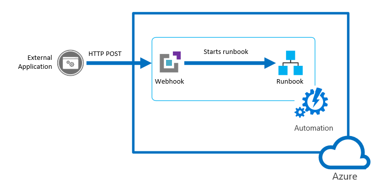
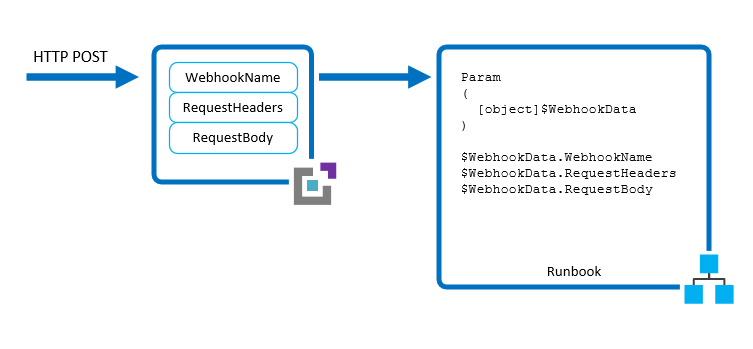
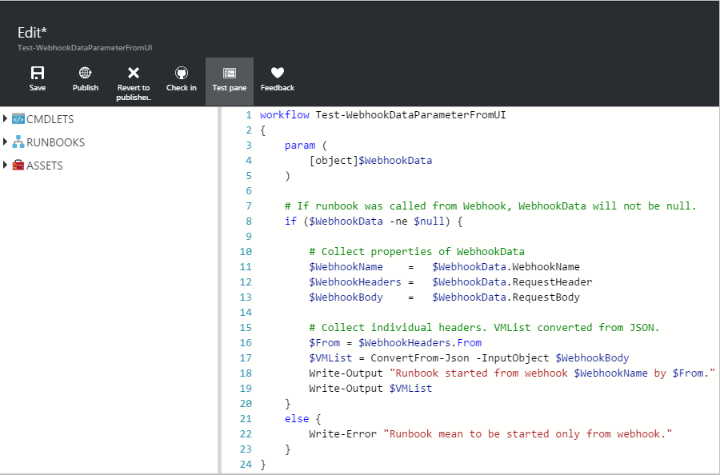
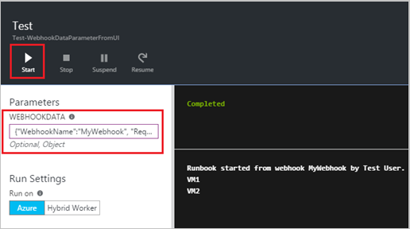
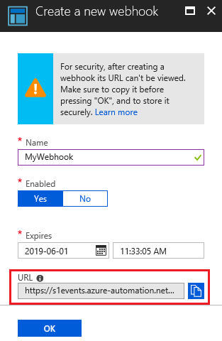
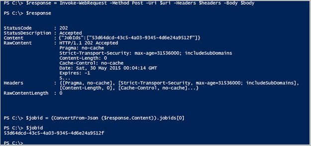

# Start a runbook from a webhook

A webhook allows an external service to start a particular runbook in Azure Automation through a single HTTP request. External services include Azure DevOps Services, GitHub, Azure Monitor logs, and custom applications. Such a service can use a webhook to start a runbook without implementing the full Azure Automation API. You can compare webhooks to other methods of starting a runbook in [Starting a runbook in Azure Automation](./start-runbooks.md).

> [!NOTE]
> Using a webhook to start a Python runbook is not supported.



To understand client requirements for TLS 1.2 with webhooks, see [TLS 1.2 enforcement for Azure Automation](automation-managing-data.md#tls-12-enforcement-for-azure-automation).

## Webhook properties

The following table describes the properties that you must configure for a webhook.

| Property | Description |
|:--- |:--- |
| Name |Name of the webhook. You can provide any name you want, since it isn't exposed to the client. It's only used for you to identify the runbook in Azure Automation. As a best practice, you should give the webhook a name related to the client that uses it. |
| URL |URL of the webhook. This is the unique address that a client calls with an HTTP POST to start the runbook linked to the webhook. It's automatically generated when you create the webhook. You can't specify a custom URL. <br> <br> The URL contains a security token that allows a third-party system to invoke the runbook with no further authentication. For this reason, you should treat the URL like a password. For security reasons, you can only view the URL in the Azure portal when creating the webhook. Note the URL in a secure location for future use. |
| Expiration date | Expiration date of the webhook, after which it can no longer be used. You can modify the expiration date after the webhook is created, as long as the webhook has not expired. |
| Enabled | Setting indicating if the webhook is enabled by default when it's created. If you set this property to Disabled, no client can use the webhook. You can set this property when you create the webhook or any other time after its creation. |

## Parameters used when the webhook starts a runbook

A webhook can define values for runbook parameters that are used when the runbook starts. The webhook must include values for any mandatory runbook parameters and can include values for optional parameters. A parameter value configured to a webhook can be modified even after webhook creation. Multiple webhooks linked to a single runbook can each use different runbook parameter values. When a client starts a runbook using a webhook, it can't override the parameter values defined in the webhook.

To receive data from the client, the runbook supports a single parameter called `WebhookData`. This parameter defines an object containing data that the client includes in a POST request.



The `WebhookData` parameter has the following properties:

| Property | Description |
|:--- |:--- |
| `WebhookName` | Name of the webhook. |
| `RequestHeader` | Hashtable containing the headers of the incoming POST request. |
| `RequestBody` | Body of the incoming POST request. This body retains any data formatting, such as string, JSON, XML, or form-encoded. The runbook must be written to work with the data format that is expected. |

There's no configuration of the webhook required to support the `WebhookData` parameter, and the runbook isn't required to accept it. If the runbook doesn't define the parameter, any details of the request sent from the client are ignored.

> [!NOTE]
> When calling a webhook, the client should always store any parameter values in case the call fails. If there is a network outage or connection issue, the application can't retrieve failed webhook calls.

If you specify a value for `WebhookData` at webhook creation, it is overridden when the webhook starts the runbook with the data from the client POST request. This happens even if the application does not include any data in the request body. 

If you start a runbook that defines `WebhookData` using a mechanism other than a webhook, you can provide a value for `WebhookData` that the runbook recognizes. This value should be an object with the same [properties](#webhook-properties) as the `WebhookData` parameter so that the runbook can work with it just as it works with actual `WebhookData` objects passed by a webhook.

For example, if you are starting the following runbook from the Azure portal and want to pass some sample webhook data for testing, you must pass the data in JSON in the user interface.



For the next runbook example, let's define the following properties for `WebhookData`:

* **WebhookName**: MyWebhook
* **RequestBody**: `*[{'ResourceGroup': 'myResourceGroup','Name': 'vm01'},{'ResourceGroup': 'myResourceGroup','Name': 'vm02'}]*`

Now we pass the following JSON object in the UI for the `WebhookData` parameter. This example, with carriage returns and newline characters, matches the format that is passed in from a webhook.

```json
{"WebhookName":"mywebhook","RequestBody":"[\r\n {\r\n \"ResourceGroup\": \"vm01\",\r\n \"Name\": \"vm01\"\r\n },\r\n {\r\n \"ResourceGroup\": \"vm02\",\r\n \"Name\": \"vm02\"\r\n }\r\n]"}
```



> [!NOTE]
> Azure Automation logs the values of all input parameters with the runbook job. Thus any input provided by the client in the webhook request is logged and available to anyone with access to the automation job. For this reason, you should be cautious about including sensitive information in webhook calls.

## Webhook security

The security of a webhook relies on the privacy of its URL, which contains a security token that allows the webhook to be invoked. Azure Automation does not perform any authentication on a request as long as it is made to the correct URL. For this reason, your clients should not use webhooks for runbooks that perform highly sensitive operations without using an alternate means of validating the request.

Consider the following strategies:

* You can include logic within a runbook to determine if it is called by a webhook. Have the runbook check the `WebhookName` property of the `WebhookData` parameter. The runbook can perform further validation by looking for particular information in the `RequestHeader` and `RequestBody` properties.

* Have the runbook perform some validation of an external condition when it receives a webhook request. For example, consider a runbook that is called by GitHub any time there's a new commit to a GitHub repository. The runbook might connect to GitHub to validate that a new commit has occurred before continuing.

* Azure Automation supports Azure virtual network service tags, specifically [GuestAndHybridManagement](../virtual-network/service-tags-overview.md). You can use service tags to define network access controls on [network security groups](../virtual-network/network-security-groups-overview.md#security-rules) or [Azure Firewall](../firewall/service-tags.md) and trigger webhooks from within your virtual network. Service tags can be used in place of specific IP addresses when you create security rules. By specifying the service tag name **GuestAndHybridManagement**  in the appropriate source or destination field of a rule, you can allow or deny the traffic for the Automation service. This service tag does not support allowing more granular control by restricting IP ranges to a specific region.

## Create a webhook

Use the following procedure to create a new webhook linked to a runbook in the Azure portal.

1. From the Runbooks page in the Azure portal, click the runbook that the webhook starts to view the runbook details. Ensure that the runbook **Status** field is set to **Published**.
2. Click **Webhook** at the top of the page to open the Add Webhook page.
3. Click **Create new webhook** to open the Create Webhook page.
4. Fill in the **Name** and **Expiration Date** fields for the webhook and specify if it should be enabled. See [Webhook properties](#webhook-properties) for more information about these properties.
5. Click the copy icon and press Ctrl+C to copy the URL of the webhook. Then record it in a safe place. 

    > [!IMPORTANT]
    > Once you create the webhook, you cannot retrieve the URL again. Make sure you copy and record it as above.

   

1. Click **Parameters** to provide values for the runbook parameters. If the runbook has mandatory parameters, you can't create the webhook unless you provide values.

2. Click **Create** to create the webhook.

## Use a webhook

To use a webhook after it has been created, your client must issue an HTTP `POST` request with the URL for the webhook. The syntax is:

```http
http://<Webhook Server>/token?=<Token Value>
```

The client receives one of the following return codes from the `POST` request.

| Code | Text | Description |
|:--- |:--- |:--- |
| 202 |Accepted |The request was accepted, and the runbook was successfully queued. |
| 400 |Bad Request |The request was not accepted for one of the following reasons: <ul> <li>The webhook has expired.</li> <li>The webhook is disabled.</li> <li>The token in the URL is invalid.</li>  </ul> |
| 404 |Not Found |The request was not accepted for one of the following reasons: <ul> <li>The webhook was not found.</li> <li>The runbook was not found.</li> <li>The account was not found.</li>  </ul> |
| 500 |Internal Server Error |The URL was valid, but an error occurred. Please resubmit the request. |

Assuming the request is successful, the webhook response contains the job ID in JSON format as shown below. It contains a single job ID, but the JSON format allows for potential future enhancements.

```json
{"JobIds":["<JobId>"]}
```

The client can't determine when the runbook job completes or its completion status from the webhook. It can find out this information using the job ID with another mechanism, such as [Windows PowerShell](/powershell/module/servicemanagement/azure.service/get-azureautomationjob) or the [Azure Automation API](/rest/api/automation/job).

### Use a webhook from an ARM template

Automation webhooks can also be invoked by [Azure Resource Manager (ARM) templates](/azure/azure-resource-manager/templates/overview). The ARM template issues a `POST` request and receives a return code just like any other client. See [Use a webhook](#use-a-webhook).

   > [!NOTE]
   > For security reasons, the URI is only returned the first time a template is deployed.

This sample template creates a test environment and returns the URI for the webhook it creates.

```json
{
    "$schema": "https://schema.management.azure.com/schemas/2019-04-01/deploymentTemplate.json#",
    "contentVersion": "1.0.0.0",
    "parameters": {
        "automationAccountName": {
            "type": "String",
            "metadata": {
                "description": "Automation account name"
            }
        },
        "webhookName": {
            "type": "String",
            "metadata": {
                "description": "Webhook Name"
            }
        },
        "runbookName": {
            "type": "String",
            "metadata": {
                "description": "Runbook Name for which webhook will be created"
            }
        },
        "WebhookExpiryTime": {
            "type": "String",
            "metadata": {
                "description": "Webhook Expiry time"
            }
        },
        "_artifactsLocation": {
            "defaultValue": "https://raw.githubusercontent.com/Azure/azure-quickstart-templates/master/101-automation/",
            "type": "String",
            "metadata": {
                "description": "URI to artifacts location"
            }
        }
    },
    "resources": [
        {
            "type": "Microsoft.Automation/automationAccounts",
            "apiVersion": "2020-01-13-preview",
            "name": "[parameters('automationAccountName')]",
            "location": "[resourceGroup().location]",
            "properties": {
                "sku": {
                    "name": "Free"
                }
            },
            "resources": [
                {
                    "type": "runbooks",
                    "apiVersion": "2018-06-30",
                    "name": "[parameters('runbookName')]",
                    "location": "[resourceGroup().location]",
                    "dependsOn": [
                        "[parameters('automationAccountName')]"
                    ],
                    "properties": {
                        "runbookType": "Python2",
                        "logProgress": "false",
                        "logVerbose": "false",
                        "description": "Sample Runbook",
                        "publishContentLink": {
                            "uri": "[uri(parameters('_artifactsLocation'), 'scripts/AzureAutomationTutorialPython2.py')]",
                            "version": "1.0.0.0"
                        }
                    }
                },
                {
                    "type": "webhooks",
                    "apiVersion": "2018-06-30",
                    "name": "[parameters('webhookName')]",
                    "dependsOn": [
                        "[parameters('automationAccountName')]",
                        "[parameters('runbookName')]"
                    ],
                    "properties": {
                        "isEnabled": true,
                        "expiryTime": "[parameters('WebhookExpiryTime')]",
                        "runbook": {
                            "name": "[parameters('runbookName')]"
                        }
                    }
                }
            ]
        }
    ],
    "outputs": {
        "webhookUri": {
            "type": "String",
            "value": "[reference(parameters('webhookName')).uri]"
        }
    }
}
```

## Renew a webhook

When a webhook is created, it has a validity time period of ten years, after which it automatically expires. Once a webhook has expired, you can't reactivate it. You can only remove and then recreate it. 

You can extend a webhook that has not reached its expiration time. To extend a webhook:

1. Navigate to the runbook that contains the webhook. 
2. Select **Webhooks** under **Resources**. 
3. Click the webhook that you want to extend. 
4. In the Webhook page, choose a new expiration date and time and click **Save**.

## Sample runbook

The following sample runbook accepts the webhook data and starts the virtual machines specified in the request body. To test this runbook, in your Automation account under **Runbooks**, click **Create a runbook**. If you don't know how to create a runbook, see [Creating a runbook](automation-quickstart-create-runbook.md).

> [!NOTE]
> For non-graphical PowerShell runbooks, `Add-AzAccount` and `Add-AzureRMAccount` are aliases for [Connect-AzAccount](/powershell/module/az.accounts/connect-azaccount). You can use these cmdlets or you can [update your modules](automation-update-azure-modules.md) in your Automation account to the latest versions. You might need to update your modules even if you have just created a new Automation account.

```powershell
param
(
    [Parameter (Mandatory = $false)]
    [object] $WebhookData
)

# If runbook was called from Webhook, WebhookData will not be null.
if ($WebhookData) {

    # Check header for message to validate request
    if ($WebhookData.RequestHeader.message -eq 'StartedbyContoso')
    {
        Write-Output "Header has required information"}
    else
    {
        Write-Output "Header missing required information";
        exit;
    }

    # Retrieve VMs from Webhook request body
    $vms = (ConvertFrom-Json -InputObject $WebhookData.RequestBody)

    # Authenticate to Azure by using the service principal and certificate. Then, set the subscription.

    Write-Output "Authenticating to Azure with service principal and certificate"
    $ConnectionAssetName = "AzureRunAsConnection"
    Write-Output "Get connection asset: $ConnectionAssetName"

    $Conn = Get-AutomationConnection -Name $ConnectionAssetName
            if ($Conn -eq $null)
            {
                throw "Could not retrieve connection asset: $ConnectionAssetName. Check that this asset exists in the Automation account."
            }
            Write-Output "Authenticating to Azure with service principal."
            Add-AzAccount -ServicePrincipal -Tenant $Conn.TenantID -ApplicationId $Conn.ApplicationID -CertificateThumbprint $Conn.CertificateThumbprint | Write-Output

        # Start each virtual machine
        foreach ($vm in $vms)
        {
            $vmName = $vm.Name
            Write-Output "Starting $vmName"
            Start-AzVM -Name $vm.Name -ResourceGroup $vm.ResourceGroup
        }
}
else {
    # Error
    write-Error "This runbook is meant to be started from an Azure alert webhook only."
}
```

## Test the sample

The following example uses Windows PowerShell to start a runbook with a webhook. Any language that can make an HTTP request can use a webhook. Windows PowerShell is used here as an example.

The runbook is expecting a list of virtual machines formatted in JSON in the body of the request. The runbook validates as well that the headers contain a defined message to validate that the webhook caller is valid.

```azurepowershell-interactive
$uri = "<webHook Uri>"

$vms  = @(
            @{ Name="vm01";ResourceGroup="vm01"},
            @{ Name="vm02";ResourceGroup="vm02"}
        )
$body = ConvertTo-Json -InputObject $vms
$header = @{ message="StartedbyContoso"}
$response = Invoke-WebRequest -Method Post -Uri $uri -Body $body -Headers $header
$jobid = (ConvertFrom-Json ($response.Content)).jobids[0]
```

The following example shows the body of the request that is available to the runbook in the `RequestBody` property of `WebhookData`. This value is formatted in JSON to be compatible with the format included in the body of the request.

```json
[
    {
        "Name":  "vm01",
        "ResourceGroup":  "myResourceGroup"
    },
    {
        "Name":  "vm02",
        "ResourceGroup":  "myResourceGroup"
    }
]
```

The following image shows the request being sent from Windows PowerShell and the resulting response. The job ID is extracted from the response and converted to a string.



## Next steps

* To trigger a runbook from an alert, see [Use an alert to trigger an Azure Automation runbook](automation-create-alert-triggered-runbook.md).
