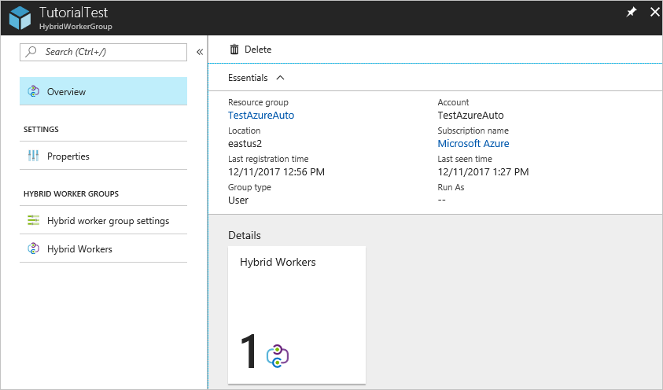

# Deploy an agent-based Windows Hybrid Runbook Worker in Automation

> [!IMPORTANT]
> Azure Automation Agent-based User Hybrid Runbook Worker (Windows and Linux) will retire on **31 August 2024** and wouldn't be supported after that date. You must complete migrating existing Agent-based User Hybrid Runbook Workers to Extension-based Workers before 31 August 2024. Moreover, starting **1 October 2023**, creating new Agent-based Hybrid Workers wouldn't be possible. [Learn more](migrate-existing-agent-based-hybrid-worker-to-extension-based-workers.md).


You can use the user Hybrid Runbook Worker feature of Azure Automation to run runbooks directly on an Azure or non-Azure machine, including servers registered with [Azure Arc-enabled servers](../azure-arc/servers/overview.md). From the machine or server that's hosting the role, you can run runbooks directly against it and against resources in the environment to manage those local resources.

Azure Automation stores and manages runbooks and then delivers them to one or more chosen machines. This article describes how to deploy a user Hybrid Runbook Worker on a Windows machine, how to remove the worker, and how to remove a Hybrid Runbook Worker group. For user Hybrid Runbook Workers, see also [Deploy an extension-based Windows or Linux user Hybrid Runbook Worker in Automation](./extension-based-hybrid-runbook-worker-install.md)

After you successfully deploy a runbook worker, review [Run runbooks on a Hybrid Runbook Worker](automation-hrw-run-runbooks.md) to learn how to configure your runbooks to automate processes in your on-premises datacenter or other cloud environment.

> [!NOTE]
> A hybrid worker can co-exist with both platforms: **Agent based (V1)** and **Extension based (V2)**. If you install Extension based (V2)on a hybrid worker already running Agent based (V1), then you would see two entries of the Hybrid Runbook Worker in the group. One with Platform Extension based (V2) and the other Agent based (V1). [**Learn more**](./extension-based-hybrid-runbook-worker-install.md#migrate-an-existing-agent-based-to-extension-based-hybrid-workers).


## Prerequisites

Before you start, make sure that you have the following.

### A Log Analytics workspace

The Hybrid Runbook Worker role depends on an Azure Monitor Log Analytics workspace to install and configure the role. You can create it through [Azure Resource Manager](../azure-monitor/logs/resource-manager-workspace.md#create-a-log-analytics-workspace), through [PowerShell](../azure-monitor/logs/powershell-workspace-configuration.md?toc=%2fpowershell%2fmodule%2ftoc.json), or in the [Azure portal](../azure-monitor/logs/quick-create-workspace.md).

If you don't have an Azure Monitor Log Analytics workspace, review the [Azure Monitor Log design guidance](../azure-monitor/logs/workspace-design.md) before you create the workspace.

### Log Analytics agent

The Hybrid Runbook Worker role requires the [Log Analytics agent](../azure-monitor/agents/log-analytics-agent.md) for the supported Windows operating system. For servers or machines hosted outside of Azure, you can install the Log Analytics agent using [Azure Arc-enabled servers](../azure-arc/servers/overview.md).

### Supported Windows operating system

The Hybrid Runbook Worker feature supports the following operating systems:

* Windows Server 2019 (including Server Core)
* Windows Server 2016, version 1709 and 1803 (excluding Server Core)
* Windows Server 2012, 2012 R2
* Windows Server 2008 SP2 (x64), 2008 R2
* Windows 10 Enterprise (including multi-session) and Pro
* Windows 8 Enterprise and Pro
* Windows 7 SP1

### Minimum requirements

The minimum requirements for a Windows system and user Hybrid Runbook Worker are:

* Windows PowerShell 5.1 ([download WMF 5.1](https://www.microsoft.com/download/details.aspx?id=54616)). PowerShell Core isn't supported.
* .NET Framework 4.6.2 or later
* Two cores
* 4 GB of RAM
* Port 443 (outbound)

### Network configuration

For networking requirements for the Hybrid Runbook Worker, see [Configuring your network](automation-hybrid-runbook-worker.md#network-planning).

### Adding a machine to a Hybrid Runbook Worker group

You can add the worker machine to a Hybrid Runbook Worker group in one of your Automation accounts. For machines hosting the system Hybrid Runbook worker managed by Update Management, they can be added to a Hybrid Runbook Worker group. But you must use the same Automation account for both Update Management and the Hybrid Runbook Worker group membership.

>[!NOTE]
>Azure Automation [Update Management](./update-management/overview.md) automatically installs the system Hybrid Runbook Worker on an Azure or non-Azure machine that's enabled for Update Management. However, this worker is not registered with any Hybrid Runbook Worker groups in your Automation account. To run your runbooks on those machines, you need to add them to a Hybrid Runbook Worker group. Follow step 6 under the section [Manual deployment](#manual-deployment) to add it to a group.

## Enable for management with Azure Automation State Configuration

For information about enabling machines for management with Azure Automation State Configuration, see [Enable machines for management by Azure Automation State Configuration](automation-dsc-onboarding.md).

> [!NOTE]
> To manage the configuration of machines that support the Hybrid Runbook Worker role with Desired State Configuration (DSC), you must add the machines as DSC nodes.

## Installation options

To install and configure a Windows user Hybrid Runbook Worker, you can use one of the following methods.

* Use a provided PowerShell script to completely [automate](#automated-deployment) the process of configuring one or more Windows machines. This is the recommended method for machines in your datacenter or another cloud environment.
* Manually import the Automation solution, install the Log Analytics agent for Windows, and configure the worker role on the machine.
* Agent-based hybrid worker uses MMA proxy setting. You have to pass the proxy setting while installing the log analytics extension(MMA) and this setting will be stored under MMA configuration(registry) on VM.

## Automated deployment

There are two methods to automatically deploy a Hybrid Runbook Worker. You can import a runbook from the Runbook Gallery in the Azure portal and run it, or you can manually download a script from the PowerShell Gallery.

### Importing a runbook from the Runbook Gallery

The import procedure is described in detail in [Import runbooks from GitHub with the Azure portal](automation-runbook-gallery.md#import-runbooks-from-github-with-the-azure-portal). The name of the runbook to import is **Create Automation Windows HybridWorker**.

The runbook uses the following parameters.

| Parameter | Status | Description |
| ------- | ----- | ----------- |
| `Location` | Mandatory | The Location of the automation account in which the script is executed. |
| `ResourceGroupName` | Mandatory | The resource group for your Automation account. |
| `AccountName` | Mandatory | The Automation account name in which the Hybrid Run Worker will be registered. |
| `CreateLA` | Mandatory | If true, uses the value of `WorkspaceName` to create a Log Analytics workspace. If false, the value of `WorkspaceName` must refer to an existing workspace. |
| `LAlocation` | Optional | The location where the Log Analytics workspace will be created, or where it already exists. |
| `WorkspaceName` | Optional | The name of the Log Analytics workspace to use. |
| `CreateVM` | Mandatory | If true, use the value of `VMName` as the name of a new VM. If false, use `VMName` to find and register existing VM. |
| `VMName` | Optional | The name of the virtual machine that's either created or registered, depending on the value of `CreateVM`. |
| `VMImage` | Optional | The name of the VM image to be created. |
| `VMlocation` | Optional | Location of the VM that's either created or registered. If this location isn't specified, the value of `LAlocation` is used. |
| `RegisterHW` | Mandatory | If true, register the VM as a hybrid worker. |
| `WorkerGroupName` | Mandatory | Name of the Hybrid Worker Group. |

### Download a script from the PowerShell Gallery

This automated deployment method uses the PowerShell script **New-OnPremiseHybridWorker.ps1** to automate and configure the Windows Hybrid Runbook Worker role. It performs the following:

* Installs the necessary modules
* Signs in with your Azure account
* Verifies the existence of specified resource group and Automation account
* Creates references to Automation account attributes
* Creates an Azure Monitor Log Analytics workspace if not specified
* Enable the Azure Automation solution in the workspace
* Download and install the Log Analytics agent for Windows
* Register the machine as Hybrid Runbook Worker

Perform the following steps to install the role on your Windows machine using the script.

1. Download the **New-OnPremiseHybridWorker.ps1** script from the [PowerShell Gallery](https://www.powershellgallery.com/packages/New-OnPremiseHybridWorker). After you've downloaded the script, copy or run it on the target machine. The script uses the following parameters.

    | Parameter | Status | Description |
    | --------- | ------ | ----------- |
    | `AAResourceGroupName` | Mandatory | The name of the resource group that's associated with your Automation account. |
    | `AutomationAccountName` | Mandatory | The name of your Automation account.
    | `Credential` | Optional | The credentials to use when logging in to the Azure environment. |
    | `HybridGroupName` | Mandatory | The name of a Hybrid Runbook Worker group that you specify as a target for the runbooks that support this scenario. |
    | `OMSResourceGroupName` | Optional | The name of the resource group for the Log Analytics workspace. If this resource group isn't specified, the value of `AAResourceGroupName` is used. |
    | `SubscriptionID` | Mandatory | The identifier of the Azure subscription associated with your Automation account. |
    | `TenantID` | Optional | The identifier of the tenant organization associated with your Automation account. |
    | `WorkspaceName` | Optional | The Log Analytics workspace name. If you don't have a Log Analytics workspace, the script creates and configures one. |

1. Open an elevated 64-bit PowerShell command prompt.

1. From the PowerShell command prompt, browse to the folder that contains the script that you downloaded. Change the values for the parameters `AutomationAccountName`, `AAResourceGroupName`, `OMSResourceGroupName`, `HybridGroupName`, `SubscriptionID`, and `WorkspaceName`. Then run the script.

    You're prompted to authenticate with Azure after you run the script. You must sign in with an account that's a member of the **Subscription Admins** role and co-administrator of the subscription.

    ```powershell-interactive
    $NewOnPremiseHybridWorkerParameters = @{
      AutomationAccountName = <nameOfAutomationAccount>
      AAResourceGroupName   = <nameOfResourceGroup>
      OMSResourceGroupName  = <nameOfResourceGroup>
      HybridGroupName       = <nameOfHRWGroup>
      SubscriptionID        = <subscriptionId>
      WorkspaceName         = <nameOfLogAnalyticsWorkspace>
    }
    .\New-OnPremiseHybridWorker.ps1 @NewOnPremiseHybridWorkerParameters
    ```

1. You're prompted to agree to install NuGet, and to authenticate with your Azure credentials. If you don't have the latest NuGet version, you can download it from [Available NuGet Distribution Versions](https://www.nuget.org/downloads).

1. Verify the deployment after the script is finished. From the **Hybrid Runbook Worker Groups** page in your Automation account, under the **User hybrid runbook workers group** tab, it shows the new group and the number of members. If it's an existing group, the number of members is incremented. You can select the group from the list on the page, from the left-hand menu choose **Hybrid Workers** . On the **Hybrid Workers** page, you can see each member of the group listed.

## Manual deployment

To install and configure a Windows Hybrid Runbook Worker, perform the following steps.

1. Enable the Azure Automation solution in your Log Analytics workspace by running the following command in an elevated PowerShell command prompt or in Cloud Shell in the [Azure portal](https://portal.azure.com).

    ```powershell
    Set-AzOperationalInsightsIntelligencePack -ResourceGroupName <resourceGroupName> -WorkspaceName <workspaceName> -IntelligencePackName "AzureAutomation" -Enabled $true
    ```

1. Deploy the Log Analytics agent to the target machine.

    - For Azure VMs, install the Log Analytics agent for Windows using the [virtual machine extension for Windows](../virtual-machines/extensions/oms-windows.md). The extension installs the Log Analytics agent on Azure virtual machines, and enrolls virtual machines into an existing Log Analytics workspace. You can use an Azure Resource Manager template, PowerShell, or Azure Policy to assign the [Deploy Log Analytics agent for *Linux* or *Windows* VMs](../governance/policy/samples/built-in-policies.md#monitoring) built-in policy definition. Once the agent is installed, the machine can be added to a Hybrid Runbook Worker group in your Automation account.
    
    - For non-Azure machines, you can install the Log Analytics agent using [Azure Arc-enabled servers](../azure-arc/servers/overview.md). Azure Arc-enabled servers support deploying the Log Analytics agent using the following methods:
    
      - Using the VM extensions framework.
        
        This feature in Azure Arc-enabled servers allows you to deploy the Log Analytics agent VM extension to a non-Azure Windows or Linux server. VM extensions can be managed using the following methods on your hybrid machines or servers managed by Arc-enabled servers:
        
        - The [Azure portal](../azure-arc/servers/manage-vm-extensions-portal.md)
        - The [Azure CLI](../azure-arc/servers/manage-vm-extensions-cli.md)
        - [Azure PowerShell](../azure-arc/servers/manage-vm-extensions-powershell.md)
        - Azure [Resource Manager templates](../azure-arc/servers/manage-vm-extensions-template.md)
        
      - Using Azure Policy.
        
      Using this approach, you use the Azure Policy [Deploy Log Analytics agent to Linux or Microsoft Azure Arc machines](../governance/policy/samples/built-in-policies.md#monitoring) built-in policy definition to audit if the Arc-enabled server has the Log Analytics agent installed. If the agent isn't installed, it automatically deploys it using a remediation task. If you plan to monitor the machines with Azure Monitor for VMs, instead use the [Enable Azure Monitor for VMs](../governance/policy/samples/built-in-initiatives.md#monitoring) initiative to install and configure the Log Analytics agent.

    We recommend installing the Log Analytics agent for Windows or Linux using Azure Policy.

1. Verify agent is reporting to workspace

    The Log Analytics agent for Windows connects machines to an Azure Monitor Log Analytics workspace. When you install the agent on your machine and connect it to your workspace, it automatically downloads the components that are required for the Hybrid Runbook Worker.

    When the agent has successfully connected to your Log Analytics workspace after a few minutes, you can run the following query to verify that it's sending heartbeat data to the workspace.

    ```kusto
    Heartbeat 
    | where Category == "Direct Agent"
    | where TimeGenerated > ago(30m)
    ```

    In the search results, you should see heartbeat records for the machine, indicating that it's connected and reporting to the service. By default, every agent forwards a heartbeat record to its assigned workspace. Use the following steps to complete the agent installation and setup.

1. Confirm the version of the Hybrid Runbook Worker on the machine hosting the Log Analytics agent, browse to `C:\Program Files\Microsoft Monitoring Agent\Agent\AzureAutomation\` and note the **version** subfolder. This folder will appear on the machine several minutes after the solution is enabled in the workspace.

1. Install the runbook environment and connect to Azure Automation. When you configure an agent to report to a Log Analytics workspace and import the **Automation** solution, the solution pushes down the `HybridRegistration` PowerShell module. This module contains the `Add-HybridRunbookWorker` cmdlet. Use this cmdlet to install the runbook environment on the machine and register it with Azure Automation.

    Open a PowerShell session in Administrator mode and run the following commands to import the module.

    ```powershell-interactive
    cd "C:\Program Files\Microsoft Monitoring Agent\Agent\AzureAutomation\<version>\HybridRegistration"
    Import-Module .\HybridRegistration.psd1
    ```

1. Run the `Add-HybridRunbookWorker` cmdlet specifying the values for the parameters `Url`, `Key`, and `GroupName`.

    ```powershell-interactive
    Add-HybridRunbookWorker –GroupName <String> -Url <Url> -Key <String>
    ```

    You can get the information required for the parameters `Url` and `Key` from the **Keys** page in your Automation account. Select **Keys** under the **Account settings** section from the left-hand side of the page.

    

    * For the `Url` parameter, copy the value for **URL**.

    * For the `Key` parameter, copy the value for **PRIMARY ACCESS KEY**.

    * For the `GroupName` parameter, use the name of the Hybrid Runbook Worker group. If this group already exists in the Automation account, the current machine is added to it. If this group doesn't exist, it's added.

    * If necessary, set the `Verbose` parameter to receive details about the installation.

1. Verify the deployment after the command is completed. From the **Hybrid Runbook Worker Groups** page in your Automation account, under the **User hybrid runbook workers group** tab, it shows the new or existing group and the number of members. If it's an existing group, the number of members is incremented. You can select the group from the list on the page, from the left-hand menu choose **Hybrid Workers**. On the **Hybrid Workers** page, you can see each member of the group listed.

## Install PowerShell modules

Runbooks can use any of the activities and cmdlets defined in the modules installed in your Azure Automation environment. As these modules aren't automatically deployed to on-premises machines, you must install them manually. The exception is the Azure module. This module is installed by default and provides access to cmdlets for all Azure services and activities for Azure Automation.

Because the primary purpose of the Hybrid Runbook Worker is to manage local resources, you most likely need to install the modules that support these resources, particularly the `PowerShellGet` module. For information on installing Windows PowerShell modules, see [Windows PowerShell](/powershell/scripting/developer/windows-powershell).

Modules that are installed must be in a location referenced by the `PSModulePath` environment variable so that the hybrid worker can automatically import them. For more information, see [Install Modules in PSModulePath](/powershell/scripting/developer/module/installing-a-powershell-module).

## <a name="remove-windows-hybrid-runbook-worker"></a>Remove the Hybrid Runbook Worker

1. Open PowerShell session in Administrator mode and run the following command:

    ```powershell-interactive
        Remove-Item -Path "HKLM:\SOFTWARE\Microsoft\HybridRunbookWorker\<AutomationAccountID>\<HybridWorkerGroupName>" -Force -Verbose
    ```
1. Under **Process Automation**, select **Hybrid worker groups** and then your hybrid worker group to go to the **Hybrid Worker Group** page.
1. Under **Hybrid worker group**, select **Hybrid Workers**.
1. Select the checkbox next to the machine(s) you want to delete from the hybrid worker group.
1. Select **Delete** to remove the agent-based Windows Hybrid Worker.

   > [!NOTE]
   > - After you disable the Private Link in your Automation account, it might take up to 60 minutes to remove the Hybrid Runbook worker.
   > - After you remove the Hybrid Worker, the Hybrid Worker authentication certificate on the machine is valid for 45 minutes.


## Remove a Hybrid Worker group

To remove a Hybrid Runbook Worker group, you first need to remove the Hybrid Runbook Worker from every machine that is a member of the group. Then use the following steps to remove the group:

1. Open the Automation account in the Azure portal.

1. Select **Hybrid worker groups** under **Process Automation**. Select the group that you want to delete. The properties page for that group appears.

   

1. On the properties page for the selected group, select **Delete**. A warning message appears to remove any machines that are defined as hybrid workers in the hybrid worker group. If there's already a worker added to the group, you'll first have to delete the worker from the group.
1. Select **Yes** if you're sure that you want to continue. 

This process can take several seconds to finish. You can track its progress under **Notifications** from the menu.

## Manage Role permissions for Hybrid Worker Groups and Hybrid Workers

You can create custom Azure Automation roles and grant following permissions to Hybrid Worker Groups and Hybrid Workers. To learn more about how to create Azure Automation custom roles, see [Azure custom roles](../role-based-access-control/custom-roles.md)

**Actions** | **Description**
--- | ---
Microsoft.Automation/automationAccounts/hybridRunbookWorkerGroups/read | Reads a Hybrid Runbook Worker Group.
Microsoft.Automation/automationAccounts/hybridRunbookWorkerGroups/write | Creates a Hybrid Runbook Worker Group. 
Microsoft.Automation/automationAccounts/hybridRunbookWorkerGroups/delete | Deletes a Hybrid Runbook Worker Group.
Microsoft.Automation/automationAccounts/hybridRunbookWorkerGroups/hybridRunbookWorkers/read | Reads a Hybrid Runbook Worker.
Microsoft.Automation/automationAccounts/hybridRunbookWorkerGroups/hybridRunbookWorkers/delete | Deletes a Hybrid Runbook Worker.


## Check version of Hybrid Worker

To check version of agent-based Windows Hybrid Runbook Worker, go to the following path:

`C:\ProgramFiles\Microsoft Monitoring Agent\Agent\AzureAutomation\`

The *Azure Automation* folder has a sub-folder with the version number as the name of the sub-folder.

## Update Log Analytics agent to latest version

Azure Automation [Agent-based User Hybrid Runbook Worker](automation-hybrid-runbook-worker.md) (V1) requires the [Log Analytics agent](../azure-monitor/agents/log-analytics-agent.md) (also known as MMA agent) during the installation of the Hybrid Worker. We recommend you to update the Log Analytics agent to the latest version to reduce security vulnerabilities and benefit from bug fixes. 

Log Analytics agent versions prior to [10.20.18053 (bundle) and 1.0.18053.0 (extension)](../virtual-machines/extensions/oms-windows.md#agent-and-vm-extension-version) use an older method of certificate handling, and hence it is **not recommended**. Hybrid Workers on the outdated agents will not be able to connect to Azure, and Azure Automation jobs executed by these Hybrid Workers will stop. 

You must update the Log Analytics agent to the latest version by following the below steps:

1.	Check the current version of the Log Analytics agent for your Windows Hybrid Worker:  Go to the installation path - *C:\ProgramFiles\Microsoft Monitoring Agent\Agent* and right-click *HealthService.exe* to check **Properties**. The field **Product version** provides the version number of the Log Analytics agent.
2.	If your Log Analytics agent version is prior to [10.20.18053 (bundle) and 1.0.18053.0 (extension)](../virtual-machines/extensions/oms-windows.md#agent-and-vm-extension-version), upgrade to the latest version of the Windows Log Analytics agent, following these [guidelines](../azure-monitor/agents/agent-manage.md).

> [!NOTE]
> Any Azure Automation jobs running on the Hybrid Worker during the upgrade process might stop. Ensure that there aren’t any jobs running or scheduled during the Log Analytics agent upgrade.

  
## Next steps

* To learn how to configure your runbooks to automate processes in your on-premises datacenter or other cloud environment, see [Run runbooks on a Hybrid Runbook Worker](automation-hrw-run-runbooks.md).

* To learn how to troubleshoot your Hybrid Runbook Workers, see [Troubleshoot Hybrid Runbook Worker issues](troubleshoot/hybrid-runbook-worker.md#general).
