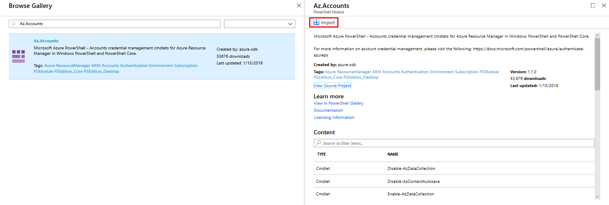
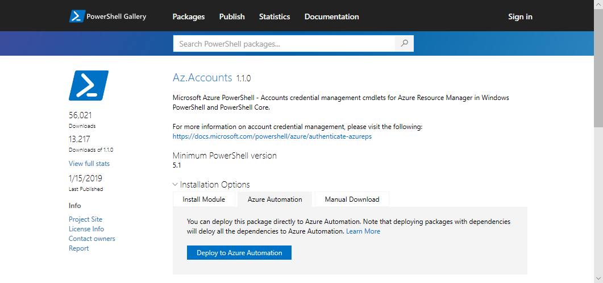

# Az module support in Azure Automation

Azure automation supports the ability to use the [Azure Powershell Az module](/powershell/azure/new-azureps-module-az?view=azps-1.1.0) in your runbooks. The Az module is not imported automatically in any new or existing Automation Accounts. This article discusses how to use Az modules with Azure Automation.

## Considerations

There are many things to take into consideration when using the Az module in Azure Automation. Runbooks and modules can be used by higher-level solutions in your Automation Account. Editing runbooks or upgrading modules can potentially cause issues with your runbooks. You should test all runbooks and solutions carefully in a separate Automation Account before importing the new `Az` modules. Any modifications to modules can negatively affect higher-level solutions, such as Update Management and Start/Stop VMs during off hours. It's recommended to not alter modules and runbooks in Automation Accounts that contain any solutions. This behavior isn't specific to the Az modules. This behavior should be taken into consideration when introducing any changes to your Automation Account.

Importing an `Az` module in your Automation Account doesn't automatically import the module in the PowerShell session that the runbooks use. Modules are imported into the PowerShell session in the following situations:

* When a cmdlet from a module is invoked from a runbook
* When a runbook imports it explicitly with the `Import-Module` cmdlet
* When another module depending on the module is imported into a PowerShell session

> [!IMPORTANT]
> It is important to make sure that runbooks in an Automation Account either only import `Az` or `AzureRM` modules into the PowerShell sessions used by runbooks and not both. If `Az` is imported before `AzureRM` in a runbook, the runbook will complete, but an [error referencing the get_SerializationSettings method](troubleshoot/runbooks.md#get-serializationsettings) will show in the job streams and cmdlets may have not been properly executed. If you import `AzureRM` and then `Az` your runbook will still complete, but you will see an error in the job streams stating that both `Az` and `AzureRM` cannot be imported in the same session or used in the same runbook.

## Migrating to Az modules

It's recommended you test the migration to using Az modules instead of AzureRM modules in a test Automation Account. Once that Automation Account has been created, you can use the following steps to ensure your migration goes smoothly:

### Stop and unschedule all runbook that uses AzureRM modules

To ensure that you do not run any existing runbooks that use `AzureRM` cmdlets, you should stop and unschedule all runbooks that use `AzureRM` modules. You can see what schedules exist and which schedules must be removed by running the following example:

  ```powershell-interactive
  Get-AzureRmAutomationSchedule -AutomationAccountName "<AutomationAccountName>" -ResourceGroupName "<ResourceGroupName>" | Remove-AzureRmAutomationSchedule -WhatIf
  ```

It's important to review each schedule separately to ensure you can reschedule it in the future for your runbooks if necessary.

### Import the Az modules

Only import the Az modules that are required for your runbooks. Don't import the rollup `Az` module, as it includes all of the `Az.*` modules to be imported. This guidance is the same for all modules.

The [Az.Accounts](https://www.powershellgallery.com/packages/Az.Accounts/1.1.0) module is a dependency for the other `Az.*` modules. For this reason, this module needs to be imported into your Automation Account before you import any other modules.

From your Automation Account, select **Modules** under **Shared Resources**. Click **Browse Gallery** to open the **Browse Gallery** page.  In the search bar, enter the module name (such as `Az.Accounts`). On the PowerShell Module page, click **Import** to import the module into your Automation Account.



This import process can also be done through the [PowerShell Gallery](https://www.powershellgallery.com) by searching for the module. Once you find the module, select it and under the **Azure Automation** tab, click **Deploy to Azure Automation**.



## Test your runbooks

Once the `Az` modules are imported in your Automation Account, you can now start editing your runbooks to use the Az module instead. The majority of the cmdlets have the same name except for `AzureRM` has been changed to `Az`. For a list of modules that do not follow this process, see [list of exceptions](/powershell/azure/migrate-from-azurerm-to-az#update-cmdlets-modules-and-parameters).

One way to test your runbooks before modifying your runbook to use the new cmdlets is by using `Enable-AzureRMAlias -Scope Process` at the beginning of a runbook. By adding this to your runbook, your runbook can run without changes.

## After migration details

After the migration is complete, don’t start runbooks using `AzureRM` modules on the account any longer. It's also recommended don’t import or update `AzureRM` modules on this account. Starting from this moment, consider this account migrated to `Az`, and operate with `Az` modules only. When a new Automation Account is created the existing `AzureRM` modules will still be installed and the tutorial runbooks will still be authored with `AzureRM` cmdlets. These runbooks should not be run.

## Next steps

To learn more about using Az modules, see [Getting started with Az module](/powershell/azure/get-started-azureps?view=azps-1.1.0).
